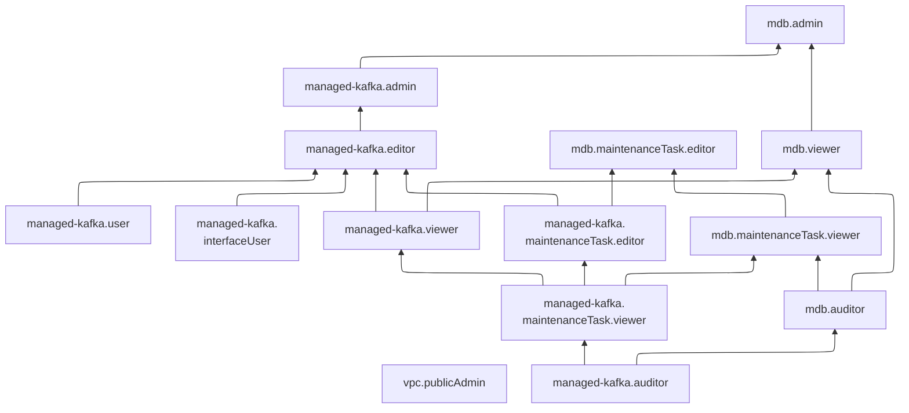

```mermaid
%%{
  init: {
    "flowchart": { "defaultRenderer": "elk" },
    "elk": { "nodePlacementStrategy": "NETWORK_SIMPLEX" }
  }
}%%
flowchart BT
    vpc.publicAdmin

    managed-kafka.user --> managed-kafka.editor
    managed-kafka.interfaceUser["`managed-kafka.
    interfaceUser`"] --> managed-kafka.editor
    managed-kafka.viewer --> managed-kafka.editor
    managed-kafka.maintenanceTask.viewer --> managed-kafka.viewer
    managed-kafka.maintenanceTask.viewer --> managed-kafka.maintenanceTask.editor["`managed-kafka.
    maintenanceTask.editor`"]
    managed-kafka.maintenanceTask.editor --> managed-kafka.editor
    managed-kafka.editor --> managed-kafka.admin
    managed-kafka.auditor --> managed-kafka.maintenanceTask.viewer["`managed-kafka.
    maintenanceTask.viewer`"]
    mdb.maintenanceTask.viewer --> mdb.maintenanceTask.editor
    managed-kafka.maintenanceTask.viewer --> mdb.maintenanceTask.viewer
    mdb.auditor --> mdb.maintenanceTask.viewer
    managed-kafka.viewer --> mdb.viewer
    managed-kafka.maintenanceTask.editor --> mdb.maintenanceTask.editor
    managed-kafka.admin --> mdb.admin
    managed-kafka.auditor --> mdb.auditor --> mdb.viewer --> mdb.admin
```
