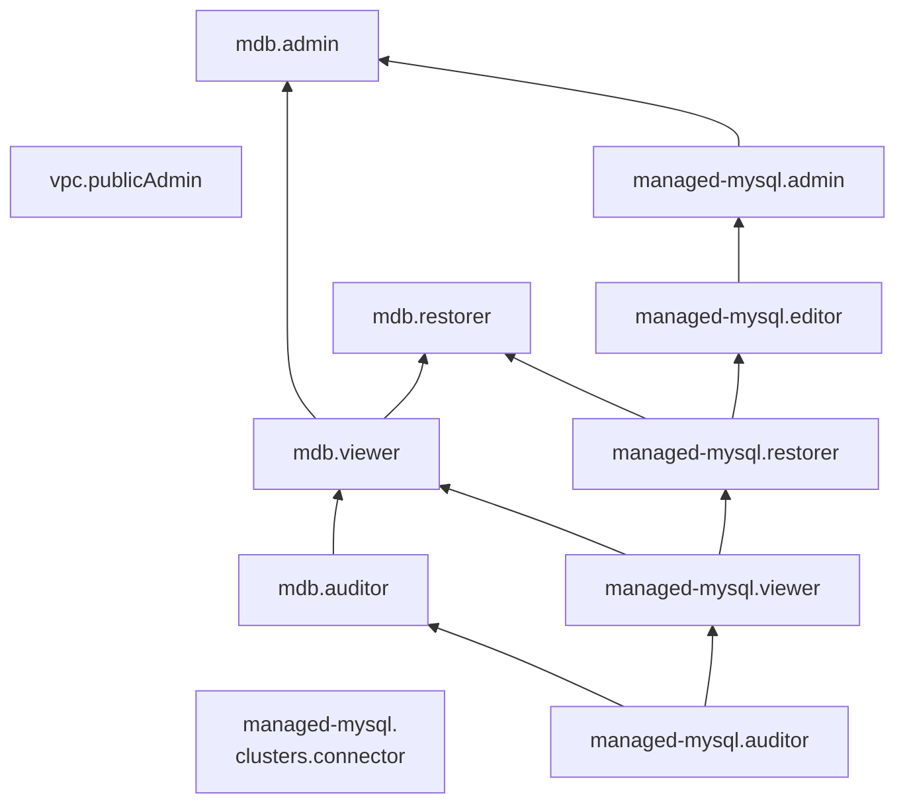

```mermaid
flowchart BT
    managed-mysql.clusters.connector["`managed-mysql.
    clusters.connector`"] ~~~ mdb.auditor 
    vpc.publicAdmin ~~~ mdb.admin   
    mdb.viewer --> mdb.admin    
    mdb.auditor --> mdb.viewer
    mdb.viewer --> mdb.restorer
    managed-mysql.auditor --> mdb.auditor
    managed-mysql.viewer --> mdb.viewer
    managed-mysql.restorer --> mdb.restorer
    managed-mysql.admin --> mdb.admin
    managed-mysql.auditor --> managed-mysql.viewer
    managed-mysql.viewer --> managed-mysql.restorer
    managed-mysql.editor --> managed-mysql.admin
    managed-mysql.restorer --> managed-mysql.editor
```