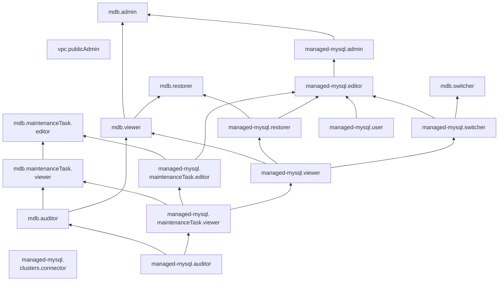

```mermaid
flowchart BT
    managed-mysql.clusters.connector["`managed-mysql.
    clusters.connector`"] ~~~ mdb.auditor
    vpc.publicAdmin ~~~ mdb.admin
    managed-mysql.auditor --> mdb.auditor
    mdb.auditor --> mdb.maintenanceTask.viewer
    mdb.auditor --> mdb.viewer
    mdb.viewer --> mdb.admin
    managed-mysql.restorer --> mdb.restorer
    mdb.viewer --> mdb.restorer
    managed-mysql.viewer --> mdb.viewer
    managed-mysql.viewer --> managed-mysql.restorer
    managed-mysql.maintenanceTask.viewer --> mdb.maintenanceTask.viewer["`mdb.maintenanceTask.
    viewer`"]
    managed-mysql.maintenanceTask.viewer --> managed-mysql.maintenanceTask.editor["`managed-mysql.
    maintenanceTask.editor`"]
    mdb.maintenanceTask.viewer --> mdb.maintenanceTask.editor
    managed-mysql.maintenanceTask.editor --> mdb.maintenanceTask.editor["`mdb.maintenanceTask.
    editor`"]
    managed-mysql.switcher --> managed-mysql.editor
    managed-mysql.restorer --> managed-mysql.editor
    managed-mysql.maintenanceTask.editor --> managed-mysql.editor
    managed-mysql.auditor --> managed-mysql.maintenanceTask.viewer["`managed-mysql.
    maintenanceTask.viewer`"]
    managed-mysql.user --> managed-mysql.editor
    managed-mysql.editor --> managed-mysql.admin
    managed-mysql.admin --> mdb.admin
    managed-mysql.switcher --> mdb.switcher
    managed-mysql.viewer --> managed-mysql.switcher
    managed-mysql.maintenanceTask.viewer --> managed-mysql.viewer
```