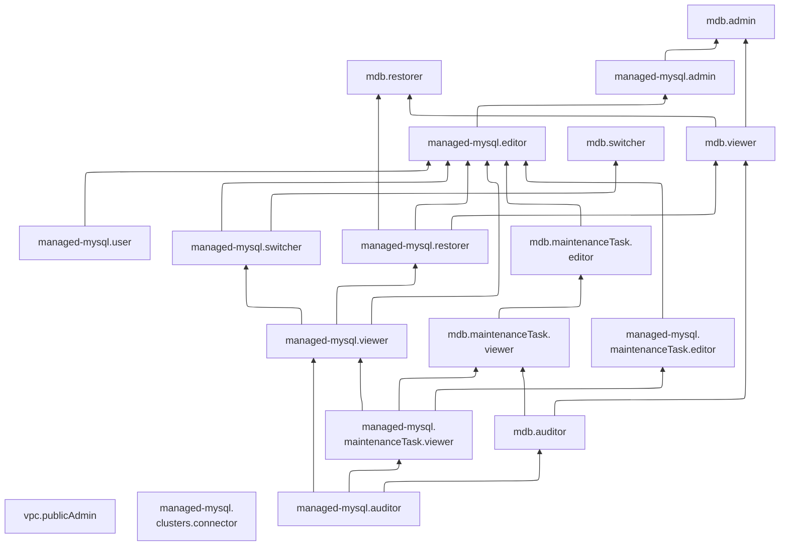

```mermaid
%%{
  init: {
    "flowchart": { "defaultRenderer": "elk" },
    "elk": { "nodePlacementStrategy": "NETWORK_SIMPLEX" }
  }
}%%
flowchart BT
    vpc.publicAdmin
    managed-mysql.clusters.connector["`managed-mysql.
    clusters.connector`"]
    managed-mysql.user --> managed-mysql.editor
    managed-mysql.switcher --> managed-mysql.editor
    managed-mysql.switcher --> mdb.switcher
    mdb.viewer --> mdb.restorer
    managed-mysql.restorer --> managed-mysql.editor
    managed-mysql.restorer --> mdb.restorer
    managed-mysql.auditor --> managed-mysql.maintenanceTask.viewer["`managed-mysql.
    maintenanceTask.viewer`"] --> managed-mysql.viewer --> managed-mysql.switcher
    managed-mysql.viewer --> managed-mysql.restorer
    managed-mysql.restorer --> mdb.viewer
    managed-mysql.auditor --> managed-mysql.viewer --> managed-mysql.editor
    managed-mysql.auditor --> mdb.auditor --> mdb.maintenanceTask.viewer["`mdb.maintenanceTask.
    viewer`"] --> mdb.maintenanceTask.editor["`mdb.maintenanceTask.
    editor`"] --> managed-mysql.editor --> managed-mysql.admin --> mdb.admin
    managed-mysql.maintenanceTask.viewer["`managed-mysql.
    maintenanceTask.viewer`"] -->  managed-mysql.maintenanceTask.editor["`managed-mysql.
    maintenanceTask.editor`"] --> managed-mysql.editor
    managed-mysql.maintenanceTask.viewer["`managed-mysql.
    maintenanceTask.viewer`"] --> mdb.maintenanceTask.viewer["`mdb.maintenanceTask.
    viewer`"]
    mdb.auditor --> mdb.viewer --> mdb.admin
```
