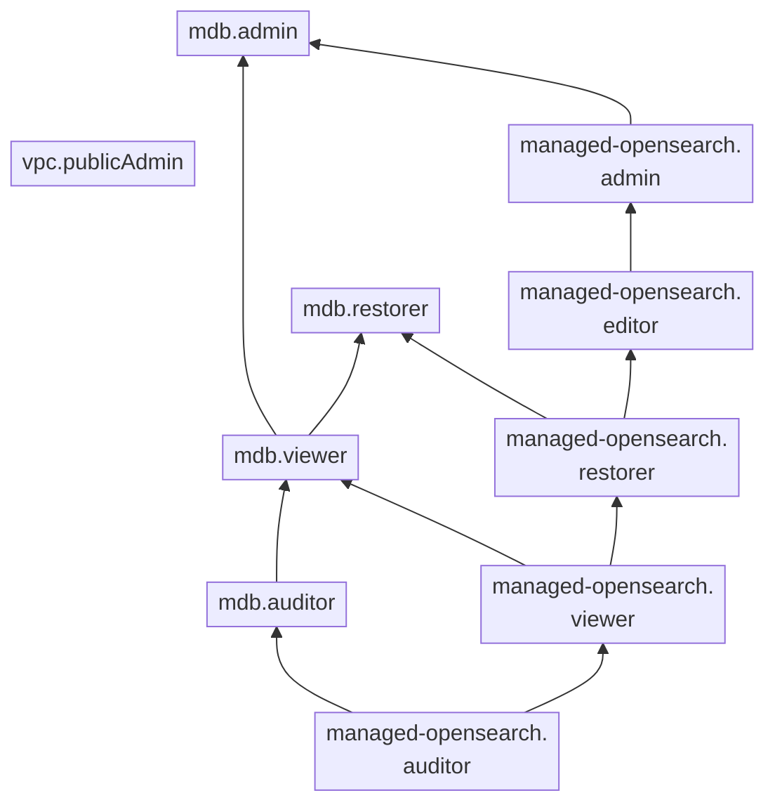

```mermaid
%%{init: { "flowchart": { "padding": 4 } } }%%
flowchart BT
    vpc.publicAdmin ~~~ mdb.admin
    mdb.viewer --> mdb.admin
    mdb.auditor --> mdb.viewer
    mdb.viewer --> mdb.restorer
    managed-opensearch.auditor["`managed-opensearch.
    auditor`"] --> mdb.auditor
    managed-opensearch.viewer["`managed-opensearch.
    viewer`"] --> mdb.viewer
    managed-opensearch.restorer["`managed-opensearch.
    restorer`"] --> mdb.restorer
    managed-opensearch.admin["`managed-opensearch.
    admin`"] --> mdb.admin
    managed-opensearch.auditor --> managed-opensearch.viewer
    managed-opensearch.viewer --> managed-opensearch.restorer
    managed-opensearch.editor["`managed-opensearch.
    editor`"] --> managed-opensearch.admin
    managed-opensearch.restorer --> managed-opensearch.editor
```