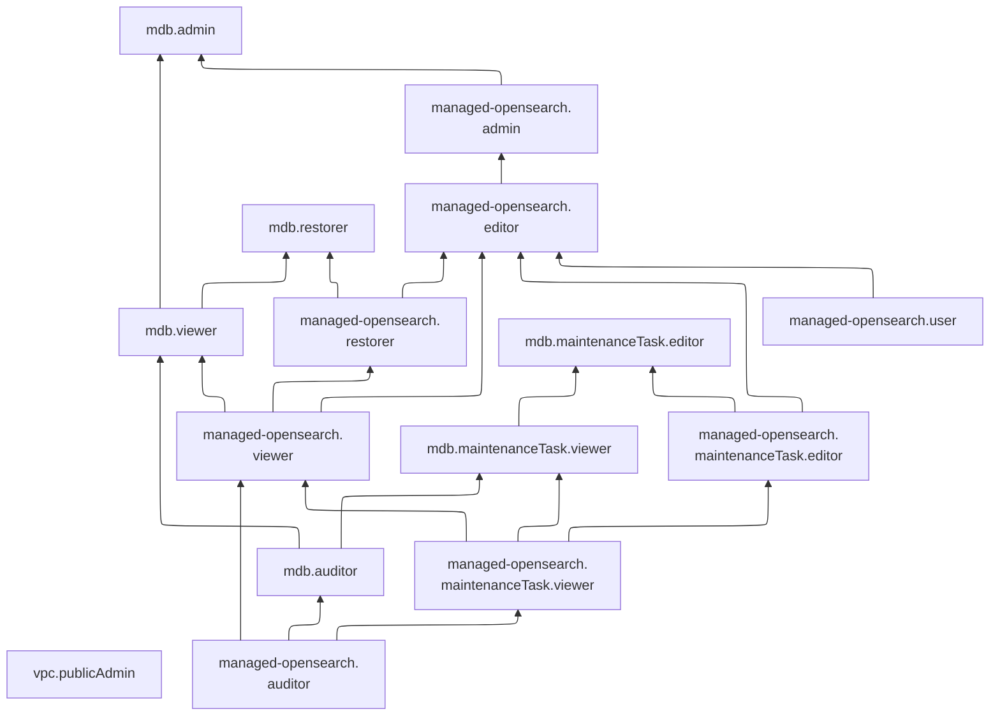

```mermaid
%%{
  init: {
    "flowchart": { "defaultRenderer": "elk" },
    "elk": { "nodePlacementStrategy": "NETWORK_SIMPLEX" }
  }
}%%
flowchart BT
    vpc.publicAdmin
    mdb.viewer --> mdb.restorer
    managed-opensearch.viewer --> managed-opensearch.restorer
    managed-opensearch.restorer["`managed-opensearch.
    restorer`"] --> managed-opensearch.editor
    mdb.auditor --> mdb.maintenanceTask.viewer
    mdb.maintenanceTask.viewer --> mdb.maintenanceTask.editor
    managed-opensearch.maintenanceTask.viewer --> mdb.maintenanceTask.viewer
    managed-opensearch.maintenanceTask.editor["`managed-opensearch.
    maintenanceTask.editor`"] --> managed-opensearch.editor
    managed-opensearch.maintenanceTask.viewer["`managed-opensearch.
    maintenanceTask.viewer`"] --> managed-opensearch.viewer
    managed-opensearch.maintenanceTask.viewer --> managed-opensearch.maintenanceTask.editor
    managed-opensearch.maintenanceTask.editor --> mdb.maintenanceTask.editor
    managed-opensearch.viewer --> managed-opensearch.editor
    managed-opensearch.auditor --> managed-opensearch.maintenanceTask.viewer
    mdb.auditor --> mdb.viewer
    managed-opensearch.viewer["`managed-opensearch.
    viewer`"] --> mdb.viewer
    managed-opensearch.auditor["`managed-opensearch.
    auditor`"] --> mdb.auditor
    managed-opensearch.auditor["`managed-opensearch.
    auditor`"] --> managed-opensearch.viewer
    managed-opensearch.editor["`managed-opensearch.
    editor`"] --> managed-opensearch.admin
    managed-opensearch.restorer --> mdb.restorer
    managed-opensearch.user --> managed-opensearch.editor
    managed-opensearch.admin["`managed-opensearch.
    admin`"] --> mdb.admin
    mdb.viewer --> mdb.admin
```
