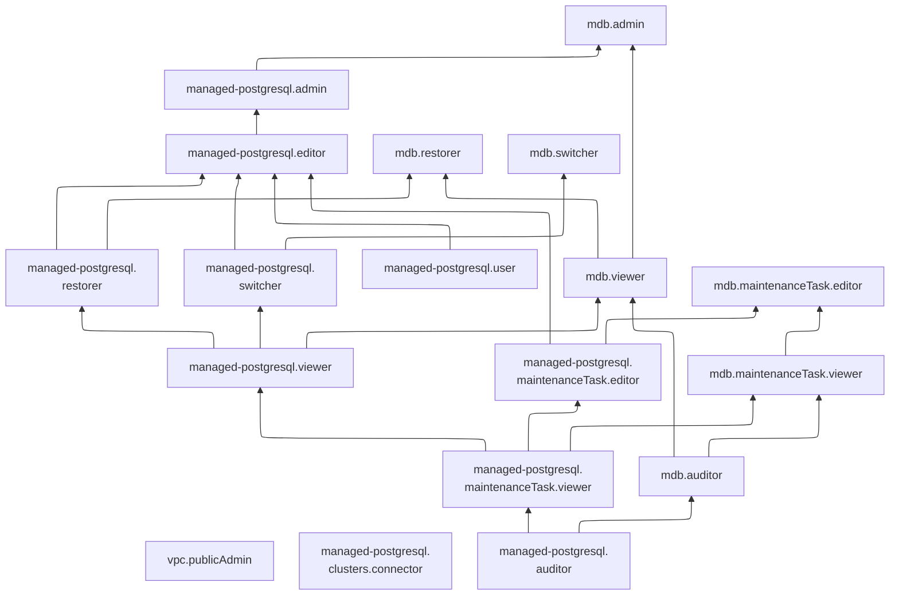

```mermaid
%%{
  init: {
    "flowchart": { "defaultRenderer": "elk" },
    "elk": { "nodePlacementStrategy": "NETWORK_SIMPLEX" }
  }
}%%
flowchart BT
    vpc.publicAdmin
    managed-postgresql.clusters.connector["`managed-postgresql.
    clusters.connector`"]
    managed-postgresql.viewer --> managed-postgresql.restorer["`managed-postgresql.
    restorer`"]
    managed-postgresql.maintenanceTask.viewer --> managed-postgresql.maintenanceTask.editor["`managed-postgresql.
    maintenanceTask.editor`"]
    managed-postgresql.switcher --> managed-postgresql.editor
    managed-postgresql.restorer --> managed-postgresql.editor
    managed-postgresql.maintenanceTask.editor --> managed-postgresql.editor
    managed-postgresql.auditor --> managed-postgresql.maintenanceTask.viewer["`managed-postgresql.
    maintenanceTask.viewer`"]
    managed-postgresql.user --> managed-postgresql.editor
    managed-postgresql.editor --> managed-postgresql.admin
    managed-postgresql.viewer --> managed-postgresql.switcher["`managed-postgresql.
    switcher`"]
    managed-postgresql.maintenanceTask.viewer --> managed-postgresql.viewer
    managed-postgresql.auditor["`managed-postgresql.
    auditor`"] --> mdb.auditor
    managed-postgresql.restorer --> mdb.restorer
    managed-postgresql.viewer --> mdb.viewer
    managed-postgresql.maintenanceTask.viewer --> mdb.maintenanceTask.viewer
    managed-postgresql.maintenanceTask.editor --> mdb.maintenanceTask.editor
    managed-postgresql.admin --> mdb.admin
    managed-postgresql.switcher --> mdb.switcher
    mdb.maintenanceTask.viewer --> mdb.maintenanceTask.editor
    mdb.viewer --> mdb.restorer
    mdb.auditor --> mdb.maintenanceTask.viewer
    mdb.auditor --> mdb.viewer
    mdb.viewer --> mdb.admin
```
