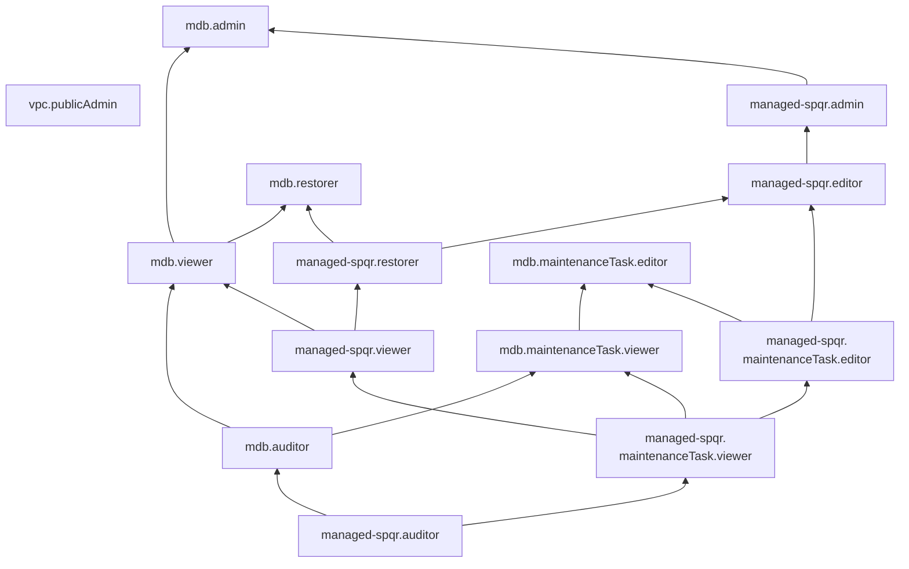

```mermaid
flowchart BT
    vpc.publicAdmin ~~~ mdb.admin
    mdb.viewer --> mdb.admin
    mdb.viewer ~~~ mdb.admin
    mdb.restorer ~~~ mdb.admin
    mdb.viewer --> mdb.restorer
    managed-spqr.admin --> mdb.admin
    managed-spqr.viewer --> managed-spqr.restorer
    managed-spqr.restorer --> managed-spqr.editor
    mdb.auditor --> mdb.maintenanceTask.viewer
    mdb.maintenanceTask.viewer --> mdb.maintenanceTask.editor
    managed-spqr.maintenanceTask.viewer --> mdb.maintenanceTask.viewer
    managed-spqr.maintenanceTask.editor --> managed-spqr.editor
    managed-spqr.maintenanceTask.viewer --> managed-spqr.viewer
    managed-spqr.maintenanceTask.viewer --> managed-spqr.maintenanceTask.editor["`managed-spqr.
    maintenanceTask.editor`"]
    managed-spqr.maintenanceTask.editor --> mdb.maintenanceTask.editor
    managed-spqr.auditor --> managed-spqr.maintenanceTask.viewer["`managed-spqr.
    maintenanceTask.viewer`"]
    mdb.auditor --> mdb.viewer
    managed-spqr.viewer --> mdb.viewer
    managed-spqr.auditor --> mdb.auditor
    managed-spqr.editor --> managed-spqr.admin
    managed-spqr.restorer --> mdb.restorer
```