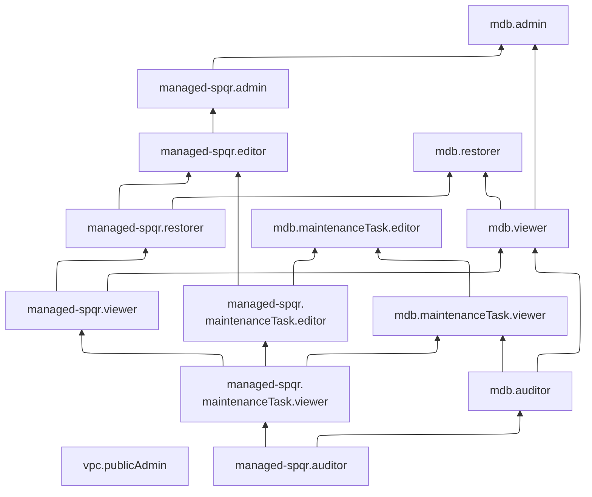

```mermaid
%%{
  init: {
    "flowchart": { "defaultRenderer": "elk" },
    "elk": { "nodePlacementStrategy": "NETWORK_SIMPLEX" }
  }
}%%
flowchart BT
    vpc.publicAdmin
    managed-spqr.viewer --> managed-spqr.restorer
    managed-spqr.restorer --> managed-spqr.editor
    managed-spqr.maintenanceTask.editor --> managed-spqr.editor
    managed-spqr.maintenanceTask.viewer --> managed-spqr.viewer
    managed-spqr.maintenanceTask.viewer --> managed-spqr.maintenanceTask.editor["`managed-spqr.
    maintenanceTask.editor`"]
    managed-spqr.auditor --> managed-spqr.maintenanceTask.viewer["`managed-spqr.
    maintenanceTask.viewer`"]
    managed-spqr.admin --> mdb.admin
    managed-spqr.maintenanceTask.viewer --> mdb.maintenanceTask.viewer
    managed-spqr.maintenanceTask.editor --> mdb.maintenanceTask.editor
    managed-spqr.viewer --> mdb.viewer
    managed-spqr.auditor --> mdb.auditor
    managed-spqr.editor --> managed-spqr.admin
    managed-spqr.restorer --> mdb.restorer
    mdb.auditor --> mdb.viewer --> mdb.admin
    mdb.viewer --> mdb.restorer
    mdb.auditor --> mdb.maintenanceTask.viewer
    mdb.maintenanceTask.viewer --> mdb.maintenanceTask.editor
```
