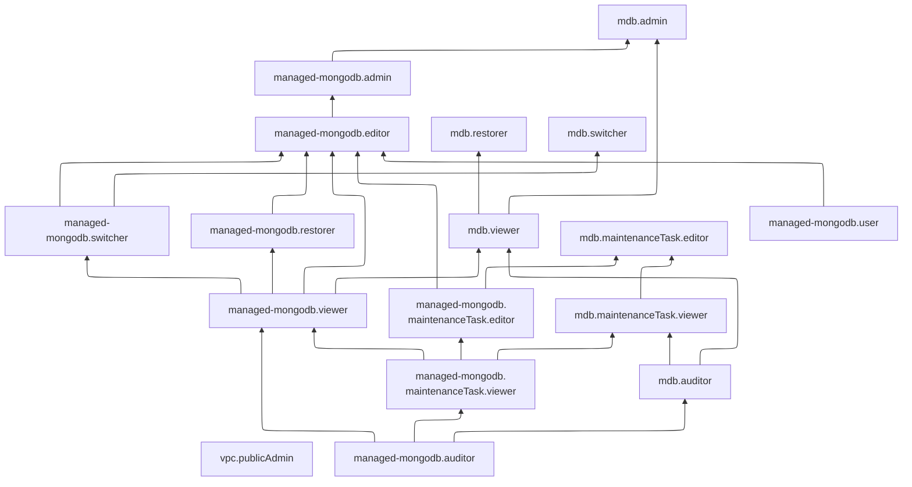

```mermaid
%%{
  init: {
    "flowchart": { "defaultRenderer": "elk" },
    "elk": { "nodePlacementStrategy": "NETWORK_SIMPLEX" }
  }
}%%
flowchart BT
    vpc.publicAdmin
    managed-mongodb.viewer --> managed-mongodb.switcher
    managed-mongodb.maintenanceTask.viewer --> managed-mongodb.viewer
    managed-mongodb.switcher --> managed-mongodb.editor
    managed-mongodb.auditor --> managed-mongodb.viewer --> managed-mongodb.restorer
    managed-mongodb.restorer --> managed-mongodb.editor
    managed-mongodb.viewer --> managed-mongodb.editor
    managed-mongodb.maintenanceTask.editor --> managed-mongodb.editor
    managed-mongodb.auditor --> managed-mongodb.maintenanceTask.viewer["`managed-mongodb.
    maintenanceTask.viewer`"]
    managed-mongodb.editor --> managed-mongodb.admin
    managed-mongodb.maintenanceTask.viewer --> managed-mongodb.maintenanceTask.editor["`managed-mongodb.
    maintenanceTask.editor`"]
    managed-mongodb.auditor --> mdb.auditor --> mdb.viewer --> mdb.admin
    managed-mongodb.viewer --> mdb.viewer --> mdb.restorer
    mdb.auditor --> mdb.maintenanceTask.viewer
    mdb.maintenanceTask.viewer --> mdb.maintenanceTask.editor
    managed-mongodb.maintenanceTask.viewer --> mdb.maintenanceTask.viewer
    managed-mongodb.maintenanceTask.editor --> mdb.maintenanceTask.editor
    managed-mongodb.admin --> mdb.admin
    managed-mongodb.switcher --> mdb.switcher
    managed-mongodb.user --> managed-mongodb.editor
```
