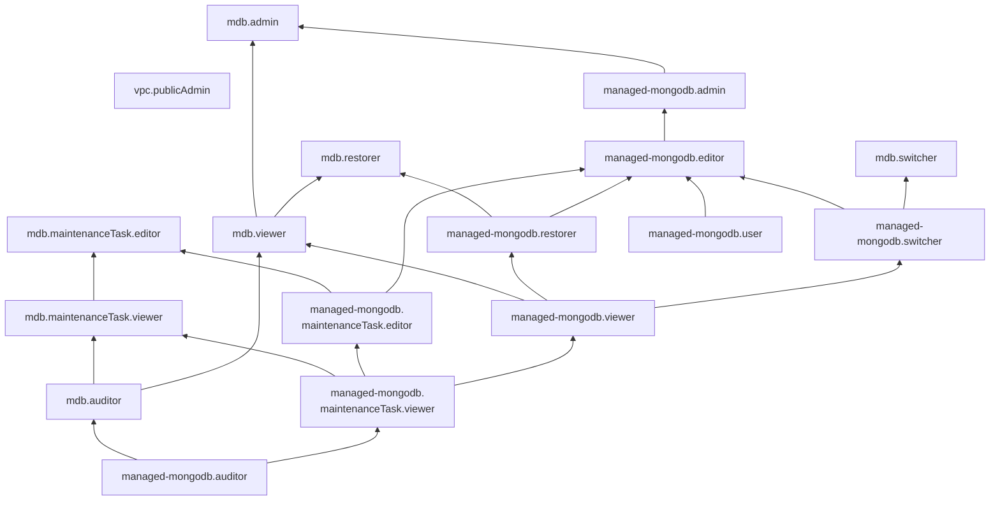

```mermaid
flowchart BT
    vpc.publicAdmin ~~~ mdb.admin
    managed-mongodb.auditor --> mdb.auditor
    mdb.auditor --> mdb.maintenanceTask.viewer
    mdb.auditor --> mdb.viewer
    mdb.viewer --> mdb.admin
    managed-mongodb.restorer --> mdb.restorer
    mdb.viewer --> mdb.restorer
    managed-mongodb.viewer --> mdb.viewer
    managed-mongodb.viewer --> managed-mongodb.restorer
    managed-mongodb.maintenanceTask.viewer --> mdb.maintenanceTask.viewer
    managed-mongodb.maintenanceTask.viewer --> managed-mongodb.maintenanceTask.editor["`managed-mongodb.
    maintenanceTask.editor`"]
    mdb.maintenanceTask.viewer --> mdb.maintenanceTask.editor
    managed-mongodb.maintenanceTask.editor --> mdb.maintenanceTask.editor
    managed-mongodb.switcher --> managed-mongodb.editor
    managed-mongodb.restorer --> managed-mongodb.editor
    managed-mongodb.maintenanceTask.editor --> managed-mongodb.editor
    managed-mongodb.auditor --> managed-mongodb.maintenanceTask.viewer["`managed-mongodb.
    maintenanceTask.viewer`"]
    managed-mongodb.user --> managed-mongodb.editor
    managed-mongodb.editor --> managed-mongodb.admin
    managed-mongodb.admin --> mdb.admin
    managed-mongodb.switcher --> mdb.switcher
    managed-mongodb.viewer --> managed-mongodb.switcher
    managed-mongodb.maintenanceTask.viewer --> managed-mongodb.viewer
```