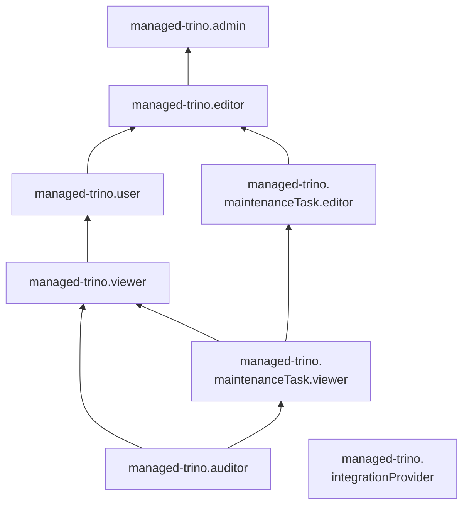

```mermaid
flowchart BT
    managed-trino.viewer --> managed-trino.user
    managed-trino.user --> managed-trino.editor
    managed-trino.editor --> managed-trino.admin
    managed-trino.auditor --> managed-trino.viewer
    managed-trino.auditor --> managed-trino.maintenanceTask.viewer["`managed-trino.
    maintenanceTask.viewer`"]
    managed-trino.maintenanceTask.viewer --> managed-trino.maintenanceTask.editor["`managed-trino.
    maintenanceTask.editor`"]
    managed-trino.maintenanceTask.viewer --> managed-trino.viewer
    managed-trino.maintenanceTask.editor --> managed-trino.editor
    managed-trino.integrationProvider["`managed-trino.
    integrationProvider`"]
```