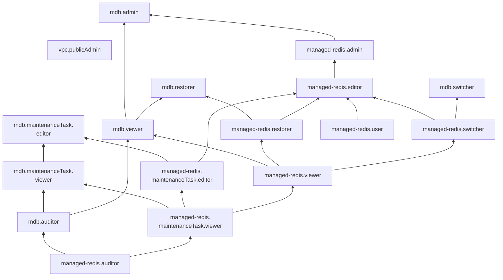

```mermaid
flowchart BT
    vpc.publicAdmin ~~~ mdb.admin
    managed-redis.auditor --> mdb.auditor
    mdb.auditor --> mdb.maintenanceTask.viewer
    mdb.auditor --> mdb.viewer
    mdb.viewer --> mdb.admin
    managed-redis.restorer --> mdb.restorer
    mdb.viewer --> mdb.restorer
    managed-redis.viewer --> mdb.viewer
    managed-redis.viewer --> managed-redis.restorer
    managed-redis.maintenanceTask.viewer --> mdb.maintenanceTask.viewer["`mdb.maintenanceTask.
    viewer`"]
    managed-redis.maintenanceTask.viewer --> managed-redis.maintenanceTask.editor["`managed-redis.
    maintenanceTask.editor`"]
    mdb.maintenanceTask.viewer --> mdb.maintenanceTask.editor
    managed-redis.maintenanceTask.editor --> mdb.maintenanceTask.editor["`mdb.maintenanceTask.
    editor`"]
    managed-redis.switcher --> managed-redis.editor
    managed-redis.restorer --> managed-redis.editor
    managed-redis.maintenanceTask.editor --> managed-redis.editor
    managed-redis.auditor --> managed-redis.maintenanceTask.viewer["`managed-redis.
    maintenanceTask.viewer`"]
    managed-redis.user --> managed-redis.editor
    managed-redis.editor --> managed-redis.admin
    managed-redis.admin --> mdb.admin
    managed-redis.switcher --> mdb.switcher
    managed-redis.viewer --> managed-redis.switcher
    managed-redis.maintenanceTask.viewer --> managed-redis.viewer
```