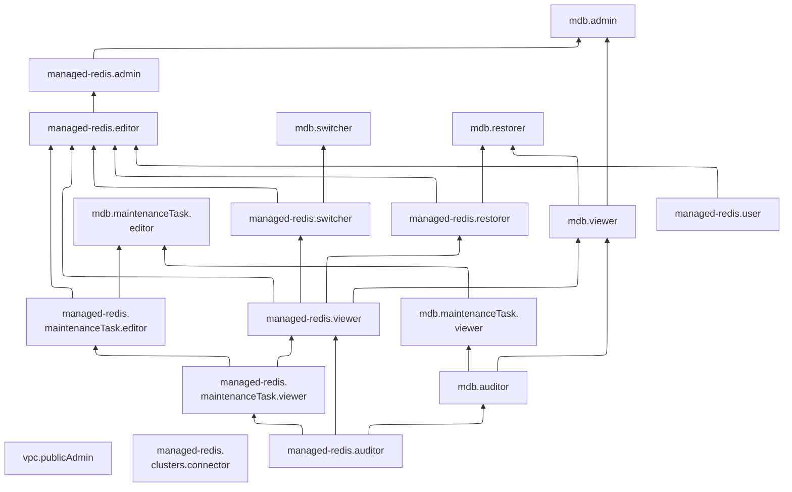

```mermaid
%%{
  init: {
    "flowchart": { "defaultRenderer": "elk" },
    "elk": { "nodePlacementStrategy": "NETWORK_SIMPLEX" }
  }
}%%
flowchart BT
  vpc.publicAdmin
  managed-redis.clusters.connector["`managed-redis.
  clusters.connector`"]
  managed-redis.auditor --> managed-redis.maintenanceTask.viewer["`managed-redis.
  maintenanceTask.viewer`"] --> managed-redis.maintenanceTask.editor["`managed-redis.
  maintenanceTask.editor`"] --> managed-redis.editor --> managed-redis.admin --> mdb.admin
  managed-redis.maintenanceTask.editor["`managed-redis.
  maintenanceTask.editor`"] --> mdb.maintenanceTask.editor["`mdb.maintenanceTask.
  editor`"]
  managed-redis.viewer --> managed-redis.switcher --> mdb.switcher
  managed-redis.viewer --> managed-redis.restorer --> mdb.restorer
  mdb.viewer --> mdb.restorer
  managed-redis.switcher --> managed-redis.editor
  managed-redis.restorer --> managed-redis.editor
  managed-redis.user --> managed-redis.editor
  managed-redis.maintenanceTask.viewer["`managed-redis.
  maintenanceTask.viewer`"] --> managed-redis.viewer
  managed-redis.viewer --> managed-redis.editor
  mdb.maintenanceTask.viewer["`mdb.maintenanceTask.
  viewer`"] --> mdb.maintenanceTask.editor["`mdb.maintenanceTask.
  editor`"]
  managed-redis.auditor --> mdb.auditor --> mdb.maintenanceTask.viewer["`mdb.maintenanceTask.
  viewer`"]
  mdb.auditor --> mdb.viewer
  managed-redis.auditor --> managed-redis.viewer --> mdb.viewer
  mdb.viewer --> mdb.admin
```
