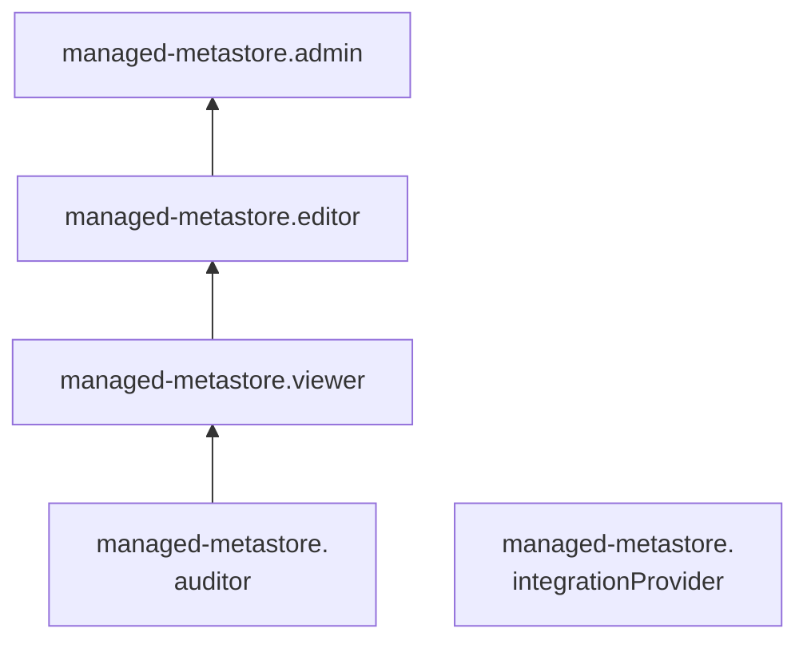

```mermaid
flowchart BT
    managed-metastore.auditor["`managed-metastore.
    auditor`"] --> managed-metastore.viewer
    managed-metastore.viewer --> managed-metastore.editor
    managed-metastore.editor --> managed-metastore.admin
    managed-metastore.integrationProvider["`managed-metastore.
    integrationProvider`"]
```