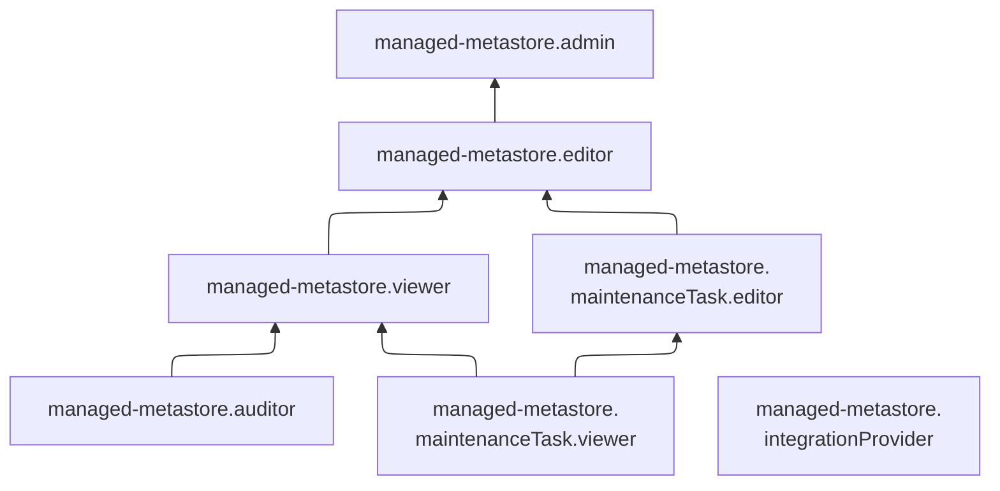

```mermaid
%%{
  init: {
    "flowchart": { "defaultRenderer": "elk" },
    "elk": { "nodePlacementStrategy": "SIMPLE" }
  }
}%%
flowchart BT
    managed-metastore.auditor --> managed-metastore.viewer
    managed-metastore.maintenanceTask.viewer --> managed-metastore.maintenanceTask.editor["`managed-metastore.
    maintenanceTask.editor`"]
    managed-metastore.maintenanceTask.viewer["`managed-metastore.
    maintenanceTask.viewer`"] --> managed-metastore.viewer
    managed-metastore.viewer --> managed-metastore.editor
    managed-metastore.editor --> managed-metastore.admin
    managed-metastore.maintenanceTask.editor["`managed-metastore.
    maintenanceTask.editor`"] --> managed-metastore.editor
    managed-metastore.integrationProvider["`managed-metastore.
    integrationProvider`"]
```