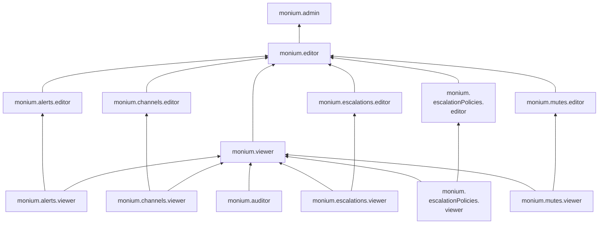

```mermaid
flowchart BT
    monium.editor --> monium.admin
    monium.alerts.viewer ---> monium.alerts.editor
    monium.alerts.viewer --> monium.viewer
    monium.channels.viewer ---> monium.channels.editor
    monium.channels.viewer --> monium.viewer
    monium.escalations.viewer --> monium.viewer
    monium.escalations.viewer ---> monium.escalations.editor
    monium.auditor --> monium.viewer
    monium.escalationPolicies.viewer["monium.<br>escalationPolicies.<br>viewer"] --> monium.viewer
    monium.escalationPolicies.viewer["monium.<br>escalationPolicies.<br>viewer"] ---> monium.escalationPolicies.editor["monium.<br>escalationPolicies.<br>editor"]
    monium.mutes.viewer --> monium.viewer
    monium.mutes.viewer ---> monium.mutes.editor
    monium.channels.editor --> monium.editor
    monium.alerts.editor --> monium.editor
    monium.viewer --> monium.editor
    monium.escalations.editor --> monium.editor
    monium.escalationPolicies.editor["monium.<br>escalationPolicies.<br>editor"] --> monium.editor
    monium.mutes.editor --> monium.editor
```