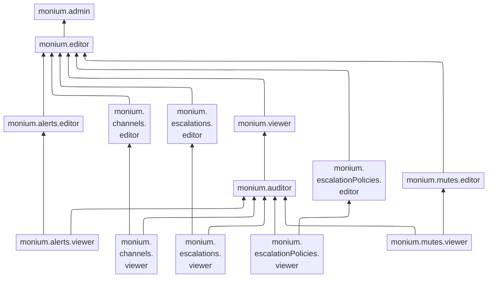

```mermaid
%%{init: {"flowchart": {'defaultRenderer': 'elk', 'padding': 4}} }%%
flowchart BT
    monium.alerts.viewer --> monium.alerts.editor
    monium.alerts.viewer --> monium.auditor
    monium.alerts.editor --> monium.editor

    monium.channels.viewer["monium.<br>channels.<br>viewer"] --> monium.channels.editor["monium.<br>channels.<br>editor"]
    monium.channels.viewer --> monium.auditor
    monium.channels.editor --> monium.editor

    monium.escalations.viewer["monium.<br>escalations.<br>viewer"] --> monium.auditor
    monium.escalations.viewer --> monium.escalations.editor["monium.<br>escalations.<br>editor"]
    monium.escalations.editor --> monium.editor

    monium.escalationPolicies.viewer["monium.<br>escalationPolicies.<br>viewer"] --> monium.auditor
    monium.escalationPolicies.viewer["monium.<br>escalationPolicies.<br>viewer"] --> monium.escalationPolicies.editor["monium.<br>escalationPolicies.<br>editor"]
    monium.escalationPolicies.editor["monium.<br>escalationPolicies.<br>editor"] --> monium.editor

    monium.mutes.viewer --> monium.auditor
    monium.mutes.viewer --> monium.mutes.editor
    monium.mutes.editor --> monium.editor

    monium.auditor --> monium.viewer --> monium.editor --> monium.admin
```
