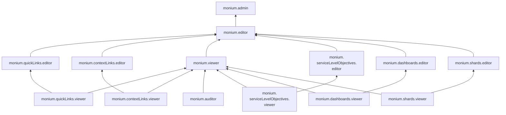

```mermaid
flowchart BT
    monium.editor --> monium.admin
    monium.quickLinks.viewer --> monium.quickLinks.editor
    monium.quickLinks.viewer --> monium.viewer
    monium.contextLinks.viewer --> monium.contextLinks.editor
    monium.contextLinks.viewer --> monium.viewer
    monium.auditor --> monium.viewer
    monium.serviceLevelObjectives.viewer["monium.<br>serviceLevelObjectives.<br>viewer"] --> monium.viewer
    monium.serviceLevelObjectives.viewer["monium.<br>serviceLevelObjectives.<br>viewer"] --> monium.serviceLevelObjectives.editor["monium.<br>serviceLevelObjectives.<br>editor"]
    monium.dashboards.viewer --> monium.viewer
    monium.dashboards.viewer --> monium.dashboards.editor
    monium.shards.viewer --> monium.viewer  
    monium.shards.viewer --> monium.shards.editor
    monium.quickLinks.editor --> monium.editor
    monium.contextLinks.editor --> monium.editor
    monium.viewer --> monium.editor
    monium.serviceLevelObjectives.editor["monium.<br>serviceLevelObjectives.<br>editor"] --> monium.editor
    monium.dashboards.editor --> monium.editor
    monium.shards.editor --> monium.editor
```