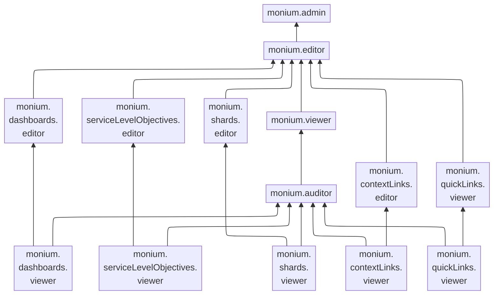

```mermaid
%%{init: {"flowchart": {'defaultRenderer': 'elk', 'padding': 4}} }%%
flowchart BT
    monium.dashboards.viewer --> monium.auditor
    monium.dashboards.viewer["monium.<br>dashboards.<br>viewer"] --> monium.dashboards.editor["monium.<br>dashboards.<br>editor"] --> monium.editor

    monium.serviceLevelObjectives.viewer["monium.<br>serviceLevelObjectives.<br>viewer"] --> monium.auditor
    monium.serviceLevelObjectives.viewer["monium.<br>serviceLevelObjectives.<br>viewer"] --> monium.serviceLevelObjectives.editor["monium.<br>serviceLevelObjectives.<br>editor"]
    monium.serviceLevelObjectives.editor["monium.<br>serviceLevelObjectives.<br>editor"] --> monium.editor

    monium.shards.viewer --> monium.auditor  
    monium.shards.viewer["monium.<br>shards.<br>viewer"] --> monium.shards.editor["monium.<br>shards.<br>editor"] --> monium.editor

    monium.auditor --> monium.viewer --> monium.editor --> monium.admin
    
    monium.contextLinks.editor --> monium.editor
    monium.contextLinks.viewer["monium.<br>contextLinks.<br>viewer"] --> monium.contextLinks.editor["monium.<br>contextLinks.<br>editor"]
    monium.contextLinks.viewer --> monium.auditor

    monium.quickLinks.viewer["monium.<br>quickLinks.<br>viewer"] --> monium.quickLinks.editor["monium.<br>quickLinks.<br>viewer"]
    monium.quickLinks.viewer --> monium.auditor
    monium.quickLinks.editor --> monium.editor
```
