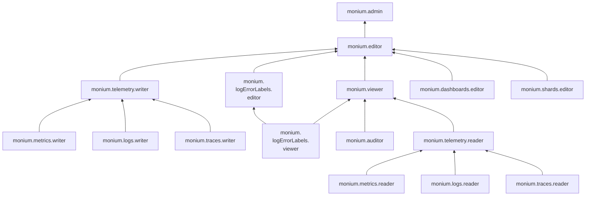

```mermaid
flowchart BT
    monium.editor --> monium.admin
    monium.metrics.writer --> monium.telemetry.writer
    monium.logs.writer --> monium.telemetry.writer
    monium.traces.writer --> monium.telemetry.writer
    monium.metrics.reader --> monium.telemetry.reader
    monium.logs.reader --> monium.telemetry.reader
    monium.traces.reader --> monium.telemetry.reader
    monium.logErrorLabels.viewer["monium.<br>logErrorLabels.<br>viewer"] --> monium.logErrorLabels.editor["monium.<br>logErrorLabels.<br>editor"]
    monium.logErrorLabels.viewer["monium.<br>logErrorLabels.<br>viewer"] --> monium.viewer
    monium.auditor --> monium.viewer
    monium.telemetry.reader --> monium.viewer
    monium.telemetry.writer --> monium.editor
    monium.logErrorLabels.editor["monium.<br>logErrorLabels.<br>editor"] --> monium.editor
    monium.viewer --> monium.editor
    monium.dashboards.editor --> monium.editor
    monium.shards.editor --> monium.editor
```