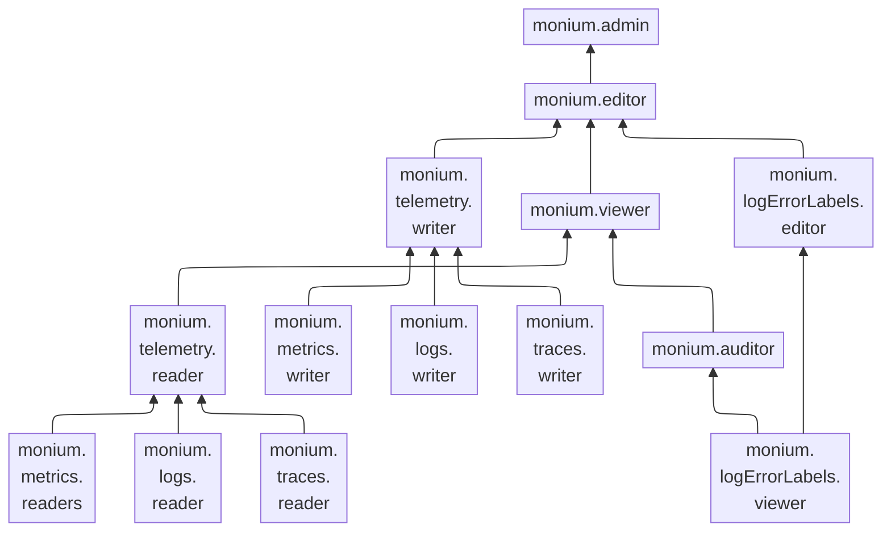

```mermaid
%%{
  init: {
    "flowchart": { "defaultRenderer": "elk", "padding": 4 },
    "elk": { "nodePlacementStrategy": "NETWORK_SIMPLEX" }
  }
}%%
flowchart BT
    monium.metrics.reader["monium.<br>metrics.<br>readers"] --> monium.telemetry.reader["monium.<br>telemetry.<br>reader"]
    monium.logs.reader["monium.<br>logs.<br>reader"] --> monium.telemetry.reader
    monium.traces.reader["monium.<br>traces.<br>reader"] --> monium.telemetry.reader

    monium.metrics.writer["monium.<br>metrics.<br>writer"] --> monium.telemetry.writer["monium.<br>telemetry.<br>writer"]
    monium.logs.writer["monium.<br>logs.<br>writer"] --> monium.telemetry.writer
    monium.traces.writer["monium.<br>traces.<br>writer"] --> monium.telemetry.writer

    monium.telemetry.reader --> monium.viewer
    monium.telemetry.writer --> monium.editor
    monium.logErrorLabels.viewer["monium.<br>logErrorLabels.<br>viewer"] --> monium.logErrorLabels.editor["monium.<br>logErrorLabels.<br>editor"] --> monium.editor
    monium.logErrorLabels.viewer["monium.<br>logErrorLabels.<br>viewer"] --> monium.auditor

    monium.auditor --> monium.viewer --> monium.editor --> monium.admin
```
