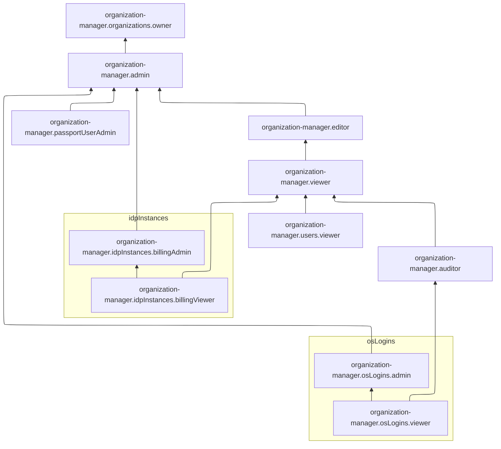

```mermaid
%%{init: {"flowchart": {'defaultRenderer': 'elk'}} }%%
flowchart BT
    
    om-passportUserAdmin["organization-manager.passportUserAdmin"] --> om-admin["organization-manager.admin"]
    
    om-usersViewer["organization-manager.users.viewer"] --> om-viewer["organization-manager.viewer"]

    subgraph idpInstances
    om-idp-billingViewer["organization-manager.idpInstances.billingViewer"] --> om-idp-billingAdmin["organization-manager.idpInstances.billingAdmin"]
    end;

    subgraph osLogins
    om-osl-viewer["organization-manager.osLogins.viewer"] --> om-osl-admin["organization-manager.osLogins.admin"]
    end;


    om-auditor["organization-manager.auditor"] ---> om-viewer ---> om-editor["organization-manager.editor"] --> om-admin
    om-admin --> om-owner["organization-manager.organizations.owner"]

    om-idp-billingViewer --> om-viewer
    om-idp-billingAdmin --> om-admin

    om-osl-viewer --> om-auditor
    om-osl-admin --> om-admin
```
