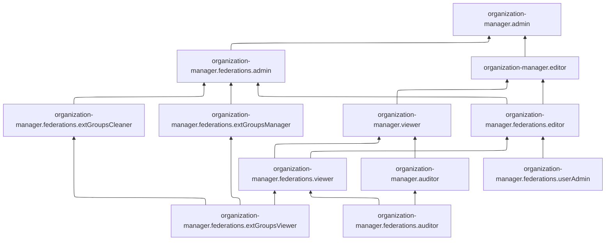

```mermaid
%%{init: {"flowchart": {'defaultRenderer': 'elk'}} }%%
flowchart BT
    om-fed-extGroupsViewer["organization-manager.federations.extGroupsViewer"] --> om-fed-extGroupsCleaner["organization-manager.federations.extGroupsCleaner"]
    om-fed-extGroupsViewer --> om-fed-extGroupsManager["organization-manager.federations.extGroupsManager"]
    om-fed-auditor["organization-manager.federations.auditor"] --> om-fed-viewer["organization-manager.federations.viewer"]
    om-fed-extGroupsViewer --> om-fed-viewer["organization-manager.federations.viewer"]
    om-fed-auditor --> om-auditor["organization-manager.auditor"]
    om-auditor --> om-viewer["organization-manager.viewer"]
    om-fed-extGroupsManager --> om-fed-admin["organization-manager.federations.admin"]
    om-fed-extGroupsCleaner --> om-fed-admin["organization-manager.federations.admin"]
    om-fed-viewer --> om-fed-editor["organization-manager.federations.editor"]
    om-fed-viewer --> om-viewer
    om-fed-editor --> om-fed-admin["organization-manager.federations.admin"]
    om-fed-userAdmin["organization-manager.federations.userAdmin"] --> om-fed-editor["organization-manager.federations.editor"]
    om-viewer --> om-editor["organization-manager.editor"] --> om-admin["organization-manager.admin"]
    om-fed-editor --> om-editor
    om-fed-admin --> om-admin
```
