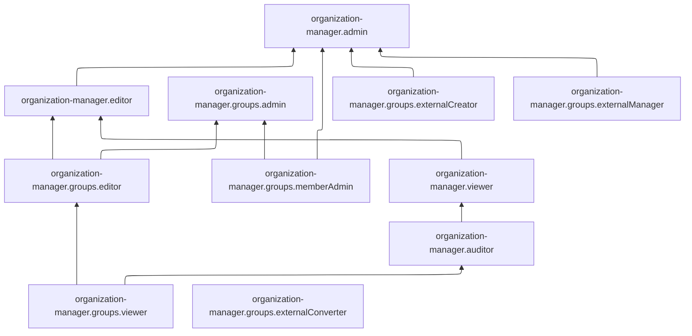

```mermaid
%%{init: {"flowchart": {'defaultRenderer': 'elk'}} }%%
flowchart BT
    om-gr-viewer["organization-manager.groups.viewer"] --> om-auditor["organization-manager.auditor"]
    om-gr-viewer --> om-gr-editor["organization-manager.groups.editor"]
    om-gr-editor --> om-editor["organization-manager.editor"]
    om-gr-editor --> om-gr-admin["organization-manager.groups.admin"]
    om-gr-memberAdmin["organization-manager.groups.memberAdmin"] --> om-gr-admin["organization-manager.groups.admin"]
    om-gr-memberAdmin --> om-admin["organization-manager.admin"]
    om-gr-externalCreator["organization-manager.groups.externalCreator"] --> om-admin
    om-gr-externalManager["organization-manager.groups.externalManager"] --> om-admin
    organization-manager.groups.externalConverter
    om-auditor --> om-viewer["organization-manager.viewer"] --> om-editor --> om-admin
```