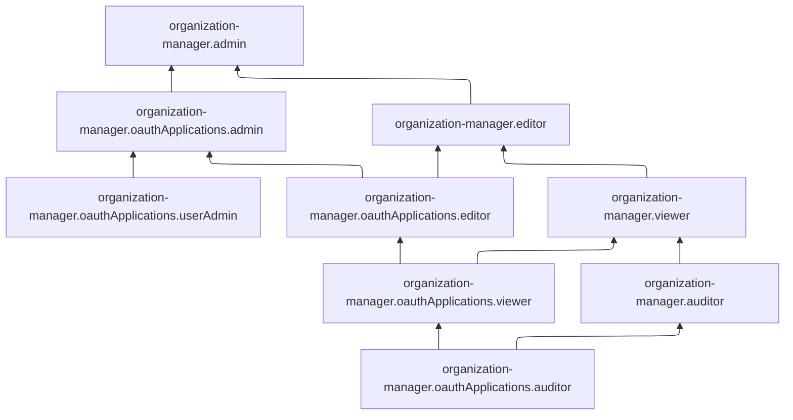

```mermaid
%%{init: {"flowchart": {'defaultRenderer': 'elk'}} }%%
flowchart BT
    om-oa-userAdmin["organization-manager.oauthApplications.userAdmin"] --> om-oa-admin["organization-manager.oauthApplications.admin"]
    om-oa-viewer["organization-manager.oauthApplications.viewer"] --> om-oa-editor["organization-manager.oauthApplications.editor"]
    om-oa-editor --> om-editor["organization-manager.editor"]
    om-oa-editor --> om-oa-admin["organization-manager.oauthApplications.admin"]
    om-oa-admin["organization-manager.oauthApplications.admin"] --> om-admin["organization-manager.admin"]
    om-oa-auditor["organization-manager.oauthApplications.auditor"] --> om-oa-viewer
    om-oa-viewer --> om-viewer
    om-oa-auditor["organization-manager.oauthApplications.auditor"] --> om-auditor["organization-manager.auditor"] --> om-viewer["organization-manager.viewer"] --> om-editor --> om-admin
```