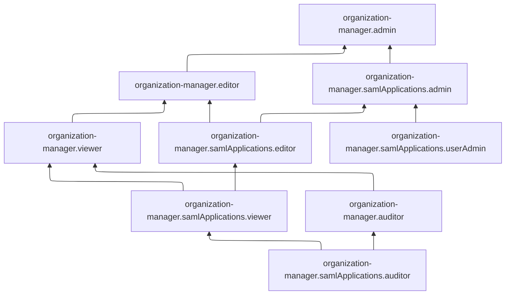

```mermaid
%%{init: {"flowchart": {'defaultRenderer': 'elk'}} }%%
flowchart BT
    om-sa-viewer["organization-manager.samlApplications.viewer"] --> om-viewer["organization-manager.viewer"]
    om-sa-viewer --> om-sa-editor["organization-manager.samlApplications.editor"]
    om-sa-editor --> om-editor["organization-manager.editor"]
    om-sa-auditor["organization-manager.samlApplications.auditor"] --> om-auditor["organization-manager.auditor"]
    om-sa-auditor["organization-manager.samlApplications.auditor"] --> om-sa-viewer
    om-sa-editor --> om-sa-admin["organization-manager.samlApplications.admin"] --> om-admin["organization-manager.admin"]
    om-sa-userAdmin["organization-manager.samlApplications.userAdmin"] --> om-sa-admin["organization-manager.samlApplications.admin"]
    om-auditor --> om-viewer --> om-editor --> om-admin
```