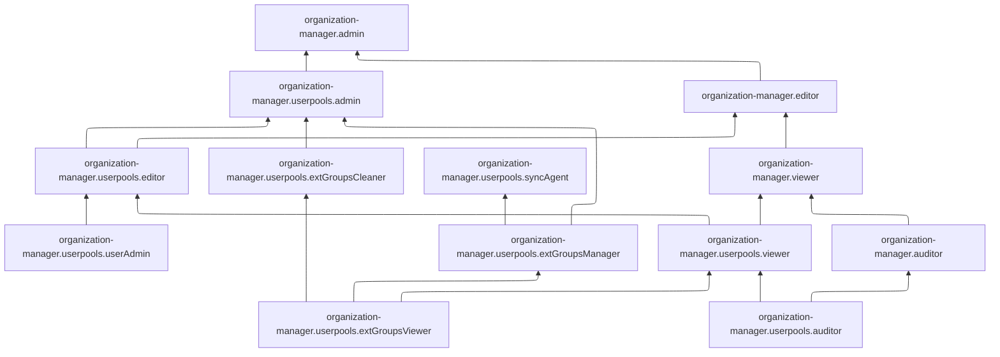

```mermaid
%%{init: {"flowchart": {'defaultRenderer': 'elk'}} }%%
flowchart BT
    om-up-userAdmin["organization-manager.userpools.userAdmin"] --> om-up-editor["organization-manager.userpools.editor"]
    om-up-extGroupsViewer["organization-manager.userpools.extGroupsViewer"] --> om-up-extGroupsManager["organization-manager.userpools.extGroupsManager"]
    om-up-extGroupsViewer --> om-up-extGroupsCleaner["organization-manager.userpools.extGroupsCleaner"]
    om-up-extGroupsViewer --> om-up-viewer["organization-manager.userpools.viewer"]
    om-up-extGroupsManager --> om-up-syncAgent["organization-manager.userpools.syncAgent"]
    om-up-extGroupsManager --> om-up-admin["organization-manager.userpools.admin"]
    om-up-extGroupsCleaner --> om-up-admin["organization-manager.userpools.admin"]
    om-up-auditor["organization-manager.userpools.auditor"] --> om-up-viewer
    om-up-viewer --> om-up-editor
    om-up-editor --> om-up-admin
    om-up-admin --> om-admin["organization-manager.admin"]
    om-up-editor --> om-editor["organization-manager.editor"]
    om-up-viewer --> om-viewer["organization-manager.viewer"]
    om-up-auditor --> om-auditor["organization-manager.auditor"]
    om-auditor --> om-viewer --> om-editor --> om-admin
```
