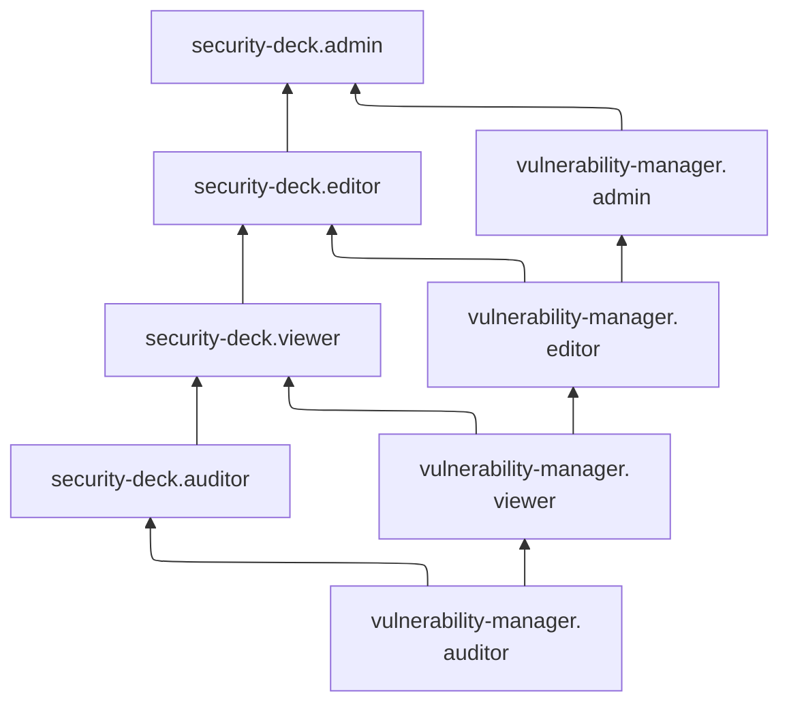

```mermaid
%%{init: {"flowchart": {'defaultRenderer': 'elk'}} }%%
flowchart BT
    security-deck.auditor --> security-deck.viewer
    security-deck.viewer --> security-deck.editor
    security-deck.editor --> security-deck.admin

    vulnerability-manager.editor["vulnerability-manager.<br>editor"] --> vulnerability-manager.admin["vulnerability-manager.<br>admin"]
    vulnerability-manager.viewer["vulnerability-manager.<br>viewer"] --> vulnerability-manager.editor
    vulnerability-manager.auditor["vulnerability-manager.<br>auditor"] --> vulnerability-manager.viewer

    vulnerability-manager.admin --> security-deck.admin
    vulnerability-manager.editor --> security-deck.editor
    vulnerability-manager.viewer --> security-deck.viewer
    vulnerability-manager.auditor --> security-deck.auditor

    security-deck.auditor ~~~ security-deck.admin
```
