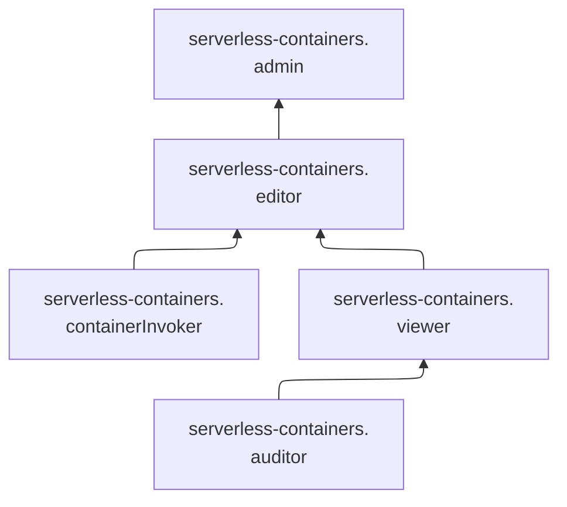

```mermaid
%%{
  init: {
    "flowchart": { "defaultRenderer": "elk" },
    "elk": { "nodePlacementStrategy": "SIMPLE" }
  }
}%%
flowchart BT
    serverless-containers.editor["serverless-containers.
    editor"] --> serverless-containers.admin["serverless-containers.
    admin"]
    serverless-containers.containerInvoker["serverless-containers.
    containerInvoker"] --> serverless-containers.editor
    serverless-containers.viewer["serverless-containers.
    viewer"] --> serverless-containers.editor
    serverless-containers.auditor["serverless-containers.
    auditor"] --> serverless-containers.viewer
```
