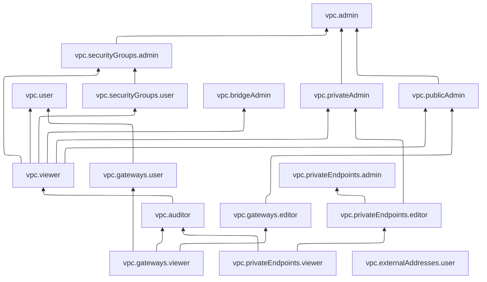

```mermaid
%%{
  init: {
    "flowchart": { "defaultRenderer": "elk" },
    "elk": { "nodePlacementStrategy": "NETWORK_SIMPLEX" }
  }
}%%
flowchart BT
    vpc.auditor --> vpc.viewer --> vpc.user
    vpc.gateways.viewer --> vpc.gateways.editor
    vpc.gateways.viewer --> vpc.gateways.user --> vpc.user
    vpc.privateEndpoints.viewer --> vpc.privateEndpoints.editor --> vpc.privateEndpoints.admin
    vpc.externalAddresses.user
    vpc.securityGroups.user --> vpc.securityGroups.admin
    vpc.viewer --> vpc.securityGroups.user
    vpc.viewer --> vpc.securityGroups.admin
    vpc.viewer --> vpc.bridgeAdmin
    vpc.viewer --> vpc.privateAdmin --> vpc.admin
    vpc.viewer --> vpc.publicAdmin --> vpc.admin
    vpc.securityGroups.admin --> vpc.admin
    vpc.privateEndpoints.editor --> vpc.privateAdmin
    vpc.gateways.editor --> vpc.publicAdmin
    vpc.gateways.viewer --> vpc.auditor
    vpc.privateEndpoints.viewer --> vpc.auditor
```
