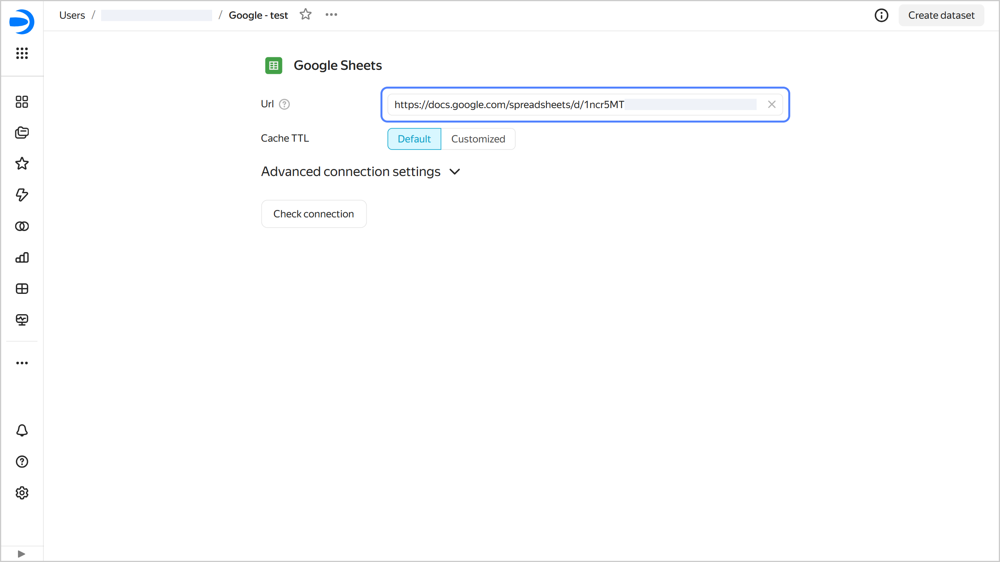
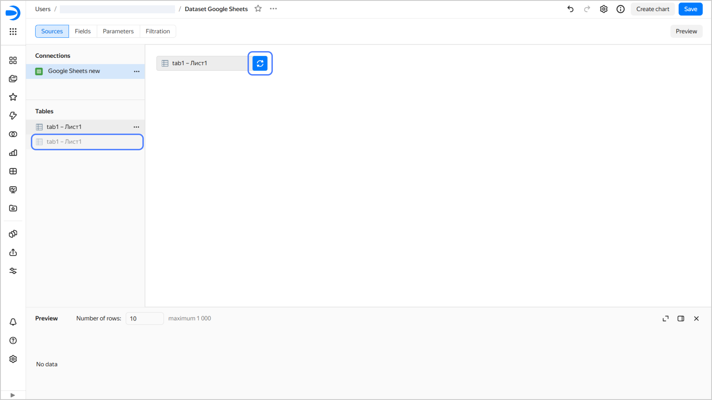

### How to replace a legacy Google Sheets connection with a new one? {#google-sheets-v2}

To migrate from a legacy Google Sheets connection (created in 2022 or earlier), manually create a new connection and replace it in the datasets currently using the old connection:

1. Open the legacy connection and copy the document link.

   
   
   

   

1. Create a new [connection to Google Sheets](../../datalens/operations/connection/create-google-sheets.md) and specify the document link you copied.
1. [Replace the connection](../../datalens/dataset/create-dataset.md#replace-connection) with the new one in existing datasets:
   
   1. In a dataset, next to the connection, click  → Replace connection.
   1. Select the new connection.
   1. To restore data display, update the table in the workspace. To do this, drag the new table (the new table has no  icon to its right) from the **Tables** section into the workspace, hover it over the circular arrow icons to the right of the table you want to replace until the icon background turns blue, then release the table.

      
      
      

      

      

      If you first delete the table from the workspace and then add a new one with the same fields, the field IDs in the dataset will change, which will break data display in all charts and selectors based on this dataset.

      

   1. Save the dataset.

   You can see which datasets are based on the legacy connection. To do this, at the top of the connection page, click  →  **Linked objects**.
