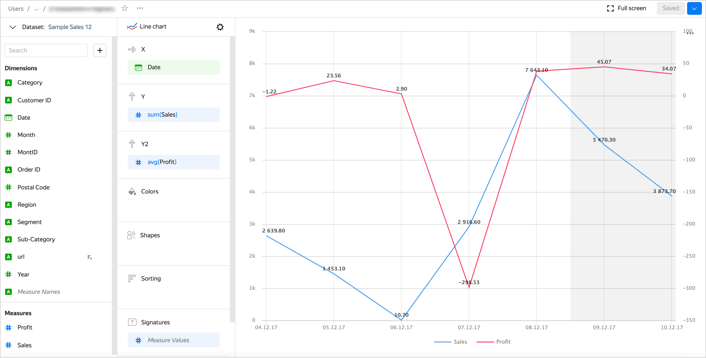

### How do I label multiple lines on a chart? {#sign-multiple-lines}

If a line chart only contains a single metric in the **Y** or the **Y2** section, drag this metric to the **Signatures** section.

If a line chart contains two or more metrics in the **Y** or the **Y2** section, drag the **Measure Values** metric to the **Signatures** section.




