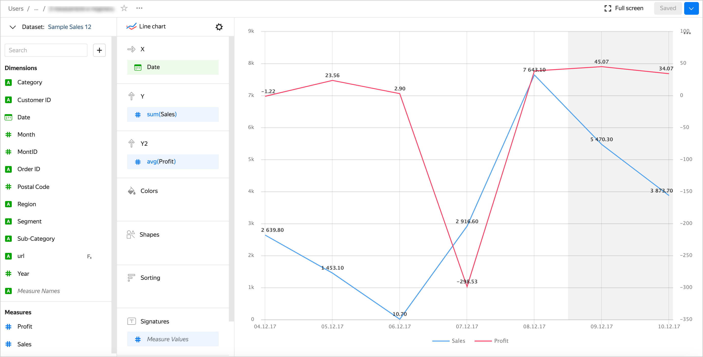

### How do I label multiple lines on a chart? {#sign-multiple-lines}

If a line chart only contains a single measure in the **Y** or the **Y2** section, drag this measure to the **Signatures** section.

If a line chart contains two or more measures in the **Y** or the **Y2** section, drag the **Measure Values** measure to the **Signatures** section.





