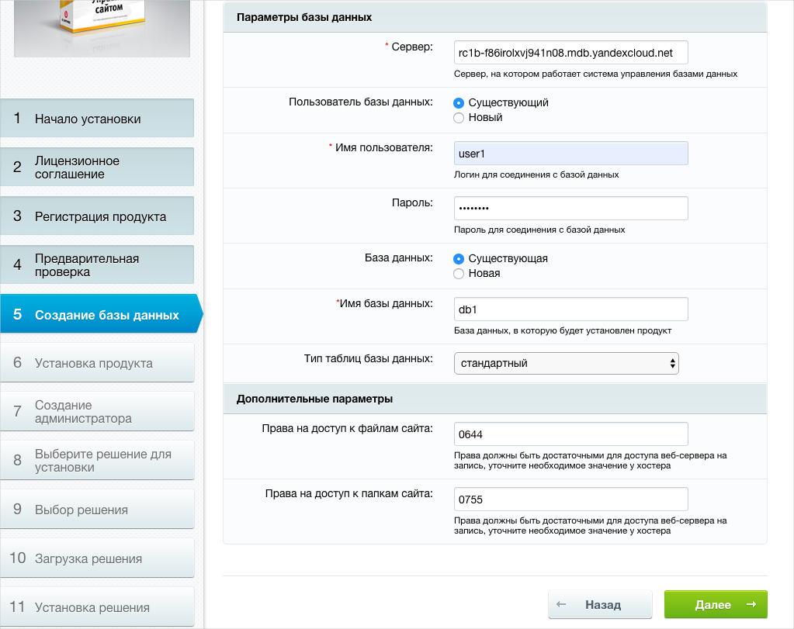
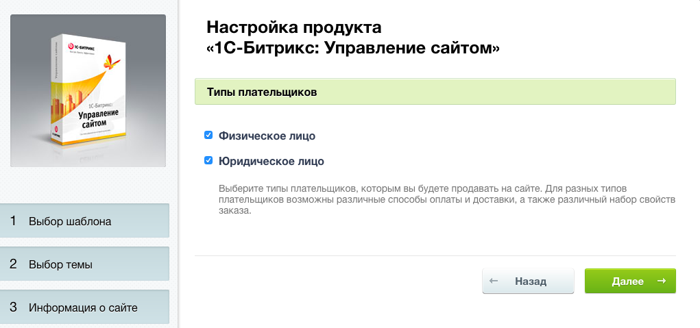

Install and configure 1C-Bitrix:

1. Open the 1C-Bitrix: Site Management web interface at `http://<VM_public_IP_address>/` in your browser. A page will open prompting you to install 1C-Bitrix.

1. Click **Next** on the installer welcome screen.

   

1. Read the license agreement and select **I accept the license agreement**. Then click **Next**.

   

1. You do not need to register the product (you can disable this option). Make sure the **Install in UTF-8 encoding** option is selected and click **Next**.

   

1. 1C-Bitrix will check if the server is configured correctly. Click **Next** at the bottom of the page.

   

1. Configure the database:
   1. In the **Server** field, enter the fully qualified domain name (FQDN) of the DB you created. To find out this name:
      1. Open the folder page in the [management console]({{ link-console-main }}) in a new browser tab.
      1. Select **{{ mmy-name }}**.
      1. In the table, click the row of the DB cluster you created.
      1. Go to the **Hosts** tab.
      1. Hover over the **Hostname** field value and click .
   1. In the **Username** and **Password** fields, specify the data you entered when creating the DB.
   1. In the **Database name** field, specify the DB name (`db1` in this example).
   1. Leave the default values in the other fields.
   1. Click **Next**.

   

1. Wait for the system installation and DB initialization to complete.

   

1. Create an administrator (a user to manage the system). Fill in the fields with your personal data and click **Next**.

   

1. Select the **Online store** template and click **Next**.

   

1. Confirm the selection of the only template and click **Next**.

   

1. Select a color for the previously selected template and click **Next**.

   

1. Fill in the fields according to your requirements for the online store and click **Next**.

   

1. If necessary, enable the inventory management function and specify when to reserve items at the warehouse. Click **Next**.

   

1. Enter your company information and click **Next**.

   

1. Select the types of payers your online store should work with and click **Next**.

   

1. Select the payment and delivery methods your online store supports and click **Next**.

   

1. Wait for the system installation to complete.

   

1. When the installation is complete, click **Go to site**.

   

1. The online store interface will open in edit mode.

   

1. Click **Exit** in the top-right corner of the page to see the site home page as a regular user. To return to edit mode, log in to the website using the 1C-Bitrix administrator credentials.

   



To get system backups, [create disk snapshots](../../compute/operations/disk-control/create-snapshot.md) on your VM from time to time.

