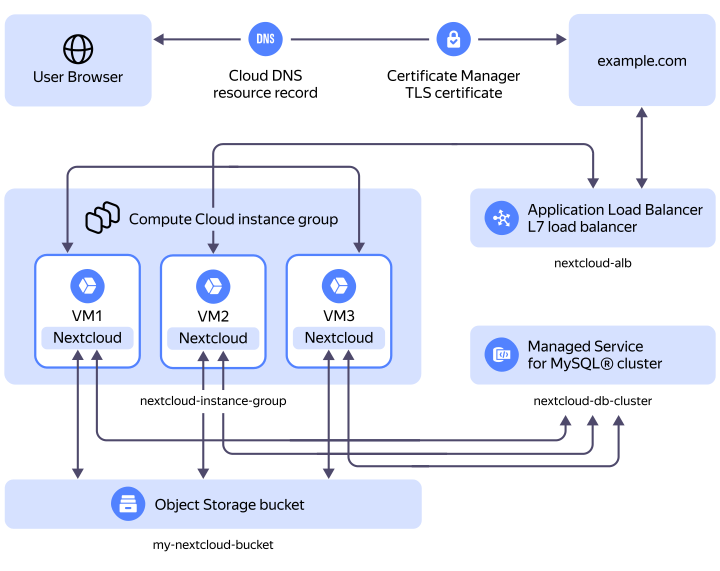

In this tutorial, you will connect an {{ objstorage-name }} [bucket](../../../storage/concepts/bucket.md) to a Nextcloud solution deployed on a {{ compute-name }} [VM instance](../../../compute/concepts/vm.md) with a database in a {{ mmy-full-name }} [cluster](../../../managed-mysql/concepts/index.md). To ensure fault tolerance and redundancy of your Nextcloud infrastructure, you will scale Nextcloud across an [instance group](../../../compute/concepts/instance-groups/index.md) and implement [L7 load balancing](../../../application-load-balancer/concepts/application-load-balancer.md) with {{ alb-full-name }}. In the fault-tolerant configuration, Nextcloud will be available via a domain name, for which a [TLS certificate](../../../certificate-manager/concepts/managed-certificate.md) will be issued in {{ certificate-manager-full-name }}.



To implement a fault-tolerant Nextcloud configuration, you will need a domain for the L7 load balancer.



Fault-tolerant solution diagram:

Where:
* `example.com`: Your domain for which a [certificate](../../../certificate-manager/concepts/managed-certificate.md) is issued in {{ certificate-manager-full-name }}, connected to the [L7 load balancer](../../../application-load-balancer/concepts/application-load-balancer.md).
* `nextcloud-alb`: L7 load balancer to evenly distribute incoming user traffic across instance group hosts.
* `nextcloud-instance-group`: [Instance group](../../../compute/concepts/instance-groups/index.md) with hosts the Nextcloud solution is deployed on.
* `nextcloud-db-cluster`: {{ mmy-full-name }} [cluster](../../../managed-mysql/concepts/index.md) with the Nextcloud service database.
* `my-nextcloud-bucket`: {{ objstorage-full-name }} [bucket](../../../storage/concepts/bucket.md) connected to the Nextcloud solution.

To deploy Nextcloud in {{ yandex-cloud }} and connect an {{ objstorage-name }} bucket: