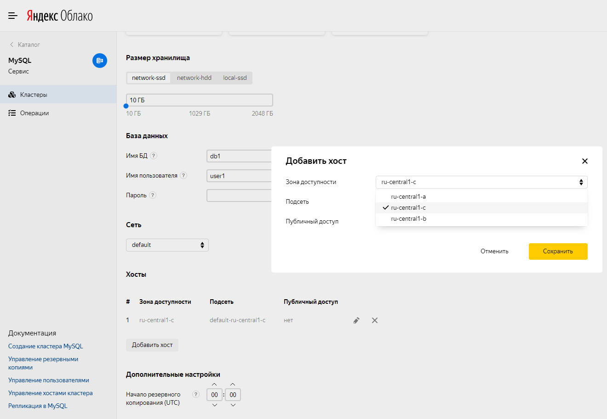

1. [Prepare your cloud](#before-you-begin).
1. [Create and set up a cloud network](#create-network).
1. [Create a VM in the cloud](#create-vm).
1. [Create a {{ MY }} DB cluster](#create-mysql).
1. [Configure a server for 1C-Bitrix](#configure-server).
1. [Configure 1C-Bitrix](#configure-bitrix).

If you no longer need the resources you created, [delete them](#clear-out).

## Prepare your cloud {#before-you-begin}



### Required paid resources {#paid-resources}



## Create and set up a cloud network {#create-network}



- Management console {#console}

   1. [Create a network](../../vpc/operations/network-create.md) named `network-1`. When creating your network, disable the **{{ ui-key.yacloud.vpc.networks.create.field_is-default }}** option.
   1. In `network-1`, [create](../../vpc/operations/subnet-create.md) two [subnets](../../vpc/concepts/network.md#subnet) in different [availability zones](../../overview/concepts/geo-scope.md) with the following parameters:
      1. Subnet in the `{{ region-id }}-a` availability zone:
         * **{{ ui-key.yacloud.vpc.subnetworks.create.field_name }}**: `subnet-a`
         * **{{ ui-key.yacloud.vpc.subnetworks.create.field_zone }}**: `{{ region-id }}-a`
         * **{{ ui-key.yacloud.vpc.subnetworks.create.field_ip }}**: `192.168.0.0/24`
      1. Subnet in the `{{ region-id }}-b` availability zone:
         * **{{ ui-key.yacloud.vpc.subnetworks.create.field_name }}**: `subnet-b`
         * **{{ ui-key.yacloud.vpc.subnetworks.create.field_zone }}**: `{{ region-id }}-b`
         * **{{ ui-key.yacloud.vpc.subnetworks.create.field_ip }}**: `192.168.1.0/24`
   1. In `network-1`, [create security groups](../../vpc/operations/security-group-create.md):
      1. Named `bitrix-sg-vm` for your VM in the cloud. [Set rules](../../vpc/operations/security-group-add-rule.md) for the [security group](../../vpc/concepts/security-groups.md) based on the following table:

         | Traffic direction | {{ ui-key.yacloud.vpc.network.security-groups.forms.field_sg-rule-description }} | {{ ui-key.yacloud.vpc.network.security-groups.forms.field_sg-rule-port-range }} | {{ ui-key.yacloud.vpc.network.security-groups.forms.field_sg-rule-protocol }} | {{ ui-key.yacloud.vpc.network.security-groups.forms.field_sg-rule-source }} / {{ ui-key.yacloud.vpc.network.security-groups.forms.field_sg-rule-destination }} | {{ ui-key.yacloud.vpc.network.security-groups.forms.field_sg-rule-cidr-blocks }} |
         --- | --- | --- | --- | --- | ---
         | Outgoing | `ANY` | `All` | `{{ ui-key.yacloud.vpc.network.security-groups.forms.value_any }}` | `{{ ui-key.yacloud.vpc.network.security-groups.label_destination-type-cidr }}` | `0.0.0.0/0` |
         | Incoming | `HTTP` | `80` | `{{ ui-key.yacloud.common.label_tcp }}` | `{{ ui-key.yacloud.vpc.network.security-groups.label_destination-type-cidr }}` | `0.0.0.0/0` |
         | Incoming | `EXT-HTTPS` | `443` | `{{ ui-key.yacloud.common.label_tcp }}` | `{{ ui-key.yacloud.vpc.network.security-groups.label_destination-type-cidr }}` | `0.0.0.0/0` |
         | Incoming | `SSH` | `22` | `{{ ui-key.yacloud.common.label_tcp }}` | `{{ ui-key.yacloud.vpc.network.security-groups.label_destination-type-cidr }}` | `0.0.0.0/0` |

      1. Named `bitrix-sg` for a {{ MY }} database cluster. [Set rules](../../vpc/operations/security-group-add-rule.md) for the security group based on the following table:

         | Traffic direction | {{ ui-key.yacloud.vpc.network.security-groups.forms.field_sg-rule-description }} | {{ ui-key.yacloud.vpc.network.security-groups.forms.field_sg-rule-port-range }} | {{ ui-key.yacloud.vpc.network.security-groups.forms.field_sg-rule-protocol }} | {{ ui-key.yacloud.vpc.network.security-groups.forms.field_sg-rule-source }} / {{ ui-key.yacloud.vpc.network.security-groups.forms.field_sg-rule-destination }} | {{ ui-key.yacloud.vpc.network.security-groups.forms.field_sg-rule-cidr-blocks }} |
         --- | --- | --- | --- | --- | ---
         | Outgoing | `ANY` | `All` | `{{ ui-key.yacloud.vpc.network.security-groups.forms.value_any }}` | `{{ ui-key.yacloud.vpc.network.security-groups.label_destination-type-cidr }}` | `0.0.0.0/0` |
         | Incoming | `EXT-HTTPS` | `3306` | `{{ ui-key.yacloud.common.label_tcp }}` | `{{ ui-key.yacloud.vpc.network.security-groups.label_destination-type-cidr }}` | `0.0.0.0/0` |



## Create a VM in the cloud {#create-vm}



- Management console {#console}

   1. On the [management console]({{ link-console-main }}) folder page, click **Create resource** and select **Virtual machine**.
   1. In the **Name** field, enter a name for your VM, e.g., `bitrixwebsite`.
   1. In the **Availability** zone field, select `{{ region-id }}-a`.
   1. Under **{{ marketplace-name }}**, select the [Ubuntu 22.04 lts](/marketplace/products/yc/ubuntu-22-04-lts) image.
   1. Under **Disks**, select a `24 GB` `SSD`.
   1. Under **Computing resources**:
      * Choose a VM [platform](../../compute/concepts/vm-platforms.md).
      * For 1C-Bitrix to work correctly, specify the following configuration:
         * **Platform**: `Intel Ice Lake`
         * **Guaranteed vCPU share**: `20%`
         * **vCPU**: `2`
         * **RAM**: `4 GB`
   1. Under **Network settings**:
      * In the **Subnet** field, select `subnet-a` you created earlier.
      * In the **Public address** field, keep **Auto** to assign your VM a random public IP address from the {{ yandex-cloud }} pool, or select a static address from the list if you reserved one in advance.
      * In the **Security group** field, select the `bitrix-sg-vm` security group.
   1. Under **Access**, specify the information required to access the VM:
      * In the **Login** field, enter the preferred username for the user to be created on the VM, e.g., `ubuntu`.
      * In the **SSH key** field, paste your public SSH key. You need to create an SSH key pair [yourself](../../compute/operations/vm-connect/ssh.md).
   1. Click **Create VM**.

   You may need to save [disk snapshots](../../compute/operations/disk-control/create-snapshot.md) of your VM. They contain a copy of the VM file system from when the snapshot was created.

   You can use disk snapshots for various purposes, e.g.:
   * Migrating data from one disk to another, for example, to a disk in a different availability zone.
   * Creating a disk [backup](../../compute/concepts/backups.md) before performing operations that can damage your data.
   * Performing disk versioning by [creating snapshots on a regular basis](../../compute/operations/disk-control/configure-schedule.md).



## Create a {{ MY }} DB cluster {#create-mysql}



- Management console {#console}

   1. On the folder page in the [management console]({{ link-console-main }}), select **{{ mmy-name }}**.
   1. Click **Create resource** and select **{{ MY }} cluster**.
   1. In the **Name** field, enter the cluster name, for example, `Bitrix{{ MY }}`.
   1. Under **Host class**, select `s2.micro`. These characteristics are enough for 1C-Bitrix to run.
   1. Under **Storage size**, select the [type of storage](../../managed-mysql/concepts/storage.md): 10 GB `network-ssd`.
   1. Under **Database**, enter:
      * **DB name**. In this tutorial, leave the default value, `db1`.
      * **Username** which serves as a login for connection to the DB. In this tutorial, leave the default value, `user1`.
      * **Password** for 1C-Bitrix to access the {{ MY }} database, e.g., `p@s$woRd!`.
   1. Under **Network settings**:
      * In the **Network** field, select `network-1` you created earlier.
      * In the **Security group** field, select the `bitrix-sg` security group.
   1. Under **Hosts**, change the **Availability zone** for the database. To do this, click  in the line containing host details. In the window that opens, select the availability zone and click **Save**.

      We recommend selecting the same availability zone as when you created the VM. This reduces latency between the VM and the DB.

      

   1. To make your DB fault-tolerant, you can add more hosts for it. To do this, select **Add host** and specify the availability zone to place it in.
   1. Leave the other fields unchanged.
   1. Click **Create cluster**.

   Creating a DB cluster may take a few minutes. To check that the new cluster is available, select **{{ mmy-name }}** in the {{ yandex-cloud }} management console. On the **Clusters** tab, the cluster status should be **Running** and its state **Alive**.



## Configure a server for 1C-Bitrix {#configure-server}



## Configure 1C-Bitrix {#configure-bitrix}



## How to delete the resources you created {#clear-out}

To stop paying for the resources you created:
1. [Delete](../../compute/operations/vm-control/vm-delete.md) the `bitrixwebsite` VM.
1. [Delete](../../managed-mysql/operations/cluster-delete.md) the {{ MY }} database cluster named `Bitrix`.

If you reserved a static public IP address specifically for this VM:
1. Select **{{ vpc-name }}** in your folder.
1. Go to the **IP addresses** tab.
1. Find the required IP address, click , and select **Delete**.
