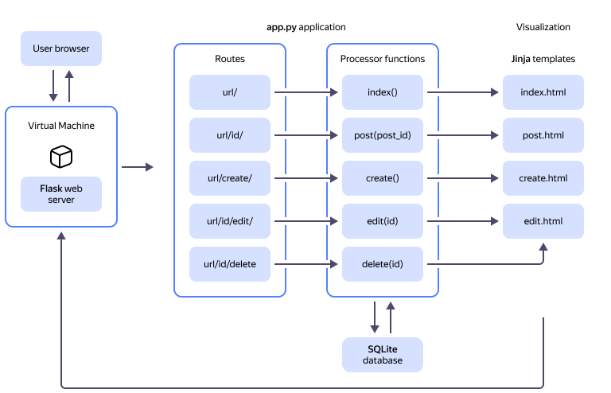

# Creating a Python web application with Flask


Using this tutorial, you will develop a simple web application from scratch: a mini blog where users can create, view, edit, and delete posts. To do this, you will create a {{ compute-full-name }} VM in {{ yandex-cloud }} and run a web server on it.

The web app is written in [Python](https://www.python.org/) and uses [SQLite](https://sqlite.org/) to handle data. To develop the frontend, we will use [Bootstrap](https://getbootstrap.com/). 

We opted for [Flask](https://flask.palletsprojects.com/en/3.0.x/) as the base framework for our application, since it is one of the most intuitive and straightforward Python web frameworks. 

Flask allows you to create web applications from a single source code file; it does not require following any specific directory structure or writing complex template code prior to using it. Flask also provides out-of-the-box support for the [Werkzeug](https://werkzeug.palletsprojects.com/en/latest/) toolkit and the [Jinja templating engine](http://jinja.palletsprojects.com/) to create dynamic HTML pages.

You can find the source code for the application in the [flask_blog.zip](https://github.com/yandex-cloud-examples/yc-web-app-python-flask/blob/main/flask_blog.zip) file.

How your application is assumed to work:



1. A Linux Ubuntu VM with a Flask web server installed and running gets HTTP requests from the user’s browser.
1. The web server forwards a request to the web application, whose router invokes the appropriate handler function based on the request URL.
1. The handler function makes a query to the SQLite database to retrieve or write the required data.
1. The function sends the data retrieved from the database to the appropriate Jinja HTML template, which returns the final HTML code of the page.
1. This HTML code is forwarded to the web server, which, in turn, transfers this code to the user's browser.

To create a web application with Flask:

1. [Get your cloud ready](#before-you-begin).
1. [Create and set up a virtual machine](#create-setup-vm).
1. [Create and run the application](#create-app).
1. [Create and configure the HTML templates](#html-templates).
1. [Configure the database](#configure-data-base).
1. [Configure the display of blog posts](#display-posts).
1. [Add actions with posts](#add-post-actions).
1. [Summarize the results](#results).

If you no longer need the web application, [delete the resources it uses](#clear-out).

## Getting started {#before-you-begin}

In {{ yandex-cloud }}, you only pay for the resources you consume and the time of their actual use. To get identified as a payer, you need a billing account.

The cost of support for your web application includes:

* Fee for using a public IP address (see [{{ vpc-full-name }} pricing](../../vpc/pricing.md)).
* Fee for VM computing resources and disks (see [{{ compute-full-name }} pricing](../../compute/pricing.md)).



### Create a cloud network and subnet {#create-network}

In {{ yandex-cloud }}, resources are linked one to another and to the internet with [cloud networks](../../vpc/concepts/network.md#network), where resources receive [public](../../vpc/concepts/address.md#public-addresses) IP addresses as well as private IP address ranges or [subnets](../../vpc/concepts/network.md#subnet).

To create a virtual network and subnet for your web server:



- Management console {#console} 

  1. In the [management console]({{ link-console-main }}), select your folder.
  1. In the list of services, select **{{ ui-key.yacloud.iam.folder.dashboard.label_vpc }}**.
  1. At the top right, click **{{ ui-key.yacloud.vpc.networks.button_create }}**.
  1. In the **{{ ui-key.yacloud.vpc.networks.create.field_name }}** field, specify `webserver-network`.
  1. In the **{{ ui-key.yacloud.vpc.networks.create.field_advanced }}** field, disable the **{{ ui-key.yacloud.vpc.networks.create.field_is-default }}** option.
  1. Click **{{ ui-key.yacloud.vpc.networks.button_create }}**.
  1. In the left-hand panel, select  **{{ ui-key.yacloud.vpc.switch_networks }}**.
  1. At the top right, click **{{ ui-key.yacloud.common.create }}**.
  1. In the **{{ ui-key.yacloud.vpc.subnetworks.create.field_name }}** field, specify `webserver-subnet-{{ region-id }}-b`.
  1. In the **{{ ui-key.yacloud.vpc.subnetworks.create.field_zone }}** field, select the `{{ region-id }}-b` availability zone.
  1. In the **{{ ui-key.yacloud.vpc.subnetworks.create.field_network }}** field, select `webserver-network`.
  1. In the **{{ ui-key.yacloud.vpc.subnetworks.create.field_ip }}** field, specify `192.168.1.0/24`.
  1. Click **{{ ui-key.yacloud.vpc.subnetworks.create.button_create }}**.

- CLI {#cli}

  1. Create a network named `webserver-network`:

      ```bash
      yc vpc network create webserver-network
      ```

      Result:

      ```text
      id: enp1gg8kr3pv********
      folder_id: b1gt6g8ht345********
      created_at: "2023-12-20T20:08:11Z"
      name: webserver-network
      default_security_group_id: enppne4l2eg5********
      ```

      For more information about the `yc vpc network create` command, see the [CLI reference](../../cli/cli-ref/vpc/cli-ref/network/create.md).

  1. Create a subnet in the `{{ region-id }}-b` availability zone:

      ```bash
      yc vpc subnet create webserver-subnet-{{ region-id }}-b \
        --zone {{ region-id }}-b \
        --network-name webserver-network \
        --range 192.168.1.0/24
      ```

      Result:

      ``` 
      id: e2li9tcgi7ii********
      folder_id: b1gt6g8ht345********
      created_at: "2023-12-20T20:11:16Z"
      name: webserver-subnet-{{ region-id }}-b
      network_id: enp1gg8kr3pv********
      zone_id: {{ region-id }}-b
      v4_cidr_blocks:
        - 192.168.1.0/24
      ```

      For more information about the `yc vpc subnet create` command, see the [CLI reference](../../cli/cli-ref/vpc/cli-ref/subnet/create.md).

- API {#api}

  1. To create a network, use the [create](../../vpc/api-ref/Network/create.md) REST API method for the [Network](../../vpc/api-ref/Network/index.md) resource or the [NetworkService/Create](../../vpc/api-ref/grpc/Network/create.md) gRPC API call.

  1. To create a subnet, use the [create](../../vpc/api-ref/Subnet/create.md) REST API method for the [Subnet](../../vpc/api-ref/Subnet/index.md) resource or the [SubnetService/Create](../../vpc/api-ref/grpc/Subnet/create.md) gRPC API call.



### Create a security group {#create-sg}

[Security groups](../../vpc/concepts/security-groups.md) are the central tool for managing network access in {{ yandex-cloud }} and help restrict unauthorized traffic to cloud resources at the cloud network level.

Create a security group that allows inbound TCP traffic on ports `5000` and `22` as well as any outbound traffic. Port `22` is used to connect to the VM over SSH, while `5000` is the default port to run a Flask web server.



- Management console {#console}

  1. In the [management console]({{ link-console-main }}), select your folder.
  1. In the list of services, select **{{ ui-key.yacloud.iam.folder.dashboard.label_vpc }}**.
  1. In the left-hand panel, select  **{{ ui-key.yacloud.vpc.label_security-groups }}**. 
  1. Click **{{ ui-key.yacloud.vpc.network.security-groups.button_create }}**.
  1. In the **{{ ui-key.yacloud.vpc.network.security-groups.forms.field_sg-name }}** field, enter this name: `webserver-sg`.
  1. In the **{{ ui-key.yacloud.vpc.network.security-groups.forms.field_sg-network }}** field, select `webserver-network`, which you created earlier.
  1. Under **{{ ui-key.yacloud.vpc.network.security-groups.forms.label_section-rules }}**, [create](../../vpc/operations/security-group-add-rule.md) the following traffic management rules:

      | Traffic<br/>direction | {{ ui-key.yacloud.vpc.network.security-groups.forms.field_sg-rule-description }} | {{ ui-key.yacloud.vpc.network.security-groups.forms.field_sg-rule-port-range }} | {{ ui-key.yacloud.vpc.network.security-groups.forms.field_sg-rule-protocol }} | {{ ui-key.yacloud.vpc.network.security-groups.forms.field_sg-rule-source }} /<br/>{{ ui-key.yacloud.vpc.network.security-groups.forms.field_sg-rule-destination }} | {{ ui-key.yacloud.vpc.network.security-groups.forms.field_sg-rule-cidr-blocks }} |
      | --- | --- | --- | --- | --- | --- |
      | Inbound | `Flask`           | `5000` | `TCP` | `{{ ui-key.yacloud.vpc.network.security-groups.forms.value_sg-rule-destination-cidr }}` | `0.0.0.0/0` |
      | Inbound | `ssh`            | `22`   | `TCP`  | `{{ ui-key.yacloud.vpc.network.security-groups.forms.value_sg-rule-destination-cidr }}` | `0.0.0.0/0` |
      | Outbound | `any`           | `All` | `{{ ui-key.yacloud.vpc.network.security-groups.forms.value_any }}` | `{{ ui-key.yacloud.vpc.network.security-groups.forms.value_sg-rule-destination-cidr }}` | `0.0.0.0/0` |

  1. Click **{{ ui-key.yacloud.common.save }}**.

- CLI {#cli}
  
  Run this command:

  ```bash
  yc vpc security-group create \
    --name webserver-sg \
    --rule "description=Flask,direction=ingress,port=5000,protocol=tcp,v4-cidrs=[0.0.0.0/0]" \
    --rule "description=ssh,direction=ingress,port=22,protocol=tcp,v4-cidrs=[0.0.0.0/0]" \
    --rule "description=any,direction=egress,port=any,protocol=any,v4-cidrs=[0.0.0.0/0]" \
    --network-name webserver-network
  ```

  Result:

  ```text
  id: enpv1c0q7j01********
  folder_id: b1gt6g8ht345********
  created_at: "2024-03-23T18:54:05Z"
  name: webserver-sg
  network_id: enp9mji1m7b3********
  status: ACTIVE
  rules:
    - id: enpmbsk2hjfd********
      description: Flask
      direction: INGRESS
      ports:
        from_port: "5000"
        to_port: "5000"
      protocol_name: TCP
      protocol_number: "6"
      cidr_blocks:
        v4_cidr_blocks:
          - 0.0.0.0/0
    - id: enpna5id9265********
      description: ssh
      direction: INGRESS
      ports:
        from_port: "22"
        to_port: "22"
      protocol_name: TCP
      protocol_number: "6"
      cidr_blocks:
        v4_cidr_blocks:
          - 0.0.0.0/0
    - id: enpen3vf7rui********
      description: any
      direction: EGRESS
      protocol_name: ANY
      protocol_number: "-1"
      cidr_blocks:
        v4_cidr_blocks:
          - 0.0.0.0/0
  ```

  Save the `id` as you will need need it to create a VM.

  For more information about the `yc vpc security-group create` command, see the [CLI reference](../../cli/cli-ref/vpc/cli-ref/security-group/create.md).

- API {#api}

  To create a security group, use the [create](../../vpc/api-ref/SecurityGroup/create.md) REST API method for the [SecurityGroup](../../vpc/api-ref/SecurityGroup/index.md) resource or the [SecurityGroupService/Create](../../vpc/api-ref/grpc/SecurityGroup/create.md) gRPC API call.



## Create and set up a virtual machine {#create-setup-vm}

A [virtual machine](../../compute/concepts/vm.md) is similar to a server in cloud infrastructures. In {{ yandex-cloud }}, you can create VMs with varying hardware specifications in terms of [performance](../../compute/concepts/performance-levels.md), RAM, and [disk space](../../compute/concepts/disk.md#maximum-disk-size); they can also run on various [operating systems](../../compute/concepts/image.md#public).

This web application will be deployed on an [Ubuntu 22.04 LTS](/marketplace/products/yc/ubuntu-22-04-lts) VM.

1. Create a virtual machine:

    Before you start, [prepare](../../compute/operations/vm-connect/ssh.md#creating-ssh-keys) a key pair (a public key and a private key) to access your VM over SSH.

    

    - Management console {#console}

      1. In the [management console]({{ link-console-main }}), select the [folder](../../resource-manager/concepts/resources-hierarchy.md#folder) where you want to create your VM.
      1. In the list of services, select **{{ ui-key.yacloud.iam.folder.dashboard.label_compute }}**.
      1. In the left-hand panel, select  **{{ ui-key.yacloud.compute.switch_instances }}**.
      1. Click **{{ ui-key.yacloud.compute.instances.button_create }}**.
      1. Under **{{ ui-key.yacloud.compute.instances.create.section_image }}**, select the [Ubuntu 22.04 LTS](/marketplace/products/yc/ubuntu-22-04-lts) image.
      1. Under **{{ ui-key.yacloud.k8s.node-groups.create.section_allocation-policy }}**, select the `{{ region-id }}-b` [availability zone](../../overview/concepts/geo-scope.md).
      1. Under **{{ ui-key.yacloud.compute.instances.create.section_network }}**:

          * In the **{{ ui-key.yacloud.component.compute.network-select.field_subnetwork }}** field, select the `webserver-subnet-{{ region-id }}-b` subnet you created earlier.
          * In the **{{ ui-key.yacloud.component.compute.network-select.field_external }}** field, select `{{ ui-key.yacloud.component.compute.network-select.switch_auto }}`.
          * In the **{{ ui-key.yacloud.component.compute.network-select.field_security-groups }}** field, select `webserver-sg`, which you created earlier.

      1. Under **{{ ui-key.yacloud.compute.instances.create.section_access }}**, select **{{ ui-key.yacloud.compute.instance.access-method.label_oslogin-control-ssh-option-title }}** and specify the VM access credentials:

          * Enter the username in the **{{ ui-key.yacloud.compute.instances.create.field_user }}** field: `yc-user`.
          * 

      1. Under **{{ ui-key.yacloud.compute.instances.create.section_base }}**, specify the VM name: `sftp-server`.
      1. Click **{{ ui-key.yacloud.compute.instances.create.button_create }}**.

    - CLI {#cli}

      Run the command while specifying the security group ID you saved at the previous step:

      ```bash
      yc compute instance create \
        --name mywebserver \
        --zone {{ region-id }}-b \
        --network-interface subnet-name=webserver-subnet-{{ region-id }}-b,nat-ip-version=ipv4,security-group-ids=<security_group_ID> \
        --create-boot-disk image-folder-id=standard-images,image-id=fd8ne6e3etbrr2ve9nlc \
        --ssh-key <public_SSH_key_file>
      ```

      Where `--ssh-key` is the path to the public SSH key file. It can look like this: `~/.ssh/id_ed25519.pub`.

      Result:

      ```yml
      done (32s)
      id: epdv79cu67np********
      folder_id: b1gt6g8ht345********
      created_at: "2024-03-23T19:17:09Z"
      name: mywebserver
      zone_id: {{ region-id }}-b
      platform_id: standard-v2
      resources:
        memory: "2147483648"
        cores: "2"
        core_fraction: "100"
      status: RUNNING
      metadata_options:
        gce_http_endpoint: ENABLED
        aws_v1_http_endpoint: ENABLED
        gce_http_token: ENABLED
        aws_v1_http_token: DISABLED
      boot_disk:
        mode: READ_WRITE
        device_name: epdg0926k12t********
        auto_delete: true
        disk_id: epdg0926k12t********
      network_interfaces:
        - index: "0"
          mac_address: d0:0d:1f:3a:59:e3
          subnet_id: e2l3qffk0h6t********
          primary_v4_address:
            address: 192.168.1.14
            one_to_one_nat:
              address: 62.84.***.***
              ip_version: IPV4
          security_group_ids:
            - enpv1c0q7j01********
      serial_port_settings:
        ssh_authorization: INSTANCE_METADATA
      gpu_settings: {}
      fqdn: epdv79cu67np********.auto.internal
      scheduling_policy: {}
      network_settings:
        type: STANDARD
      placement_policy: {}
      ```

      For more information about the `yc compute instance create` command, see the [CLI reference](../../cli/cli-ref/compute/cli-ref/instance/create.md).

    - API {#api}

      To create a VM, use the [create](../../compute/api-ref/Instance/create.md) REST API method for the [Instance](../../compute/api-ref/Instance/) resource or the [InstanceService/Create](../../compute/api-ref/grpc/Instance/create.md) gRPC API call.

    

    As a result, you will have the `mywebserver` VM in your folder. To [connect](../../compute/operations/vm-connect/ssh.md#vm-connect) to the VM over SSH, use the `yc-user` username and the [public IP address](../../vpc/concepts/address.md#public-addresses) of the VM. If you intend to use the web server you created over a long period of time, [makeconvert](../../vpc/operations/set-static-ip.md) ’its public IP address to static.

1. Create and activate the virtual environment.

    A virtual environment provides an isolated space for Python projects on the server. All required dependencies, e.g., executables, libraries, and other files, are copied to the selected folder, and the application uses them rather than those installed on the system. This both ensures the development environment is stable and keeps the base system clean.

    To create a virtual environment, use the Python 3 `venv` library module:

    1. [Connect](../../compute/operations/vm-connect/ssh.md) to `mywebserver`.

    1. In the current user's directory, create a project subdirectory named `flask_blog` where the application will be stored and navigate to it:

        ```bash
        mkdir flask_blog && cd flask_blog
        ```

    1. Install the `venv` virtualization module:

        ```bash
        sudo apt install python3.10-venv
        ```

    1. Create the `env` virtual environment:

        ```bash
        python3 -m venv env
        ```

    1. Activate the virtual environment:

        ```bash
        source env/bin/activate
        ```

        After you activate the virtual environment, a prefix with the environment name will appear in the command line:

        ```text
        (env) yc-user@ubuntu:~/flask_blog$
        ```

        

        To effectively track and manage project development, you can use a version control system. In this case, add the `env` directory to the `.gitignore` file to only track files associated with the project.

        

        To deactivate the virtual environment, run this command:

        ```bash
        deactivate
        ```

1. Install Flask:

    ```bash
    pip install flask
    ```

    Result:

    ```text
    Successfully installed Jinja2-3.1.3 MarkupSafe-2.1.5 Werkzeug-3.0.1 blinker-1.7.0 click-8.1.7 flask-3.0.2 itsdangerous-2.1.2
    ```

## Create and run the application {#create-app}

Create a simple web application inside a Python file and run it to launch the server.

1. In the `flask_blog` project directory, create and open the `app.py` file:

    ```bash
    nano app.py
    ```

    This file enables you to understand how the application will handle HTTP requests.

1. Add the following code to the file:

    ```python
    from flask import Flask

    app = Flask(__name__)


    @app.route('/')
    def hello():
        return 'Hello, World!'
    ```

    In this code:

    * You import the [`Flask`](https://flask.palletsprojects.com/en/latest/api/#flask.Flask) object from the `flask` package.
    * You create an instance of the Flask application named `app`. The special `__name__` variable contains the name of the current Python module and points its location to the instance. The reason this is required is that Flask creates several routes within the application.
    * The `@app.route('/')` [decorator](https://en.wikipedia.org/wiki/Python_syntax_and_semantics#Decorators) transforms the Python function into a Flask view function. The view function converts the return value into an HTTP response that can be processed by an HTTP client, such as a web browser. The `'/'` value in `@app.route()​​` means that this function will respond to web requests for the `/` URL, which is the primary URL of the web application.
    * You create a `hello()` function that returns the `Hello, World!` string as a response.

    Save and close the `app.py` file.

1. Set the `Flask` environment variables:

    ```bash
    export FLASK_APP=app && export FLASK_DEBUG=true
    ```

    Where:

    * `FLASK_APP=app` points to the app location, i.e., the `app.py` file.
    * `FLASK_DEBUG=true` means the application should run in development mode.

1. Run the application:

    ```bash
    flask run \
      --host=0.0.0.0
    ```

    Where the `--host=0.0.0.0` parameter starts the application server on all IP addresses of the VM. Failure to specify this parameter will prevent you from accessing the application using the VM public IP address.

    Result:

    ```text
     * Serving Flask app 'app'
     * Debug mode: on
    WARNING: This is a development server. Do not use it in a production deployment. Use a production WSGI server instead.
     * Running on all addresses (0.0.0.0)
     * Running on http://127.0.0.1:5000
     * Running on http://192.168.1.14:5000
    Press CTRL+C to quit
     * Restarting with stat
     * Debugger is active!
     * Debugger PIN: 884-371-***
    ```

    You will need the following information:

    * Name of the running application: `app`.
    * `Debug mode: on`: Means that the Flask debugger is active. This feature is useful in development as it provides detailed error messages whenever issues occur, making it easier to resolve them.
    * The application is running on all addresses.

    You can change the web server port to any other value by setting this optional parameter: `--port=<port_number>`. For example, the `flask run --host=0.0.0.0 --port=5001` command will start the Flask web server on port `5001`.

1. In you browser address bar, enter `http://<public_IP_address_of_VM>:5000/`.

    The browser will display the `Hello, World!` string. This means that your application is running properly and can be accessed from the internet.



Flask uses a simple web server to maintain the application in the development environment. It is reserved for testing and debugging and should not be used in the production environment. For more information, see [this Flask article](https://flask.palletsprojects.com/en/latest/deploying/).



Keep the web server running in the current window and open a new terminal window. You will use this new window to finish setting up your application. This way, you can test your changes without having to continuously stop and restart the web server.

When you open a new terminal window:

1. [Connect](../../compute/operations/vm-connect/ssh.md) to the VM.
1. Go to the `flask_blog` project directory, activate the virtual environment, and set the environment variables:

    ```bash
    cd flask_blog && source env/bin/activate && export FLASK_APP=app && export FLASK_DEBUG=true
    ```

## Create and configure the HTML templates {#html-templates}

At this point, the application can only display a plain text message in the browser. To display the data and controls the user needs, add HTML templates to your application.

To use templates in the app, you can use the [`render_template()`](https://flask.palletsprojects.com/en/latest/api/#flask.render_template) helper function enabled by the [Jinja template engine](https://jinja.palletsprojects.com/en/latest/templates/). You will use HTML templates to create application pages: the main page that lists blog posts and the pages for creating, viewing, and editing a post.

### Create the main page HTML template {#create-html-template}

1. Open the `app.py` file:

    ```bash
    nano app.py
    ```

1. Replace the file contents with this code:

    ```python
    from flask import Flask, render_template

    app = Flask(__name__)

    @app.route('/')
    def index():
        return render_template('index.html')
    ```

    In this code:

    * You import the `render_template()` helper function to render HTML templates.
    * The `hello()` function is replaced with the `index()` function that returns the result of invoking the `render_template()` helper function with the `index.html​`​ argument. The function argument references a template file in the template directory that will be used for rendering.

    

    You will create the template directory and the `index.html` file later. Running the application at this stage will produce an error.

    

    Save and close the `app.py` file.

1. In the `flask_blog` project directory, create a subdirectory named `templates`:

    ```bash
    mkdir templates
    ```

1. Create and open the `index.html` template file in the `templates` directory:

    ```bash
    nano templates/index.html
    ```

1. Add the following code to the `index.html` file:

    ```html
    <!DOCTYPE html>
    <html lang="en">
      <head>
        <meta charset="UTF-8">
        <title>FlaskBlog</title>
      </head>
      <body>
        <h1>Welcome to FlaskBlog</h1>
      </body>
    </html>
    ```

    This HTML code describes a simple page with the `FlaskBlog` header and `Welcome to FlaskBlog` as the first level header.

    Save and close the `index.html` file.

1. Refresh the main page of your application, `http://<VM_public_IP_address>:5000/`.

    Result:

    ```text
    Welcome to FlaskBlog.
    ```

1. In addition to the `templates` directory, Flask web applications typically have a `static` directory that stores static files, such as CSS styles, JavaScript scripts, or images used by the application.

    In the `flask_blog` project directory, create a subdirectory named `static`:

    ```bash
    mkdir static
    ```

1. In the `static` directory you just created, create the `css` subdirectory:

    ```bash
    mkdir static/css
    ```

    

    Subdirectories are used to organize static files in dedicated folders. For example, the `js` directory usually stores JavaScript files, the `images` (or `img`) directory stores images, etc.

    

1. In the `static/css` project directory, create and open the `style.css` file:

    ```bash
    nano static/css/style.css
    ```

1. Add this code to the `style.css` file:

    ```css
    h1 {
        border: 2px #eee solid;
        color: #fc3d17;
        text-align: center;
        padding: 10px;
    }
    ```

    This CSS code changes the formatting of the text wrapped by the `<h1>` HTML tags:
    * `border`: Adds a border.
    * `color`: Changes the text color.
    * `text-align`: Aligns the text.
    * `padding`: Adds a padding between the element's border and text.

    Save and close the `style.css` file.

1. Open the `index.html` template:

    ```bash
    nano templates/index.html
    ```

1. Add a link to `style.css` inside the `<head>` section:

    ```html
    ...
      <head>
        <meta charset="UTF-8">
        <link rel="stylesheet" href="{{ url_for('static', filename= 'css/style.css') }}">
        <title>FlaskBlog</title>
      </head>
    ...
    ```

    The link uses the [`url_for()`](https://flask.palletsprojects.com/en/latest/api/#flask.url_for) helper function​​​ to generate the URL for the file location. The first argument means the link references a static file; the second argument specifies the path to the file in the static file subdirectory.

    Save and close the `index.html` file.

1. Refresh the main page of your application, `http://<public_IP_address_of_VM>:5000/`.

    You will see that the `Welcome to FlaskBlog`​​​ text changed its color to red and is now centered inside the frame.

The [CSS language](https://en.wikipedia.org/wiki/CSS) enables you to create a consistent and unique design for your web application. If you are not familiar with CSS, use the [Bootstrap toolkit](https://getbootstrap.com/) that provides simple and easy-to-use UI components. In this tutorial, you will use Bootstrap.

### Configure other HTML templates {#configure-html-templates}

In other HTML templates, you will need to reuse most of the HTML code from the `index.html` template. To avoid unnecessary duplicate code, use the _base template_ file as a parent for all other HTML templates in the project. For more information, see [this Jinja article](https://jinja.palletsprojects.com/en/latest/templates/#template-inheritance).

1. Create and open the `base.html` base template in the `templates` directory:

    ```bash
    nano templates/base.html
    ```

1. Add the following code to the file:

    ```html
    <!doctype html>
    <html lang="en">
      <head>
        <!-- Required meta tags -->
        <meta charset="utf-8">
        <meta name="viewport" content="width=device-width, initial-scale=1, shrink-to-fit=no">

        <!-- Bootstrap CSS -->
        <link href="https://cdn.jsdelivr.net/npm/bootstrap@5.2.3/dist/css/bootstrap.min.css" rel="stylesheet" integrity="sha384-rbsA2VBKQhggwzxH7pPCaAqO46MgnOM80zW1RWuH61DGLwZJEdK2Kadq2F9CUG65" crossorigin="anonymous">

        <title> </title>
      </head>
      <body>
        <nav class="navbar navbar-expand-lg bg-light">
          <div class="container-fluid">
            <a class="navbar-brand" href="{{ url_for('index')}}">FlaskBlog</a>
            <button class="navbar-toggler" type="button" data-bs-toggle="collapse" data-bs-target="#navbarSupportedContent" aria-controls="navbarSupportedContent" aria-expanded="false" aria-label="Toggle navigation">
              <span class="navbar-toggler-icon"></span>
            </button>
            <div class="collapse navbar-collapse" id="navbarSupportedContent">
              <ul class="navbar-nav me-auto mb-2 mb-lg-0">
                <li class="nav-item">
                  <a class="nav-link active" href="#">About</a>
                </li>
              </ul>
            </div>
          </div>
        </nav>
        <div class="container">
           
        </div>

        <!-- Optional JavaScript -->
        <script src="https://cdn.jsdelivr.net/npm/bootstrap@5.2.3/dist/js/bootstrap.bundle.min.js" integrity="sha384-kenU1KFdBIe4zVF0s0G1M5b4hcpxyD9F7jL+jjXkk+Q2h455rYXK/7HAuoJl+0I4" crossorigin="anonymous"></script>
      </body>
    </html>
    ```

    This file contains HTML code as well as additional code required by Bootstrap. The `<meta>` tags contain browser information, the `<link>` tag binds Bootstrap CSS files, and the `<script>` tag references a JavaScript-based script that enables additional Bootstrap features. For more information, see the [Bootstrap documentation](https://getbootstrap.com/docs/).

    The following code elements are specific to the Jinja template engine:

    * ` `: Placeholder [section](https://jinja.palletsprojects.com/en/latest/templates/#blocks) for a header. You will use it in other templates to give a custom header for each page in your application without rewriting the `<head>` section.
    * `{{ url_for('index')}}`: Calls a function that returns the URL for the `index()` view function. This call is different from `url_for()` that we used previously to link the CSS file. In this case, you need to provide only one argument: the name of the view function linked to its associated route rather than a file.
    * ` `: Section that will contain content specific to each child template.

    Save and close the `base.html` file.

1. Configure your HTML templates to inherit code from the base template. Open the `index.html` template:

    ```bash
    nano templates/index.html
    ```

1. Replace the file contents with this code:

    ```html
    

     Welcome to FlaskBlog 

    
      <h1> Welcome to FlaskBlog </h1>
    
    ```

    In this code:

    * ``: Refers to inheritance from the `base.html` template.
    * ` ... `: Specifies a header that will replace the variable in the appropriate block of the `base.html` parent template.
    * ` ... `: Specifies the content that will replace the variable in the appropriate block of the `base.html` parent template.

    Since `Welcome to FlaskBlog` is used as both the page name and the header that appears below the navigation bar, you can make this code even more concise and avoid duplication:

    ```html
    

    
      <h1> Welcome to FlaskBlog </h1>
    
    ```

    Save and close the `index.html` file.

1. Refresh the main page of your application, `http://<public_IP_address_of_VM>:5000/`.

    Your page will now have a navigation bar and a styled header.

## Configure the database {#configure-data-base}

Create a database to store blog posts and populate it with sample entries.

You will use [SQLite](https://sqlite.org/) to work with the web application data, since the [sqlite3](https://docs.python.org/3/library/sqlite3.html) module, which you will need to work with the database, comes bundled with Python.

Prepare the `schema.sql` file containing SQL commands to create a database consisting of a table named `posts` with multiple columns.

1. In the `flask_blog` project directory, create and open the `schema.sql` file:

    ```bash
    nano schema.sql
    ```

1. Add the following code to the file:

    ```sql
    DROP TABLE IF EXISTS posts;

    CREATE TABLE posts (
        id INTEGER PRIMARY KEY AUTOINCREMENT,
        created TIMESTAMP NOT NULL DEFAULT CURRENT_TIMESTAMP,
        title TEXT NOT NULL,
        content TEXT NOT NULL
    );
    ```

    In this code:

    * The `DROP TABLE IF EXISTS posts;` command deletes the `posts` table if it already exists. To prevent possible errors, we recommend performing this step each time you create a new table.
    * The `CREATE TABLE posts` command creates the `posts` table with the following columns:
        * `id`: Integer that is the `PRIMARY KEY` of the table. `AUTOINCREMENT` means that its value will be a unique number generated automatically when inserting a new record (blog post) into the table.
        * `created`: New record timestamp. `NOT NULL` means that the value in the column cannot be empty. `DEFAULT CURRENT_TIMESTAMP`​​​ sets the default value as the time when a new record is added to the table. This means that you do not need to manually specify the time when a post is created; it will be added automatically.
        * `title`: Post title.
        * `content`: Body text.

    Save and close the `schema.sql` file.

    

    When using these SQL commands, any previous contents of the `posts` table in the `database.db` file will be deleted. Do not save anything important into the database through the web application until you have completed this tutorial.

    

1. In the `flask_blog` project directory, create and open the `init_db.py` file:

    ```bash
    nano init_db.py
    ```

    This file will create the SQLite database file for your web application.

1. Add the following code to the file:

    ```python
    import sqlite3

    connection = sqlite3.connect('database.db')


    with open('schema.sql') as f:
        connection.executescript(f.read())

    cur = connection.cursor()

    cur.execute("INSERT INTO posts (title, content) VALUES (?, ?)",
                ('First Post', 'Content for the first post')
                )

    cur.execute("INSERT INTO posts (title, content) VALUES (?, ?)",
                ('Second Post', 'Content for the second post')
                )

    connection.commit()
    connection.close()
    ```

    In this code:

    * You import the `sqlite3` module.
    * You open the connection to the `database.db` file, created once you run the Python file.
    * The `open()` function opens the previously created `schema.sql` SQL schema.
    * The `executescript()` method formalizes the contents of the schema by running multiple SQL statements at once and creating the `posts` table.
    * The `cursor()` method opens the cursor for sending queries to the database.
    * The `execute()` method executes two `INSERT` SQL statements, adding two sample posts to the `posts` table.
    * These changes are committed and the connection is closed.

    Save and close the `init_db.py` file.

1. Run the file using `python`:

    ```bash
    python init_db.py
    ```

1. Make sure the `database.db` file is in the `flask_blog` project directory:

    ```bash
    ls -l
    ```

    Result:

    ```text
    total 40
    -rw-rw-r-- 1 yc-user yc-user   105 Mar 23 19:45 app.py
    -rw-r--r-- 1 yc-user yc-user 12288 Mar 24 12:27 database.db
    drwxrwxr-x 5 yc-user yc-user  4096 Mar 23 19:30 env
    -rw-rw-r-- 1 yc-user yc-user   472 Mar 24 12:27 init_db.py
    drwxrwxr-x 2 yc-user yc-user  4096 Mar 23 19:45 __pycache__
    -rw-rw-r-- 1 yc-user yc-user   204 Mar 24 12:26 schema.sql
    drwxrwxr-x 2 yc-user yc-user  4096 Mar 24 12:29 static
    drwxrwxr-x 2 yc-user yc-user  4096 Mar 24 12:30 templates
    ```

## Display blog posts {#display-posts}

On the main page of your application, configure the display of the blog posts list and create a page to view individual posts by their ID.

### Display the blog posts list {#display-all-posts}

Update the `index()` view function and the `index.html` template to display the list of all posts stored in the database.

1. Open the `app.py` file:

    ```bash
    nano app.py
    ```

1. Replace the file contents with this code:

    ```python
    import sqlite3
    from flask import Flask, render_template

    def get_db_connection():
        conn = sqlite3.connect('database.db')
        conn.row_factory = sqlite3.Row
        return conn

    app = Flask(__name__)

    @app.route('/')
    def index():
        conn = get_db_connection()
        posts = conn.execute('SELECT * FROM posts').fetchall()
        conn.close()
        return render_template('index.html', posts=posts)
    ```

    Additionally, this code does the following:

    * Imports the `sqlite3` module.
    * Creates the `get_db_connection()` function, which, in turn:
        * Creates the `conn` object for connecting to `database.db`.
        * Assigns database data to the `row_factory` attribute of the `conn` object.
        * Returns the `conn` object, which will be used to access the database.
    * The updated `index()` function:
        * Assigns the database connection object returned by `get_db_connection()` to `conn`.
        * Uses the `fetchall()` method to assign the `posts` object the result of the SQL query for selecting all records from the `posts` table.
        * Uses the `close()` method to close the connection to the database.
        * Returns the HTML code of the application main page, formed from the `index.html` template, which gets the `posts` object containing all records of the table with posts as an argument.

    Save and close the `app.py` file.

1. Open the `index.html` main page template:

    ```bash
    nano templates/index.html
    ```

1. Replace the file contents with this code:

    ```html
    

    
      <h1> Welcome to FlaskBlog </h1>
      
        <a href="#">
          <h2>{{ post['title'] }}</h2>
        </a>
        <span class="badge text-bg-primary">{{ post['created'] }}</span>
        <hr>
      
    
    ```

    This code adds:

    * ``` ... ```: [Jinja loop](https://jinja.palletsprojects.com/en/latest/templates/#for), which displays, one by one, each element contained in the `posts` object provided by the `index()` function in `app.py`. Inside this loop, the post title with a link is displayed in the `<h2>​​` HTML header for each post. Later on, these links will be used to open a view page for each post.
    * `{{ post['title'] }}`: Post title from the `post` variable, i.e., the element of the `posts` object processed in the current iteration of the `for` loop.
    * Similarly, the `post['created']` date is displayed with the `badge` CSS class applied to it.

    Save and close the `index.html` file.

1. Refresh the main page of your application, `http://<public_IP_address_of_VM>:5000/`.

    You will see a list of the two post titles you added to the database when creating it.

### Display individual blog posts {#display-individual-posts}

Create a new Flask route with a view function that will process a new HTML template to display an individual blog post by its ID. The application will use the new route to display the post at `http://<public_IP_address_of_VM>:5000/ID` with the appropriate `ID`, provided such an ID exists in the database.

1. Open the `app.py` file:

    ```bash
    nano app.py
    ```

1. Replace the file contents with this code:

    ```python
    import sqlite3
    from flask import Flask, render_template
    from werkzeug.exceptions import abort

    def get_db_connection():
        conn = sqlite3.connect('database.db')
        conn.row_factory = sqlite3.Row
        return conn

    def get_post(post_id):
        conn = get_db_connection()
        post = conn.execute('SELECT * FROM posts WHERE id = ?',
                            (post_id,)).fetchone()
        conn.close()
        if post is None:
            abort(404)
        return post

    app = Flask(__name__)

    @app.route('/')
    def index():
        conn = get_db_connection()
        posts = conn.execute('SELECT * FROM posts').fetchall()
        conn.close()
        return render_template('index.html', posts=posts)

    @app.route('/<int:post_id>')
    def post(post_id):
        post = get_post(post_id)
        return render_template('post.html', post=post)
    ```

    Additionally, this code does the following:

    * Imports the [abort()](https://werkzeug.palletsprojects.com/en/latest/exceptions/#werkzeug.exceptions.abort) function from the [Werkzeug](https://werkzeug.palletsprojects.com/en/latest/) library. It allows you to generate a Flask response with the `404 Not Found​​`​ message if the blog post with the ID specified in the URL does not exist.
    * Creates the `get_post()` function that takes the `post_id` argument. This function:
        * Assigns the database connection object returned by `get_db_connection()` to `conn`.
        * Uses the `fetchone()` method to assign the `post` object the result of the SQL query which retrieves the blog post string and its ID matching the `post_id` value from the database.
        * Uses the `close()` method to close the connection to the database.
        * Uses the `abort()` function to respond with the 404 error code if the post with the ID provided to `post_id` is not found; following that, the function terminates.
        * Returns the `post` object containing the database table row for this post if the post with the ID provided to `post_id` is found.
    * Creates the `post(post_id)` view function. This function:
        * Uses the decorator to add the `<int:post_id>` [variable rule](https://flask.palletsprojects.com/en/latest/quickstart/#variable-rules) specifying that the URL after `/` is a positive integer (marked with the `int` converter) used by the view function.
        * Assigns the `post` object the contents of the database table row matching the blog post with the specified ID using the `get_post(post_id)` function.
        * Returns the HTML code of the post view page formed from the `post.html` template, which gets the `post` object containing the post contents as an argument.

    Save and close the `app.py` file.

1. Create and open the `post.html` template file in the `templates` directory:

    ```bash
    nano templates/post.html
    ```

1. Add the following code to the file:

    ```html
    

    
        <h2> {{ post['title'] }} </h2>
        <p>{{ post['content'] }}</p>
        <span class="badge text-bg-primary">{{ post['created'] }}</span>
    
    ```

    This code is similar to that of the `index.html` template. The difference is that it does not use the `for` loop here since the template should display a single post with its contents specified in `post['content']`.

    Save and close the `post.html` file.

1. To view the first two posts you created together with the database, open these URLs: `http://<public_IP_address_of_VM>:5000/1` and `http://<public_IP_address_of_VM>:5000/2`.

    If you try to open `http://<public_IP_address_of_VM>:5000/3`, you will see an error page stating that the requested blog post is not found.

1. Add links from the post titles that open the post view pages to the application main page. 

    Open the `index.html` template:

    ```bash
    nano templates/index.html
    ```

1. Replace the `#` value of the `href` attribute with `{{ url_for('post', post_id=post['id']) }}` so that the `for` loop is as follows:

    ```html
    ...
      
        <a href="{{ url_for('post', post_id=post['id']) }}">
          <h2>{{ post['title'] }}</h2>
        </a>
        <span class="badge text-bg-primary">{{ post['created'] }}</span>
        <hr>
      
    ...
    ```

    The `url_for()` function takes these arguments:

    * `'post'`: `post()` view function.
    * `post_id`: Variable with the `post['id']` value used by the view function. 

    The `post['id']` function returns a valid URL for each post title based on the post ID.

    Save and close the `index.html` file.

1. Go to the application main page, `http://<public_IP_address_of_VM>:5000/`, and make sure the post titles are valid links to the posts.

## Add post actions {#add-post-actions}

Enable users to create, edit, and delete posts in your application.

### Creating a new post {#create-post}

Create a page where the user can add a new post with a title.

1. Open the `app.py` file:

    ```bash
    nano app.py
    ```

1. Replace the file contents with this code:

    ```python
    import sqlite3
    from flask import Flask, render_template, request, url_for, flash, redirect
    from werkzeug.exceptions import abort

    def get_db_connection():
        conn = sqlite3.connect('database.db')
        conn.row_factory = sqlite3.Row
        return conn

    def get_post(post_id):
        conn = get_db_connection()
        post = conn.execute('SELECT * FROM posts WHERE id = ?',
                            (post_id,)).fetchone()
        conn.close()
        if post is None:
            abort(404)
        return post

    app = Flask(__name__)
    app.config['SECRET_KEY'] = 'your secret key'

    @app.route('/')
    def index():
        conn = get_db_connection()
        posts = conn.execute('SELECT * FROM posts').fetchall()
        conn.close()
        return render_template('index.html', posts=posts)

    @app.route('/<int:post_id>')
    def post(post_id):
        post = get_post(post_id)
        return render_template('post.html', post=post)

    @app.route('/create', methods=('GET', 'POST'))
    def create():
        return render_template('create.html')
    ```

    Additionally, this code does the following:

    * Imports these items:
        * [`request`](https://flask.palletsprojects.com/en/latest/api/#flask.request) global object to access the data provided through the HTML form.
        * [`url_for()`](https://flask.palletsprojects.com/en/latest/api/#flask.url_for) function to generate URLs.
        * [`flash()`](https://flask.palletsprojects.com/en/latest/api/#flask.flash) function to display a message when processing a request.
        * [`redirect()`](https://flask.palletsprojects.com/en/latest/api/#flask.redirect) function to redirect the client to a different page.
    * Using the `app.config` object, adds the `SECRET_KEY` configuration required for the `flash()` function to store pop-up messages in the client's browser session. The secret key is a long string of random characters. It is used to create secure sessions and allows Flask to remember information between requests. For example, it can go from the post creation page to the main application page. A user can access the information stored in a session but cannot edit it without the secret key. This is why you should never give anyone access to your secret key. For more information, see [this Flask article](https://flask.palletsprojects.com/en/latest/api/#sessions).
    * Uses the `create()` view function to return the HTML code of the post creation page generated from the `create.html` template. The decorator creates the `/create` route that accepts both `GET` and `POST` requests. By default, only `GET` requests are accepted. To ensure the route also accepts `POST` requests, which are used by the browser when sending form data, you need to provide a tuple of valid request types in the `methods` argument.

    Save and close the `app.py` file.

1. Create and open the `create.html` template file in the `templates` directory:

    ```bash
    nano templates/create.html
    ```

1. Add the following code to the file:

    ```html
    

    
    <h1> Create a New Post </h1>

    <form method="post">
      <div class="mb-3">
        <label for="title" class="col-sm-2 col-form-label">Title</label>
        <input type="text" name="title"
               placeholder="Post title" class="form-control"
               value="{{ request.form['title'] }}">
      </div>

      <div class="mb-3">
        <label for="content" class="col-sm-2 col-form-label">Content</label>
        <textarea name="content" placeholder="Post content"
                  class="form-control" rows="3">{{ request.form['content'] }}</textarea>
      </div>
      <div class="mb-3">
        <button type="submit" class="btn btn-primary">Submit</button>
      </div>
    </form>
    
    ```

    Basically, this is plain HTML code that will display fields for the post title and body as well as a button for submitting the form.

    The post title value is stored in the `{{ request.form['title'] }}` object, and the content value, in the `{{ request.form['content'] }}` object. This way, the data you enter will not get lost should something go wrong. For example, if you add the body text of a post but forget to add a title, you will see a message saying the title is a required field. However, you will not lose the body text, as it will be saved in the `request` global object you have access to in your templates.

    Save and close the `create.html` file.

1. Go to `http://<public_IP_address_of_VM>:5000/create` and make sure you can see the **Create a New Post** page with input fields for the post title and contents as well as the submit form button.

    The form on this page sends a `POST` request to the `create()` view function. However, the function currently lacks the code to handle the `POST` request, so the input data will not be saved into the database after the form is submitted. You can fix this by updating the `create()` view function.

1. Open the `app.py` file:

    ```bash
    nano app.py
    ```

1. Replace the contents of the `create()` view function with the code below:

    ```python
    ...
    @app.route('/create', methods=('GET', 'POST'))
    def create():
        if request.method == 'POST':
            title = request.form['title']
            content = request.form['content']

            if not title:
                flash('Title is required!')
            else:
                conn = get_db_connection()
                conn.execute('INSERT INTO posts (title, content) VALUES (?, ?)',
                             (title, content))
                conn.commit()
                conn.close()
                return redirect(url_for('index'))

        return render_template('create.html')
    ```

    This function code:

    * Employs the `if request.method == 'POST'` condition to make sure the code is only executed for `POST` requests.
    * Retrieves the new post title and contents submitted in the form fields from the `request.form` global object which contains the form data.
    * If no post title is specified in the form, the `if not title` condition will be met and the user will see a message instructing them to fill in the title field.
    * If the title is specified:
        * The `get_db_connection()` function opens a connection to the database and a new post record is added to the `posts` table, containing the post title and text received through the form.
        * The changes are committed and the connection is closed.
        * The `redirect()` function redirects the user to the application main page.

    Save and close the `app.py` file.

1. Open the `http://<public_IP_address_of_VM>:5000/create` URL, enter the post title and contents, and submit the form. After submitting the form, you will be redirected to the application main page, where you will see a list of all posts, including the new one.

1. In the `base.html` template, enable the display of a pop-up message and add a link to the new post form to the navigation bar. Open the `base.html` template:

    ```bash
    nano templates/base.html
    ```

1. Prepend the `<li>` tag to the `About` link inside `<nav>`:

    ```html
    ...
        <nav class="navbar navbar-expand-lg bg-light">
          <div class="container-fluid">
            <a class="navbar-brand" href="{{ url_for('index')}}">FlaskBlog</a>
            <button class="navbar-toggler" type="button" data-bs-toggle="collapse" data-bs-target="#navbarSupportedContent" aria-controls="navbarSupportedContent" aria-expanded="false" aria-label="Toggle navigation">
              <span class="navbar-toggler-icon"></span>
            </button>
            <div class="collapse navbar-collapse" id="navbarSupportedContent">
              <ul class="navbar-nav me-auto mb-2 mb-lg-0">
                <li class="nav-item">
                  <a class="nav-link active" href="{{url_for('create')}}">New Post</a>
                </li>
                <li class="nav-item">
                  <a class="nav-link active" href="#">About</a>
                </li>
              </ul>
            </div>
          </div>
        </nav>
    ...
    ```

1. Under `<div class="container">` , add the `for` loop before the `content` section to display pop-up messages under the navigation bar:

    ```html
    ...
        <div class="container">
          
            <div class="alert alert-danger">not_var{{ message }}</div>
          
           
        </div>
    ...
    ```

    Pop-up messages are available in the special `get_flashed_messages()` Flask function.

    Save and close the `base.html` file.

    The **New Post** control linked to the `/create` route will appear on the navigation bar.

1. Go to the application main page, `http://<public_IP_address_of_VM>:5000`, and make sure you can create a new post using the **New Post** link on the navigation bar.

### Editing an existing post {#edit-post}

Create a page where you can edit an existing post.

1. Open the `app.py` file:

    ```bash
    nano app.py
    ```

1. Add the `edit()` view function at the end of the file:

    ```python
    ...
    @app.route('/<int:id>/edit', methods=('GET', 'POST'))
    def edit(id):
        post = get_post(id)

        if request.method == 'POST':
            title = request.form['title']
            content = request.form['content']

            if not title:
                flash('Title is required!')
            else:
                conn = get_db_connection()
                conn.execute('UPDATE posts SET title = ?, content = ?'
                            ' WHERE id = ?',
                            (title, content, id))
                conn.commit()
                conn.close()
                return redirect(url_for('index'))

        return render_template('edit.html', post=post)
    ```

    Editing an existing post is much like creating a new one, so this view function is almost identical to the `create()` function. The post to edit is specified in the URL, with the post ID provided to the `edit()` function in the `id` argument. The `get_post()` function also gets the same value so it can retrieve the current contents of the post from the database. The application receives the updated data in a POST request, which is processed in the `if request.method == 'POST'` condition.

    As with creating a new post, the function extracts the data from the `request.form` object into separate variables and then checks whether the user filled in the post title. If the title is missing, the function displays a pop-up message saying this is a required field. Otherwise, the function opens a connection to the database and updates the fields in the row with the required post in the `posts` table. The post ID in the database matches the ID specified in the URL.

    When handling a `GET` request, the function returns the HTML code generated from the `edit.html` template with the post title and text values from the `post` object.

    Save and close the `app.py` file.

1. Create and open the `edit.html` template file in the `templates` directory:

    ```bash
    nano templates/edit.html
    ```

1. Add the following code to the file:

    ```html
    

    
    <h1> Edit "{{ post['title'] }}" </h1>

    <form method="post">
      <div class="mb-3">
        <label for="title" class="col-sm-2 col-form-label">Title</label>
        <input type="text" name="title" placeholder="Post title"
               class="form-control"
               value="{{ request.form['title'] or post['title'] }}">
      </div>

      <div class="mb-3">
        <label for="content" class="col-sm-2 col-form-label">Content</label>
        <textarea name="content" placeholder="Post content"
                  class="form-control" rows="3">{{ request.form['content'] or post['content'] }}</textarea>
      </div>
      <div class="mb-3">
        <button type="submit" class="btn btn-primary">Submit</button>
      </div>
    </form>
    <hr>
    
    ```

    The code is similar to the `create.html` template code, except for the `{{ request.form['title'] or post['title'] }}` and `{{ request.form['content'] or post['content'] }}` expressions. These expressions display the data stored in the request, or if the request does not exist, the data from the `post` variable provided to the template with the current database values.

    Save and close the `edit.html` file.

1. Open `http://<public_IP_address_of_VM>:5000/1/edit` to edit the first post. You will see the **Edit First Post** page with the post details. Edit the post, submit the form, and make sure the post is updated.

1. On the main application page, add a link to the edit page for each post in the list. Open the `index.html` template:

    ```bash
    nano templates/index.html
    ```

1. Add a link to the edit post page after its creation date:

    ```html
    ...
      
        <a href="{{ url_for('post', post_id=post['id']) }}">
          <h2>{{ post['title'] }}</h2>
        </a>
        <span class="badge text-bg-primary">{{ post['created'] }}</span>
        <a href="{{ url_for('edit', id=post['id']) }}">
          <span class="badge text-bg-warning">Edit</span>
        </a>
        <hr>
      
    ...
    ```

    This adds the **Edit** link to the post titles on the main page. This link points to the `edit()` view function and provides it with the ID from `post['id']`.

    Save and close the `index.html` file.

1. Go to the application main page, `http://<public_IP_address_of_VM>:5000`, and make sure it now has **Edit** links.

### Deleting a post {#delete-post}

1. Open the `app.py` file:

    ```bash
    nano app.py
    ```

1. Add the `delete()` view function at the end of the file:

    ```python
    ...
    @app.route('/<int:id>/delete', methods=('POST',))
    def delete(id):
        post = get_post(id)
        conn = get_db_connection()
        conn.execute('DELETE FROM posts WHERE id = ?', (id,))
        conn.commit()
        conn.close()
        flash('"{}" was successfully deleted!'.format(post['title']))
        return redirect(url_for('index'))
    ```

    This function only accepts POST requests. This means that going to `http://<public_IP_address_of_VM>:5000/ID/delete` in a browser will return an error, as web browsers use `GET` requests by default. You can only send a POST request through this route by using a form that provides the ID of the post you want to delete.

    After receiving a POST request, the function opens a connection to the database and runs the `DELETE FROM` SQL command. Following that, the changes are committed and the connection is closed. The application redirects the user to the main page and displays a message that the system deleted the post.

    The **Delete** button will be added to the post edit page, so you do not need a separate template for this feature.

    Save and close the `app.py` file.

1. Open the `edit.html` template:

    ```bash
    nano templates/edit.html
    ```

1. Add the `<form>` tag right after the `<hr>` tag and before the `` line:

    ```html
    ...
    <hr>
    <form action="{{ url_for('delete', id=post['id']) }}" method="POST">
      <input type="submit" value="Delete Post"
             class="btn btn-danger btn-sm"
             onclick="return confirm('Are you sure you want to delete this post?')">
    </form>
    
    ```

    This code uses the [`confirm()`](https://developer.mozilla.org/en-US/docs/Web/API/Window/confirm) method to ask the user to confirm their action before sending a request.

    Save and close the `edit.html` file.

1. Go to the application main page, `http://<public_IP_address_of_VM>:5000`, and make sure the post edit page now has the **Delete Post** button.

Your application is now ready. If you did everything correctly, the final source code of your project should match the [code on this page](https://github.com/).

## Summarize the results {#results}

In this tutorial, you created a simple web application using [Flask](http://flask.pocoo.org/), [SQLite](https://sqlite.org/) [Werkzeug](https://werkzeug.palletsprojects.com/en/latest/), [Jinja](http://jinja.palletsprojects.com/), and [Bootstrap](https://getbootstrap.com/). The result is a fully functional blog that allows you to create, read, edit, and delete posts using URL parameters and HTML forms.

You can take this project further with a wide range of community-created [Flask extensions](http://flask.palletsprojects.com/en/latest/extensions/), e.g.:

* [Flask-Login](https://flask-login.readthedocs.io/en/latest/): Allows you to manage user sessions, i.e., handles login/logout tasks and user session management.
* [Flask-SQLAlchemy](https://flask-sqlalchemy.palletsprojects.com/en/latest/): Streamlines the use of Flask by supporting [SQLAlchemy](https://www.sqlalchemy.org/). It is a Python SQL toolkit and Object Relational Mapper designed for working with databases.
* [Flask-Mail](https://pythonhosted.org/Flask-Mail/): Helps you send emails from Flask applications.

## Delete the resources you created {#clear-out}

To stop paying for the deployed web server, [delete the VM](../../compute/operations/vm-control/vm-delete.md).

If you reserved a static public IP address for your web server, [delete it](../../vpc/operations/address-delete.md).