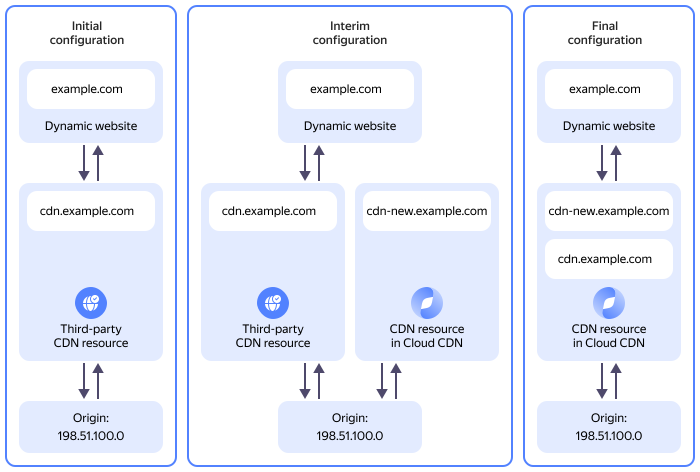

# Migrating to {{ cdn-full-name }} from a third-party CDN provider

If your dynamic website uses a third-party CDN to deliver static content to users, you can seamlessly migrate to {{ cdn-full-name }}. This tutorial explains how to migrate while keeping your content accessible at all times.

## Solution architecture {#solution-overview}



To migrate smoothly, create a new [CDN resource](../../cdn/concepts/resource.md) in {{ cdn-full-name }} that uses the same [origin](../../cdn/concepts/origins.md) as the third-party CDN. Register a new subdomain for the new CDN resource and create a new [TLS certificate](../../certificate-manager/concepts/managed-certificate.md) for the second-level domain and all its third-level subdomains in {{ certificate-manager-full-name }}.

Once you have made sure the new CDN resource is working properly, update the static content links on your dynamic website accordingly. Then, remove the third-party CDN and add its domain name as an additional one to your {{ cdn-full-name }} resource.

Your dynamic website’s static content will stay continuously accessible as you migrate from a third-party CDN to {{ cdn-name }}.

To migrate a CDN resource to {{ src-name }}:

1. [Get your cloud ready](#before-you-begin).
1. [Connect to {{ cdn-name }}](#enable-provider).
1. [Create a CNAME record for your new CDN resource's subdomain](#setup-subdomain).
1. [Add a TLS certificate to {{ certificate-manager-full-name }}](#issue-certificate).
1. [Create a CDN resource in {{ cdn-name }}](#setup-resource).
1. [Update your website to use the new CDN resource](#update-website).
1. [Add an additional domain to the CDN resource in {{ cdn-name }}](#add-secondary-domain).

## Getting started {#before-you-begin}



### Access to DNS settings {#dns-access}

Make sure you can access the DNS settings on the website of your DNS hosting provider. This is usually the company that registered your domain.

Your DNS provider's dashboard should already include a public domain zone matching your domain name, e.g., `example.com.`. This zone should contain a [CNAME record](../../dns/concepts/resource-record.md#cname) for your current CDN subdomain, e.g., `cdn.example.com`, pointing to the third-party CDN provider.

### Required paid resources {#paid-resources}

The cost of the CDN infrastructure support includes charges for outbound traffic from CDN servers (see [{{ cdn-name }} pricing](../../cdn/pricing.md)).

## Connect to {{ cdn-name }} {#enable-provider}

You can only create a CDN resource in a [folder](../../resource-manager/concepts/resources-hierarchy.md#folder) if this folder is connected to {{ cdn-name }}. Once connected, your folder will get a unique `cname` value required for creating [CNAME records](../../dns/concepts/resource-record.md#cname) for subdomains used by the CDN resources you create in the folder.

To connect a folder to a CDN provider and get a `cname` value:



- Management console {#console}

  1. In the [management console]({{ link-console-main }}), select the folder to connect to a CDN provider.
  1. From the list of services, select **{{ ui-key.yacloud.iam.folder.dashboard.label_cdn }}**.
  1. If the CDN provider is not activated yet, click **{{ ui-key.yacloud.cdn.label_activate-provider-empty-container_action-text }}**. A connection will be established automatically.

      If there is no **{{ ui-key.yacloud.cdn.label_activate-provider-empty-container_action-text }}** button, and you can create resources and origin groups, it means that the provider is already activated.
  1. Click **{{ ui-key.yacloud.cdn.button_resource-create }}** and under **{{ ui-key.yacloud.cdn.label_section-domain }}**, copy the `cname` value required to create a [resource record](../../dns/concepts/resource-record.md#cname) for the new CDN subdomain.
  1. Click **{{ ui-key.yacloud.common.cancel }}**. You will create a CDN resource later.

- CLI {#cli}

  

  
  
  1. Connect to a provider:

      ```bash
      yc cdn provider activate --type gcore
      ```

  1. Get the CNAME record value for the CDN resource:

      ```bash
      yc cdn resource get-provider-cname
      ```

      Result:

      ```yaml
      cname: cl-ms6*****90.edgecdn.ru
      folder_id: b1gt6g8ht345********
      ```



Make sure to save the CNAME record value you got, as you will need it at the next step.

## Create a CNAME record for your new CDN resource's subdomain {#setup-subdomain}

To seamlessly switch your website to the new CDN resource, you will need a new CDN subdomain. In your website's public DNS zone, create a CNAME record for the new CDN subdomain that the new CDN resource will use:

* Record name: New CDN subdomain name, e.g., `cdn-new.example.com.`.
* Record type: `CNAME`.
* Record value: `cname` value you got [earlier](#enable-provider) for your folder.

If you delegated your website domain to {{ dns-full-name }}, follow [this tutorial](../../dns/operations/resource-record-create.md) to create a CNAME record. Otherwise, use your DNS provider's guides or contact their support.

## Add a TLS certificate to {{ certificate-manager-full-name }} {#issue-certificate}

To ensure data encryption when accessing the new CDN resource, add a new [TLS certificate](../../certificate-manager/concepts/managed-certificate.md) issued by Let's Encrypt® for your website's domain and all its subdomains (wildcard certificate) to {{ certificate-manager-full-name }}:

1. Create a new TLS certificate:

    

    - Management console {#console}

      1. In the [management console]({{ link-console-main }}), select the [folder](../../resource-manager/concepts/resources-hierarchy.md#folder) to add a certificate to.
      1. From the list of services, select **{{ ui-key.yacloud.iam.folder.dashboard.label_certificate-manager }}**.
      1. Click **{{ ui-key.yacloud.certificate-manager.button_empty-action }}** and select **{{ ui-key.yacloud.certificate-manager.action_request }}**.
      1. In the window that opens, enter a name for your certificate in the **{{ ui-key.yacloud.certificate-manager.metadata.field_name }}** field, e.g., `my-cdn-certificate`.
      1. In the **{{ ui-key.yacloud.certificate-manager.request.field_domains }}** field, specify the wildcard for your domain and its subdomains, e.g., `*.example.com`, where `example.com` is the domain name of your website.
      1. In the **{{ ui-key.yacloud.certificate-manager.request.field_challenge-type }}** field, select `{{ ui-key.yacloud.certificate-manager.request.challenge-type_label_dns }}`.
      1. Click **{{ ui-key.yacloud.certificate-manager.request.button_request }}**.

    - CLI {#cli}

      1. Request a new wildcard certificate. To do this, run the following command:

          ```bash
          yc certificate-manager certificate request \
            --name my-cdn-certificate \
            --domains "*.<your_website_domain_name>"
          ```

          Where:
          * `--name`: Certificate name, e.g., `my-cdn-certificate`.
          * `--domains`: Wildcard for your domain and its subdomains, e.g., `*.example.com`, where `example.com` is the domain name of your website.

          Result:

          ```text
          id: fpqba7lpgmp7********
          folder_id: b1gt6g8ht345********
          created_at: "2025-02-09T20:41:05.916923798Z"
          name: my-cdn-certificate
          type: MANAGED
          domains:
            - '*.example.com'
          status: VALIDATING
          updated_at: "2025-02-09T20:41:05.916923798Z"
          ```

          Save the certificate ID (from the `id` field), as you will need it in the next steps.

          For more information about the `yc certificate-manager certificate request` command, see the [CLI reference](../../cli/cli-ref/certificate-manager/cli-ref/certificate/request.md).

    
1. Follow these steps to verify ownership of your domain:

    

    - Management console {#console}

      1. In the [management console]({{ link-console-main }}), select the folder the certificate was added to.
      1. From the list of services, select **{{ ui-key.yacloud.iam.folder.dashboard.label_certificate-manager }}**.
      1. From the list of certificates, select the one you need verified.
      1. In the window that opens, you will find the info you will need to pass the rights check under **{{ ui-key.yacloud.certificate-manager.overview.section_challenges }}**.

          In the **CNAME record** tab, copy and save the values of the **{{ ui-key.yacloud.certificate-manager.overview.challenge_label_dns-name }}** and **{{ ui-key.yacloud.certificate-manager.overview.challenge_label_value }}** fields. You will need these to create a CNAME record.

    - CLI {#cli}

      1. Retrieve the CNAME record values required for the domain rights check. To do this, run the following command while specifying the certificate ID you saved earlier.

          ```bash
          yc certificate-manager certificate get <certificate_ID> \
            --full \
            --format=json | \
            jq -r ".challenges[].dns_challenge"
          ```

          Result:

          ```json
          {
            "name": "_acme-challenge.example.com.",
            "type": "CNAME",
            "value": "fpqba7lpgmp7********.cm.yandexcloud.net."
          }
          {
            "name": "_acme-challenge.example.com.",
            "type": "TXT",
            "value": "oRnpmIJau5SWFDYqKwwUJMn-61HHdulvqk7********"
          }
          ```

          Save the values of the `name` and `value` fields for the `CNAME` record. You will need these to create a CNAME record.

          For more information about the `yc certificate-manager certificate get` command, see the [CLI reference](../../cli/cli-ref/certificate-manager/cli-ref/certificate/get.md).

    
1. Using the values from the previous step, create a CNAME record in your website's public DNS zone to verify your domain ownership:

    If you delegated your website’s domain to {{ dns-full-name }}, follow [this tutorial](../../dns/operations/resource-record-create.md) to create a CNAME record. Otherwise, use your DNS provider's guides or contact their support.

    

    

    

Wait for the domain rights check to complete successfully. The wildcard certificate will then be issued and get the `Issued` status.

You can check the certificate status on the certificate page in the [management console]({{ link-console-main }}) or by running the `yc certificate-manager certificate get <certificate_ID>` CLI command.

## Create a CDN resource in {{ cdn-name }} {#setup-resource}

This section explains how to create a CDN resource with the `{{ ui-key.yacloud.cdn.value_source-type-url }}` origin type. If your origin is a {{ objstorage-full-name }} [bucket](../../storage/concepts/bucket.md) or a Yandex Application [Load Balancer](../../application-load-balancer/concepts/application-load-balancer.md) instance, use [this tutorial](../../cdn/operations/resources/create-resource.md) to create a CDN resource.

Create a CDN resource in {{ cdn-full-name }}:



- Management console {#console}

  1. In the [management console]({{ link-console-main }}), select the folder you are going to create your CDN resource in.
  1. From the list of services, select **{{ ui-key.yacloud.iam.folder.dashboard.label_cdn }}**.
  1. Click **{{ ui-key.yacloud.cdn.button_resource-create }}**.
  1. Under **{{ ui-key.yacloud.cdn.label_section-content }}**, specify:

      * **{{ ui-key.yacloud.cdn.label_content-query-type }}**: `{{ ui-key.yacloud.cdn.value_query-type-one-origin }}`
      * **{{ ui-key.yacloud.cdn.label_source-type }}**: `{{ ui-key.yacloud.cdn.value_source-type-url }}`
      * In the **{{ ui-key.yacloud.cdn.field_origin }}** field, specify the domain name or public IP address of your static content origin.
  1. Under **{{ ui-key.yacloud.cdn.label_section-domain }}**, in the **{{ ui-key.yacloud.cdn.label_personal-domain }}** field, specify the new domain name you assigned to your new CDN resource, e.g., `cdn-new.example.com`.

  1. Under **{{ ui-key.yacloud.cdn.label_section-additional }}**:

      1. In the **{{ ui-key.yacloud.cdn.label_protocol }}** field, select the protocol the CDN resource will use to communicate with the origin. If you select `{{ ui-key.yacloud.common.label_https }}` or `{{ ui-key.yacloud.cdn.value_protocol-match }}`, make sure your origin supports HTTPS.
      1. In the **{{ ui-key.yacloud.cdn.label_redirect }}** field, select `{{ ui-key.yacloud.cdn.value_do-not-use }}`.
      1. In the **{{ ui-key.yacloud.cdn.label_certificate-type }}** field, select `{{ ui-key.yacloud.cdn.value_certificate-custom }}` and then, from the list that opens, select the certificate you previously created, such as `my-cdn-certificate`.
      1. In the **{{ ui-key.yacloud.cdn.label_host-header }}** field, select `{{ ui-key.yacloud.cdn.value_host-header-default }}`.

  1. Click **{{ ui-key.yacloud.common.create }}**.

- {{ yandex-cloud }} CLI {#cli}

  1. Run this command:
  
      ```bash
      yc cdn resource create <subdomain_name> \
        --origin-custom-source '<origin_IP_address_or_domain_name>' \
        --origin-protocol '<origin_protocol>' \
        --cert-manager-ssl-cert-id <certificate_ID>
      ```

      Where:
      * `<subdomain_name>`: Domain name for which you created  CNAME record earlier and that the new CDN resource will use, e.g., `cdn-new.example.com`.
      * `--origin-custom-source`: Domain name or public IP address of your static content origin.
      * `--origin-protocol`: Protocol the CDN resource will use to communicate with the origin. The possible values are as follows:

          * `http`: Use HTTP.
          * `https`: Use HTTPS.
          * `match`: Use the same value as that of the `Host` header in the client request to the CDN.

          If you select `https` or `match`, make sure your origin supports HTTPS.
      * `--cert-manager-ssl-cert-id`: TLS certificate ID that was saved earlier when creating the certificate.

      

      ```text
      id: bc8cfqtx2mkx********
      folder_id: b1gt6g8ht345********
      cname: cdn-new.example.com
      created_at: "2025-02-10T07:42:24.920162Z"
      updated_at: "2025-02-10T07:42:24.920187Z"
      active: true
      options:
        edge_cache_settings:
          enabled: true
          default_value: "345600"
        query_params_options:
          ignore_query_string:
            enabled: true
            value: true
        stale:
          enabled: true
          value:
            - error
            - updating
      origin_group_id: "352269"
      origin_group_name: Origins for cdn-new.example.com (302798)
      origin_protocol: HTTP
      ssl_certificate:
        type: CM
        status: READY
        data:
          cm:
            id: fpqnetjumkhn********
      ```

      

      Save the new dataset's ID (the `id` field value), as you will need it later.

      For more information about the `yc cdn resource create` command, see the [CLI reference](../../cli/cli-ref/cdn/cli-ref/resource/create.md).





After the CDN resource is set up, it may take up to 15 minutes for it to go live.

Make sure the new CDN resource is working properly before proceeding with the next steps.



## Update your website to use the new CDN resource {#update-website}

Once you have created a new CDN resource in {{ cdn-name }} and tested it, you can start updating your website configuration and removing the old CDN resource.

### Redirect links from the dynamic website {#redirect-links}

Redirect the static content links generated by your dynamic website to the new CDN subdomain, e.g., by replacing `cdn.example.com` with `cdn-new.example.com`. It is your dynamic website's admin who must do this.

Once you have made all the required changes, make sure the static content links generated by your website are valid and the content is accessible. Also, make sure outgoing traffic has stopped on the old CDN resource by using the statistics and monitoring tools provided by your third-party CDN provider.

Your dynamic website has now fully switched to {{ cdn-full-name }}.

### Update the CNAME record for the original CDN subdomain {#update-cname}

To keep your website's original CDN subdomain working with the new {{ cdn-name }} resource, replace the resource CNAME record value of the original subdomain with the value you got earlier when connecting to {{ cdn-name }}:

* Record name: Original CDN subdomain name, e.g., `cdn.example.com.`.
* Record type: `CNAME`.
* Record value: The `cname` value you [got earlier](#enable-provider) for your folder.

If you delegated your website’s domain to {{ dns-full-name }}, follow [this tutorial](../../dns/operations/resource-record-update.md) to update the CNAME record. Otherwise, use your DNS provider's guides or contact their support.

### Delete the third-party CDN {#delete-resource}

Once you have confirmed the original CDN resource from your third-party CDN provider is no longer sending outgoing traffic, delete it. To do this, use the third-party DNS provider's guides or contact their support.

## Add an additional domain to the CDN resource in {{ cdn-name }} {#add-secondary-domain}

Once you have deleted the third-party CDN resource that was using the original CDN subdomain, you can add that subdomain as an additional domain to your new {{ cdn-name }} resource. To do this:



- Management console {#console}

  1. In the [management console]({{ link-console-main }}), select the folder with your CDN resource.
  1. From the list of services, select **{{ ui-key.yacloud.iam.folder.dashboard.label_cdn }}**.
  1. In the line with the CDN resource you created earlier, click  and select  **{{ ui-key.yacloud.common.edit }}**.
  1. Under **{{ ui-key.yacloud.cdn.label_section-domain }}**, click  **{{ ui-key.yacloud.cdn.button_add-domain }}** and in the field that appears, enter the domain name the old CDN resource used previously. e.g., `cdn.example.com`.
  1. Click **{{ ui-key.yacloud.common.save }}**.

- {{ yandex-cloud }} CLI {#cli}

  1. Run this command:
  
      ```bash
      yc cdn resource update <CDN_resource_ID> \
        --secondary-hostnames '<old_CDN_subdomain>'
      ```

      Where:
      * `<CDN_resource_ID>`: {{ cdn-name }} resource ID you saved [earlier](#setup-resource).
      * `--secondary-hostnames`: Domain name that became available after deleting the third-party CDN resource, e.g., `cdn.example.com`.

      

      This command will delete all additional domains that were previously linked to the CDN resource.
      
      To link an additional domain to a CDN resource that already has additional domains linked, list the domains in the `--secondary-hostnames` parameter while separating them with commas. 

      

      

      ```text
      id: bc845trezddi********
      folder_id: b1gt6g8ht345********
      cname: cdn-new.example.com
      created_at: "2025-01-25T21:47:21.181871Z"
      updated_at: "2025-02-10T17:10:37.511453Z"
      active: true
      options:
        edge_cache_settings:
          enabled: true
          default_value: "345600"
        query_params_options:
          ignore_query_string:
            enabled: true
            value: true
        stale:
          enabled: true
          value:
            - error
            - updating
        ignore_cookie:
          enabled: true
      secondary_hostnames:
        - cdn.example.com
      origin_group_id: "350569"
      origin_group_name: Origins for cdn-new.example.com (301532)
      origin_protocol: HTTP
      ssl_certificate:
        type: CM
        status: READY
      ```

      

      For more information about the `yc cdn resource update` command, see the [CLI reference](../../cli/cli-ref/cdn/cli-ref/resource/update.md).



Updating the CDN resource settings may take up to 15 minutes. After that, your new CDN resource will be accessible via both domain names, i.e., `cdn-new.example.com` and `cdn.example.com`.

#### See also {#see-also}

* [Creating a CDN resource](../../cdn/operations/resources/create-resource.md)
* [Adding a Let's Encrypt® certificate](../../certificate-manager/operations/managed/cert-create.md)
* [Getting started with {{ dns-name }}](../../dns/quickstart.md)