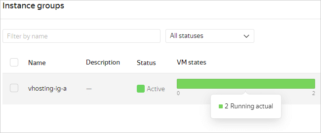

# Setting up virtual hosting


This tutorial describes how to set up virtual hosting: use [{{ alb-full-name }}](../../application-load-balancer/) to host multiple websites with different domain names at the same [IP address](../../vpc/concepts/address.md).

As examples, we are going to use these three domain names: `site-a.com`, `site-b.com`, and `default.com`.

To set up virtual hosting:
1. [Get your cloud ready](#before-begin).
1. [Create a cloud network](#create-network).
1. [Reserve a static public IP address](#reserve-ip).
1. [Create security groups](#create-security-groups).
1. [Import TLS certificates of the websites to {{ certificate-manager-full-name }}](#import-certificates).
1. [Create instance groups for websites](#create-vms).
1. [Upload the website files to the VMs](#upload-sites-files).
1. [Create backend groups](#create-backend-groups).
1. [Create and configure HTTP routers](#create-http-routers).
1. [Create an L7 load balancer](#create-l7-balancer).
1. [Configure DNS for the websites](#configure-dns).
1. [Test the hosting](#test).

If you no longer need the resources you created, [delete them](#clear-out).

## Get your cloud ready {#before-begin}



### Required paid resources {#paid-resources}

The cost of virtual hosting includes:
* Fee for continuously running [VMs](../../compute/concepts/vm.md) (see [{{ compute-full-name }} pricing](../../compute/pricing.md)).
* Fee for using a [public static IP address](../../vpc/concepts/address.md#public-addresses) (see [{{ vpc-full-name }} pricing](../../vpc/pricing.md)).
* Fee for using the computing resources of the [L7 load balancer](../../application-load-balancer/concepts/index.md) (see [{{ alb-name }} pricing](../../application-load-balancer/pricing.md)).
* Fee for public DNS queries and [DNS zones](../../dns/concepts/dns-zone.md) if using [{{ dns-full-name }}](../../dns/) (see [{{ dns-name }} pricing](../../dns/pricing.md)).
  
## Create a cloud network {#create-network}

All the resources created in this tutorial will belong to the same [cloud network](../../vpc/concepts/network.md).

To create a network:



- Management console {#console}

  1. In the [management console]({{ link-console-main }}), select **{{ ui-key.yacloud.iam.folder.dashboard.label_vpc }}**.
  1. Click **{{ ui-key.yacloud.vpc.networks.button_create }}**.
  1. Specify the **{{ ui-key.yacloud.vpc.networks.create.field_name }}** of the network: `vhosting-network`.
  1. In the **{{ ui-key.yacloud.vpc.networks.create.field_advanced }}** field, select **{{ ui-key.yacloud.vpc.networks.create.field_is-default }}**.
  1. Click **{{ ui-key.yacloud.vpc.networks.button_create }}**.



## Reserve a static public IP address {#reserve-ip}

For your virtual hosting to run, you need to assign a static public IP address to the [L7 load balancer](../../application-load-balancer/concepts/application-load-balancer.md).

To reserve an IP address:



- Management console {#console}

  1. In the [management console]({{ link-console-main }}), select **{{ ui-key.yacloud.iam.folder.dashboard.label_vpc }}**.
  1. In the left-hand panel, select  **{{ ui-key.yacloud.vpc.switch_addresses }}**. Click **{{ ui-key.yacloud.vpc.addresses.button_create }}**.
  1. In the window that opens, select the `{{ region-id }}-d` [availability zone](../../overview/concepts/geo-scope.md). Click **{{ ui-key.yacloud.vpc.addresses.popup-create_button_create }}**.



## Create security groups {#create-security-groups}

[Security groups](../../application-load-balancer/concepts/application-load-balancer.md#security-groups) include rules that allow the load balancer to receive incoming traffic and redirect it to the VMs so they can receive the traffic. In this tutorial, we will create two security groups: one for the load balancer and another one for all VMs.

To create security groups:



- Management console {#console}

  1. In the [management console]({{ link-console-main }}), select **{{ ui-key.yacloud.iam.folder.dashboard.label_vpc }}**.
  1. In the left-hand panel, select  **{{ ui-key.yacloud.vpc.label_security-groups }}**.
  1. Create a security group for the load balancer:
     1. Click **{{ ui-key.yacloud.vpc.network.security-groups.button_create }}**.
     1. Specify the group **{{ ui-key.yacloud.vpc.network.security-groups.forms.field_sg-name }}**: `vhosting-sg-balancer`.
     1. Select **{{ ui-key.yacloud.vpc.network.security-groups.forms.field_sg-network }}**: `vhosting-network`.
     1. Under **{{ ui-key.yacloud.vpc.network.security-groups.forms.label_section-rules }}**, create the following rules using the instructions below the table:

        | Traffic<br/>direction | {{ ui-key.yacloud.vpc.network.security-groups.forms.field_sg-rule-description }} | {{ ui-key.yacloud.vpc.network.security-groups.forms.field_sg-rule-port-range }} | {{ ui-key.yacloud.vpc.network.security-groups.forms.field_sg-rule-protocol }} | Source /<br/>destination | {{ ui-key.yacloud.vpc.network.security-groups.forms.field_sg-rule-cidr-blocks }} |
        | --- | --- | --- | --- | --- | --- |
        | `Outgoing` | `any` | `All` | `{{ ui-key.yacloud.vpc.network.security-groups.forms.value_any }}` | `{{ ui-key.yacloud.vpc.network.security-groups.forms.value_sg-rule-destination-cidr }}` | `0.0.0.0/0` |
        | `Incoming` | `ext-http` | `80` | `{{ ui-key.yacloud.common.label_tcp }}` | `{{ ui-key.yacloud.vpc.network.security-groups.forms.value_sg-rule-destination-cidr }}` | `0.0.0.0/0` |
        | `Incoming` | `ext-https` | `443` | `{{ ui-key.yacloud.common.label_tcp }}` | `{{ ui-key.yacloud.vpc.network.security-groups.forms.value_sg-rule-destination-cidr }}` | `0.0.0.0/0` |
        | `Incoming` | `healthchecks` | `30080` | `{{ ui-key.yacloud.common.label_tcp }}` | `{{ ui-key.yacloud.vpc.network.security-groups.forms.value_sg-rule-sg-type-balancer }}` | — |

     1. Select the **{{ ui-key.yacloud.vpc.network.security-groups.label_egress }}** or **{{ ui-key.yacloud.vpc.network.security-groups.label_ingress }}** tab.
     1. Click **{{ ui-key.yacloud.vpc.network.security-groups.button_add-rule }}**.
     1. In the **{{ ui-key.yacloud.vpc.network.security-groups.forms.field_sg-rule-port-range }}** field of the window that opens, specify a single port or a port range for traffic to come to or from.
     1. In the **{{ ui-key.yacloud.vpc.network.security-groups.forms.field_sg-rule-protocol }}** field, specify the appropriate protocol or leave `{{ ui-key.yacloud.vpc.network.security-groups.forms.value_any }}` to allow traffic transmission over any protocol.
     1. In the **{{ ui-key.yacloud.vpc.network.security-groups.forms.field_sg-rule-destination }}** or **{{ ui-key.yacloud.vpc.network.security-groups.forms.field_sg-rule-source }}** field, select the purpose of the rule:
        * `{{ ui-key.yacloud.vpc.network.security-groups.forms.value_sg-rule-destination-cidr }}`: Rule will apply to the range of IP addresses. In the **{{ ui-key.yacloud.vpc.network.security-groups.forms.field_sg-rule-cidr-blocks }}** field, specify the CIDR and subnet masks the traffic will come to or from. To add multiple CIDRs, click **{{ ui-key.yacloud.vpc.subnetworks.create.button_add-cidr }}**.
        * `{{ ui-key.yacloud.vpc.network.security-groups.forms.value_sg-rule-destination-sg }}`: Rule will apply to the VMs from the current group or the selected security group.
        * `{{ ui-key.yacloud.vpc.network.security-groups.forms.value_sg-rule-sg-type-balancer }}`: Rule allowing a load balancer to health-check VMs.
     1. Click **{{ ui-key.yacloud.common.save }}**. Repeat these steps to create all rules from the table.
     1. Click **{{ ui-key.yacloud.common.save }}**.
  1. Similarly, create a security group for the VM named `vhosting-sg-vms` with the same `vhosting-network` and the following rules:

     | Traffic<br/>direction | {{ ui-key.yacloud.vpc.network.security-groups.forms.field_sg-rule-description }} | {{ ui-key.yacloud.vpc.network.security-groups.forms.field_sg-rule-port-range }} | {{ ui-key.yacloud.vpc.network.security-groups.forms.field_sg-rule-protocol }} | Source | {{ ui-key.yacloud.vpc.network.security-groups.forms.field_sg-rule-cidr-blocks }} |
     | --- | --- | --- | --- | --- | --- |
     | `Incoming` | `balancer` | `80` | `{{ ui-key.yacloud.common.label_tcp }}` | `{{ ui-key.yacloud.vpc.network.security-groups.forms.value_sg-rule-destination-sg }}` | `vhosting-sg-balancer` |
     | `Incoming` | `ssh` | `22` | `{{ ui-key.yacloud.common.label_tcp }}` | `{{ ui-key.yacloud.vpc.network.security-groups.forms.value_sg-rule-destination-cidr }}` | `0.0.0.0/0` |



## Import TLS certificates of the websites to {{ certificate-manager-name }}{#import-certificates}

To access the websites using the secure HTTPS protocol (HTTP over TLS), you must have [TLS certificates](../../certificate-manager/concepts/managed-certificate.md) issued for them. To use the certificates in the L7 load balancer, import them to {{ certificate-manager-name }}.

If your websites do not have certificates, you can [use {{ certificate-manager-name }} to get them from Let's Encrypt<sup>®</sup>](../../certificate-manager/operations/managed/cert-create.md). You do not need to do anything else after creating certificates this way, because the certificates are imported automatically.

To import an existing certificate for `site-a.com`:



- Management console {#console}

  1. In the [management console]({{ link-console-main }}), select **{{ ui-key.yacloud.iam.folder.dashboard.label_certificate-manager }}**.
  1. Click **{{ ui-key.yacloud.certificate-manager.button_empty-action }}** and select **{{ ui-key.yacloud.certificate-manager.action_import }}**.
  1. Specify the certificate's **{{ ui-key.yacloud.certificate-manager.metadata.field_name }}**: `vhosting-cert-a`.
  1. In the **{{ ui-key.yacloud.certificate-manager.import.field_certificate }}** field, click **{{ ui-key.yacloud.certificate-manager.import.button_add-certificate }}**. Upload the **{{ ui-key.yacloud.component.file-content-dialog.field_file }}** with your certificate or enter its **{{ ui-key.yacloud.component.file-content-dialog.field_content }}** and click **{{ ui-key.yacloud.component.file-content-dialog.button_submit }}**.
  1. If your certificate is issued by a third-party certificate authority, click **{{ ui-key.yacloud.certificate-manager.import.button_add-chain }}** in the **{{ ui-key.yacloud.certificate-manager.import.field_chain }}** field. Upload the **{{ ui-key.yacloud.component.file-content-dialog.field_file }}** with the certificate chain or enter its **{{ ui-key.yacloud.component.file-content-dialog.field_content }}** and click **{{ ui-key.yacloud.component.file-content-dialog.button_submit }}**.
  1. In the **{{ ui-key.yacloud.certificate-manager.import.field_privateKey }}** field, click **{{ ui-key.yacloud.certificate-manager.import.button_add-privateKey }}**. Upload the **{{ ui-key.yacloud.component.file-content-dialog.field_file }}** with the key or enter its **{{ ui-key.yacloud.component.file-content-dialog.field_content }}** and click **{{ ui-key.yacloud.component.file-content-dialog.button_submit }}**.
  1. Click **{{ ui-key.yacloud.common.create }}**.



Similarly, import the certificates for `site-b.com` and `default.com` named `vhosting-cert-b` and `vhosting-cert-default`, respectively.

## Create instance groups for the websites {#create-vms}

{{ compute-name }} VMs will act as web servers for the two websites: one [group](../../compute/concepts/instance-groups/index.md) of multiple identical instances for each website. In this tutorial, the LEMP stack (Linux, NGINX, {{ MY }}, PHP) will be installed on the servers. For more information, see [LAMP or LEMP-based website](../../tutorials/web/lamp-lemp/index.md).

To create an instance group for `site-a.com`:



- Management console {#console}

  1. In the [management console]({{ link-console-main }}), select **{{ ui-key.yacloud.iam.folder.dashboard.label_compute }}**.
  1. In the left-hand panel, select  **{{ ui-key.yacloud.compute.instance-groups_hx3kX }}**. Click **{{ ui-key.yacloud.compute.groups.button_create }}**.
  1. Enter the instance group name: `vhosting-ig-a`.
  1. Under **{{ ui-key.yacloud.compute.groups.create.section_allocation }}**, select multiple availability zones to ensure the fault tolerance of your hosting.
  1. Under **{{ ui-key.yacloud.compute.groups.create.section_instance }}**, click **{{ ui-key.yacloud.compute.groups.create.button_instance_empty-create }}**.
  1. Under **{{ ui-key.yacloud.compute.instances.create.section_image }}**, open the **{{ ui-key.yacloud.compute.instances.create.image_value_marketplace }}** tab and click **{{ ui-key.yacloud.compute.instances.create.button_show-all-marketplace-products }}**. Select [LEMP](/marketplace/products/yc/lemp) and click **{{ ui-key.yacloud.marketplace-v2.button_use }}**.
  1. Under **{{ ui-key.yacloud.compute.instances.create.section_platform }}**:
     * Choose a VM [platform](../../compute/concepts/vm-platforms.md).
     * Specify the required number of vCPUs and the amount of RAM.

     This minimum configuration will do for functional website testing:
     * **{{ ui-key.yacloud.component.compute.resources.field_platform }}**: `Intel Ice Lake`
     * **{{ ui-key.yacloud.component.compute.resources.field_core-fraction }}**: `20%`
     * **{{ ui-key.yacloud.component.compute.resources.field_cores }}**: `2`
     * **{{ ui-key.yacloud.component.compute.resources.field_memory }}**: `1 {{ ui-key.yacloud.common.units.label_gigabyte }}`
  1. Under **{{ ui-key.yacloud.compute.instances.create.section_network }}**, select the **{{ ui-key.yacloud.compute.instances.create.field_instance-group-network }}** named `vhosting-network` you [created earlier](#create-network) and its [subnets](../../vpc/concepts/network.md#subnet).
  1. In the **{{ ui-key.yacloud.compute.instances.create.field_instance-group-address }}** field, select `{{ ui-key.yacloud.compute.instances.create.value_address-auto }}`.
  1. Select the `vhosting-sg-vms` security group [created earlier](#create-security-groups).
  1. Specify the VM access data:
     * Under **{{ ui-key.yacloud.compute.instances.create.field_user }}**, enter the username.
     * In the **{{ ui-key.yacloud.compute.instances.create.field_key }}** field, paste the contents of the public key file.

       You need to create a key pair for the SSH connection yourself. To learn how, see [Connecting to a VM via SSH](../../compute/operations/vm-connect/ssh.md).

     

     Once created, the VM gets an IP address and a [host name (FQDN)](../../compute/concepts/network.md#hostname) for connections. If you selected `{{ ui-key.yacloud.compute.instances.create.value_address-none }}` in the **{{ ui-key.yacloud.compute.instances.create.field_instance-group-address }}** field, you will not be able to access the VM from the internet.

     

  1. Click **{{ ui-key.yacloud.compute.groups.create.button_edit }}**.
  1. Under **{{ ui-key.yacloud.compute.groups.create.section_scale }}**, specify the instance group **{{ ui-key.yacloud.compute.groups.create.field_scale-size }}**: `2`.
  1. Under **{{ ui-key.yacloud.compute.groups.create.section_alb }}**, select **{{ ui-key.yacloud.compute.groups.create.field_target-group-attached }}** and enter `vhosting-tg-a` as the group name. [Read more about target groups](../../application-load-balancer/concepts/target-group.md).
  1. Click **{{ ui-key.yacloud.common.create }}**.



Follow the same steps to create a second instance group named `vhosting-ig-b` and a target group named `vhosting-tg-b` for `site-b.com`.

It may take a few minutes to create an instance group. As soon as the group changes its [status](../../compute/concepts/instance-groups/statuses.md#group-statuses) to `RUNNING`, and all its VMs to `RUNNING_ACTUAL`, you can [upload the website files to them](#upload-sites-files).



## Upload the website files to the VMs {#upload-sites-files}

To test your web servers, upload `index.html` files with different contents to the VMs: one content version for the `vhosting-ig-a` instance group VMs, and another for the `vhosting-ig-b` instance group VMs.



```html
<!DOCTYPE html>
<html>
  <head>
    <title>Site A</title>
  </head>
  <body>
    <p>This is site A</p>
  </body>
</html>
```





```html
<!DOCTYPE html>
<html>
  <head>
    <title>Site B</title>
  </head>
  <body>
    <p>This is site B</p>
  </body>
</html>
```



To upload a file to a VM:



Repeat the above steps for the files you want to upload to each VM in the `vhosting-ig-a` and `vhosting-ig-b` groups.

## Create backend groups {#create-backend-groups}

Target groups created together with instance groups must be linked to the [backend groups](../../application-load-balancer/concepts/backend-group.md) that define the traffic allocation settings.

For the backends, the groups will implement [health checks](../../application-load-balancer/concepts/backend-group.md#health-checks): the load balancer will periodically send health check requests to the VMs and expect a response for a certain period.

To create a backend group for `site-a.com`:
1. In the [management console]({{ link-console-main }}), select **{{ ui-key.yacloud.iam.folder.dashboard.label_application-load-balancer }}**.
1. In the left-hand panel, select  **{{ ui-key.yacloud.alb.label_backend-groups }}**. Click **{{ ui-key.yacloud.alb.button_backend-group-create }}**.
1. Enter the backend group **{{ ui-key.yacloud.common.name }}**: `vhosting-bg-a`.
1. Under **{{ ui-key.yacloud.alb.label_backends }}**, click **{{ ui-key.yacloud.common.add }}**.
1. Enter the backend **{{ ui-key.yacloud.common.name }}**: `vhosting-backend-a`.
1. In the **{{ ui-key.yacloud.alb.label_target-groups }}** field, select the `vhosting-tg-a` group.
1. Specify **{{ ui-key.yacloud.alb.label_port }}** the backend VMs will use to receive incoming traffic from the load balancer: `80`.
1. Click **Add health check**.
1. Specify **{{ ui-key.yacloud.alb.label_port }}** the backend VMs will use to accept health check connections: `80`.
1. Specify **{{ ui-key.yacloud.alb.label_path }}** the load balancer will use for health checks: `/`.
1. Click **{{ ui-key.yacloud.common.create }}**.

Follow the same steps to create a second backend group named `vhosting-bg-b` for `site-b.com`. In this group, create the `vhosting-backend-b` backend and link the `vhosting-tg-b` target group to it.

## Create and configure HTTP routers {#create-http-routers}

Backend groups must be linked to [HTTP routers](../../application-load-balancer/concepts/http-router.md) that define the HTTP request routing rules. In this tutorial, you will create two routers for the main sites (`site-a.com` and `site-b.com`) and the default router for `default.com`, which will respond to each request with the `404 Not Found` HTTP status code.

### Create HTTP routers for the websites {#create-http-routers-sites}

To create an HTTP router for `site-a.com`:



- Management console {#console}

  1. In the [management console]({{ link-console-main }}), select **{{ ui-key.yacloud.iam.folder.dashboard.label_application-load-balancer }}**.
  1. In the left-hand panel, select  **{{ ui-key.yacloud.alb.label_http-routers }}**. Click **{{ ui-key.yacloud.alb.button_http-router-create }}**.
  1. Specify the HTTP router **{{ ui-key.yacloud.common.name }}**: `vhosting-router-a`.
  1. Click **{{ ui-key.yacloud.alb.button_virtual-host-add }}**.
  1. Specify the virtual host **{{ ui-key.yacloud.common.name }}**: `vhosting-host-a`.
  1. In the **{{ ui-key.yacloud.alb.label_authority }}** field, specify the website domain name: `site-a.com`.
  1. Click **{{ ui-key.yacloud.alb.button_add-route }}**.
  1. Specify the route **{{ ui-key.yacloud.common.name }}**: `vhosting-route-a`.
  1. In the **{{ ui-key.yacloud.alb.label_backend-group }}** field, select the `vhosting-bg-a` group.
  1. Click **{{ ui-key.yacloud.common.create }}**.



Follow the same steps to create the `vhosting-router-b` HTTP router for `site-b.com` and link the `vhosting-bg-b` backend group to it.

### Create the default HTTP router {#create-http-routers-default}

To create an HTTP router for `default.com`:



- Management console {#console}

  1. In the [management console]({{ link-console-main }}), select **{{ ui-key.yacloud.iam.folder.dashboard.label_application-load-balancer }}**.
  1. In the left-hand panel, select  **{{ ui-key.yacloud.alb.label_http-routers }}**. Click **{{ ui-key.yacloud.alb.button_http-router-create }}**.
  1. Specify the HTTP router **{{ ui-key.yacloud.common.name }}**: `vhosting-router-default`.
  1. Click **{{ ui-key.yacloud.alb.button_virtual-host-add }}**.
  1. Specify the virtual host **{{ ui-key.yacloud.common.name }}**: `vhosting-host-default`.
  1. In the **{{ ui-key.yacloud.alb.label_authority }}** field, specify the website domain name: `default.com`.
  1. Click **{{ ui-key.yacloud.alb.button_add-route }}**.
  1. Specify the route **{{ ui-key.yacloud.common.name }}**: `vhosting-route-a`.
  1. In the **{{ ui-key.yacloud.alb.label_route-action }}** field, select `{{ ui-key.yacloud.alb.label_route-action-statusResponse }}`.
  1. In the **{{ ui-key.yacloud.alb.label_http-status-code }}** field, select `404 Not Found`.
  1. In the **{{ ui-key.yacloud.alb.label_body }}** field, click **{{ ui-key.yacloud.alb.button_select }}**. Select the `{{ ui-key.yacloud.component.file-content-dialog.value_manual }}` method and enter the following in the **{{ ui-key.yacloud.component.file-content-dialog.field_content }}** field:

     ```text
     404 Not Found

     This is the default site.
     ```

     Click **{{ ui-key.yacloud.component.file-content-dialog.button_submit }}**.
  1. Click **{{ ui-key.yacloud.common.create }}**.



## Create an L7 load balancer {#create-l7-balancer}

To create a load balancer:



- Management console {#console}

  1. In the [management console]({{ link-console-main }}), select **{{ ui-key.yacloud.iam.folder.dashboard.label_application-load-balancer }}**.
  1. Click **{{ ui-key.yacloud.alb.button_load-balancer-create }}**.
  1. Enter the load balancer **{{ ui-key.yacloud.common.name }}**: `vhosting-alb`.
  1. Under **{{ ui-key.yacloud.mdb.forms.section_network-settings }}**, select the `vhosting-sg-balancer` security group you [created earlier](#create-security-groups).
  1. Create a listener to redirect HTTP requests to HTTPS:
     1. Under **{{ ui-key.yacloud.alb.label_listeners }}**, click **{{ ui-key.yacloud.alb.button_add-listener }}**.
     1. Enter the listener **{{ ui-key.yacloud.common.name }}**: `vhosting-listener-http`.
     1. Under **{{ ui-key.yacloud.alb.section_external-address-specs }}**, select `{{ ui-key.yacloud.alb.label_address-list }}` for the type and the IP address you [reserved earlier](#reserve-ip).
     1. In the **{{ ui-key.yacloud.alb.label_protocol-type }}** field, select `{{ ui-key.yacloud.alb.label_redirect-to-https }}`.
  1. Create an HTTPS request listener:
     1. Click **{{ ui-key.yacloud.alb.button_add-listener }}** again.
     1. Enter the listener **{{ ui-key.yacloud.common.name }}**: `vhosting-listener-https`.
     1. Under **{{ ui-key.yacloud.alb.section_external-address-specs }}**, select `{{ ui-key.yacloud.alb.label_address-list }}` for the type and the IP address you [reserved earlier](#reserve-ip).
     1. In the **{{ ui-key.yacloud.alb.label_protocol-type }}** field, select `{{ ui-key.yacloud.alb.label_proto-http-tls }}`.
     1. Under **{{ ui-key.yacloud.alb.section_default-sni-match }}**, select `vhosting-cert-default` for the certificate and `vhosting-router-default` for the HTTP router.
     1. Add an SNI handler for `site-a.com`:
        1. Click **{{ ui-key.yacloud.alb.button_add-sni-match }}**.
        1. Specify the **{{ ui-key.yacloud.common.name }}** for the SNI handler: `vhosting-sni-a`.
        1. In the **{{ ui-key.yacloud.alb.label_server-names }}** field, specify `site-a.com`.
        1. Select `vhosting-cert-a` for the certificate and `vhosting-router-a` for the HTTP router.
     1. Follow the same steps to add an SNI handler for `site-b.com` with `vhosting-sni-b` as its name, `site-b.com` as the server name, the `vhosting-cert-b` certificate, and the `vhosting-router-b` HTTP router.
  1. Click **{{ ui-key.yacloud.common.create }}**.



## Configure DNS for the websites {#configure-dns}

The `site-a.com`, `site-b.com`, and `default.com` domain names must be mapped to the L7 load balancer IP address using DNS records.

To configure DNS for `site-a.com`:
1. In the [management console]({{ link-console-main }}), select **{{ ui-key.yacloud.iam.folder.dashboard.label_application-load-balancer }}**.
1. Copy the IP address of the load balancer that you created.
1. On the website of your DNS hosting provider, navigate to the DNS settings.
1. Create or edit the A record for `site-a.com` so that it points to the copied IP address:

   ```text
   site-a.com. A <L7_load_balancer_IP_address>
   ```

   If you use {{ dns-full-name }}, follow this guide to configure the record:

   

   

   - Management console {#console}

     1. In the [management console]({{ link-console-main }}), select **{{ ui-key.yacloud.iam.folder.dashboard.label_dns }}**.
     1. If you do not have a public [DNS zone](../../dns/concepts/dns-zone.md), create one:
        1. Click **{{ ui-key.yacloud.dns.button_zone-create }}**.
        1. Specify the zone **{{ ui-key.yacloud.common.name }}**: `vhosting-dns-a`.
        1. In the **{{ ui-key.yacloud.dns.label_zone }}** field, enter the website domain name with a trailing dot: `site-a.com.`.
        1. Select a **{{ ui-key.yacloud.common.type }}** of the zone: `{{ ui-key.yacloud.dns.label_public }}`.
        1. Click **{{ ui-key.yacloud.common.create }}**.
     1. Create a record in the zone:
        1. In the list of zones, click `vhosting-dns-a`.
        1. Click **{{ ui-key.yacloud.dns.button_record-set-create }}**.
        1. Leave the **{{ ui-key.yacloud.common.name }}** field empty for the record to match the `site-a.com` domain name rather than a name with a subdomain, e.g., `www.site-a.com`.
        1. Select the record **{{ ui-key.yacloud.common.type }}**: **A**.
        1. In the **{{ ui-key.yacloud.dns.label_records }}** field, paste the copied IP address of the load balancer.
        1. Click **{{ ui-key.yacloud.common.create }}**.

   

   

Follow the same steps to configure DNS for `site-b.com` and `default.com` using the same IP address.

You can test your websites 15-20 minutes after you have configured DNS.

## Test the hosting {#test}

To test the hosting, open each of the three websites in your browser:
* For `https://site-a.com` and `https://site-b.com`, you should see the pages you [uploaded to the VMs](#upload-sites-files).
* For `https://default.com`, you should see the `404 Not Found` error page configured when [creating the HTTP router](#create-http-routers-default).

## Delete the resources you created {#clear-out}

To shut down the hosting and stop paying for the resources you created:
1. Delete the non-billable resources that block the deletion of billable resources:
   1. [Delete](../../application-load-balancer/operations/application-load-balancer-delete.md) the `vhosting-alb` L7 load balancer.
   1. [Delete](../../application-load-balancer/operations/http-router-delete.md) the `vhosting-router-a`, `vhosting-router-b`, and `vhosting-router-default` HTTP routers.
   1. [Delete](../../application-load-balancer/operations/backend-group-delete.md) the `vhosting-bg-a` and `vhosting-bg-b` backend groups.
1. [Delete](../../compute/operations/instance-groups/delete.md) the `vhosting-ig-a` and `vhosting-ig-b` instance groups.
1. [Delete](../../vpc/operations/address-delete.md) the static public IP address that you reserved.
1. If you used {{ dns-full-name }}, [delete](../../dns/operations/resource-record-delete.md) the DNS records and [delete](../../dns/operations/zone-delete.md) the DNS zone.