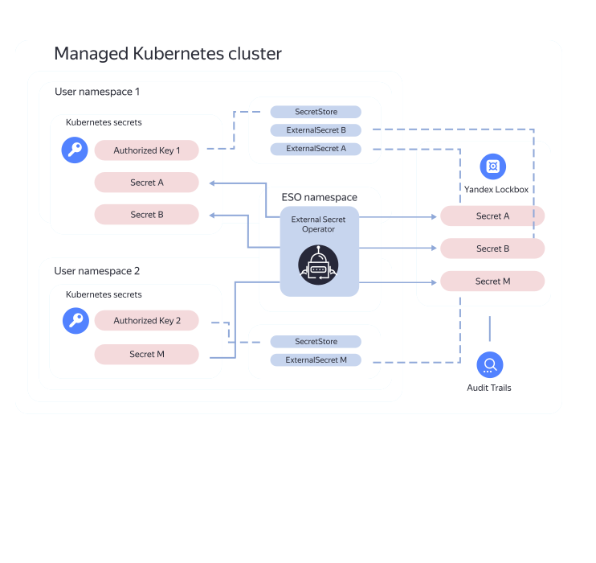

[External Secrets Operator](https://external-secrets.io/latest/provider/yandex-lockbox/) enables you to set up syncing of [{{ lockbox-name }}](../../lockbox/) [secrets](../../lockbox/concepts/secret.md) with [{{ managed-k8s-full-name }} cluster](../../managed-kubernetes/concepts/index.md#kubernetes-cluster) [secrets](../../managed-kubernetes/concepts/encryption.md).

There are [several schemas for integrating](https://external-secrets.io/latest/guides/multi-tenancy/) {{ lockbox-name }} with {{ managed-k8s-name }}. The example below describes [ESO as a Service](https://external-secrets.io/latest/guides/multi-tenancy/#eso-as-a-service):



To set up secret syncing:
1. [Install the External Secrets Operator and set up {{ lockbox-name }}](#install-eso-lockbox).
1. [Configure the {{ managed-k8s-name }} cluster](#configure-k8s).
1. [Create an External Secret](#create-es).

If you no longer need the resources you created, [delete them](#clear-out).

You can also deploy an infrastructure for syncing {{ lockbox-name }} secrets with {{ managed-k8s-name }} cluster secrets via {{ TF }} using a [ready-made configuration file](#terraform).

## Getting started {#before-you-begin}



### Required paid resources {#paid-resources}

The cost of resources for syncing secrets includes:
* Fee for using the [{{ managed-k8s-name }} master](../../managed-kubernetes/concepts/index.md#master) (see [{{ managed-k8s-name }} pricing](../../managed-kubernetes/pricing.md)).
* Fee for a [{{ managed-k8s-name }} node group's](../../managed-kubernetes/concepts/index.md#node-group) [computing resources](../../compute/concepts/vm-platforms.md) and [disks](../../compute/concepts/disk.md) (see [{{ compute-full-name }} pricing](../../compute/pricing.md)).

### Create an infrastructure {#deploy-infrastructure}



- Manually {#manual}

  1. If you do not have a [network](../../vpc/concepts/network.md#network) yet, [create one](../../vpc/operations/network-create.md).
  1. If you do not have any [subnets](../../vpc/concepts/network.md#subnet) yet, [create them](../../vpc/operations/subnet-create.md) in the [availability zones](../../overview/concepts/geo-scope.md) where your {{ managed-k8s-name }} cluster and node group will be created.
  1. [Create service accounts](../../iam/operations/sa/create.md):
     * [Service account](../../iam/concepts/users/service-accounts.md) for the {{ k8s }} resources with the `k8s.clusters.agent` and `vpc.publicAdmin` [role](../../iam/concepts/access-control/roles.md) for the [folder](../../resource-manager/concepts/resources-hierarchy.md#folder) where the {{ managed-k8s-name }} cluster is created.
     * Service account for {{ managed-k8s-name }} nodes with the [{{ roles-cr-puller }}](../../container-registry/security/index.md#container-registry-images-puller) role for the folder containing the [Docker image](../../container-registry/concepts/docker-image.md) [registry](../../container-registry/concepts/registry.md). {{ managed-k8s-name }} nodes will pull the required Docker images from the registry on behalf of this account.

     

     You can use the same service account for all operations.

     

  1. 

        

  1. [Create a {{ managed-k8s-name }} cluster](../../managed-kubernetes/operations/kubernetes-cluster/kubernetes-cluster-create.md#kubernetes-cluster-create) and a [node group](../../managed-kubernetes/operations/node-group/node-group-create.md). When creating a {{ managed-k8s-name }} cluster, specify the previously created service accounts for resources and nodes and the security group.

  1. [Create a {{ lockbox-name }} secret](../../lockbox/operations/secret-create.md) with the following properties:
     * **{{ ui-key.yacloud.common.name }}**: `lockbox-secret`.
     * **{{ ui-key.yacloud.lockbox.forms.label_key }}**: Enter `password` as the non-secret ID.
     * **{{ ui-key.yacloud.lockbox.forms.label_value }}**: Enter the confidential data for storing `p@$$w0rd`.

     Save the ID of the secret. You will need it later.

- {{ TF }} {#tf}

  1. 
  1. 
  1. 
  1. 
  1. Download the [k8s-cluster-and-lockbox.tf](https://github.com/yandex-cloud-examples/yc-mk8s-lockbox/blob/main/k8s-cluster-and-lockbox.tf) configuration file of the {{ managed-k8s-name }} cluster to the same working directory.

     This file describes:
     * [Network](../../vpc/concepts/network.md#network).
     * [Subnet](../../vpc/concepts/network.md#subnet).
     * {{ lockbox-name }} secret.
     * {{ managed-k8s-name }} cluster.
     * [Service account](../../iam/concepts/users/service-accounts.md) for {{ managed-k8s-name }} resources and nodes.
     * 

        

  1. Specify the following in the configuration file:
     * [Folder ID](../../resource-manager/operations/folder/get-id.md).
     * [{{ k8s }} version](../../managed-kubernetes/concepts/release-channels-and-updates.md) for the {{ managed-k8s-name }} cluster and node groups.
     * Name of the service account for {{ managed-k8s-name }} resources and nodes.
  1. Make sure the {{ TF }} configuration files are correct using this command:

     ```bash
     terraform validate
     ```

     If there are any errors in the configuration files, {{ TF }} will point them out.
  1. Create the required infrastructure:

     

     

  1. Save the created secret's ID that you entered in the terminal. You will need it later.



### Set up your environment {#environment-set-up}

1. 

   

1. Install the `jq` utility:

   ```bash
   sudo apt update && sudo apt install jq
   ```

1. 

## Install the External Secrets Operator and set up {{ lockbox-name }} {#install-eso-lockbox}

1. Follow [this guide](../../managed-kubernetes/operations/applications/external-secrets-operator.md) to install the [External Secrets Operator](/marketplace/products/yc/external-secrets).
1. [Assign the service account](../../lockbox/operations/secret-access.md) you created when installing the External Secrets Operator the `lockbox.payloadViewer` role for the [previously created](#deploy-infrastructure) `lockbox-secret`.

## Configure the {{ managed-k8s-name }} cluster {#configure-k8s}

1. Create a `ns` [namespace](../../managed-kubernetes/concepts/index.md#namespace) to store External Secrets Operator objects in:

   ```bash
   kubectl create namespace ns
   ```

1. Create a `yc-auth` secret with the `sa-key.json` key you created when [installing](#install-eso) the External Secrets Operator:

   ```bash
   kubectl --namespace ns create secret generic yc-auth \
     --from-file=authorized-key=sa-key.json
   ```

1. Create a [SecretStore](https://external-secrets.io/latest/api/secretstore/) containing the `yc-auth` secret:


   ```bash
   kubectl --namespace ns apply -f - <<< '
   apiVersion: external-secrets.io/v1beta1
   kind: SecretStore
   metadata:
     name: secret-store
   spec:
     provider:
       yandexlockbox:
         auth:
           authorizedKeySecretRef:
             name: yc-auth
             key: authorized-key'
   ```


## Create an External Secret {#create-es}

1. Create an object named [ExternalSecret](https://external-secrets.io/latest/api/externalsecret/) pointing to `lockbox-secret` in `secret-store`:

   ```bash
   kubectl --namespace ns apply -f - <<< '
   apiVersion: external-secrets.io/v1beta1
   kind: ExternalSecret
   metadata:
     name: external-secret
   spec:
     refreshInterval: 1h
     secretStoreRef:
       name: secret-store
       kind: SecretStore
     target:
       name: k8s-secret
     data:
     - secretKey: password
       remoteRef:
         key: <secret_ID>
         property: password'
   ```

   Where:
   * `key`: ID of the {{ lockbox-name }} `lockbox-secret` secret [you created](#deploy-infrastructure).
   * `spec.target.name`: New key name, `k8s-secret`. The External Secrets Operator will create this key and place the `lockbox-secret` parameters in it.
1. Make sure the new `k8s-secret` key contains the `lockbox-secret` value:

   ```bash
   kubectl --namespace ns get secret k8s-secret \
     --output=json | \
     jq --raw-output ."data"."password" | \
     base64 --decode
   ```

   The command result will contain the value of the `password` key of `lockbox-secret`:

   ```text
   p@$$w0rd
   ```

## Delete the resources you created {#clear-out}

Delete the resources you no longer need to avoid paying for them:



- Manually {#manual}

  1. [Delete the {{ managed-k8s-name }} cluster](../../managed-kubernetes/operations/kubernetes-cluster/kubernetes-cluster-delete.md).
  1. [Delete](../../vpc/operations/address-delete.md) the {{ managed-k8s-name }} cluster's [public static IP address](../../vpc/concepts/address.md#public-addresses) if you had reserved one.
  1. [Delete `lockbox-secret`](../../lockbox/operations/secret-delete.md).

- {{ TF }} {#tf}

  


