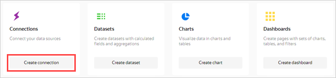
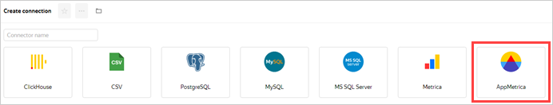
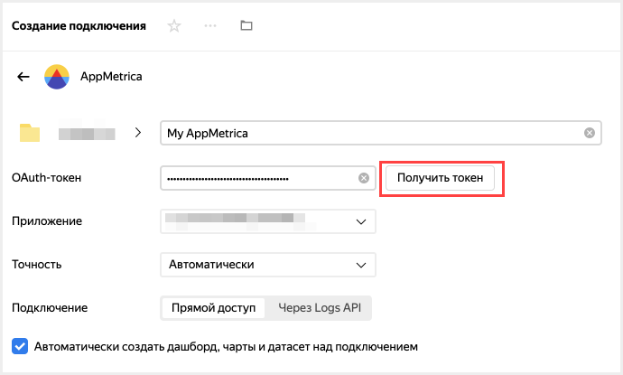
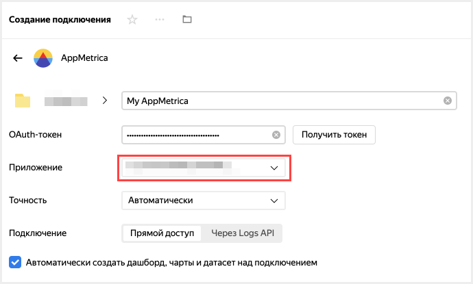
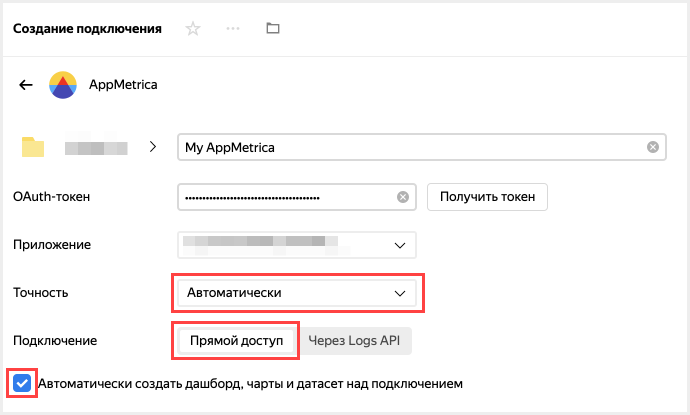
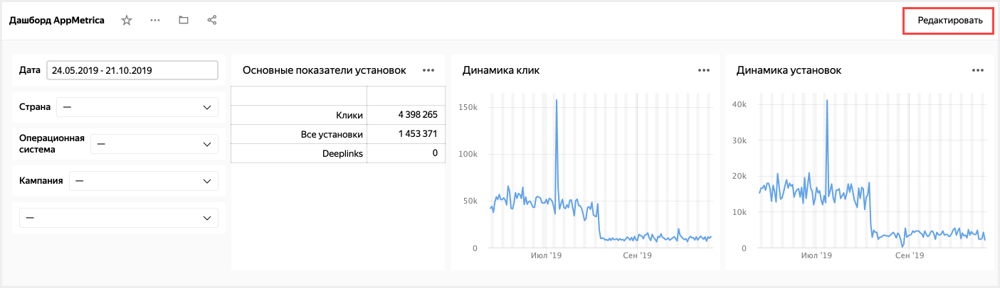
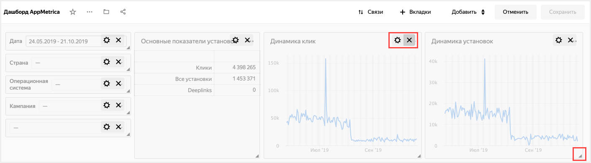

# Mobile app analytics based on AppMetrica data

You can visualize and explore AppMetrica data in {{ datalens-full-name }} using the following methods:

* Direct access.
   {{ datalens-name }} connects directly to AppMetrica. This method is the easiest and fastest, but the set of supported functions is [limited](../datalens/function-ref/availability.md).
* Real-time export of data from AppMetrica to {{ mch-name }}.
   Raw data is available and its pre-aggregation and post-processing at the DB level are supported. To implement this option, [set up data export](https://appmetrica.yandex.ru/docs/common/cloud/about.html)(https://appmetrica.yandex.ru/docs/common/cloud/about.html?lang=en) and [create a connection](https://cloud.yandex.ru/docs/datalens/operations/connection/create-clickhouse)(https://cloud.yandex.com/en/docs/datalens/operations/connection/create-clickhouse) from {{ datalens-name }} to the {{ CH }} database.

In this scenario, direct access is used. An application added to [AppMetrica](https://appmetrica.yandex.ru) will be used as the data source. You can view a list of applications available to you under [Applications](https://appmetrica.yandex.ru/application/list).

If you don't have any apps available, then before performing this scenario, [add an app](https://appmetrica.yandex.ru/docs/quick-start/concepts/quick-start.html) or use the standard **AppMetrica Dashboard**.

To visualize and explore data, [set up your cloud](#before-you-begin), then follow the steps below:

1. [Create a connection and standard dashboard](#create-dashboard).
1. [Edit the standard dashboard](#edit-dashboard).



## Prepare your cloud {#before-you-begin}





## Create a connection and a standard dashboard {#create-dashboard}



This step is available to users who have an app in AppMetrica. If you don't have any apps, open the standard **AppMetrica dashboard** and go to the [next step](data-from-appmetrica-visualization.md#edit-dashboard).



1. Go to [{{ datalens-short-name }}]({{ link-datalens-main }}) and click **Create connection**.

   

1. Select **AppMetrica** as the connection type.

   

1. Enter a name for the connection: `My Metrica`, then click **Get token**.

   

   If this is your first connection to an AppMetrica app, grant the necessary permissions to the service.

1. Select an app from the drop-down list.

   

1. Specify the connection settings:

   

   1. Set the data accuracy (sampling rate). You can change accuracy after you create the connection.
   1. Select the **Direct access** connection type.
   1. Enable **Automatically create a dashboard on this connection**.

1. In the upper-right corner, click **Create**.

   When the connection is created, a folder containing a dashboard and a set of datasets and charts opens.

## Edit the standard dashboard {#edit-dashboard}



If you don't have an app in AppMetrica and you skipped the previous step, use the **AppMetrica dashboard**.



You can change the standard [dashboard](../datalens/concepts/dashboard.md) however you want. For example, you can delete a chart, change its size, or change the visualization type.

1. Open the dashboard.

1. Click **Edit** in the upper-right corner.

   

1. To delete the **Click dynamics** widget, click  in the upper-right corner.

   

1. To change the size of the **Installation dynamics** widget, drag it by the lower-right corner.

1. Click **Save** in the upper-right corner to save the dashboard.

   

You can edit any chart on the dashboard. For example, change the visualization type for the **Ad networks** chart from the **Attracting users** section.
