# AppMetrica: data export, post-processing, and visualization


In this scenario, you will analyze user behavior in a mobile app based on AppMetrica data:

* Process the data using Python scripts in {{ jlab }} Notebooks in {{ ml-platform-full-name }}.
* Build charts and dashboards in {{ datalens-full-name }}.
* Compare products by breadth and frequency of coverage.

Customer journey is a sequence of user actions. User behavior analysis helps you find out how people use your product: which pages they visit, which functions they use, and where they run into problems. This information makes it easier for you to find the right solutions to develop your product.

As a data source, you'll use sampled and anonymized data from the [auto.ru](https://auto.ru) mobile app, exported from AppMetrica.



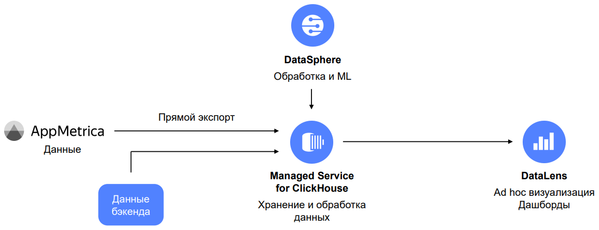





The script uses a file with pre-exported AppMetrica data so you can run the script without accessing the mobile app and AppMetrica.

For your own tasks, we recommend directly [exporting data](https://appmetrica.yandex.com/docs/common/cloud/about.html) from AppMetrica to {{ CH }}.



[First prepare the cloud](#before-you-begin) and then explore and visualize the data step-by-step:

1. [Connect {{ CH }} and {{ ml-platform-short-name }}](#ch-datasphere-connection)
   1. [Connect {{ CH }}](#ch-connection)
   1. [Connect {{ ml-platform-short-name }}](#datasphere-connection)
   1. [Clone the repository to {{ ml-platform-short-name }}](#clone-repo-to-datasphere)
1. [Retrieve and upload data to {{ CH }}](#get-download-data-in-ch)
   1. [{{ ml-platform-short-name }}. Download the test app data via Yandex Disk](#uploading-data-counter-from-disk)
   1. [Export the data from AppMetrica](#uploading-data-from-appmetrica)
   1. [{{ CH }}. Get the cluster's IP address](#getting-ch-cluster-host)
   1. [{{ ml-platform-short-name }}. Upload the data to {{ CH }}](#uploading-data-counter-to-ch)
1. [{{ ml-platform-short-name }}. You will compare products by breadth and frequency of coverage](#compare-by-coverage-frequency)
1. [Connect {{ datalens-short-name }} and create charts](#datalens-connection-chart-creation)
   1. [Connect to {{ datalens-short-name }}](#datalens-connection)
   1. [Create a connection to {{ CH }} in {{ datalens-short-name }}](#creation-datalens-connection-to-ch)
   1. [Create a dataset based on the connection](#creating-dataset-based-on-connection)
   1. [Create a chart: scatter chart](#creating-scatter-chart)
   1. [Create a chart: table](#creating-table-chart)
1. [Create and configure a dashboard in {{ datalens-short-name }}](#creating-configuring-dashboard)
1. [Customer journey. Create a QL chart and a Sankey chart](#customer-journey)
   1. [Create a QL chart in {{ datalens-short-name }}](#creating-sql-chart)
   1. [Create a Sankey diagram in {{ ml-platform-short-name }}](#creating-sankey-chart)

## Prepare your cloud {#before-you-begin}



## 1. Connect {{ CH }} and {{ ml-platform-short-name }} {#ch-datasphere-connection}

### 1.1. Connect {{ CH }} {#ch-connection}

1. In the [management console]({{ link-console-main }}), select **{{ mch-name }}** from the list on the left.
1. Click **Create cluster**.
1. Specify the settings for a {{ CH }} cluster.

   1. **Basic parameters**: Enter `appmetrica_analysis` as the cluster name.
   1. **Host class**: Select **burstable** as the virtual machine type and **b2.medium** as the host type.

      

      We do not recommend using **burstable** VM configurations in production environments. This tutorial uses them as an example. For production solutions, use **standard** or **memory-optimized** configurations.

      

      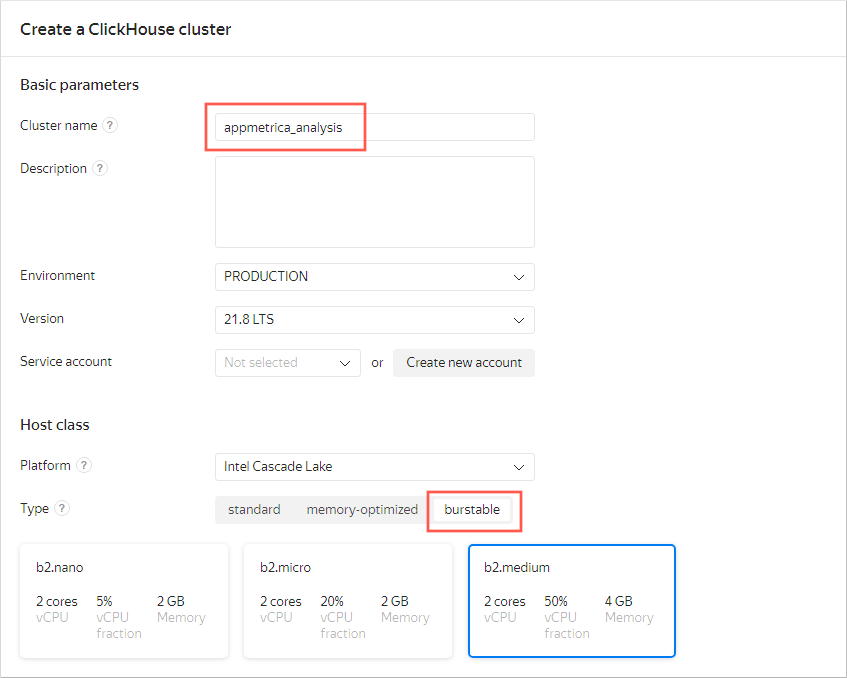

   1. **Storage size**: Leave the value at 10 GB.
   1. **Database**: Enter `autoru_appmetrica` database name, as well as its username and password. Memorize these credentials.

      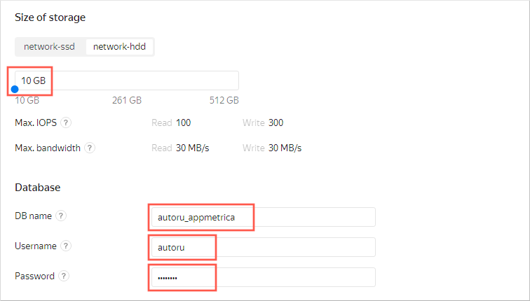

   1. **Hosts**: Click the  icon. Enable **Public access** and click **Save**.
   1. **Advanced settings**: Enable 4 options:

      * Access from {{ datalens-short-name }}
      * Access from the management console
      * Access from Yandex Metrica and AppMetrica
      * Access from Serverless

   1. After configuring all settings, click **Create cluster**.

### 1.2. Connect {{ ml-platform-short-name }} {#datasphere-connection}

1. Go to the [management console]({{ link-console-main }}).
1. Select **{{ ml-platform-name }}** from the list on the left.
1. Click **Create project**.
1. Enter `appmetrica_analysis` as the project name, and click **Create**.
1. Open the project. To do this, in the line with the project name, click  → **Open**.

### 1.3. Clone the repository to {{ ml-platform-short-name }} {#clone-repo-to-datasphere}

1. In the top-left corner, click **Git Clone**: .

   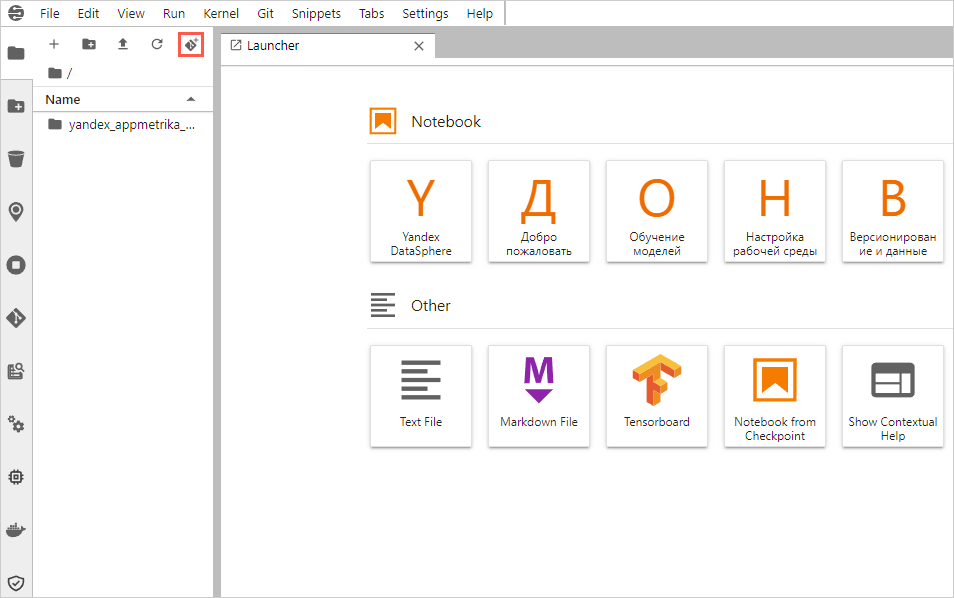

1. In the window that opens, enter the repository **URI** `https://github.com/firstsvet/yandex_appmetrika_cloud_case`, then click **CLONE**.

## 2. Retrieve and upload data to {{ CH }} {#get-download-data-in-ch}

If you do not have a Yandex Metrica tag, it has not accumulated enough data, or if you want to make sure that you will get a result by completing all the guide steps, go to step [2.1](#uploading-data-counter-from-disk) (skip step [2.2](#uploading-data-from-appmetrica)).

If you have the AppMetrica app and access to it, go to step [2.2](#uploading-data-from-appmetrica): this is recommended for experienced users who might need to edit scripts (skip step [2.1](#uploading-data-counter-from-disk)).

### 2.1. {{ ml-platform-short-name }}. Download the test app data via Yandex Disk {#uploading-data-counter-from-disk}



Skip this step if you are using your own app data.



1. In the menu on the left, open the **yandex_appmetrika_cloud_case** folder → notebook **1.upload_data_from_yadisk.ipynb**.
1. Complete all the steps (cells with code) in the notebook **1.upload_data_from_yadisk.ipynb**.

   To run the step, click the number to the left of the cell, then the run button at the top. The number will change to `[*]`. After the number appears again, run the next step.

   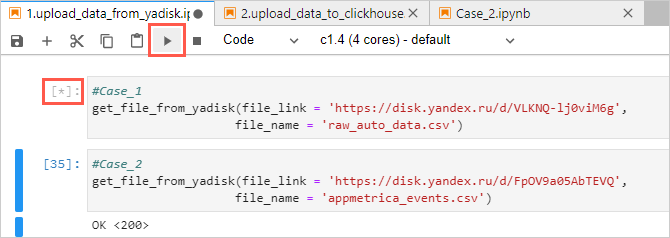

### 2.2. Export the data from AppMetrica {#uploading-data-from-appmetrica}

To set up the connection and export data from your app, see [Export data to {{ yandex-cloud }}](https://appmetrica.yandex.com/docs/common/cloud/about.html).


### 2.3. {{ CH }}. Get the cluster IP address {#getting-ch-cluster-host}

1. Go to the {{ CH }} `appmetrica_analysis` cluster that you created in step [1.1](#ch-connection). Wait until the cluster status changes to **Alive**. Then open the cluster by clicking it.

   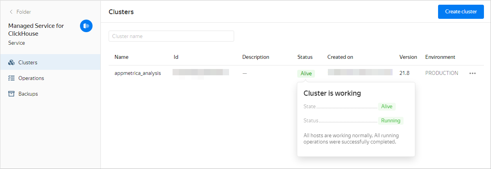

1. Select **Hosts** from the list on the left.
1. On the **Overview** tab, go to the **Hostname** column. To copy a hostname, point to the right of the hostname and click the copy icon.

### 2.4. {{ ml-platform-short-name }}. Upload the data to {{ CH }} {#uploading-data-counter-to-ch}

1. Open the **yandex_appmetrika_cloud_case** folder → notebook **2. upload_data_to_{{ CH }}.ipynb**.
1. Paste data in the variables:

   * Host name from step [2.3](#uploading-data-counter-to-ch): In the **CH_HOST_NAME** variable.
   * Username from step [1.1](#ch-connection): In the **CH_USER** variable.
   * Database name from step [1.1](#ch-connection): In the **CH_DB_NAME** variable.

      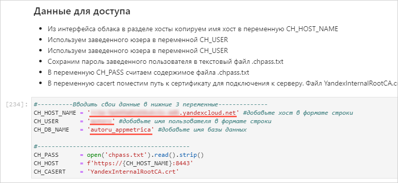

1. In the **yandex_appmetrika_cloud_case** folder, create a new text file named `chpass.txt`.

   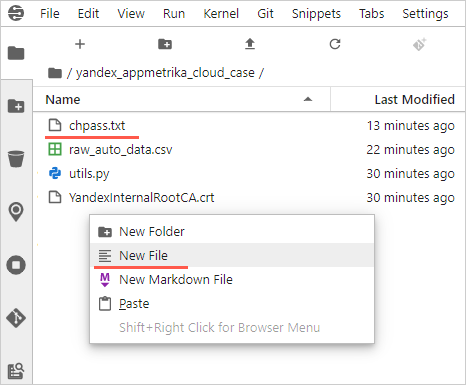

1. Enter the password of the logged-in user in the **chpass.txt** file. Save and close the file.
1. Complete all the steps (the cells with the code) in the notebook.

## 3. {{ ml-platform-short-name }}. You will compare products by breadth and frequency of coverage {#compare-by-coverage-frequency}

1. Open the **yandex_appmetrika_cloud_case** folder → **Case_1.ipynb** notebook.
1. Paste data in the variables:

   * Host name from step [2.3](#uploading-data-counter-to-ch): In the **CH_HOST_NAME** variable.
   * Username from step [1.1](#ch-connection): In the **CH_USER** variable.
   * Database name from step [1.1](#ch-connection): In the **CH_DB_NAME** variable.

1. Complete all the steps (the cells with the code) in the notebook.

1. View the intermediate results.

   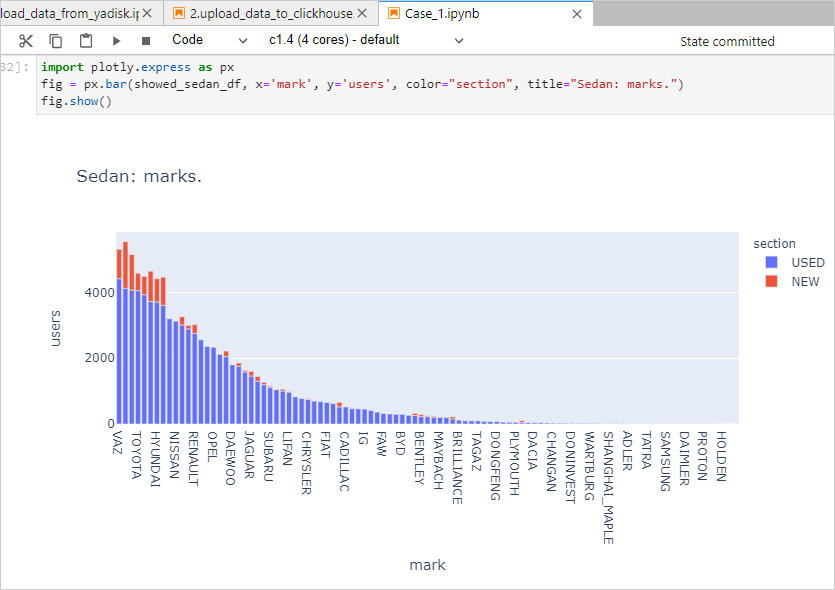

## 4. Connect {{ datalens-short-name }} and create charts {#datalens-connection-chart-creation}

### 4.1. Connect to {{ datalens-short-name }} {#datalens-connection}

1. In the [management console]({{ link-console-main }}), open the page of the {{ CH }} cluster you created.
1. On the left side of the window, select  **{{ datalens-short-name }}**.
1. Click **Create connection**.

### 4.2. Create a connection to {{ CH }} in {{ datalens-short-name }} {#creation-datalens-connection-to-ch}

1. Fill in the connection settings:

   1. Enter the name: `AppMetrica_workshop`.
   1. Select a {{ CH }} host from the **Hostname** drop-down list.
   1. Select the username and enter the password from step [1.1](#ch-connection).
   1. Enable **Allow subqueries in datasets and queries from charts**.

      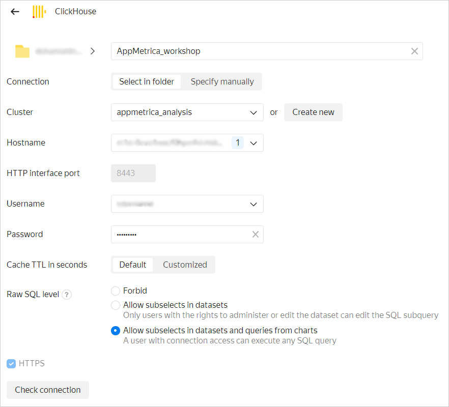

   1. Click **Check connection**.

1. When the connection check succeeds, click **Create connection**. In the window that opens, enter the connection name and click **Create**.

### 4.3. Create a dataset based on the connection {#creating-dataset-based-on-connection}

1. In the top-right corner, click **Create dataset**.
1. Select the `autoru_appmetrica.auto_data` table as the source. To do this, drag the table from the list on the left to the editing area.
1. Open the **Fields** tab.
1. Create the **users** calculated field:

   1. In the top-right corner, click **Add field**.
   1. At the top left, enter the `users` field name.
   1. Paste the `countd([appmetrica_device_id])` formula in the area to the right.
   1. Click **Create**.

   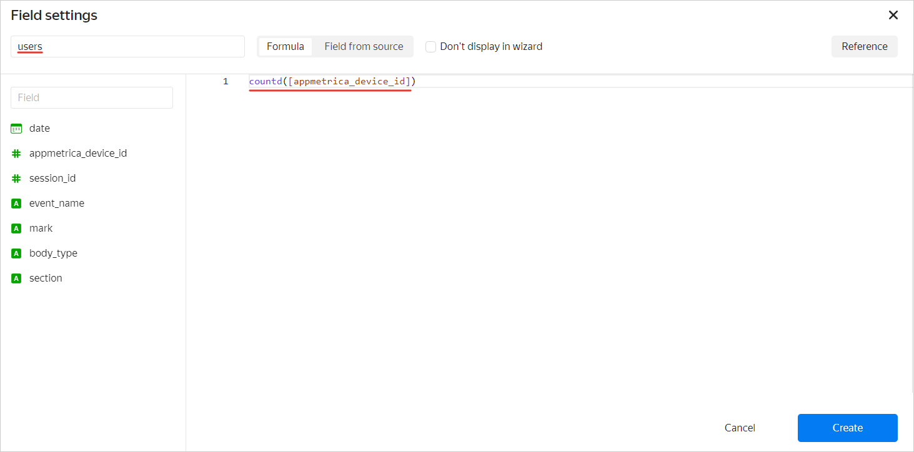

1. Repeat the previous step for other fields:

   * **reach**, using the `COUNTD([appmetrica_device_id])/COUNTD([appmetrica_device_id] FIXED)` formula.
   * **events**, using the `COUNT([session_id])` formula.
   * **events per user**, using the `[events]/[users]` formula.

1. In the top-right corner, click **Save**.
1. Name the dataset `autoru_backend_data` and click **Create**.

### 4.4. Create a chart: scatter chart {#creating-scatter-chart}

1. In the top-right corner, click **Create chart**.
1. Select **Scatter chart** as the type.
1. Drag the fields to the chart section:

   * Drag the **reach** measure to the **X** section.
   * Drag the **events per user** measure to the **Y** section.
   * Drag the **mark** dimension to the **Points** section.
   * Drag the **event_name** dimension to the **Colors** section.

   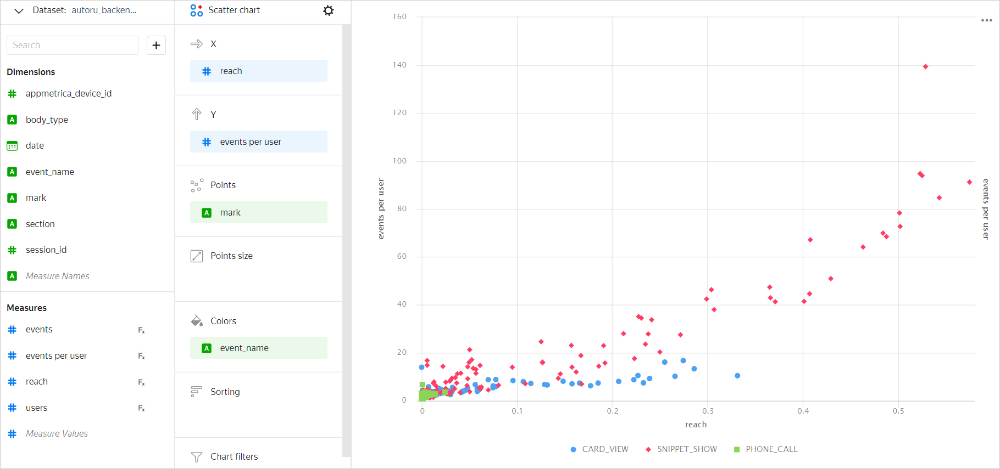

1. In the top-right corner, click **Save**.
1. In the window that opens, enter `Coverage and events` as the chart name and click **Save**.

### 4.5. Create a chart: table {#creating-table-chart}

1. Select the **Table** type.
1. Drag the fields to the chart section:

   * Drag the **mark** measure to the **Columns** section.
   * Drag the **users** measure to the **Columns** section.
   * Drag the **users** measure to the **Sorting** section.

   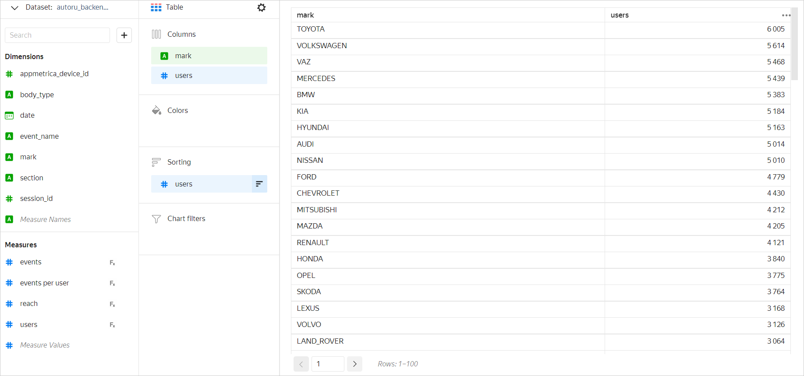

1. In the top-right corner, click the button to the right of **Save**, then click **Save as**.
1. In the window that opens, enter `Table by car brands` as the chart name, then click **Save**.

## 5. Create and configure a dashboard in {{ datalens-short-name }} {#creating-configuring-dashboard}

1. Open the {{ datalens-short-name }} [homepage]({{ link-datalens-main }}) and click **Create dashboard**.
1. Add a chart to your dashboard.

   1. In the top-right corner, click **Add** → **Chart**.
   1. From the **Chart** drop-down list, select **Table by car brands**. The **Name** field will be populated automatically.
   1. Click **Add**.

   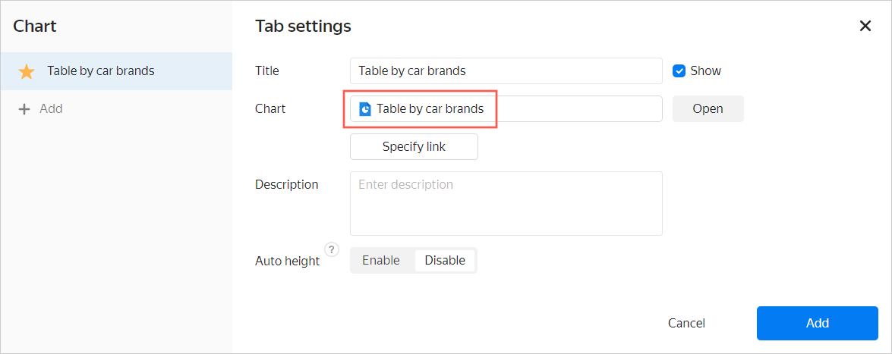

1. Repeat the previous step for the **Coverage and events** chart.
1. Add and configure a selector.

   1. In the top-right corner, click **Add** → **Selector**.
   1. In the **Dataset** list, select **autoru_backend_data**.
   1. In the **Field** list, select **event name**.
   1. In the **Default value** list, select any option.
   1. Click **Add**.

1. Position the charts and selector on the dashboard. To resize an element, drag it by the bottom-right corner.
1. Save the dashboard:

   1. In the top-right corner, click **Save**.
   1. Enter `auto.ru app` as the dashboard name, then click **Create**.

   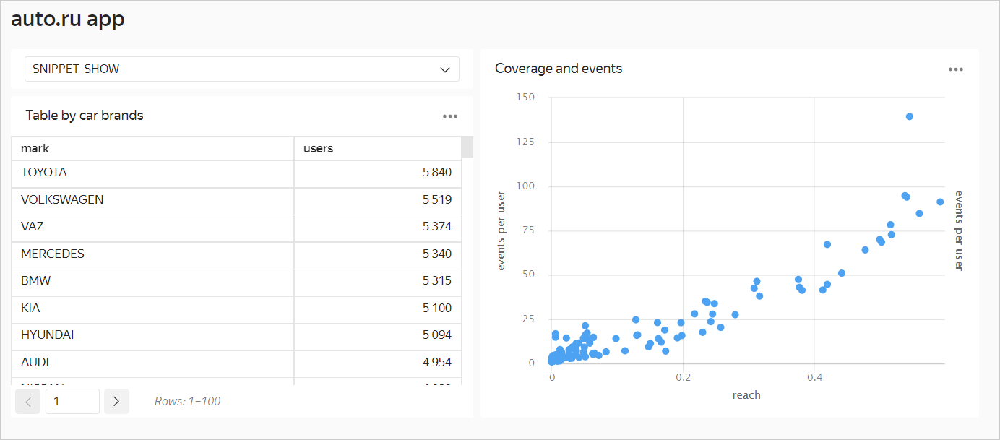

Try to change **event name** in the selector to another value to see how the dashboard changes.

## 6. Customer journey. Create a QL chart and a Sankey chart {#customer-journey}

### 6.1. Create a QL chart in {{ datalens-short-name }} {#creating-sql-chart}

Use QL charts to delve into event sequences and experiment in {{ datalens-short-name }}.

1. Open the {{ datalens-short-name }} [home page]({{ link-datalens-main }}) and select **Connections** in the menu on the left.
1. Select the `AppMetrica_workshop` connection that you created in step [4.2](#creation-datalens-connection-to-ch).
1. At the top right, click **Create QL chart**.
1. Enter the query:

   ```sql
   SELECT uniqExact(t.appmetrica_device_id) as counts, events_seq, 

   if(events_seq like '%Call%', 'Call', 
   if(events_seq like '%Message%', 'Message', 'Contact failed')) as contact

   FROM (

   SELECT
       appmetrica_device_id,
       num_steps,
       arrayStringConcat(filt_events, ' -> ') as events_seq
   FROM
       (SELECT
           appmetrica_device_id,
           groupArray(event_name) as events,
           count(event_name) as cnt_events,
           groupArray(datetime) as times,
           arrayEnumerate(events) as indexes,
           arrayDifference(arrayMap(x -> toUInt64(x), times)) as times_diffs,
           arrayFilter(e, i -> (i = 1) or (events[i - 1] != events[i]) or (times_diffs[i] >= 1800),
                       events, indexes) as filt_events,
           length(filt_events) as num_steps
       FROM 
           (SELECT
               appmetrica_device_id,
               datetime,
               event_name
           FROM autoru_appmetrica.raw_appmetrica_auto_data
           ORDER BY appmetrica_device_id,
               datetime)
       GROUP BY appmetrica_device_id
       HAVING cnt_events <= 30)) as t

   where  t.num_steps<10

   GROUP BY t.events_seq
   HAVING counts>10
   ORDER BY counts desc
   ```

1. Click **Start**.
1. Select the **Bar chart** type.

   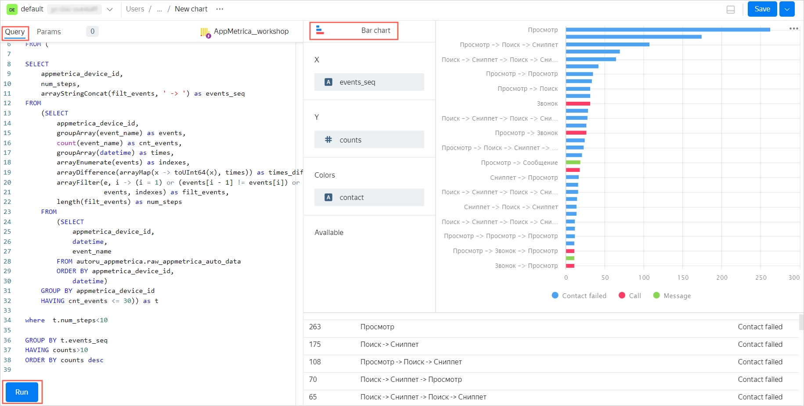

1. In the top-right corner, click **Save**, then enter the chart name: `Event chains`.
1. Add the QL chart to the dashboard.

   1. In the menu on the left, click **Dashboards**.
   1. Select the **auto.ru app** dashboard from the list.
   1. Click **Edit** at the top right.
   1. Click **Add** → **Chart**.
   1. In the **Chart** list, select **Event chains** and click **Add**.
   1. Customize the dashboard layout and click **Save**.

   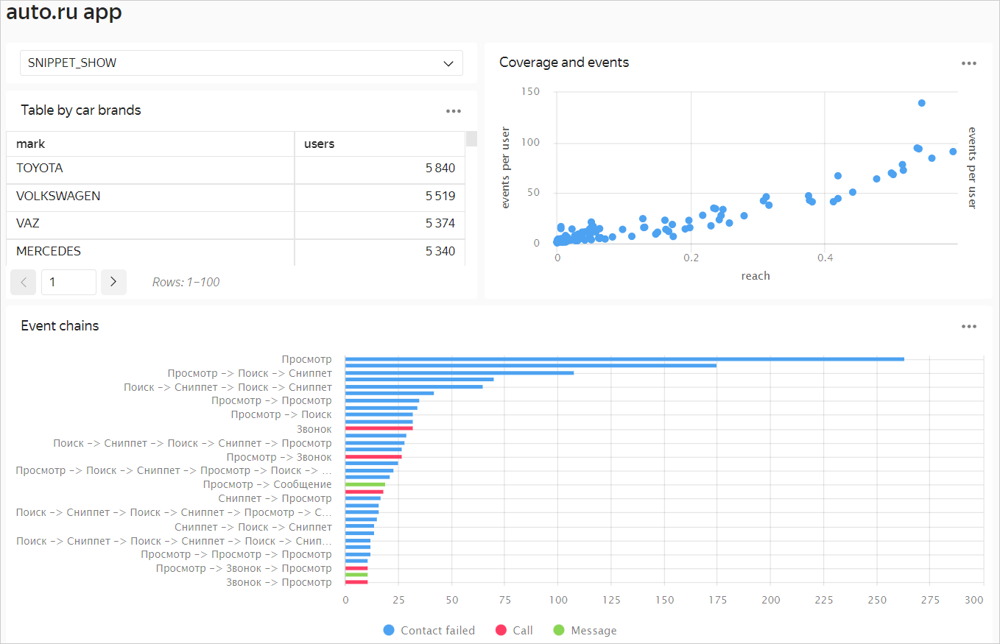

### 6.2. Create a Sankey diagram in {{ ml-platform-short-name }} {#creating-sankey-chart}

1. Go to the [management console]({{ link-console-main }}).
1. Select **{{ ml-platform-name }}** from the list on the left.
1. Open the **yandex_appmetrika_cloud_case** folder → **Case_2.ipynb** notebook.
1. Complete all the steps (cells with code) in the notebook **Case_2.ipynb**.
1. You will get an interactive Sankey diagram that shows user behavior scenarios. You can move the chart blocks and save the result as an image.

   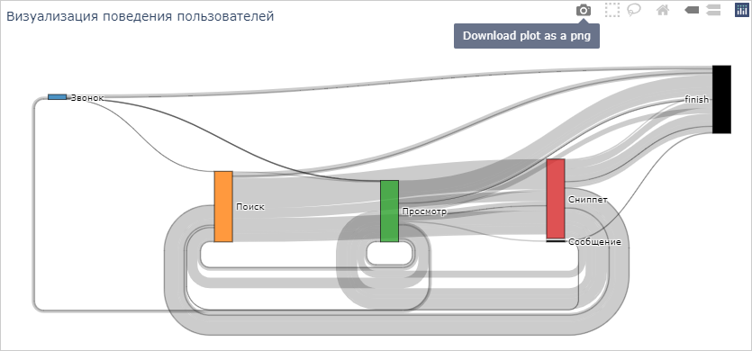
