# AppMetrica: data export, post-processing, and visualization


In this tutorial, you will analyze user behavior in a mobile app based on AppMetrica data:

* Process the data using Python scripts in {{ jlab }} Notebooks in {{ ml-platform-full-name }}.
* Build charts and dashboards in {{ datalens-full-name }}.
* Compare products by reach and frequency.

Customer journey is a sequence of user actions. User behavior analysis helps you find out how people use your product: pages they visit, functions they use, and issues they face. This information makes it easier for you to find the right solutions to develop your product.

As a data source, we will use sampled and anonymized data from the [auto.ru](https://auto.ru) mobile app, exported from AppMetrica.



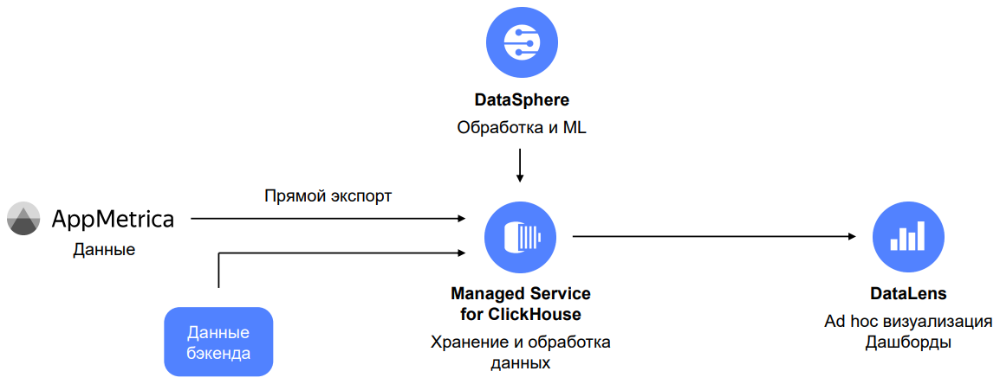





This tutorial uses a file with pre-exported AppMetrica data so you can follow this tutorial without accessing the mobile app and AppMetrica.

For your own tasks, we recommend directly [exporting data](https://appmetrica.yandex.com/docs/common/cloud/about.html) from AppMetrica to {{ CH }}.



[First get your cloud ready](#before-you-begin) and then explore and visualize the data step-by-step:

1. [Connect {{ CH }} and {{ ml-platform-short-name }}](#ch-datasphere-connection).
    1. [Connect {{ CH }}](#ch-connection).
    1. [Connect {{ ml-platform-short-name }}](#datasphere-connection).
    1. [Clone the repository to {{ ml-platform-short-name }}](#clone-repo-to-datasphere).
1. [Get and upload data to {{ CH }}](#get-download-data-in-ch).
    1. [{{ ml-platform-short-name }}. Export the test app data via Yandex Disk](#uploading-data-counter-from-disk).
    1. [Export the data from AppMetrica](#uploading-data-from-appmetrica).
    1. [{{ CH }}. Get the cluster address](#getting-ch-cluster-host).
    1. [{{ ml-platform-short-name }}. Upload the data to {{ CH }}](#uploading-data-counter-to-ch).
1. [{{ ml-platform-short-name }}. Compare products by reach and frequency](#compare-by-coverage-frequency).
1. [Connect {{ datalens-short-name }} and create charts](#datalens-connection-chart-creation).
    1. [Connect to {{ datalens-short-name }}](#datalens-connection).
    1. [Create a connection to {{ CH }} in {{ datalens-short-name }}](#creation-datalens-connection-to-ch).
    1. [Create a dataset based on the connection](#creating-dataset-based-on-connection).
    1. [Create a scatter chart](#creating-scatter-chart).
    1. [Create a table chart](#creating-table-chart).
1. [Create and configure a dashboard in {{ datalens-short-name }}](#creating-configuring-dashboard).
1. [Customer journey. Create a QL chart and a Sankey chart](#customer-journey).
    1. [Create a QL chart in {{ datalens-short-name }}](#creating-sql-chart).
    1. [Create a Sankey chart in {{ ml-platform-short-name }}](#creating-sankey-chart).

## Get your cloud ready {#before-you-begin}



## 1. Connect {{ CH }} and {{ ml-platform-short-name }} {#ch-datasphere-connection}

### 1.1. Connect {{ CH }} {#ch-connection}

1. Navigate to the [management console]({{ link-console-main }}).
1. Navigate to **{{ ui-key.yacloud.iam.folder.dashboard.label_managed-clickhouse }}**.
1. Click **Create cluster**.
1. Configure your {{ CH }} cluster.

   1. **Basic parameters**: Enter `appmetrica_analysis` as the cluster name. 
   1. **Host class**: Select **burstable** as the virtual machine type and **b2.medium** as the host type.

      
   
      We do not recommend using **burstable** VM configurations in production environments. This tutorial uses them as an example. For production solutions, use **standard** or **memory-optimized** configurations.

      

      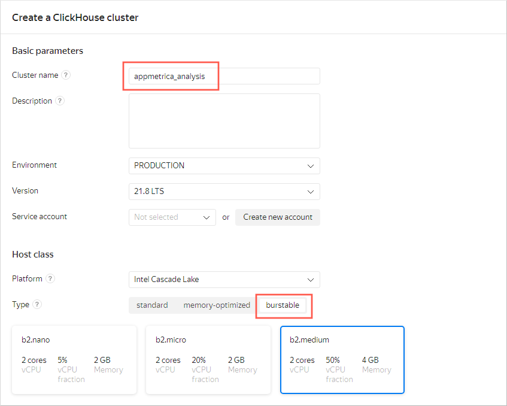
   
   1. **Storage size**: Leave 10 GB.
   1. **Database**: Specify the database name (`autoru_appmetrica`), username, and password. Memorize these credentials.
     
      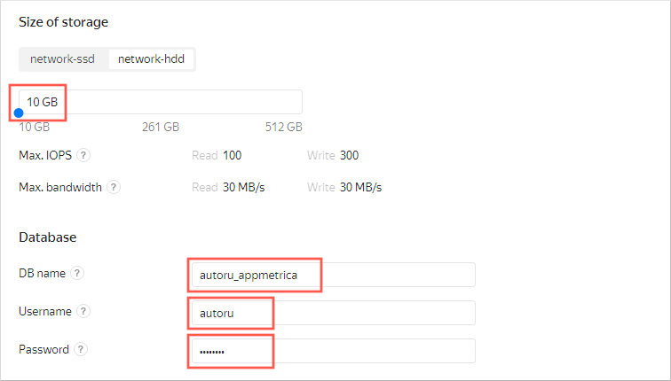
      
   1. **Hosts**: Click the  icon. Enable **Public access** and click **Save**.
   1. **Advanced settings**: Enable these four options:

        * Access from {{ datalens-short-name }}
        * Access from the management console
        * Access from Yandex Metrica and AppMetrica
        * Access from Serverless

   1. After specifying all the settings, click **Create cluster**.

### 1.2. Connect {{ ml-platform-short-name }} {#datasphere-connection}

1. Navigate to the [management console]({{ link-console-main }}).
1. Navigate to **{{ ml-platform-name }}**.
1. Click **Create project**.
1. Specify `appmetrica-analysis` as the project name and click **Create**. 
1. Open your project. To do this, in the row with the project name, click  → **Open**.

### 1.3. Clone the repository to {{ ml-platform-short-name }} {#clone-repo-to-datasphere}

1. In the top-left corner, click the **Git Clone** icon: .

   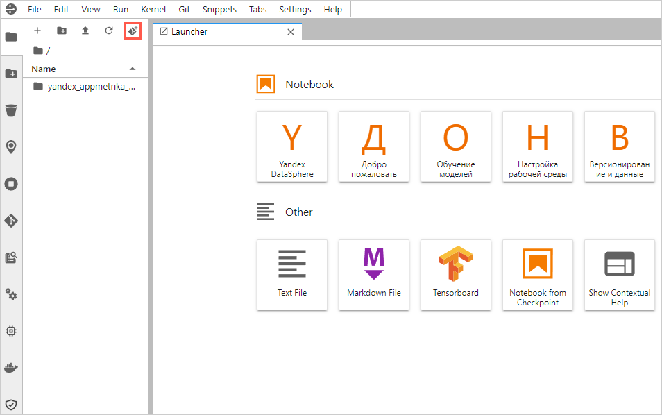

1. In the window that opens, specify the repository **URI**, `https://github.com/firstsvet/yandex_appmetrika_cloud_case`, and click **CLONE**.

## 2. Get and upload data to {{ CH }} {#get-download-data-in-ch}

If you do not have a Yandex Metrica app, it has not accumulated enough data, or if you want to make sure that you will get a result by completing all the tutorial steps, go to step [2.1](#uploading-data-counter-from-disk) (skip step [2.2](#uploading-data-from-appmetrica)).

If you have an AppMetrica app and access to it, go to step [2.2](#uploading-data-from-appmetrica). We recommend this for experienced users as you might need to edit scripts (skip step [2.1](#uploading-data-counter-from-disk)).

### 2.1. {{ ml-platform-short-name }}. Download the test app data via Yandex Disk {#uploading-data-counter-from-disk}



Skip this step if you are using your own app data.



1. In the left-hand menu, open the **yandex_appmetrika_cloud_case** folder → **1.upload_data_from_yadisk.ipynb** notebook.
1. Complete all the steps, i.e., run cells with code, in the **1.upload_data_from_yadisk.ipynb** notebook.

    To run a step, click the number to the left of the cell, then the run button at the top. The number will change to `[*]`. After the number appears again, run the next step.

    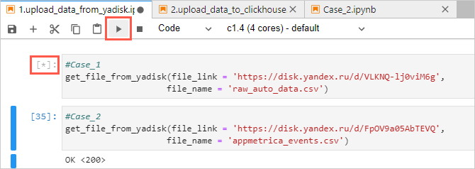

### 2.2. Export the data from AppMetrica {#uploading-data-from-appmetrica}

To set up the connection and export data from your app, see the guide in [Exporting data in {{ yandex-cloud }}](https://appmetrica.yandex.ru/docs/common/cloud/about.html).

### 2.3. {{ CH }}. Get the cluster address {#getting-ch-cluster-host}

1. Go to the `appmetrica_analysis` {{ CH }} cluster you created in step [1.1](#ch-connection). Wait for the cluster status to change to **Alive**. Then open the cluster by clicking it.

     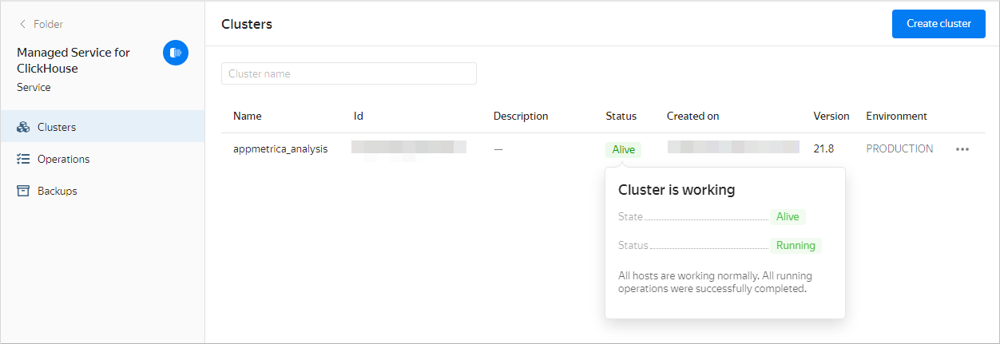

1. Select **Hosts** from the list on the left.
1. On the **Overview** tab, go to the **Host name** column. To copy a host name, point to the right of the host name and click the copy icon.

### 2.4. {{ ml-platform-short-name }}. Upload the data to {{ CH }} {#uploading-data-counter-to-ch}

1. Open the **yandex_appmetrika_cloud_case** folder → **2.upload_data_to_{{ CH }}.ipynb** notebook.
1. Insert the data into the variables:

    * Host name from step [2.3](#uploading-data-counter-to-ch): Into the **CH_HOST_NAME** variable.
    * Username from step [1.1](#ch-connection): Into the **CH_USER** variable.
    * Database name from step [1.1](#ch-connection): Into the **CH_DB_NAME** variable.
    
      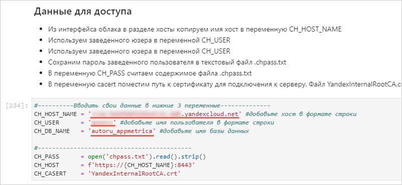
    
1. In the **yandex_appmetrika_cloud_case** folder, create a new text file named `chpass.txt`.
    
    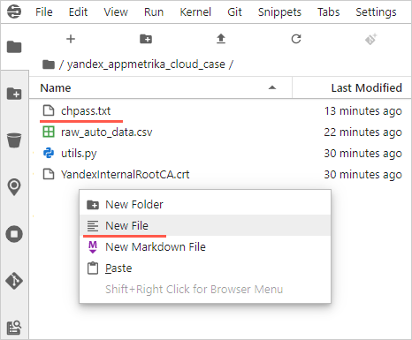

1. Specify the password of the logged-in user in the **chpass.txt** file. Save and close the file.
1. Complete all the steps, i.e., run the cells with code, in the notebook.

## 3. {{ ml-platform-short-name }}. Compare products by reach and frequency {#compare-by-coverage-frequency}

1. Open the **yandex_appmetrika_cloud_case** folder → **Case_1.ipynb** notebook.
1. Insert the data into the variables:

    * Host name from step [2.3](#uploading-data-counter-to-ch): Into the **CH_HOST_NAME** variable.
    * Username from step [1.1](#ch-connection): Into the **CH_USER** variable.
    * Database name from step [1.1](#ch-connection): Into the **CH_DB_NAME** variable.

1. Complete all the steps, i.e., run the cells with code, in the notebook.

1. View the intermediate results.

     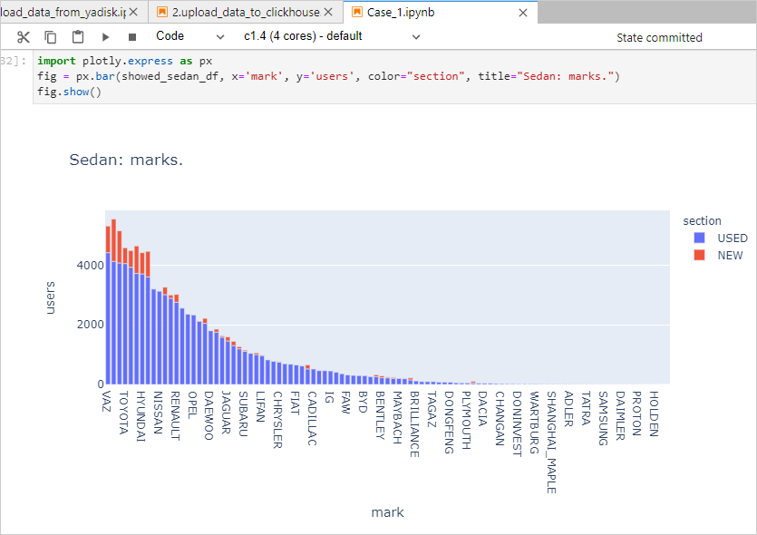

## 4. Connect {{ datalens-short-name }} and create charts {#datalens-connection-chart-creation}

### 4.1. Connect to {{ datalens-short-name }} {#datalens-connection}

1. In the [management console]({{ link-console-main }}), open the page of the new {{ CH }} cluster.
1. On the left side of the window, select  **{{ datalens-short-name }}**.
1. Click **Create connection**.

### 4.2. Create a connection to {{ CH }} in {{ datalens-short-name }} {#creation-datalens-connection-to-ch}

1. Set up your connection:

   1. Enter `AppMetrica_workshop` for the name.
   1. Select the {{ CH }} host from the **Host name** drop-down list.
   1. Select the username and enter the password from step [1.1](#ch-connection).
   1. Enable **Allow subqueries in datasets and queries from charts**.
  
      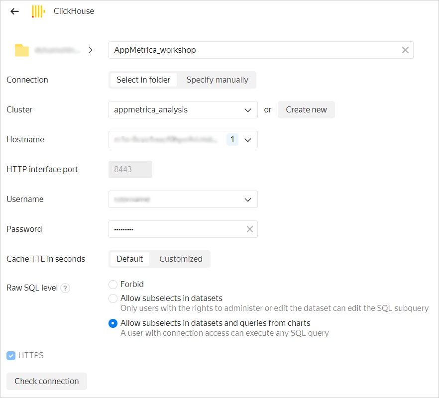

   1. Click **Check connection**.

1. After a successful check, click **Create connection**. In the window that opens, enter the connection name and click **Create**.

### 4.3. Create a dataset based on the connection {#creating-dataset-based-on-connection}

1. In the top-right corner, click **Create dataset**.
1. Select the `autoru_appmetrica.auto_data` table as the source by dragging the table from the list on the left to the editing area.
1. Open the **Fields** tab.
1. Create the **users** calculated field:

    1. In the top-right corner, click **Add field**.
    1. At the top left, enter `users` for the field name.
    1. Paste the `countd([appmetrica_device_id])` formula in the area on the right.
    1. Click **Create**.

     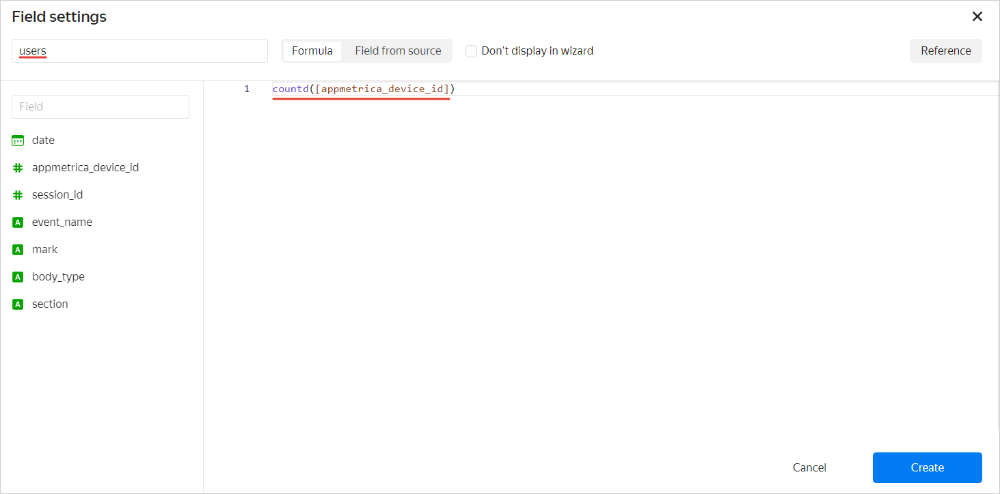

1. Repeat the previous step for other fields:

    * Field name: **reach**, formula: `COUNTD([appmetrica_device_id])/COUNTD([appmetrica_device_id] FIXED)`.
    * Field name: **events**, formula: `COUNT([session_id])`.
    * Field name: **events per user**, formula: `[events]/[users]`.

1. In the top-right corner, click **Save**.
1. Name the dataset `autoru_backend_data` and click **Create**.

### 4.4. Create a scatter chart {#creating-scatter-chart}

1. In the top-right corner, click **Create chart**.
1. Select **Scatter chart** as the type.
1. Drag these fields to the chart section:

    * **reach** measure to the **X** section.
    * **events per user** measure to the **Y** section.
    * **mark** dimension to the **Points** section.
    * **event_name** dimension to the **Colors** section.

   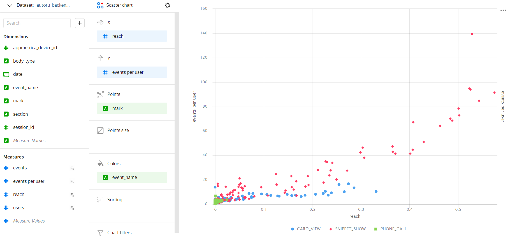

1. In the top-right corner, click **Save**.
1. In the window that opens, enter `Coverage and events` as the chart name and click **Save**.

### 4.5. Create a table chart {#creating-table-chart}

1. Select the **Table** type.
1. Drag these fields to the chart section:

    * **mark** measure to the **Columns** section.
    * **users** measure to the **Columns** section.
    * **users** measure to the **Sorting** section.

   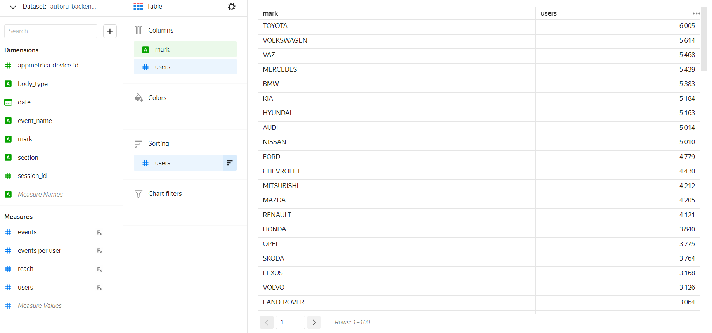

1. In the top-right corner, click the button to the right of **Save**, then click **Save as**.
1. In the window that opens, enter `Table by car brands` as the chart name, then click **Save**.

## 5. Create and configure a dashboard in {{ datalens-short-name }} {#creating-configuring-dashboard}

1. Open the {{ datalens-short-name }} [home page]({{ link-datalens-main-skip-promo }}).
1. In the left-hand panel, click  **Dashboards**.
1. Click **Create dashboard**.
1. Add a chart to your dashboard.

    1. In the top-right corner, click **Add** → **Chart**.
    1. From the **Chart** drop-down list, select **Table by car brands**. The **Name** field will be populated automatically.
    1. Click **Add**.

    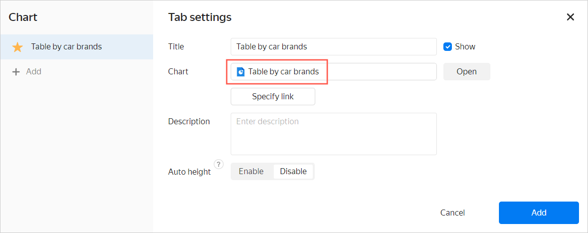

1. Repeat the previous step for the **Coverage and events** chart.
1. Add and configure a selector.

    1. In the top-right corner, click **Add** → **Selector**.
    1. In the **Dataset** list, select **autoru_backend_data**.
    1. In the **Field** list, select **event name**.
    1. In the **Default value** list, select any option.
    1. Click **Add**.

1. Position the charts and selector on the dashboard. To resize an element, drag it by the bottom-right corner.
1. Save the dashboard:

    1. In the top-right corner, click **Save**.
    1. Enter `auto.ru app` for the dashboard name and click **Create**.

    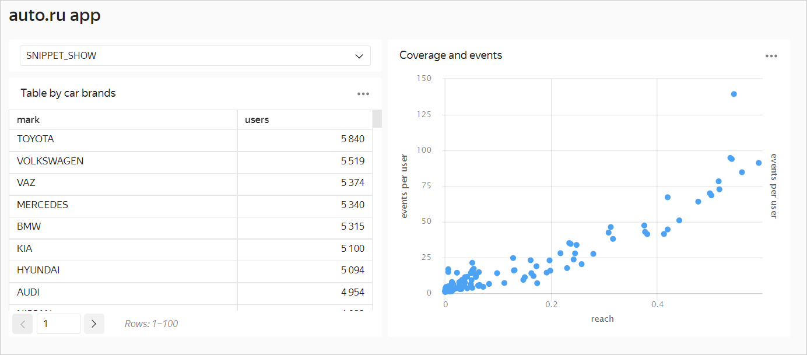

Try to change **event name** in the selector to another value to see how the dashboard changes.

## 6. Customer journey. Create a QL chart and a Sankey chart {#customer-journey}

### 6.1. Create a QL chart in {{ datalens-short-name }} {#creating-sql-chart}

Use QL charts to delve into event sequences and experiment in {{ datalens-short-name }}.

1. Open the {{ datalens-short-name }} [home page]({{ link-datalens-main-skip-promo }}) and select **Connections** in the left-hand menu.
1. Select the `AppMetrica_workshop` connection you created in step [4.2](#creation-datalens-connection-to-ch).
1. At the top right, click **Create QL chart**.
1. Enter this query:

     ```sql
     SELECT uniqExact(t.appmetrica_device_id) as counts, events_seq, 

     if(events_seq like '%Call%', 'Call', 
     if(events_seq like '%Message%', 'Message', 'Contact failed')) as contact

     FROM (

     SELECT
         appmetrica_device_id,
         num_steps,
         arrayStringConcat(filt_events, ' -> ') as events_seq
     FROM
         (SELECT
             appmetrica_device_id,
             groupArray(event_name) as events,
             count(event_name) as cnt_events,
             groupArray(datetime) as times,
             arrayEnumerate(events) as indexes,
             arrayDifference(arrayMap(x -> toUInt64(x), times)) as times_diffs,
             arrayFilter(e, i -> (i = 1) or (events[i - 1] != events[i]) or (times_diffs[i] >= 1800),
                         events, indexes) as filt_events,
             length(filt_events) as num_steps
         FROM 
             (SELECT
                 appmetrica_device_id,
                 datetime,
                 event_name
             FROM autoru_appmetrica.raw_appmetrica_auto_data
             ORDER BY appmetrica_device_id,
                 datetime)
         GROUP BY appmetrica_device_id
         HAVING cnt_events <= 30)) as t
     
     where  t.num_steps<10
     
     GROUP BY t.events_seq
     HAVING counts>10
     ORDER BY counts desc
     ```

1. Click **Start**.
1. Select the **Bar chart** type.

   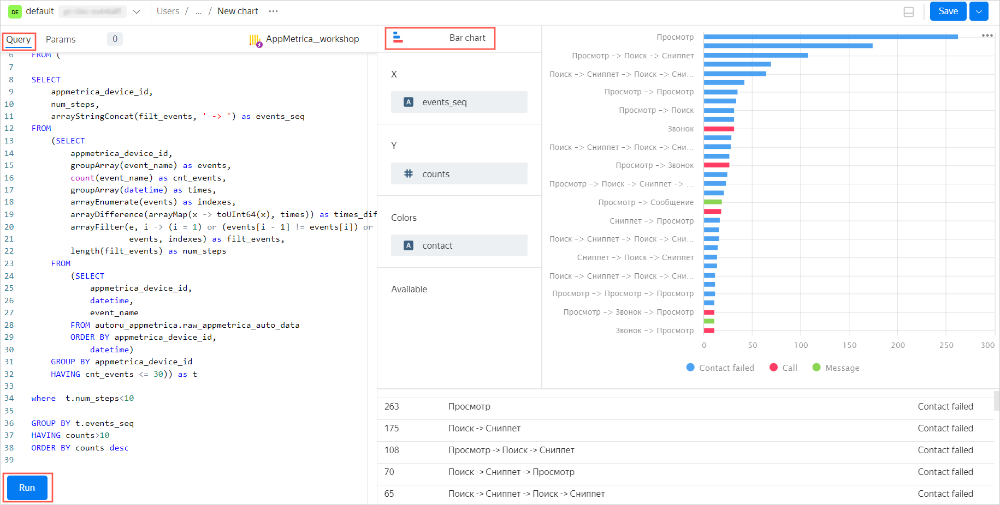

1. In the top-right corner, click **Save**, then enter the chart name: `Event chains`.
1. Add the QL chart to the dashboard.

    1. In the left-hand menu, click **Dashboards**.
    1. Select the **auto.ru app** dashboard from the list.
    1. Click **Edit** at the top right.
    1. Click **Add** → **Chart**.
    1. In the **Chart** list, select **Event chains** and click **Add**.
    1. Customize the dashboard layout and click **Save**.

      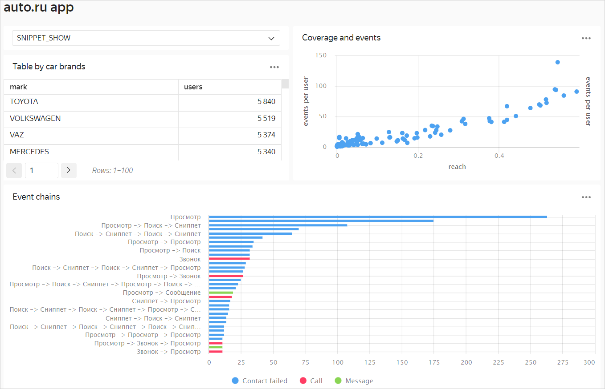

### 6.2. Create a Sankey chart in {{ ml-platform-short-name }} {#creating-sankey-chart}

1. Navigate to the [management console]({{ link-console-main }}).
1. Navigate to **{{ ml-platform-name }}**.
1. Open the **yandex_appmetrika_cloud_case** folder → **Case_2.ipynb** notebook.
1. Complete all the steps, i.e., run the cells with code, in the **Case_2.ipynb** notebook.
1. You will get an interactive Sankey chart that shows user behavior scenarios. You can move the chart blocks and save the result as an image.

   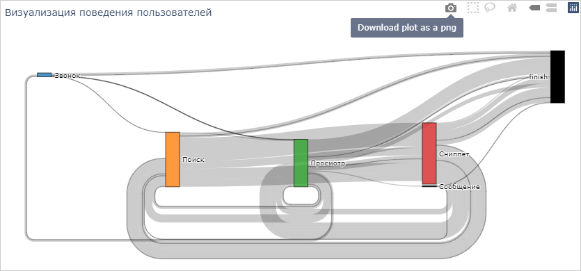
