# Visualizing Bitrix24 data

You will create a connection to a demo Bitrix24 data source and get familiar with the dashboard and charts built by Bitrix24 based on {{ datalens-short-name }}. You will also learn to work with [datasets](../../datalens/concepts/dataset/index.md), [charts](../../datalens/concepts/chart/index.md), and [dashboards](../../datalens/concepts/dashboard.md).

To visualize and explore data, [set up {{ datalens-short-name }}](#before-you-begin) and follow the steps below:

1. [Create a connection to Bitrix24](#create-connection-bitrix24).
1. [Review the dashboard and charts](#view-dashboard-bitrix24).
1. [Review the dataset. Create your dataset and chart](#create-dataset-and-chart).

## Getting started {#before-you-begin}



## Step 1. Create a connection to Bitrix24 {#create-connection-bitrix24}

1. Go to the [{{ datalens-short-name }}]({{ link-datalens-main }}).
1. In the left-hand panel, select  **Connections** and click **Create connection**.
1. Select the [**Bitrix24**]({{ link-datalens-main }}/connections/new/bitrix24) connection type.

   

   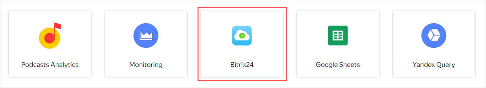

   

1. To connect to a demo data source, specify:

   * **Portal**: `gds.office.bitrix.ru`
   * **Token**: `wJZIFjdYtbLRtfewYcnq71oSFyEgxlbQ`

   When connecting to a working [Bitrix24](../../datalens/operations/connection/create-bitrix24.md) data source, specify:

   * **Portal**: URL of your Bitrix24 portal in `test.bitrix24.ru` format.
   * **Token**: Get a secret key in Bitrix24 by selecting **CRM** → **Analytics** → **BI analytics** in the **Yandex DataLens** tab. For more information, see [this guide](https://helpdesk.bitrix24.ru/open/17402692).

   Leave the **Automatically create a dashboard, charts, and a dataset on the connection** option enabled.

1. Check the connection and click **Create connection**.

   

   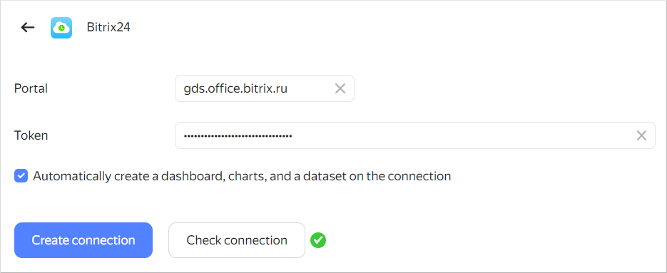

   

1. Enter a name for the connection, e.g., `Bitrix24`, and click **Create**.

   Once the connection is created, the **Bitrix24** folder will open the demo **Bitrix24 dashboard** and nested **Leads** and **Deals** folders with datasets and charts inside.

## Step 2. Review the dashboard {#view-dashboard-bitrix24}

In the **Bitrix24** folder, open the **Bitrix24 dashboard**.

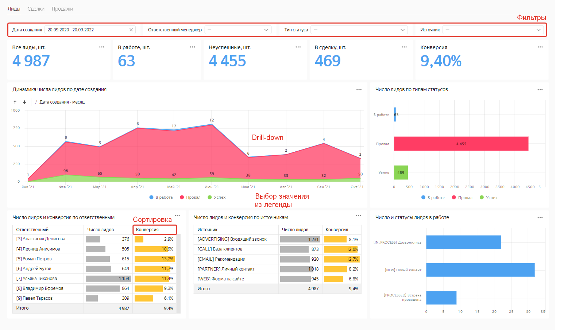

The dashboard is interactive, there you can:

* Set up a variety of filters.
* Sort rows in tables.
* Switch between charts.
* Drill down into charts.

You can see a copy of the main dashboard. Feel free to edit the dashboard as you see fit. For example, in the **Leads** tab, you can change the **Dynamics in the number of leads by creation date** chart and add it to the dashboard:

1. Click  in the top-right corner of the chart and select **Edit**.

   

   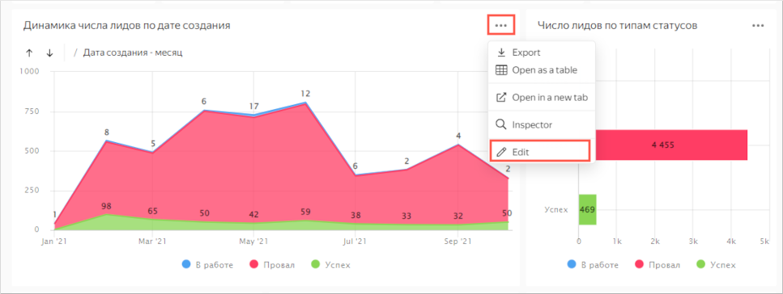

   

1. Select a different chart type: **Column chart**.

   

   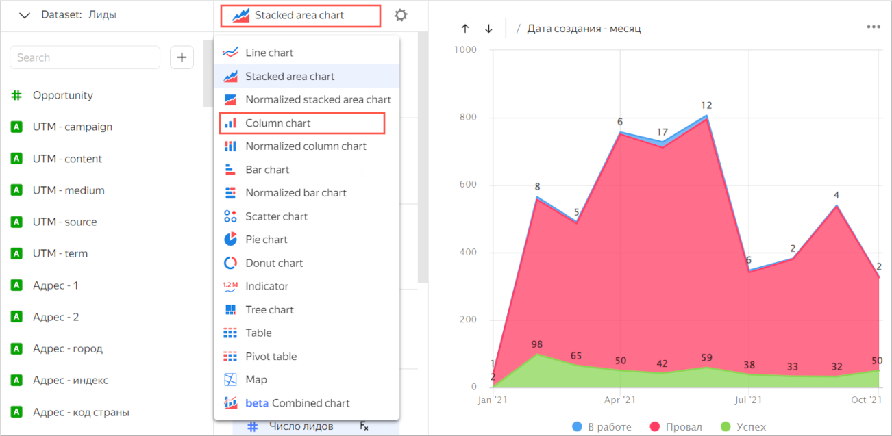

   

1. Drag the **Source** field to the **Colors** section.

   

   The chart shows the number of generated leads across channels by month.

1. Save the chart as a new object:

   1. Click  in the top-right corner and select **Save as**.

      

      To replace the source chart with the edited one on the dashboard, click **Save** in the top-right corner.

      

   1. Enter `Number of leads by channel` as the new chart name and click **Save**.

1. Add the chart to the dashboard:

   1. Return to the tab with the dashboard and click **Edit** at the top of the page.
   1. Click **Add** and select **Chart**.
   1. In the **Chart** field, click **Select**.
   1. Select the **Number of leads by channel** chart. This will automatically fill in the **Name** field.
   1. Click **Add**. The widget will be displayed on the dashboard.
   1. Set up the size and position of widgets on the dashboard.
   1. Click **Save** to save your changes to the dashboard.

   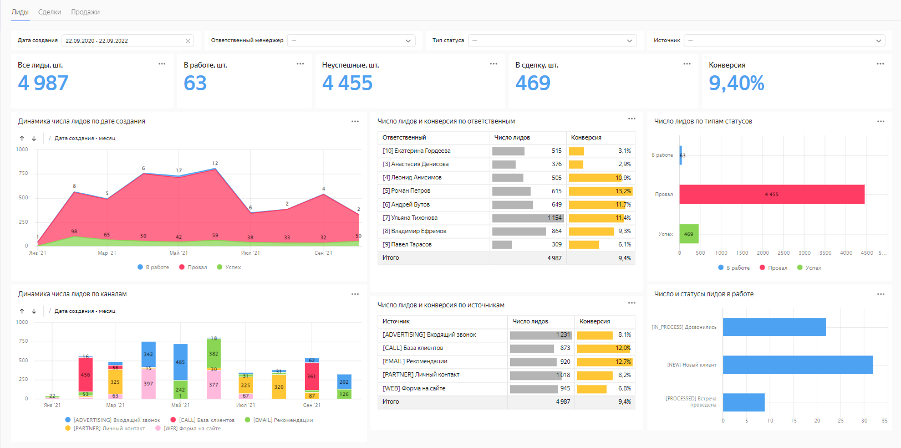

## Step 3. Review the connection and dataset. Create your dataset and chart {#create-dataset-and-chart}

1. Review the contents of the **Bitrix24** folder. To do this, go back to the Bitrix24 folder: click  and select **Bitrix24** in the navigation panel.

   Apart from the dashboard, the folder contains two nested folders with:

   * : Charts that visualize information as charts and tables.
   * : Dataset that describes a data model used to generate reports by lead.

1. Go to the **Leads** folder and open the **Leads** dataset.

   The **Fields** tab displays a list of fields from the table selected in the source. Pay attention to the following columns:

   * **Name**: Field name.
   * **Type**: Field [data type](../../datalens/concepts/data-types.md).
   * **Field source**: Field in the source table or a formula for [calculations](../../datalens/concepts/calculations/index.md) (marked with the  icon).
   * **Aggregation**: [Data aggregation function](../../datalens/concepts/dataset/data-model.md#aggregation) if it is applied to the field.
    

   

   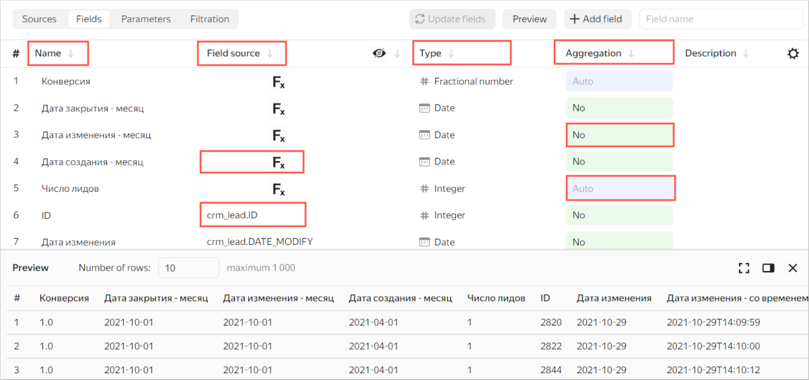

   

   The **Source** tab shows the following:

   * Connection the dataset is based on.
   * List of tables available in the source.
   * Workspace for the tables selected as the source of dataset fields.

      

      Please note: You cannot [join](../../datalens/concepts/data-join.md) tables for the **Bitrix24** connection type.

      

   * Preview area for information from the selected tables.
    

   

   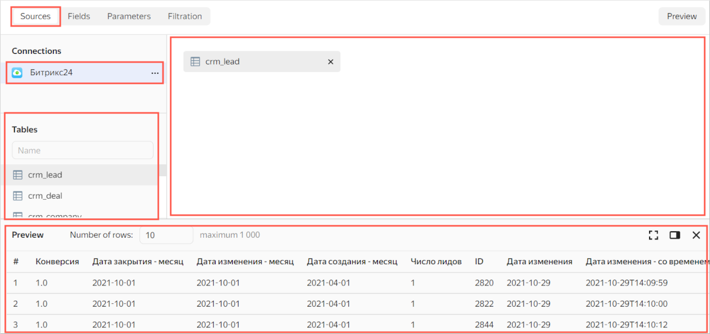

   

1. Go to the **Deal** folder and open the **Deal** dataset. Review the contents of the **Fields** and **Sources** tabs.

### Create your dataset {#create-dataset}

To use the [Bitrix24](#create-connection-bitrix24) connection data, you can create a custom dataset based on it.

1. Select **Datasets** in the navigation panel on the left.
1. Click **Create dataset** at the top right.
1. Go to the **Sources** tab.
1. Under **Connections**, click **Add** and select the previously created Bitrix24 connection.
1. Drag the **crm_activity** table to the workspace. Wait for the data to load.

   

   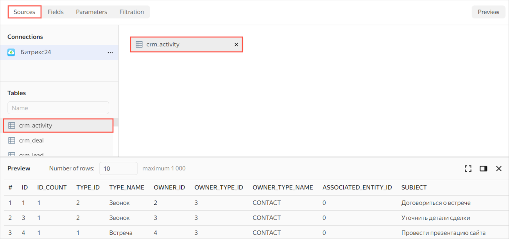

   

   

   You cannot join tables for the **Bitrix24** connection type.

   

1. Go to the **Fields** tab.
1. Create a record count field named `ID_COUNT`:

   1. Duplicate the `ID` field: hover over the row with the field, click  at the end of the row, and select **Duplicate**.

      

      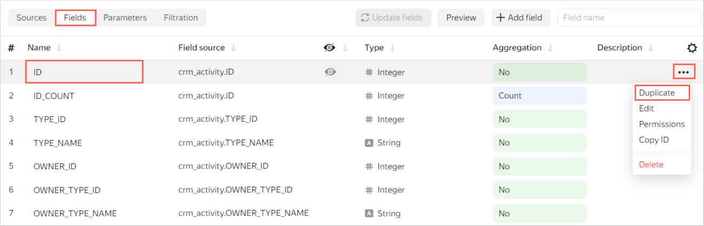

      

   1. Rename the `ID (1)` duplicate field to `ID_COUNT`: click the row name, delete the current name, and enter the new one.
   1. In the **Aggregation** column, select **Count** for the `ID_COUNT` field. As a result, the field will become a [measure](../../datalens/concepts/chart/measure-values.md) and change its color to blue.

   

   You can add and rename fields, create [calculated fields](../../datalens/concepts/calculations/index.md), and add descriptions to them.

   

1. In the top-right corner, click **Save**.
1. Enter `Activity` as the dataset name and click **Create**.

### Create a new chart {#create-chart}

To visualize interaction by type, create a column chart.

1. When the dataset is saved, click **Create chart** in the top-right corner.
1. For the [visualization type](../../datalens/visualization-ref/index.md), choose **Column chart**.
1. Add the types of customer contacts on the chart. To do this, drag the `TYPE_NAME` field from **Dimensions** to the **X** section.
1. Add the number of interactions of each type to the chart. To do this, drag the `ID_COUNT` field from **Measures** to the **Y** section.

   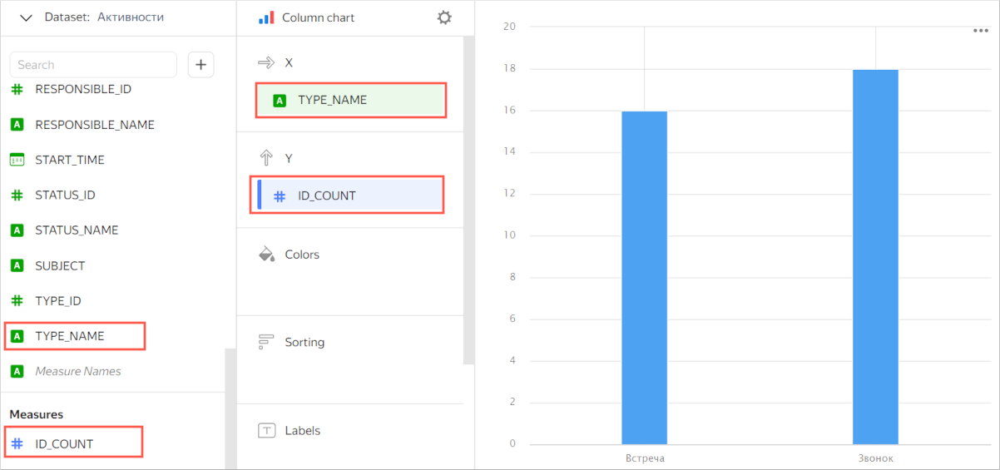

1. Save the chart:

   1. Click  in the top-right corner and select **Save**.
   1. Enter `Number of interactions by type` as the new chart's name and click **Save**.

### Add a chart to your dashboard {#add-chart-on-dashboard}

Add the chart to your dashboard:

1. In the **Bitrix24** folder, open the **Bitrix24 dashboard** or [create a new one](../../datalens/operations/dashboard/create.md).
1. At the top of the page, click **Edit**.
1. Click **Add** and select **Chart**.
1. Choose the **Number of interactions by type** chart. This will automatically fill in the **Name** field.
1. Click **Add**. The widget will be displayed on the dashboard.
1. Set up the size and position of widgets on the dashboard.
1. Click **Save** to save your changes to the dashboard.
