# Bitrix24: direct connection



In this tutorial, you will create a connection to a demo Bitrix24 data source and explore the dashboard and charts built by Bitrix24 with {{ datalens-short-name }}. You will also learn to work with [datasets](../../datalens/dataset/index.md), [charts](../../datalens/concepts/chart/index.md), and [dashboards](../../datalens/concepts/dashboard.md).

To visualize and explore data, [set up {{ datalens-short-name }}](#before-you-begin) and follow the steps below:

1. [Create a workbook](#create-workbook).
1. [Create a connection to Bitrix24](#create-connection-bitrix24).
1. [Review the dashboard and charts](#view-dashboard-bitrix24).
1. [Review the dataset. Create your dataset and chart](#create-dataset-and-chart).

## Getting started {#before-you-begin}



## Create a workbook {#create-workbook}

1. Go to the {{ datalens-short-name }} [home page]({{ link-datalens-main }}).
1. In the left-hand panel, select  **Collections and workbooks**.
1. In the top-right corner, click **Create** → **Create workbook**.
1. Enter a name for the [workbook](../../datalens/workbooks-collections/index.md), `Bitrix24`.
1. Click **Create**.

## Create a connection to Bitrix24 {#create-connection-bitrix24}

1. In the top-right corner of the workbook, click **Create** →  **Connection**.
1. Under **Partner connections**, select the **Bitrix24** connection.
1. To connect to a demo data source, specify:

   * **Portal**: `gds.office.bitrix.ru`.
   * **Token**: `wJZIFjdYtbLRtfewYcnq71oSFyEgxlbQ`.

   When connecting to a working [Bitrix24](../../datalens/operations/connection/create-bitrix24.md) data source, specify:

   * **Portal**: URL of your Bitrix24 portal in `test.bitrix24.ru` format.
   * **Token**: Get a secret key in Bitrix24 by selecting **CRM** → **Analytics** → **BI analytics** in the **Yandex DataLens** tab. For more information, see [this guide](https://helpdesk.bitrix24.ru/open/17402692).

   Leave the **Automatically create a dashboard, charts, and a dataset on the connection** option enabled.

1. Check the connection and click **Create connection**.

   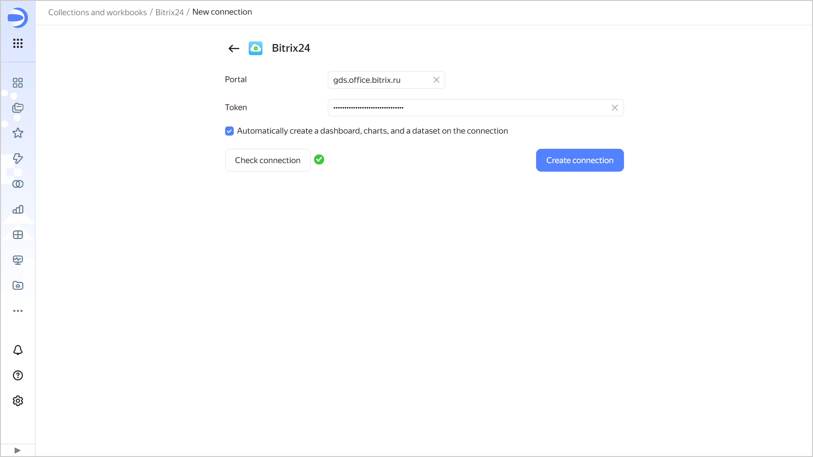

1. Enter a name for the connection, e.g., `Bitrix24`, and click **Create**.

   Once the connection is created, a workbook named `Bitrix24` will open with the demo `Bitrix24 dashboard`, `Leads` and `Deals` datasets, and charts inside.

## Review the dashboard {#view-dashboard-bitrix24}

Open the `Bitrix24 dashboard`. The dashboard is interactive. You can:

* Set up a variety of filters.
* Sort rows in tables.
* Switch between charts.
* Drill down into charts.

Set the filter by creation date, `20.09.2020 - 20.09.2022`, to display the statistics for the selected period.

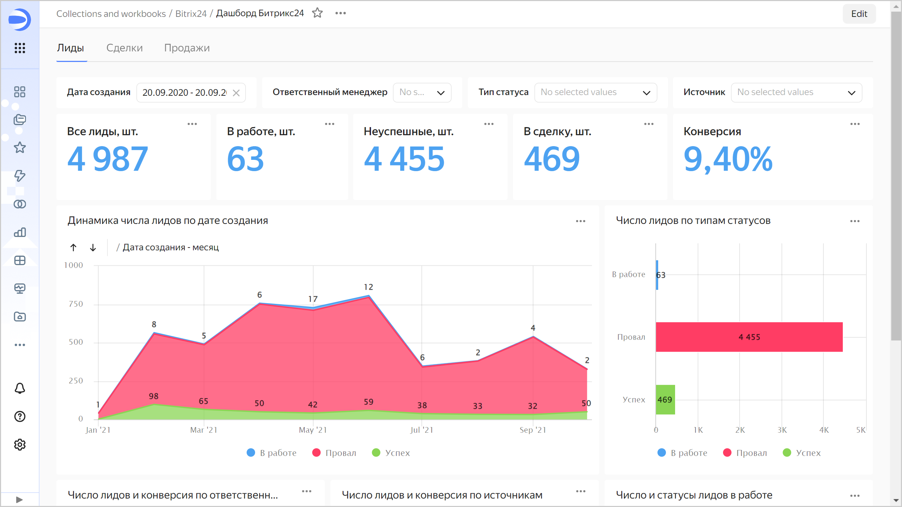

You can customize the standard dashboard by deleting, moving, or editing charts. In the `Leads` tab, change the `Dynamics in the number of leads by creation date` chart and add it to the dashboard:

1. Click  in the top-right corner of the chart and select  **Edit**.

   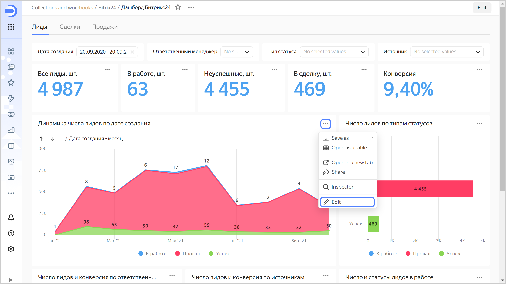

1. Select **Column chart** as the chart type.

   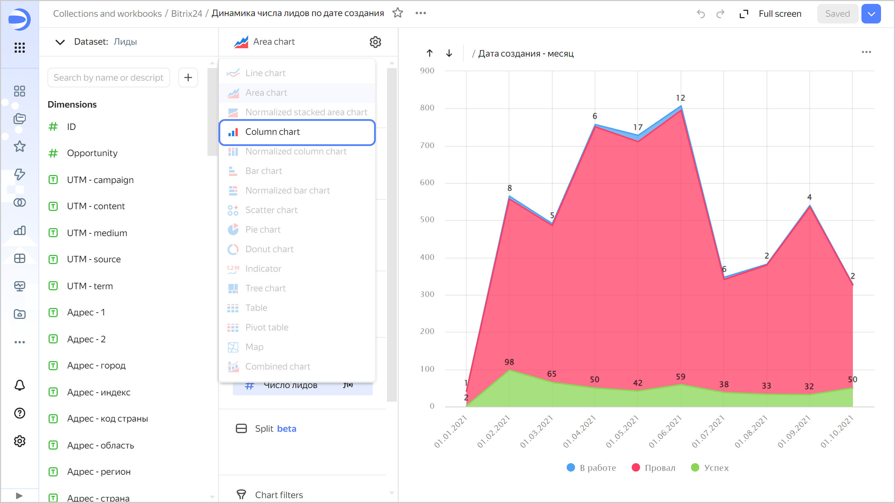

1. Under **Colors**, replace status types with the source. To do this, drag the `Source` field from **Dimensions** to the **Colors** section and hold it over the `Status type` field until the latter turns red.

   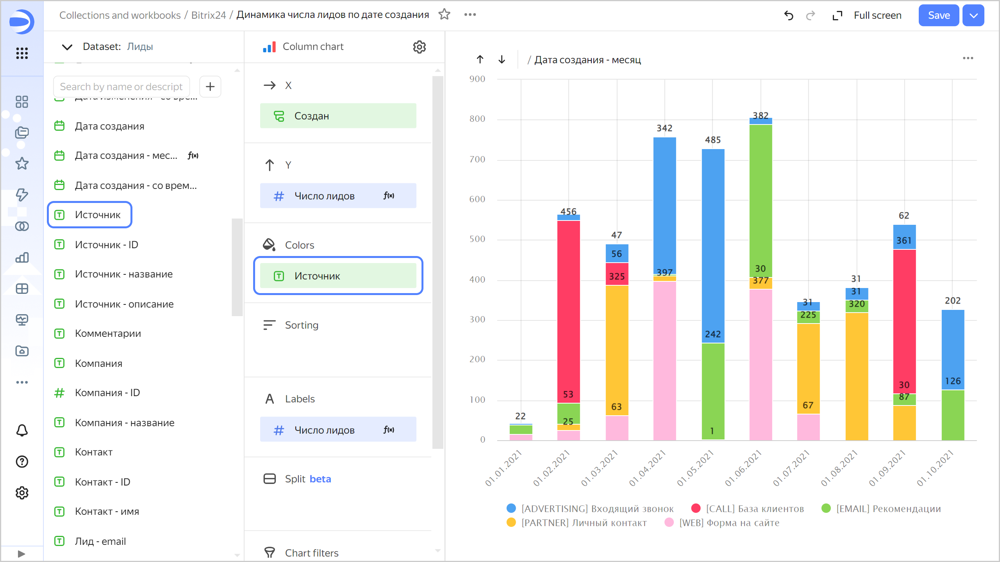

   The chart shows the number of generated leads across channels by month.

1. Save the chart as a new object:

   1. Click  in the top-right corner and select **Save as copy**.

      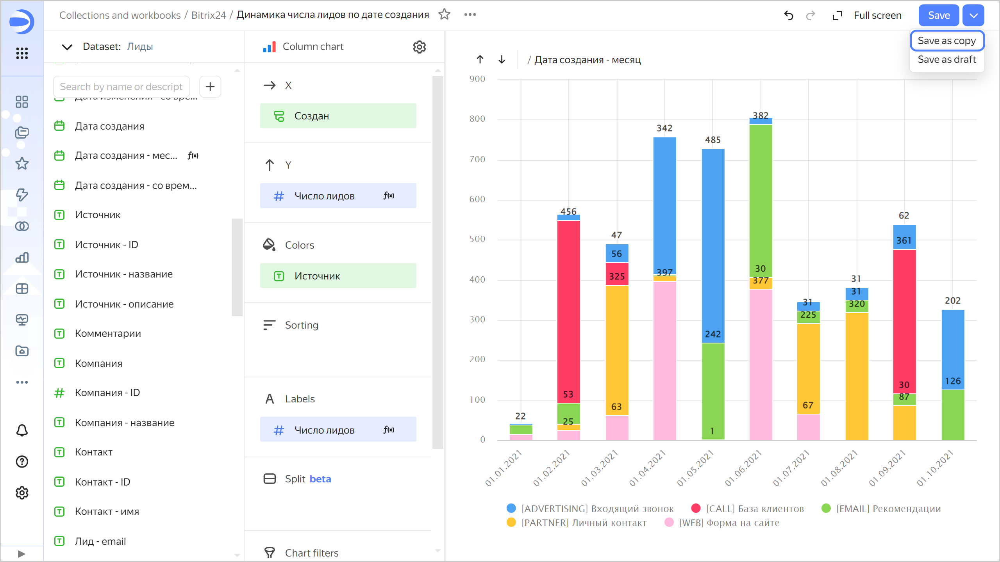

      

      To replace the source chart with the edited one on the dashboard, click **Save** in the top-right corner.

      

   1. Enter `Number of leads by channel` as the new chart name and click **Save**.

1. Add the chart to the dashboard:

   1. Return to the tab with the dashboard and click **Edit** at the top of the page.
   1. In the panel at the bottom of the page, hold down  **Chart** and drag it to the required area.
   
      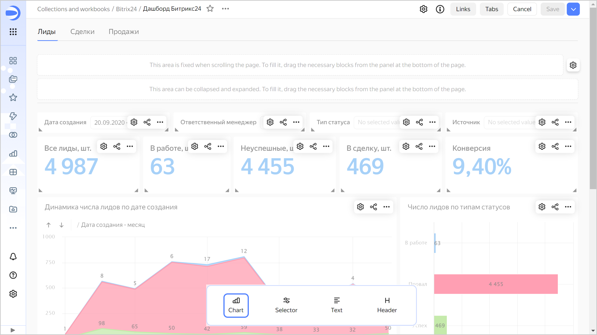
   
   1. In the window that opens, click **Select**.
   1. Select the `Number of leads by channel` chart. This will automatically fill in the **Name** field.
   1. Click **Add**. The widget will be displayed on the dashboard.
   1. Adjust the size of the widgets with your mouse and place them on the dashboard as you prefer.
   1. In the top-right corner of the dashboard, click **Save** to save your dashboard.

   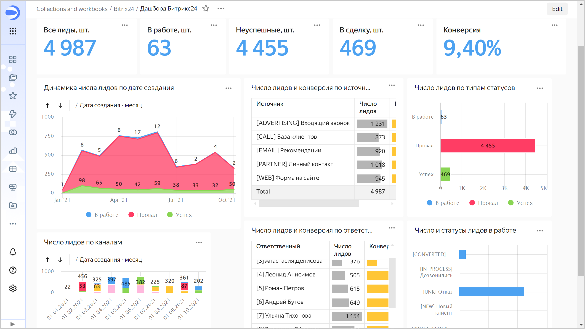

## Review the connection and dataset. Create your dataset and chart {#create-dataset-and-chart}

1. Go to the `Bitrix24` workbook by clicking its name in the dashboard path. 

   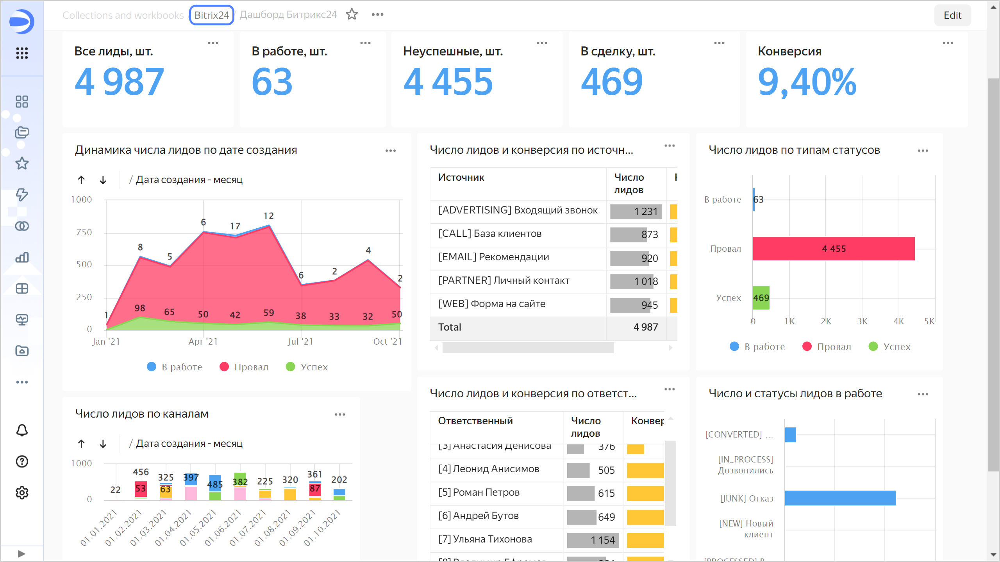

1. Open the `Leads` dataset.

   The **Fields** tab displays a list of fields from the table selected in the source. Pay attention to the following columns:

   * **Name**: Field name.
   * **Type**: Field [data type](../../datalens/dataset/data-types.md).
   * **Field source**: Field in the source table or a formula for [calculations](../../datalens/concepts/calculations/index.md) (marked with the  icon).
   * **Aggregation**: [Data aggregation function](../../datalens/dataset/data-model.md#aggregation) if it is applied to the field.
    

   

   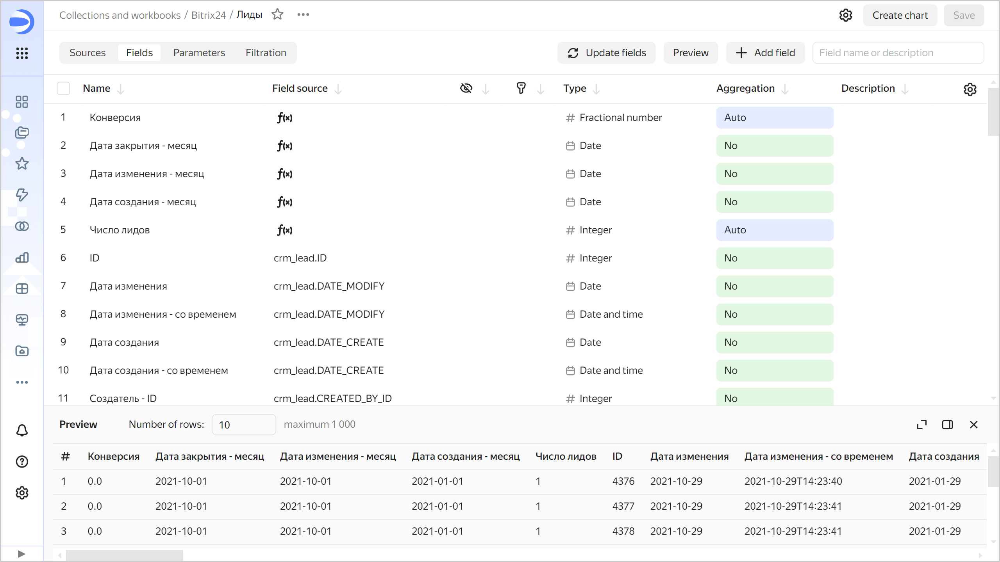

   

   The **Source** tab shows the following:

   * Connection the dataset is based on.
   * List of tables available in the source.
   * Workspace for the tables selected as the source of dataset fields.
   * Preview area for information from the selected tables.
    

   

   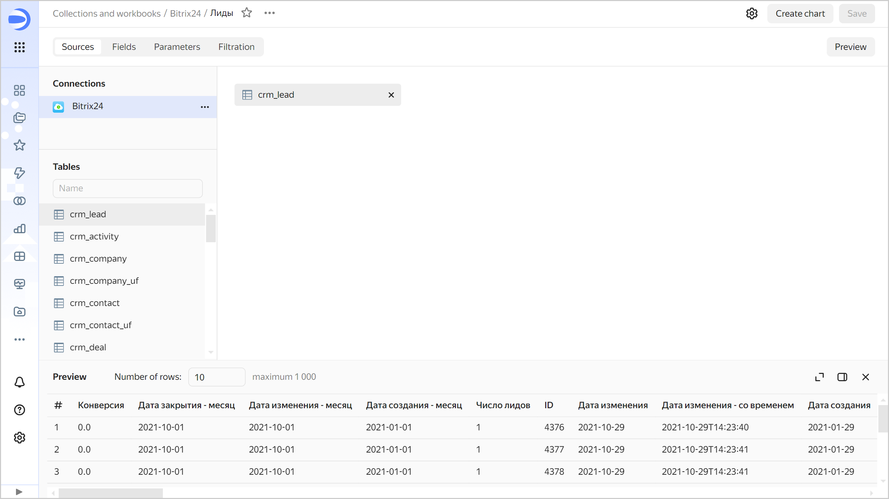

   

1. Go to the `Bitrix24` workbook and open the `Deal` dataset. Review the contents of the **Fields** and **Sources** tabs.

### Create your dataset {#create-dataset}

To use the `Bitrix24` connection data, you can create a custom dataset based on it:

1. In the left-hand panel, select  **Collections and workbooks** and go to the `Bitrix24` workbook.
1. In the top-right corner, click **Create** →  **Create dataset**.
1. Go to the **Sources** tab.
1. Under **Connections**, click ** Add** and select the previously created Bitrix24 connection.
1. Drag the `crm_activity` table to the workspace. Wait for the data to load.

   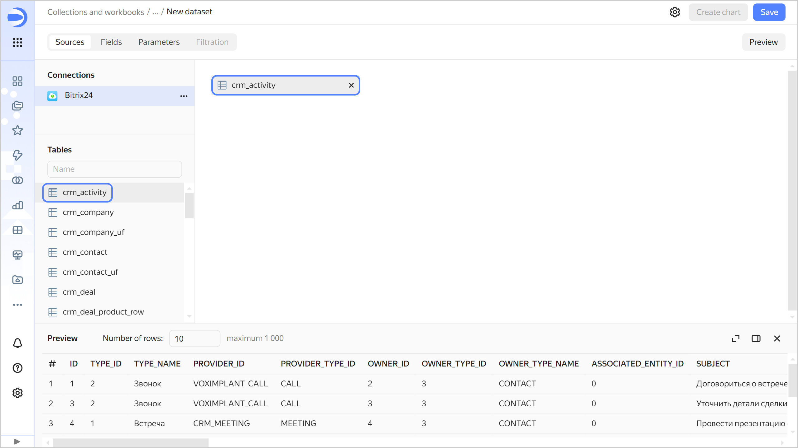

1. Navigate to the **Fields** tab.
1. Create a record count field named `ID_COUNT`:

   1. Duplicate the `ID` field: on the right side of the row with the field, click  and select **Duplicate**.

      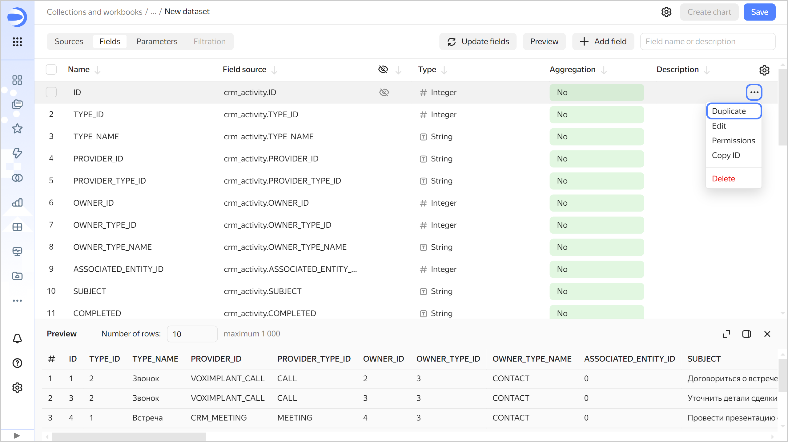

   1. Rename the `ID (1)` duplicate field to `ID_COUNT`: click the row name, delete the current name, and enter the new one.
   1. In the **Aggregation** column, select **Count** for the `ID_COUNT` field. As a result, the field will become a [measure](../../datalens/concepts/chart/measure-values.md) and change its color to blue.

   

   You can add and rename fields, create [calculated fields](../../datalens/concepts/calculations/index.md), and add descriptions to them.

   

1. Save the dataset:

   1. In the top-right corner, click **Save**.
   1. Enter `Activities` for the dataset name and click **Create**.

### Create a new chart {#create-chart}

To visualize interaction by type, create a column chart.

1. Click **Create chart** in the top-right corner of the dataset page.
1. Add the types of customer contacts on the chart. To do this, drag the `TYPE_NAME` field from **Dimensions** to the **X** section.
1. Add the number of interactions of each type to the chart. To do this, drag the `ID_COUNT` field from **Measures** to the **Y** section.

   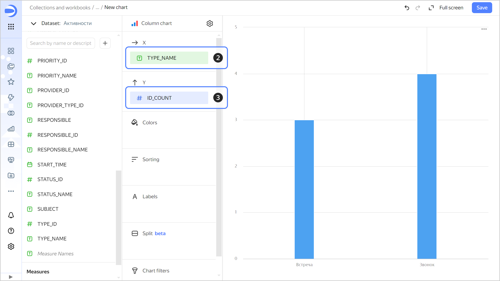

1. Save the chart:

   1. Click  in the top-right corner and select **Save**.
   1. Enter `Number of interactions by type` as the new chart's name and click **Save**.

### Add a chart to your dashboard {#add-chart-on-dashboard}

Add the chart to your dashboard:

1. Go to the `Bitrix24` workbook and open `Bitrix24 dashboard` or [create a dashboard](../../datalens/operations/dashboard/create.md).
1. At the top of the page, click **Edit**.
1. Click **Add** and select **Chart**.
1. Choose the `Number of interactions by type` chart.
1. Click **Add**. The widget will be displayed on the dashboard.
1. Adjust the size of the widgets with your mouse and place them on the dashboard as you prefer.
1. Click **Save** to save your changes to the dashboard.
