# Source parameterization in {{ datalens-short-name }}





In this tutorial, you will create a connection to a data source and learn how to use dataset source parameterization in {{ datalens-short-name }}.

Parameterization will enable you to:

* Substitute a table in queries.
* Provide a parameter to the dataset's SQL as part of a query.

We will use a Moscow retail chain's demo sales {{ CH }} database as our data source.

To visualize and explore data, [set up {{ datalens-short-name }}](#before-you-begin) and follow the steps below:

1. [Create a workbook](#create-workbook).
1. [Create a connection](#create-connection).
1. [Create a dataset with a table substitution parameter](#create-dataset-table-parameter).
1. [Create a chart with a table selection parameter](#create-chart-with-parameter).
1. [Create a dataset with a subquery parameter](#create-dataset-sql-parameter).
1. [Create a chart with a parameter for selecting a subquery condition](#create-chart-with-sql-parameter).


## Getting started {#before-you-begin}



## Create a workbook {#create-workbook}

1. Go to the {{ datalens-short-name }} [home page]({{ link-datalens-main }}).
1. In the left-hand panel, select  **Collections and workbooks**.
1. In the top-right corner, click **Create** → **Create workbook**.
1. Enter a name for the [workbook](../../datalens/workbooks-collections/index.md): `Dataset parametrisation`.
1. Click **Create**.


## Create a connection {#create-connection}

A connection named **Sample ClickHouse** will be created for database access.



## Create a dataset with a table substitution parameter {#create-dataset-table-parameter}

Create a [dataset](../../datalens/dataset/index.md) based on the `Sample ClickHouse` connection:

1. In the top-right corner of the connection page, click **Create dataset**.
1. Drag the `samples.MS_SalesFacts` table to the workspace.
1. Enable [parameterization](../../datalens/dataset/parametrization.md) in the dataset settings. To do this, click  at the top and select **Enable parameterization**.

   

1. Save the dataset:

   1. In the top-right corner, click **Save**.
   1. Enter `Dataset with parametrisation` for the dataset name and click **Create**.

1. Add a parameter with the table name:

   1. Go to the **Parameters** tab.
   1. Click **Add** and configure as follows:
      
      * **Name**: `table_name`.
      * **Type**: `String`.
      * **Default value**: `MS_SalesFacts`.
      * Enable **Allow use in source settings** and keep the default validation.

      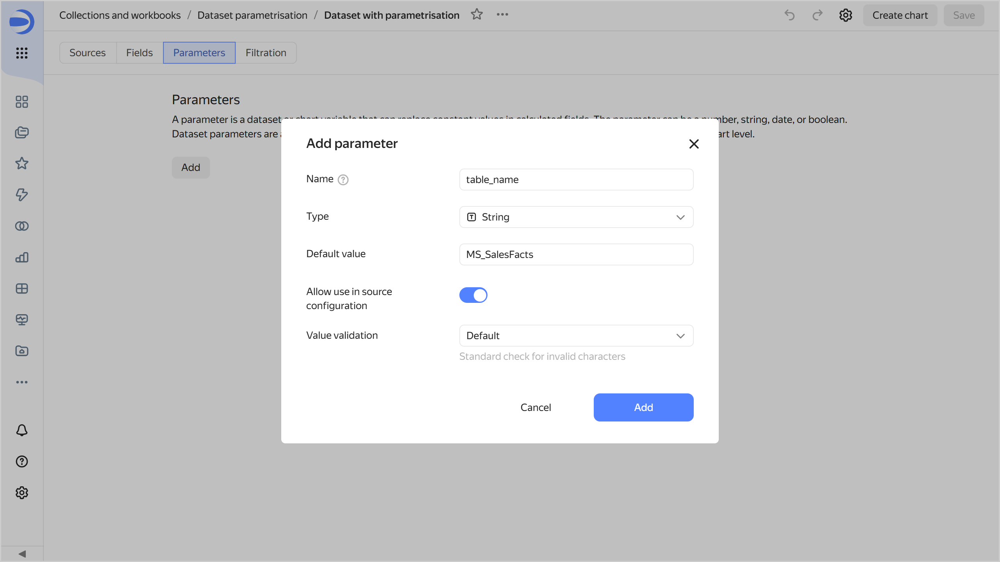

      When you click **Add**, the system will show an error saying that the dataset validation failed. By default, the value of a parameter allowed for use in the source cannot contain `_`.

      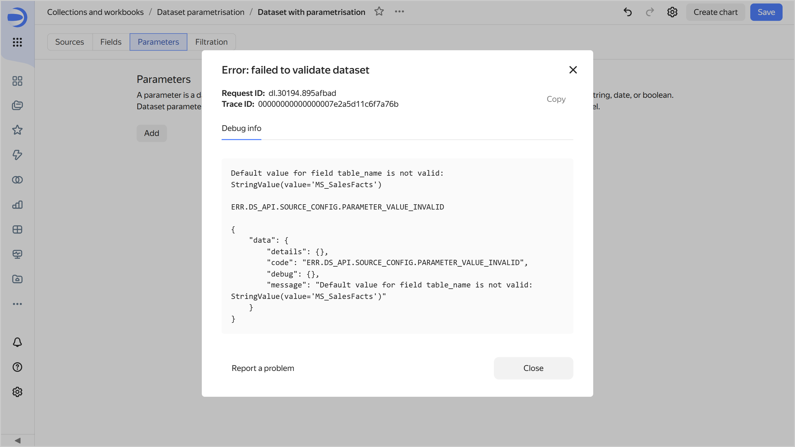

1. Adjust the dataset validation settings to allow the `MS_SalesFacts` value in the parameter. Proceed as follows:
   
   1. Click **Add** and specify **Name**, **Type**, and **Default value** as in the previous step.
   1. Enable **Allow use in source settings** and select `Regular expression` for the value validation.
   1. In the field, enter this Python regular expression to enable using uppercase and lowercase letters, digits, and underscores:
   
      ```python
      ^[a-zA-Z0-9_]+$
      ```

   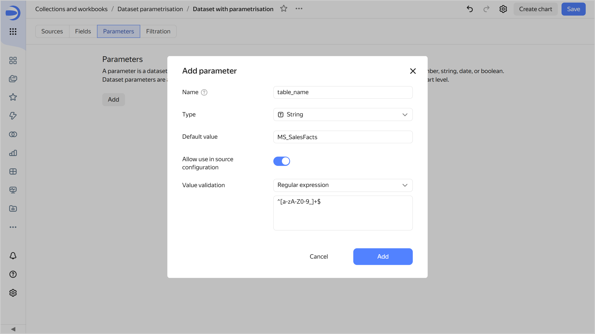

   The `MS_SalesFacts` table name matches this regular expression. When you click **Add**, the dataset validation will succeed.

1. Save the dataset.
1. Change the settings to define the table name with a parameter:

   1. Go to the **Sources** tab.
   1. In the table list next to **MS_SalesFacts** go  → **Change settings**.
   1. To the right of the **Table name** field set to `MS_SalesFacts`, click  and select the `table_name` parameter. The selected parameter will now define the table name.
   
      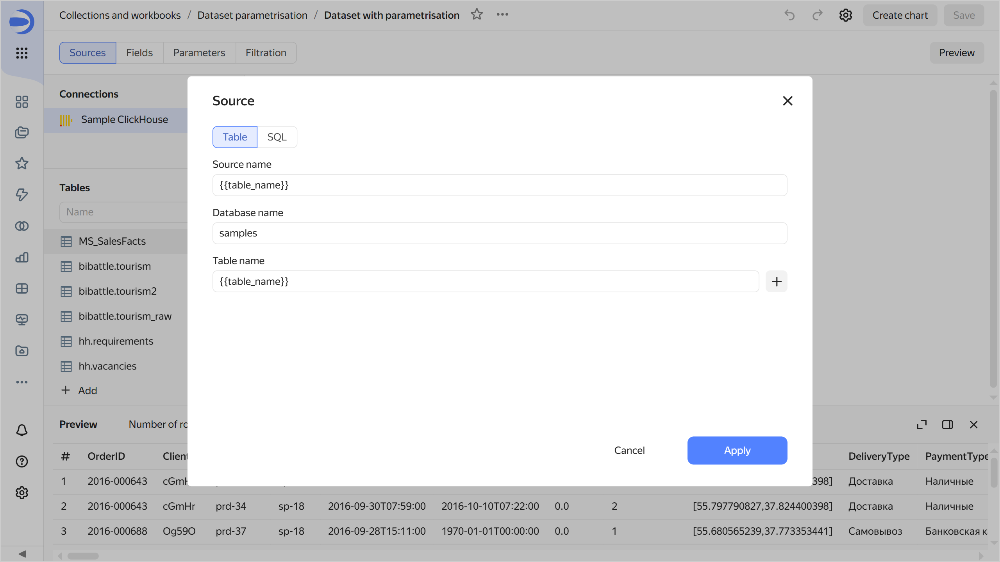

   1. Click **Apply** and save the dataset.

## Create a chart with a table selection parameter {#create-chart-with-parameter}

1. At the top of your dataset, click **Create chart**.
1. Select the **Table** visualization type.
1. Create a [calculated field](../../datalens/concepts/calculations/index.md):

   1. On the left side of the screen above the list of dataset fields, click  and select **Field**.
   1. Enter the name: `Year`.
   1. Enter the formula: `YEAR([OrderDatetime])`.
   1. Click **Create**.

1. Add the new field to the chart. To do this, drag the `Year` field from **Dimensions** to the **Columns** section.
1. Add total sales to the chart. To do this, drag the `Sales` field from **Dimensions** to the **Columns** section and change its aggregation settings:

   1. In the **Columns** section, click `#` next to the `Sales` field.
   1. In the **Aggregation** field, select **Sum** and click **Apply**.

   

1. Open the chart inspector and make sure the data comes from the `MS_SalesFacts` table. To do this, click  in the top-right corner of the chart and select **Inspector**.

   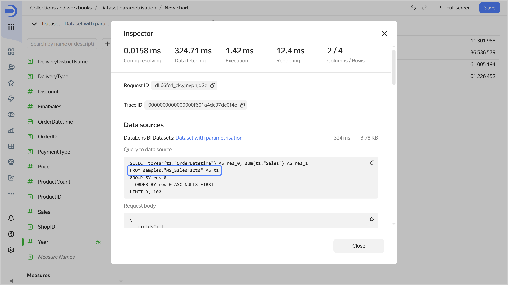

1. Save the chart:

   1. In the top-right corner, click **Save**.
   1. In the window that opens, enter `Table with parametrisation` for chart name and click **Save**.

   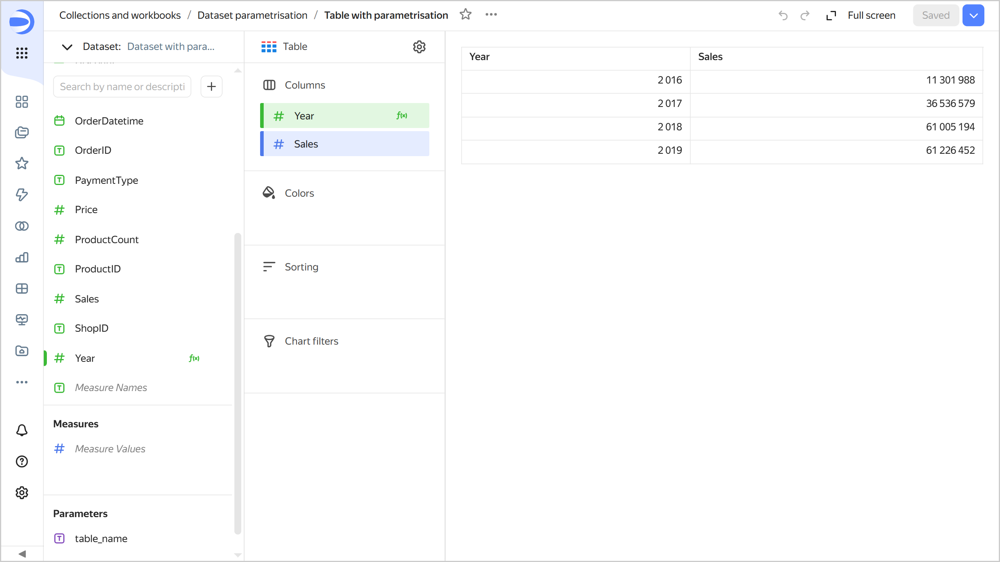

1. Change the table name in the relevant chart parameter:

   1. Under **Parameters**, click the icon next to `table_name`.
   1. Set the default value to `MS_SalesFacts_up`.

      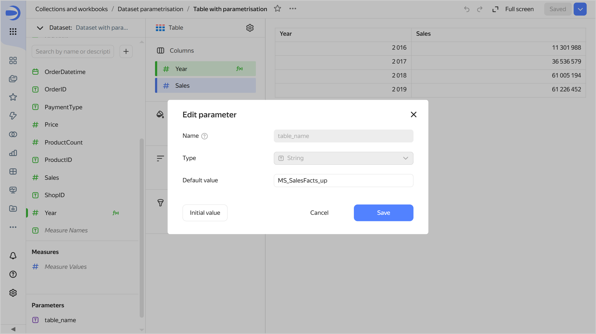

   1. Click **Save**. Now, the chart uses data from the `MS_SalesFacts_up` table.

      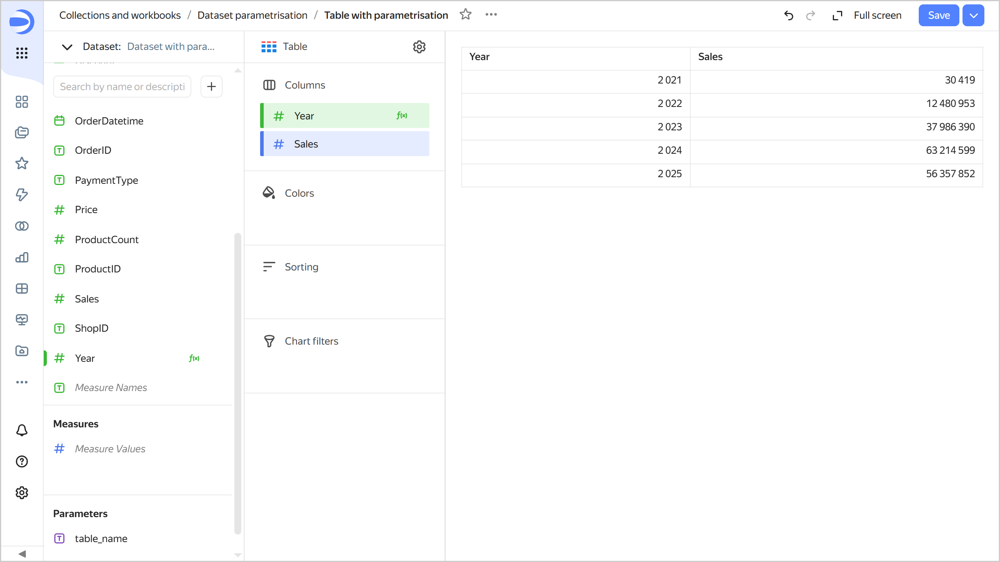

## Create a dataset with a subquery parameter {#create-dataset-sql-parameter}

Create another dataset based on the `Sample ClickHouse` connection:

1. Navigate to the `Sample ClickHouse` connection and click **Create dataset** in the top-right corner.
1. Add an SQL query to the source:

   1. At the bottom left under the table list, click  → **Add**.
   1. Open the **SQL** tab and enter the following query text in the **Subquery** field:
      
      ```sql
      SELECT * FROM samples.MS_SalesFacts
      ```

   1. Click **Apply**.

1. Enable parameterization in the dataset settings. To do this, click  at the top and select **Enable parameterization**.
1. Save the dataset:

   1. In the top-right corner, click **Save**.
   1. Enter `Dataset with parametrisation for sql` for the dataset name and click **Create**.

1. Add a parameter with the subquery condition:

   1. Go to the **Parameters** tab.
   1. Click **Add** and configure as follows:
      
      * **Name**: `custom_where`.
      * **Type**: `String`.
      * **Default value**: `1=1`. This condition will always return `True`.
      * Enable **Allow use in source settings** and select `Regular expression` for the value validation. In the field, enter this Python regular expression to allow characters you may need to use when writing SQL queries:

        ```python
        ^[a-zA-Z0-9а-яАА-ЯёЁ_\s\(\)\.\'\=\-\+\*/\,\<\>!]+$
        ```

      When you click **Add**, the dataset validation will succeed.

1. Save the dataset.

1. Add a condition to the SQL query text using the parameter:

   1. Go to the **Sources** tab.
   1. In the table list, click  next to **SQL** and select **Change settings**.
   1. In the **Subquery** field, add a `WHERE` clause to your query:
   
      ```sql
      SELECT * FROM samples.MS_SalesFacts
      WHERE
      ```

   1. Under the query input field, click  **Insert parameter** and select `custom_where`. The selected parameter will now define the SQL query condition.

      ```sql
      SELECT * FROM samples.MS_SalesFacts
      WHERE not_var{{custom_where}}
      ```

      

1. Save the dataset.

## Create a chart with a parameter for selecting a subquery condition {#create-chart-with-sql-parameter}

1. At the top of your dataset, click **Create chart**.
1. Select the **Indicator** visualization type.
1. Drag the `Sales` field from **Dimensions** to the **Measure** section. This will automatically apply aggregation to this field, making it a measure.

   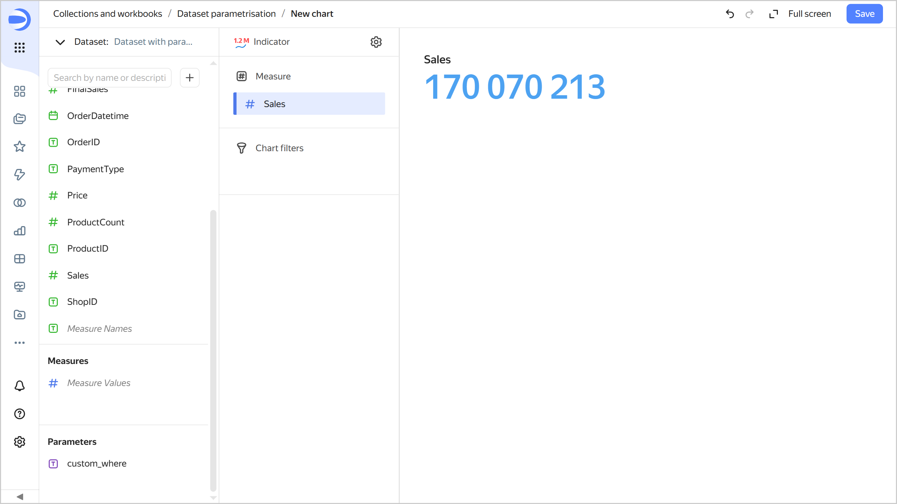

1. Open the chart inspector and make sure the SQL query uses the `1=1` value of the dataset parameter.

   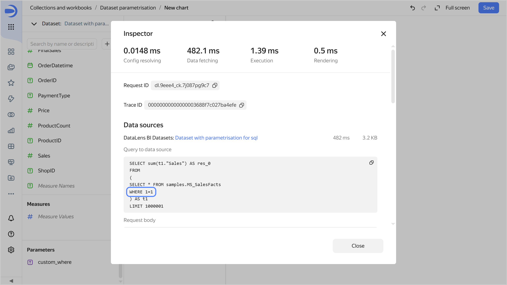

1. Change the SQL query condition in the parameter:

   1. Under **Parameters**, click the icon next to `table_name`.
   1. Set the default value to `ProductID IN (SELECT ProductID FROM samples.MS_Products WHERE ProductCategory='Home appliances')`.
   1. Click **Save**. This will filter the chart data to only show products in the `Home appliances` category.
      
      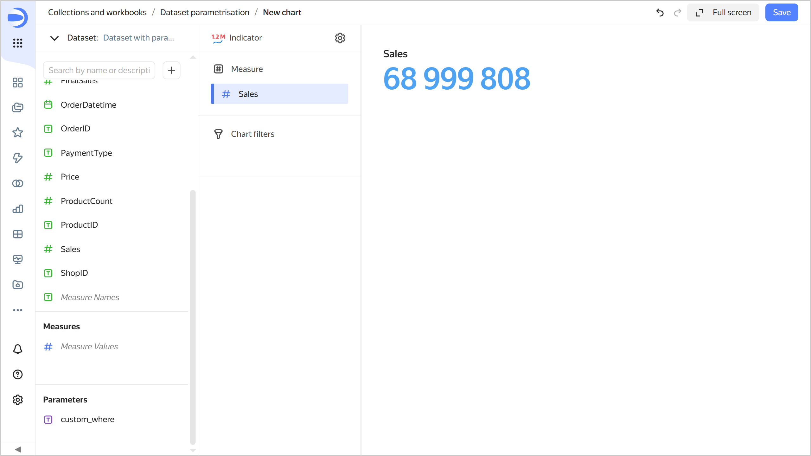

   1. Open the chart inspector and make sure the SQL query now uses the new parameter value.

      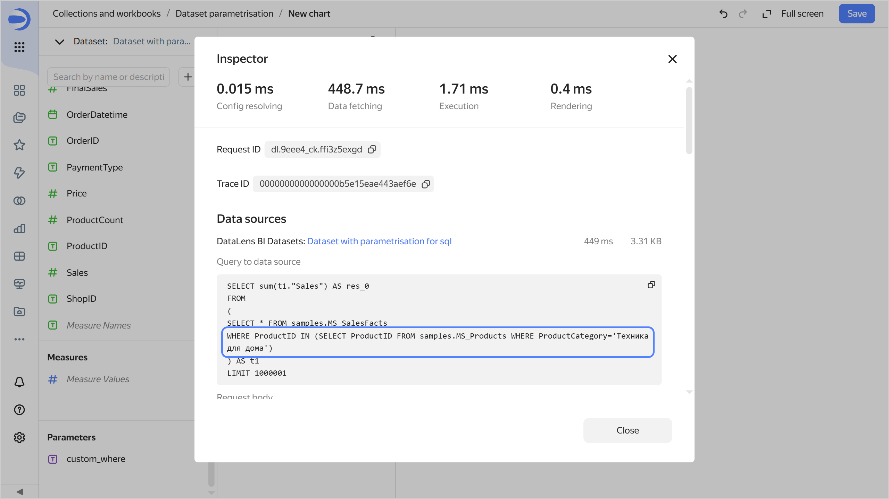

1. Save the chart:

   1. In the top-right corner, click **Save**.
   1. In the window that opens, enter `Chart with parametrisation sql` for chart name and click **Save**.