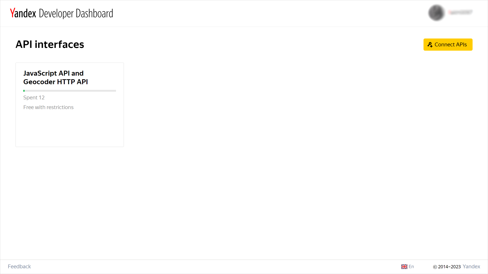
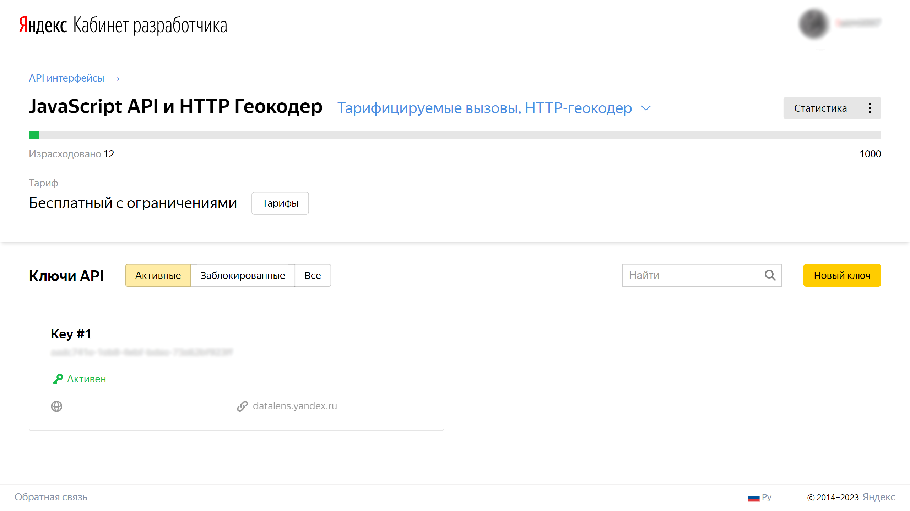
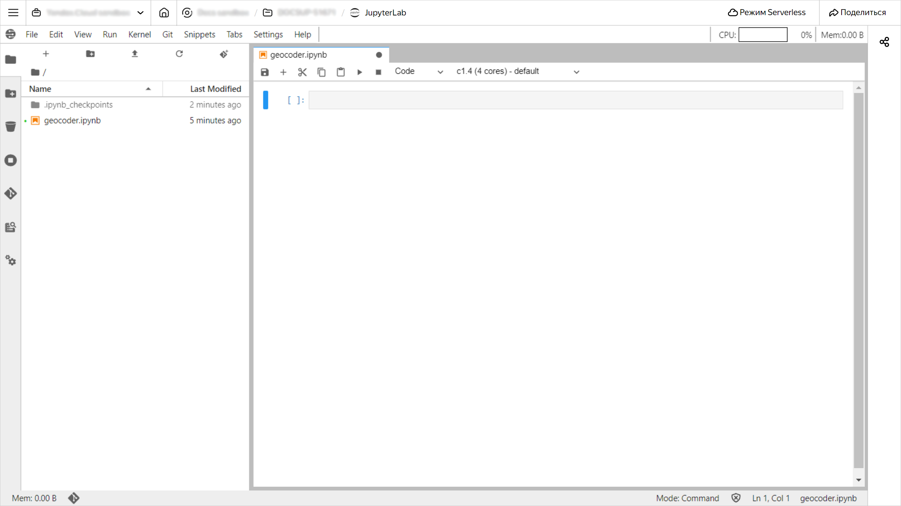
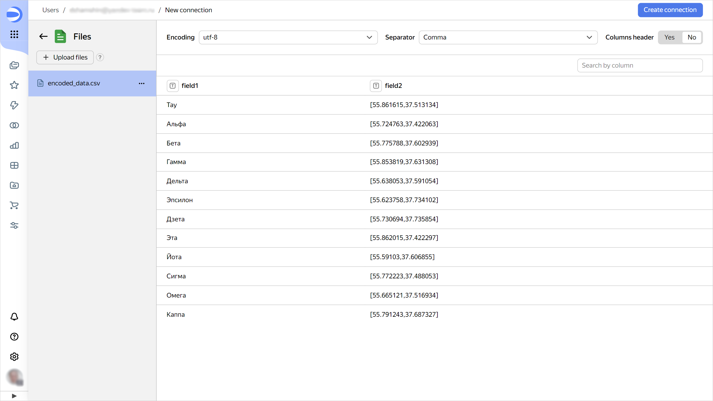
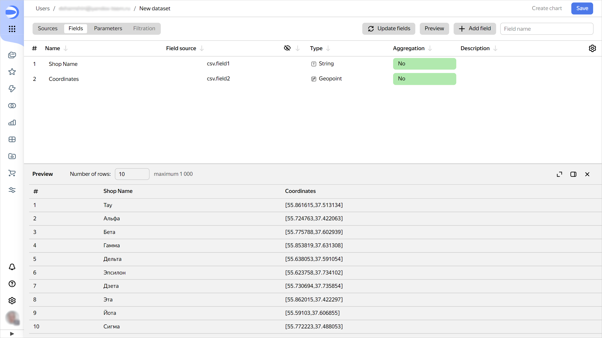
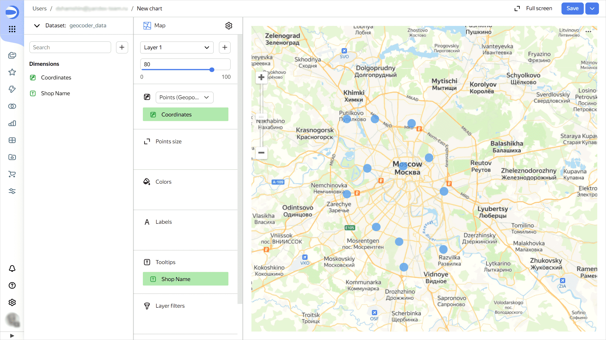

# Geocoding with the Yandex Maps API for data visualization in {{ datalens-short-name }}


In this tutorial, you will learn how to convert addresses to geo-coordinates using the [Geocoder](https://yandex.com/maps-api/products/geocoder-api) API and visualize data in {{ datalens-short-name }}. Data is processed using Python scripts in Jupyter Notebooks in [{{ ml-platform-full-name }}](../../datasphere/).

We will use data from a [{{ CH }} demo database](../../datalens/quickstart.md#create-connection) as the data source.

1. [Prepare your cloud](#before-you-begin).
1. [Get the Geocoder API key](#get-key).
1. [Convert your data to {{ ml-platform-short-name }}](#datasphere).
1. [Create a connection to the file in {{ datalens-short-name }}](#create-connection).
1. [Create a dataset based on the connection](#create-dataset).
1. [Create a chart](#create-chart).

If you no longer need the resources you created, [delete them](#clear-out).

## Getting started {#before-you-begin}





To make sure {{ datalens-full-name }} and {{ ml-platform-full-name }} can run within the {{ yandex-cloud }} network, create their instances in the same organization.



### Required paid resources {#paid-resources}

The infrastructure deployment cost includes a fee for using [{{ ml-platform-name }} computing resources](../../datasphere/pricing.md).

## Get the Geocoder API key {#get-key}

Get a key required to use the Geocoder API:

1. Go to the [Developer Dashboard](https://developer.tech.yandex.com) and click **Connect APIs**.

   

1. In the window that opens, select **JavaScript API and Geocoder HTTP API** and click **Continue**.
1. Fill out the form and click **Continue**.
1. In the window that opens, click **Go to API**.
1. Under **API keys**, copy the value of the key.

   

## Convert your data to {{ ml-platform-short-name }} {#datasphere}

### Create a project {#create-project}



### Create a secret {#create-secret}

Create a [secret](../../datasphere/concepts/secrets.md) to store the [Geocoder API key](#get-key):

1. Under **{{ ui-key.yc-ui-datasphere.project-page.project-resources }}** on the project page, click **{{ ui-key.yc-ui-datasphere.resources.secret }}**.
1. Click **{{ ui-key.yc-ui-datasphere.common.create }}**.
1. In the **{{ ui-key.yc-ui-datasphere.secret.name }}** field, enter the secret name: `API_KEY`.
1. In the **{{ ui-key.yc-ui-datasphere.secret.content }}** field, enter the key value.
1. Click **{{ ui-key.yc-ui-datasphere.common.create }}**. This will display the created secret's info page.

### Create a notebook {#create-notebook}

1. 
1. Click **{{ ui-key.yc-ui-datasphere.project-page.project-card.go-to-jupyter }}** and wait for the loading to complete.
1. In the top panel of the project window, click **File** and select **New** → **Notebook**.
1. Select **{{ ml-platform-name }} Kernel** and click **Select**.

   

### Install dependencies {#dependencies}

1. Paste the code given below into the notebook cell and click :

   ```py
   %pip install requests
   %pip install clickhouse-driver
   ```

1. Restart the kernel by clicking **Kernel** → **Restart Kernel** in the top panel of the project window.

### Upload and convert your data {#load-and-transform}

1. Create a class to work with the Geocoder API:

   ```py
   import requests
   from dataclasses import dataclass

   @dataclass
   class YandexGeocoder:
       api_key: str
       geocoder_url: str = 'https://geocode-maps.yandex.ru/1.x'

       def adress_to_geopoint(self, address: str) -> str:

           # Address conversion to DataLens format geo-coordinates

           response = requests.get(self.geocoder_url, params={
               'apikey': self.api_key,
               'geocode': address,
               'format': 'json',
           })
           response.raise_for_status()

           result = response.json()['response']['GeoObjectCollection']['featureMember']
           if not result:
               return None

           lat, lon = result[0]['GeoObject']['Point']['pos'].split(' ')
           return self._to_datalens_format(lon, lat)

       def _to_datalens_format(self, lon, lat):
           return f'[{lon},{lat}]'
    ```

1. Connect to the {{ CH }} demo DB:

   ```py
   from clickhouse_driver import Client as CHClient
   ​
   ch_client = CHClient(
       'rc1a-ckg8nrosr2lim5iz.mdb.yandexcloud.net',
       user='samples_ro',
       password='MsgfcjEhJk',
       database='samples',
       port=9440,
       secure=True,
   )
   ```

1. Export data from the table with shop addresses to the `ch_data` variable:

   ```py
   ch_data = ch_client.execute('SELECT ShopName, ShopAddress FROM MS_Shops')
   ch_data
   ```

1. Convert the addresses from the `ShopAddress` column to geo-coordinates:

   ```py
   import os

   geocoder = YandexGeocoder(api_key=os.environ['API_KEY'])

   encoded_data = [
       (name, geocoder.adress_to_geopoint(adress))
       for name, adress in ch_data
   ]
   encoded_data
   ```

1. Save the resulting data to a file:

   ```py
   import csv
   import sys

   csv_writer = csv.writer(
       sys.stdout,
       delimiter=',',
       quotechar='"',
       quoting=csv.QUOTE_MINIMAL,
   )

   filename = 'encoded_data.csv'

   with open(filename, 'w') as f:
       csv_writer = csv.writer(
           f,
           delimiter=',',
           quotechar='"',
       )
       csv_writer.writerows(encoded_data)
   ```

   You will see the `encoded_data.csv` file in the left-hand panel.

   

1. Download the file: right-click it and select `Download`.

## Create a connection to the file in {{ datalens-short-name }} {#create-connection}

1. Go to the {{ datalens-short-name }} [home page]({{ link-datalens-main }}).
1. In the left-hand panel, select  **Connections** and click **Create connection**.
1. Under **Files and services**, select the **Files** connection.
1. Click **Upload files** and select the `encoded_data.csv` file.

   

1. In the top-right corner, click **Create connection**.
1. Enter `geocoder_csv` as the connection name and click **Create**.

## Create a dataset based on the connection {#create-dataset}

1. In the top-right corner, click **Create dataset**.
1. Go to the **Fields** tab.
1. Rename the fields as follows:

   * `field1` to `Shop name`
   * `field2` to `Coordinates`

1. For the `Coordinates` field, change the data type to **Geopoint**.

   

1. In the top-right corner, click **Save**.
1. Enter `geocoder_data` as the dataset name and click **Create**.

## Create a chart {#create-chart}

1. In the top-right corner, click **Create chart**.
1. Select the **Map** visualization type.
1. Drag the `Coordinates` field to the **Points (Geopoints)** section.
1. Drag the `Shop name` field to the **Tooltips** section.

   

1. In the top-right corner, click **Save**.
1. Enter the chart name and click **Save**.

## How to delete the resources you created {#clear-out}

If you no longer plan to use the project in {{ ml-platform-short-name }}, [delete it](../../datasphere/operations/projects/delete.md#delete-project).
