# Analyzing sales and locations of pizzerias based on data from Clickhouse DB and Marketplace

We'll use a ClickHouse database connection and the **Companies: supply and demand** product from the Marketplace as a source.

In this use case, you'll prepare a dashboard for selecting locations to open new Dodo pizzerias.

With {{ datalens-short-name }}, you'll analyze locations based on real data:

- Revenue from current Dodo pizzerias.
- Search queries to pizzerias by location (Yandex data).
- The number of all pizzerias by location (Yandex data).

This scenario is also available as a [recording](https://www.youtube.com/watch?v=cw6PotbQYng) from the {{ yandex-cloud }} YouTube channel.

To visualize and explore data, [set up {{ datalens-short-name }}](#before-you-begin), then follow the steps below:

1. [Import geolayers from the Marketplace](#step1).
1. [Create a connection](#step2).
1. [Configure the dataset fields](#step3).
1. [Create a column chart](#step4).
1. [Create a bar chart](#step5).
1. [Create an indicator chart](#step6).
1. [Create a map chart](#step7).
1. [Create a dashboard](#step8).
1. [Add geolayers to the dashboard](#step9).

## Before you start {#before-you-begin}



## Step 1. Import geolayers from the Marketplace {#step1}

1. Go to [Marketplace](https://datalens.yandex.com/marketplace) {{ datalens-short-name }}.
1. Choose the **Geolayers** category and the **Companies: supply and demand** product.
1. Click **Deploy** in the product card that opens.
1. Save your purchase in the **Purchases** folder.
1. Click **Open**.
1. The resulting window will contain a collection of {{ datalens-short-name }} objects: [connection](../../datalens/concepts/connection.md), [dataset](../../datalens/concepts/dataset/index.md), [chart](../../datalens/concepts/chart/index.md), and [dashboard](../../datalens/concepts/dashboard.md). Click the yellow dashboard icon at the end of the list.

   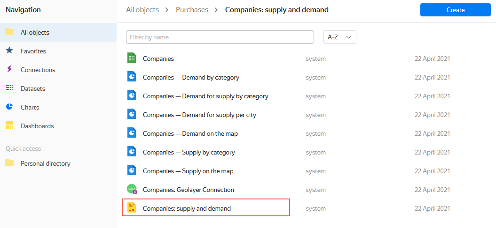

1. Examine the dashboard and its description at the bottom of the screen:
   * Demand is the number of search queries made by users of Yandex geoservices to the selected category of companies or services. The category is determined from the query. Local queries from mobile devices within a search radius of 3 km are included.
   * Supply is the number of existing companies in the selected category. This is based on company data in the [Yandex Business Directory](https://business.yandex.ru/sprav/).

1. Select the **Pizzeria** category and check the map for **Demand**, **Supply**, and **Demand for supply per city** measures.

   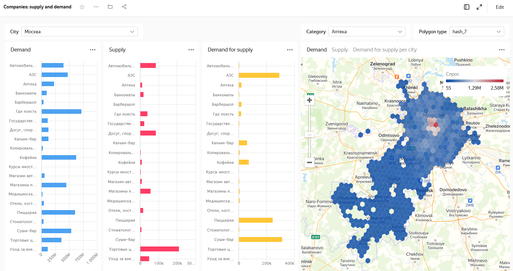

## Step 2. Create a connection {#step2}

1. Go to the [{{ datalens-short-name }}]({{ link-datalens-main }}).
1. Click **Create connection**.
1. Select the **ClickHouse** connection.

   1. In the window that opens, specify the connection parameters:

      * Connection type: **Specify manually**.
      * Host name: `myt-g2ucdqpavskt6irw.{{ dns-zone }}, sas-1h1276u34g7nt0vx.{{ dns-zone }}` (comma-separated).
      * HTTP interface port: `8443` (default).
      * Username: `datalens-marathon-2020-11-ro`.
      * Password: `/4b+xBF6aSCgN9wKTevYGuDjxC9IO4Fa`.

   1. Check the connection and click **Create connection**.
   1. Enter `DODO Con` as the name for the connection and click **Create**.

      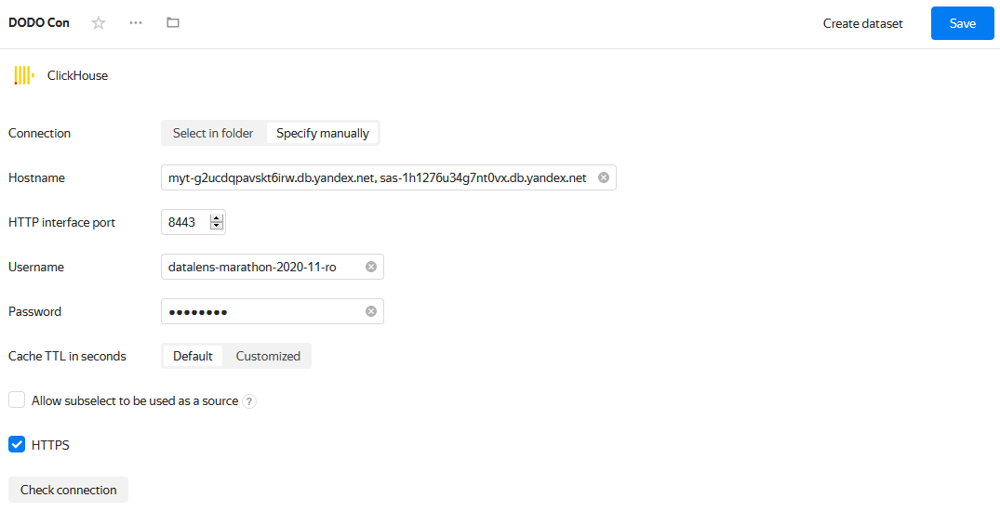

Wait for the connection to be saved.

## Step 3. Configure the dataset fields {#step3}

1. In the window that opens, click **Create dataset**.
1. In the created dataset, drag the table to the workspace.

   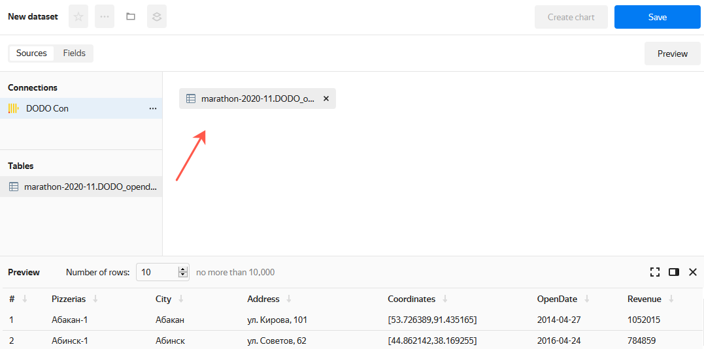

1. Open the **Fields** tab.

   1. Rename the **Name** field to **Pizzerias** in the **Name** column.
   1. For the **Coordinates** field, select the `geopoint` type.
   1. For the **Revenue** field, select the **Sum** aggregation type in the **Aggregation** column.
   1. Duplicate the **Pizzerias** field. Click 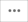 and select the **Duplicate** option.

      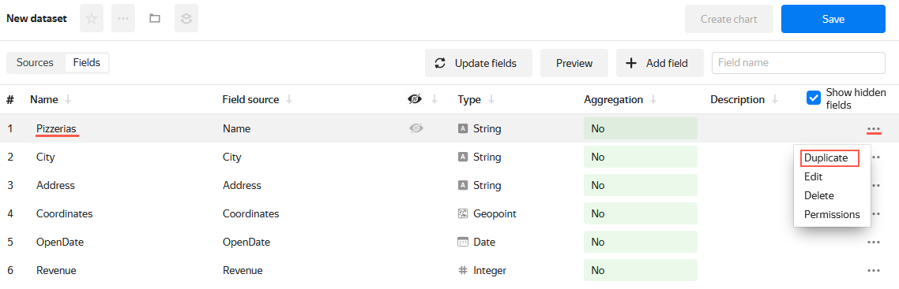

   1. Rename the created field from **Pizzerias** to **The number of pizzerias**.
   1. For the **The number of pizzerias** field, select the **Number of unique** aggregation type in the **Aggregation** column.
   1. Click **Add field**.

      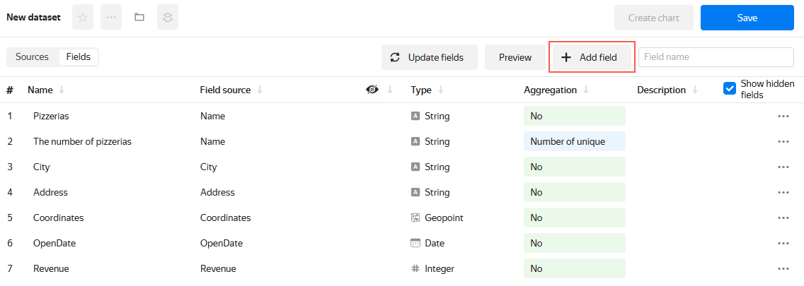

   1. Create a calculated field with the revenue ranking:
      * Formula: `RANK([Revenue])`.
      * Field name: Rank by revenue.

      This field will be used when creating charts filtered by TOP-N.

   1. Click **Create**.

      

   1. In the upper-right corner, click **Save**. In the window that opens, specify the **DODO** dataset name and click **Create**.

## Step 4. Create a column chart {#step4}

1. Click **Create chart** on the workspace panel of the **DODO** dataset.

   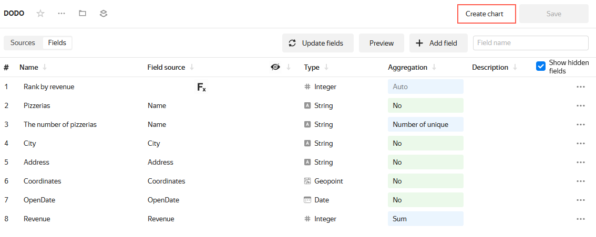

1. In the resulting window, select the **OpenDate** dimension in section **X** and **The number of pizzerias** in section **Y**.

   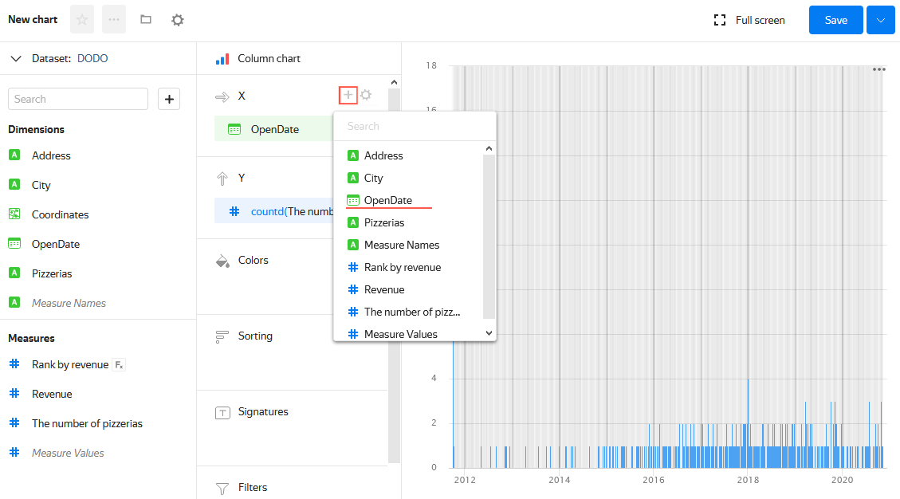

   The chart will show statistics on how many new pizzerias opened on a certain day.

1. Set up the **Opening dates** grouping by month.

   1. Click the calendar icon in the **OpenDate** field.

      1. In the **Grouping** list, select **Rounding** → **Month**.
      1. Click **Apply**.

   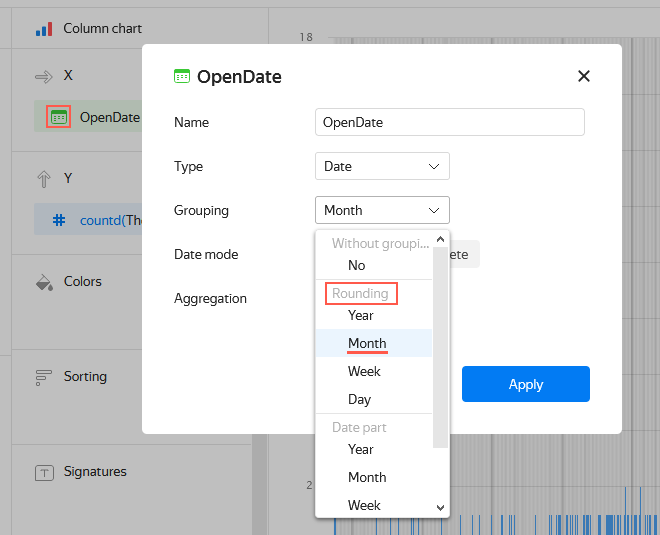

1. Click **Save** in the upper-right corner. Name the chart **Opening dynamics** and click **Save**.

## Step 5. Create a bar chart {#step5}

1. Select a different chart type: **Bar chart**.

   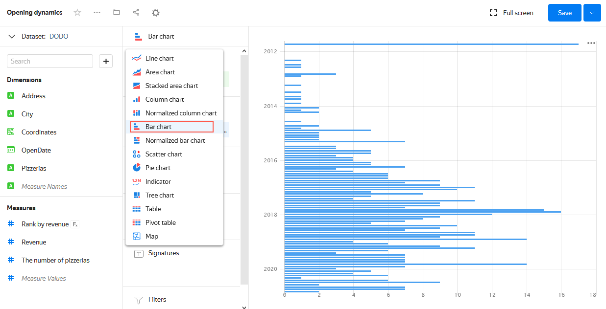

1. Add the **Pizzerias** dimension to the **Y** section. Remove the **OpenDate** dimension from the **Y** section.
1. Add the **Revenue** metric to the **X** section. Remove the **The number of pizzerias** metric from the **X** section.
1. Add the **Revenue** measure to the **Sorting** section.

   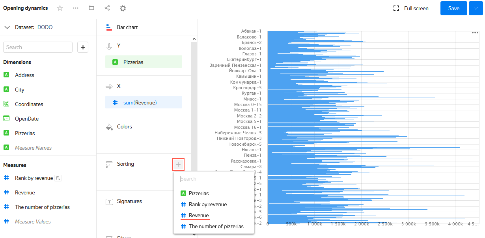

1. Add the **Rank by revenue** measure to the **Chart filters** section:

   1. Select **Less than or equal** to from the **Operation** list.
   1. Enter **10** in the **Value** field.
   1. Click **Apply filter**.
   
1. The chart will show the rating of the **Top 10 pizzerias in Russia**.
1. In the top right-hand corner, click  → **Save as**. Name the chart **Top 10 pizzerias** and click **Save**.

   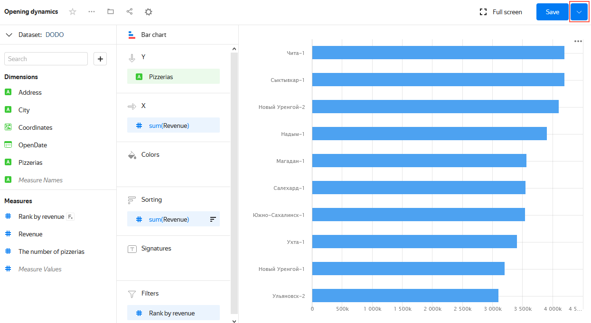

## Step 6. Create an indicator chart {#step6}

1. Select the **Indicator** chart type.

   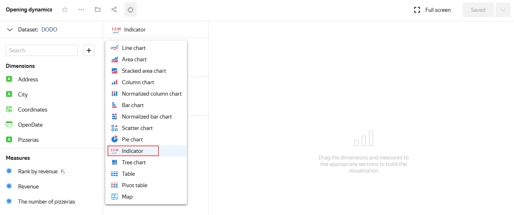

1. Delete the **RANK by revenue** measure from the **Chart filters** field.
1. Add the **Revenue** measure to the **Measure** section.

   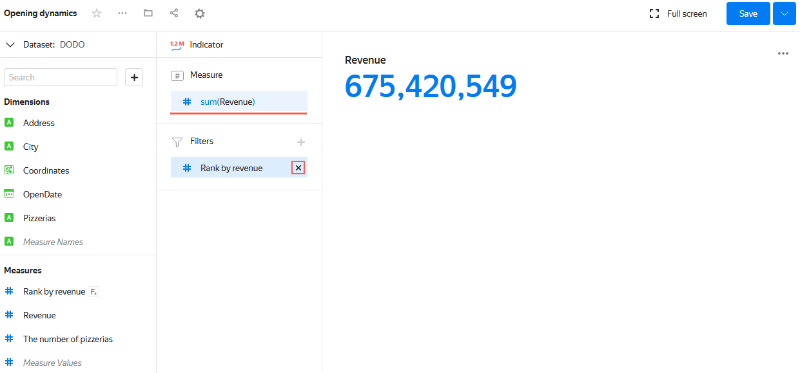

1. In the top right-hand corner, click  → **Save as**. Name the chart **Revenue** and click **Save**.
1. Delete the **sum(Revenue)** measure from the **Measure** section.
1. Add the **The number of pizzerias** measure to the **Measure** section.

   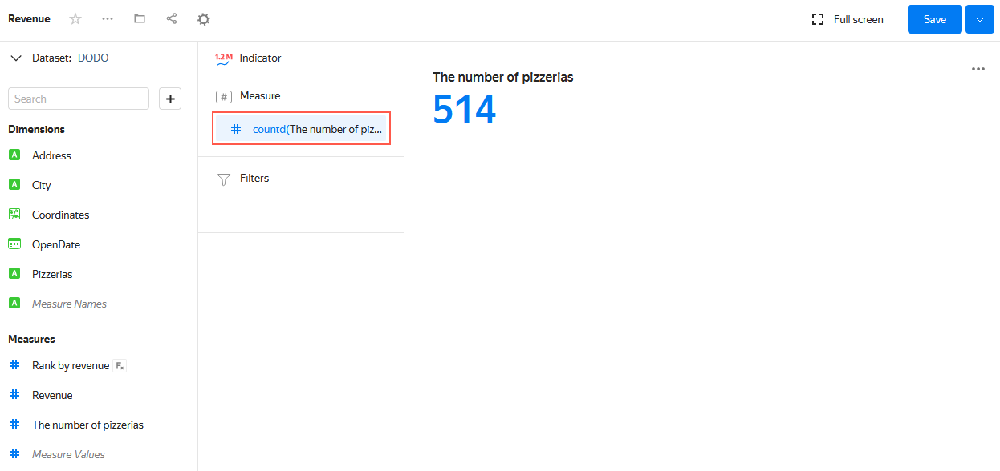

1. In the top right-hand corner, click  → **Save as**. Name the chart **The number of pizzerias** and click **Save**.

## Step 7. Create a map chart {#step7}

1. Select the **Map** chart type.

   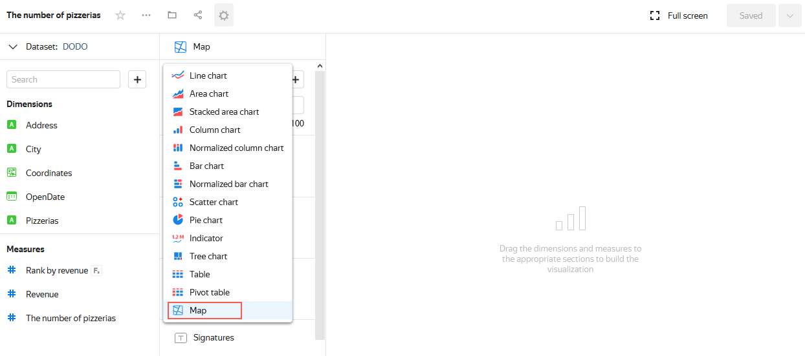

1. Add the **Coordinates** dimension to the **Points (Geopoints)** section.
1. Add the **Revenue** metric to the **Points size** and the **Colors** sections.

   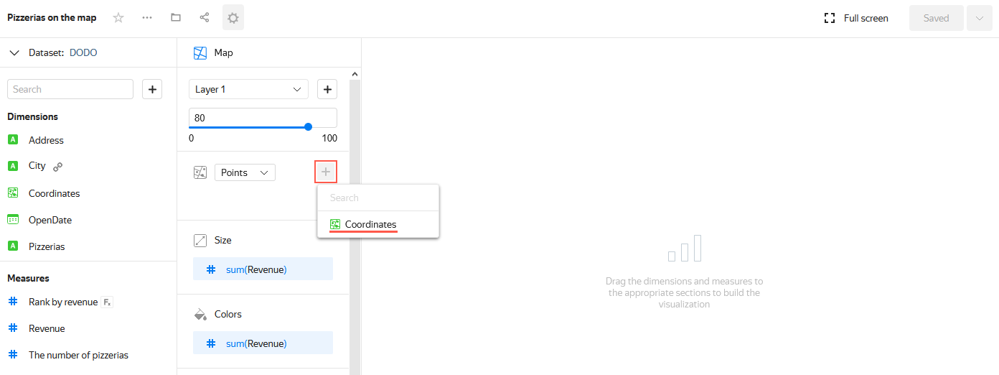

1. Add the following to the **Tooltips** section:

   * Pizzerias
   * Address
   * OpenDate
   * Revenue

1. Go to the **Colors** section settings.

   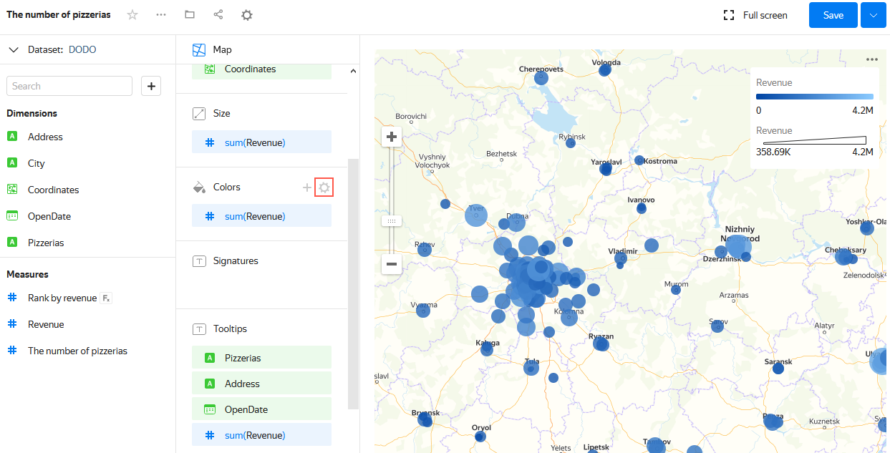

   1. Select the **2 point** gradient type and the **Yellow (shades)** color.
   1. Click **Apply**.

1. Save the chart as **Pizzerias on the map**.

   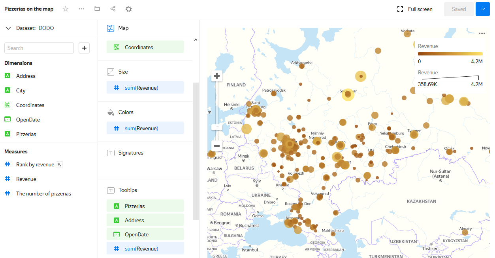

## Step 8. Create a dashboard {#step8}

1. Go to the [{{ datalens-short-name }}]({{ link-datalens-main }}).
1. Click **Create Dashboard**.
1. Name it **DODO Dashboard** and click **Create**.
1. In the window that opens, click **Add** in the upper-right corner and choose **Chart**.
1. Select the chart named **The number of pizzerias**.
1. Click **Add**.

   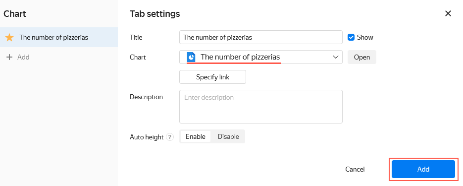

1. Repeat steps 4-6 for the other charts.
1. For indicator charts (**The number of pizzerias** and **Revenue**), disable the name display. To do this, turn off the **Show** option in the **Tab settings** window.

   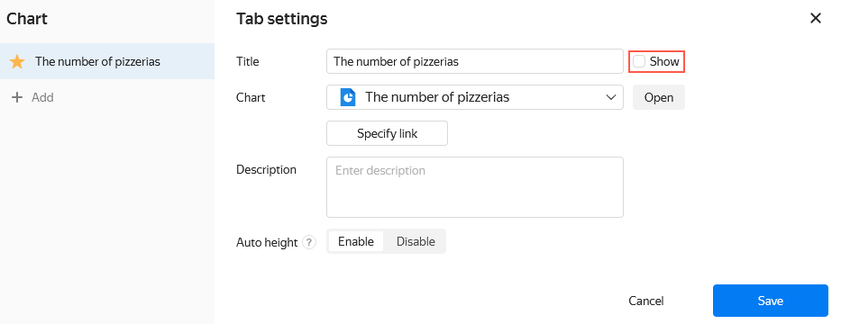

1. To prevent charts from being created as a single column, drag each chart to any free space in the dashboard.
1. In the upper-right corner, click **Add** → **Selector**.

   1. In the window that opens, select the **DODO** dataset.
   1. In the selector settings:

      1. Activate the **Show** option to display the name.
      1. Select the **City** field.
      1. Click **Add**.

   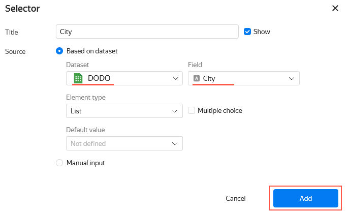

1. Move the selector to the top. If necessary, resize the charts.
1. Click **Save**.
1. Choose Moscow in the selector. If the map remains centered on the same location when you change the city in the filter, refresh the browser page. {{ datalens-name }} records the map scale and location if you changed them during the current session.

   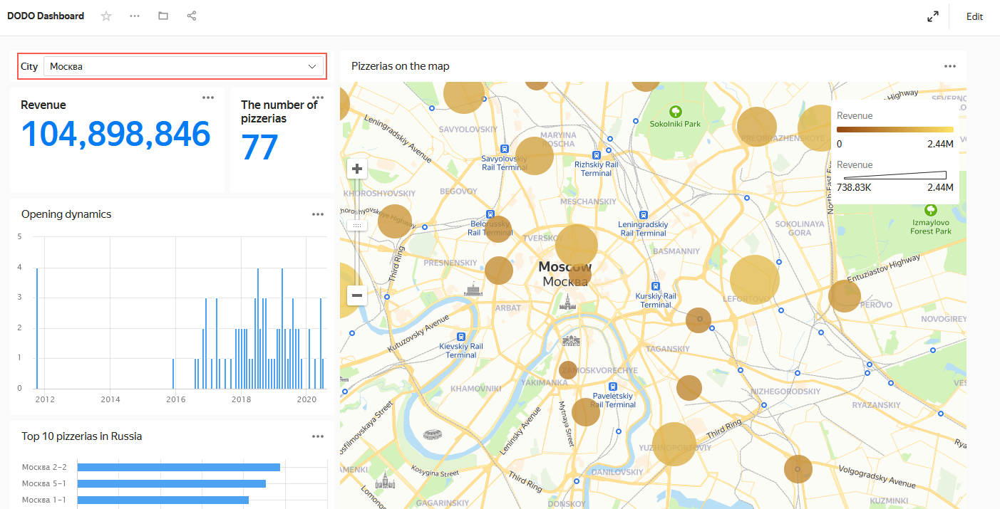

## Step 9. Add geolayers to the dashboard {#step9}

1. Make sure that you only selected Moscow in the city filter of your dashboard.
1. Click the menu icon in the upper-right corner of the map.
1. Select **Edit**.

   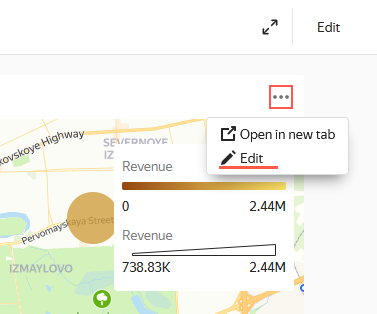

1. Click on the **DODO** dataset name and choose **Add dataset**.
1. In the drop-down list, select **Datasets** instead of **Personal folder**.
1. Select **Companies** (dataset imported from Marketplace in [Step 1](#step-1)).

   

1. Once the dataset is selected, the link setup window appears. By default, a link is established between fields with the same names.

   1. Click **Add link**.
   1. Add a link between the **City** (DODO) and **City** (Companies) dataset fields and click **Save**.

      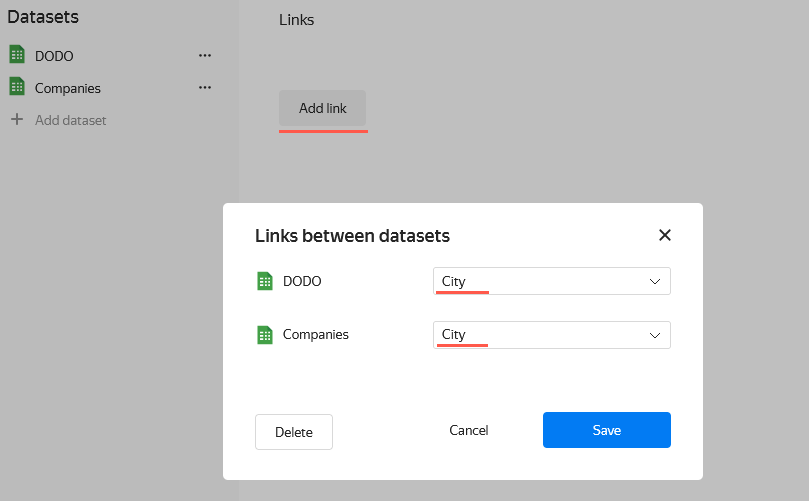

1. Click **Save** to close the **Links** window.
1. In the layer section, rename **Layer 1**.

   1. To do this, click on the layer and choose .

   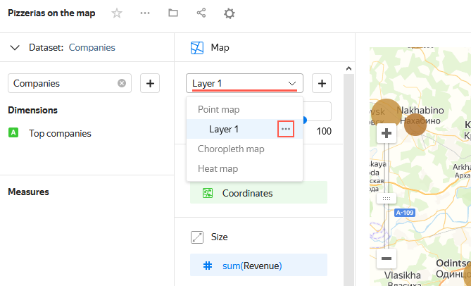

   1. In the **Layer settings** window that opens, enter the name **DODO** and click **Apply**.

1. Click 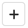 to add a layer. Rename it **Demand for supply**.
1. Modify geolayer type from **Points (Geopoints)** to **Polygons (Geopolygons)**.

   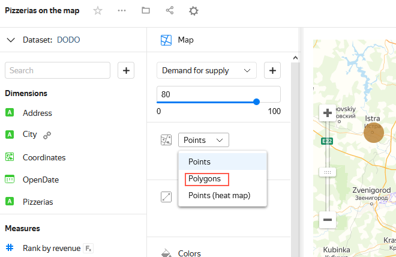

1. Make sure that the current dataset is **Companies** and not **DODO**. If the current dataset is **DODO**, click on its name in the upper-left corner and choose **Companies**.

   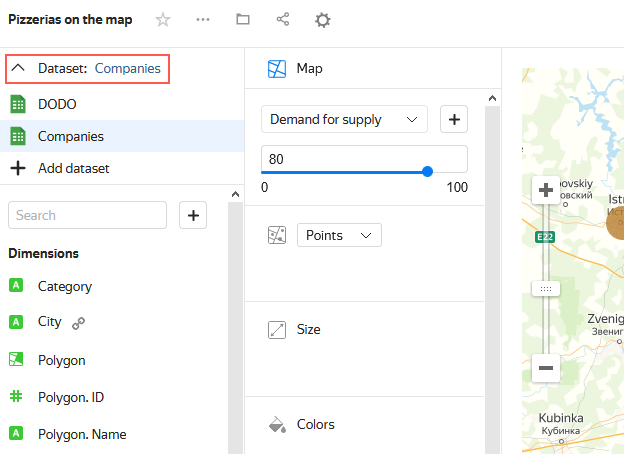

1. Add the **Polygon** dimension to the **Polygons (Geopolygons)** section.
1. Add the **Polygon.Type** dimension to the **Chart filters** section and set it to **hash7**. Click **Apply filter**.
1. Add the **Category** dimension to the **Layer filters** section and choose **Pizzeria**. Click **Apply filter**.
1. Add the **Demand for supply per city** measure to the **Colors** section.
1. In the color settings, select the **Blue-Grey-Red** three-color gradient and click **Apply**.

   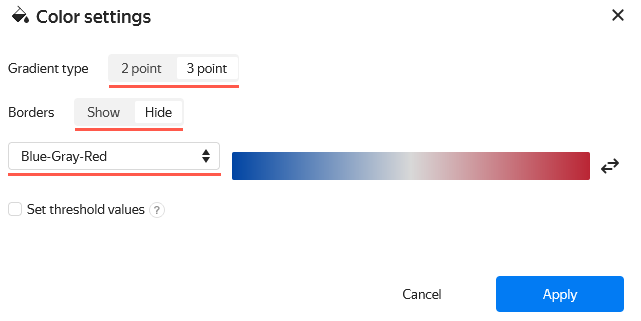

1. Change the transparency level to 60.

   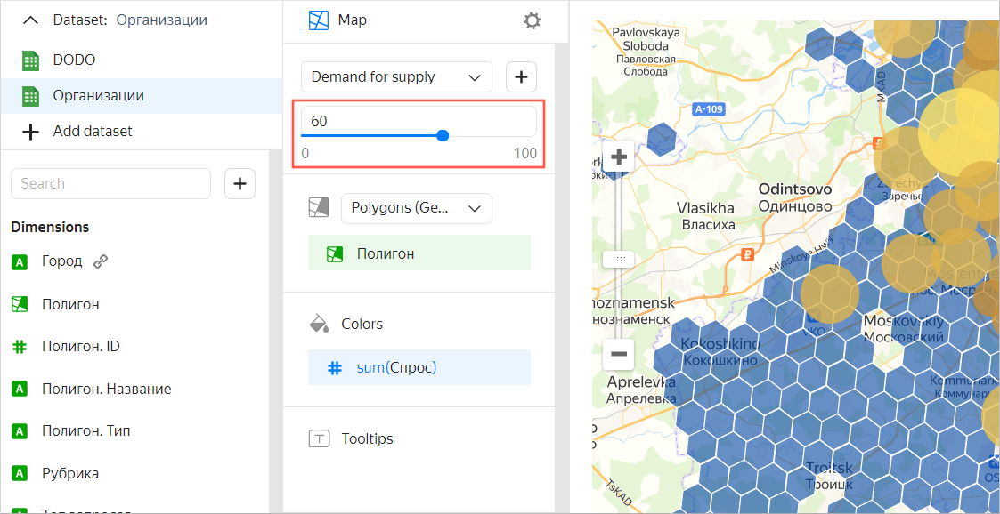

1. Add the following to the **Tooltips** section:

   * Demand
   * Supply
   * Demand for supply per city
   * Top queries
   * Top companies

1. Click **Save** in the upper-right corner.

   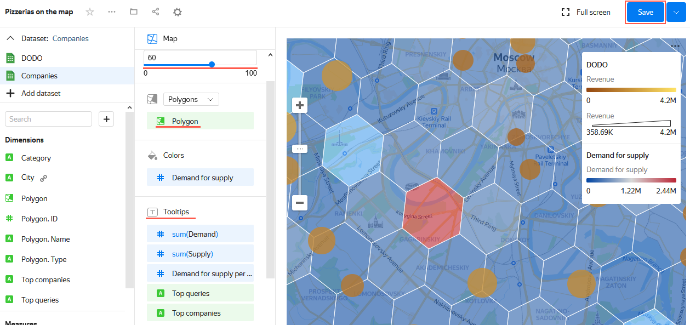

1. Go back to the dashboard (it should be open on the previous tab in your browser) and refresh the web page.
1. Choose Saint Petersburg in the selector. After that, the dashboard, including the map and external geolayer, will only be filtered by this selector.

   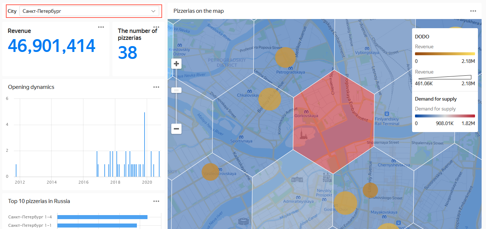

If the map remains centered on the same location when you change the city in the filter, refresh the browser page. {{ datalens-name }} records the map scale and location if you changed them during the current session.

## Optional {#additional}

As an idea for further independent work we suggest:

1. Adding a geolayer with companies in the **Where to eat** category (restaurants and fast food chains in general, not only pizzerias).
1. Add [Audience: interests and social demographics](https://datalens.yandex.com/marketplace/f2eemc2dui59rn72h0ck) from the Marketplace to be able to similarly display the city audience data on the map.
1. Using Voronezh as an example, you can familiarize yourself with free [geolayers from Geointellect](https://datalens.yandex.com/marketplace/f2eu3edujf1jdmaihu7u). A demo set contains calculated indexes of a fast food restaurant location's business potential.
