# Analyzing sales and locations of pizzerias based on data from {{ CH }} and {{ marketplace-short-name }} databases



In this tutorial, you will prepare a dashboard for selecting locations to open new Dodo pizzerias.

With {{ datalens-short-name }}, you will analyze locations based on real data:

* Revenue from current Dodo pizzerias.
* Search queries to pizzerias by location (Yandex data).
* Number of all pizzerias by location (Yandex data).

We will use a {{ CH }} demo DB and the **Companies: supply and demand** product from {{ marketplace-short-name }} as a source.

You can also [watch](https://www.youtube.com/watch?v=cw6PotbQYng) this tutorial on the {{ yandex-cloud }} YouTube channel.

To visualize and explore data, [set up {{ datalens-short-name }}](#before-you-begin) and follow the steps below:

1. [Create a workbook](#create-workbook).
1. [Import geolayers from {{ marketplace-short-name }}](#import-from-marketplace).
1. [Review the dashboard](#view-dashboard).
1. [Create a connection](#create-connection).
1. [Create a dataset](#create-dataset).
1. [Analyze the rate of opening new pizzerias](#create-column-chart).
1. [Analyze the revenue of pizzerias](#create-bar-chart).
1. [Calculate the total revenue and number of pizzerias](#create-indicator-chart).
1. [Analyze order density on the map](#create-map-chart).
1. [Create a dashboard](#create-dashboard).
1. [Add geolayers to the dashboard](#add-geolayers).

## Getting started {#before-you-begin}



## Create a workbook {#create-workbook}

1. Go to the {{ datalens-short-name }} [home page]({{ link-datalens-main }}).
1. In the left-hand panel, select  **Collections and workbooks**.
1. In the top-right corner, click **Create** → **Create workbook**.
1. Enter the [workbook](../../datalens/workbooks-collections/index.md) name: `Companies: supply and demand`.
1. Click **Create**.

## Import geolayers from {{ marketplace-short-name }} {#import-from-marketplace}

1. Go to {{ datalens-short-name }} in [{{ marketplace-short-name }}]({{ link-datalens-main }}/marketplace).
1. Select the **Geolayers** category and the **Companies: supply and demand** product.
1. Click **Expand** in the product card that opens.
1. Select the `Companies: supply and demand` workbook.
1. Click **Deploy**.

   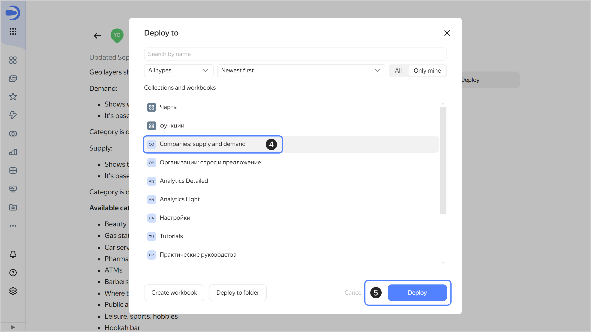

## Review the dashboard {#view-dashboard}

1. Open the `Companies: supply and demand` dashboard.
1. Review the dashboard:

   * At the top, there are filters by city, category, and polygon type.
   * The tables gives information on demand and supply:

     * `Demand` is the number of search queries made by users of Yandex geoservices to the selected category of companies or services. The category is determined from the query. Local queries from mobile devices within a search radius of 3 km are included.
     * `Supply` is the number of existing companies in the selected category. This is based on company data in the [Yandex Business Directory](https://business.yandex.ru/sprav/).
     * `Demand-to-supply ratio` shows the extent to which the supply meets the demand in a polygon compared to the entire city.

   * The map visualizes the distribution of supply and demand across the city.

1. Select the `Pizzeria` category and check the map for `Demand`, `Supply`, and `Demand-to-supply ratio per city` measures.

   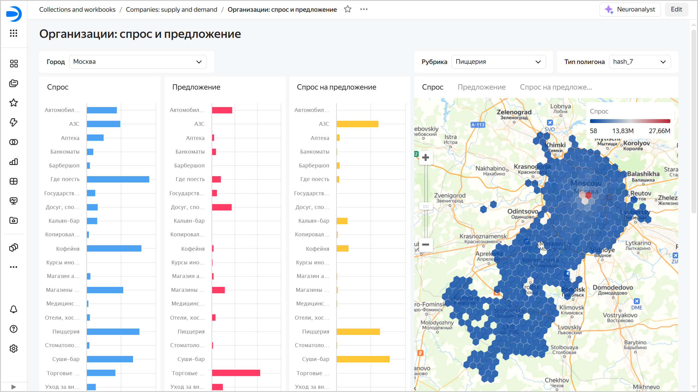

## Create a connection {#create-connection}

1. Go to the `Companies: supply and demand` workbook by clicking its name in the dashboard path.

   

1. In the top-right corner, click **Create** →  **Connection**.
1. Under **Databases**, select the **{{ CH }}** connection.

   1. In the window that opens, select `Specify manually` for the connection type and provide the following connection parameters:

      * **Host name**: `rc1a-g1gicp3imcc0pnsg.{{ dns-zone }},rc1b-vbbl6tob599tr3oi.{{ dns-zone }},rc1d-qf1ven1igeihhbep.{{ dns-zone }}` (comma-separated).
      * **HTTP interface port**: `8443` (default).
      * **Username**: `datalens-marathon-2020-11-ro`.
      * **Password**: `/4b+xBF6aSCgN9wKTevYGuDjxC9IO4Fa`.

   1. Click **Check connection** and make sure you get a green check mark.
   1. Click **Create connection**.
   1. Enter the connection name:`DODO Con`.
   1. Click **Create**.

      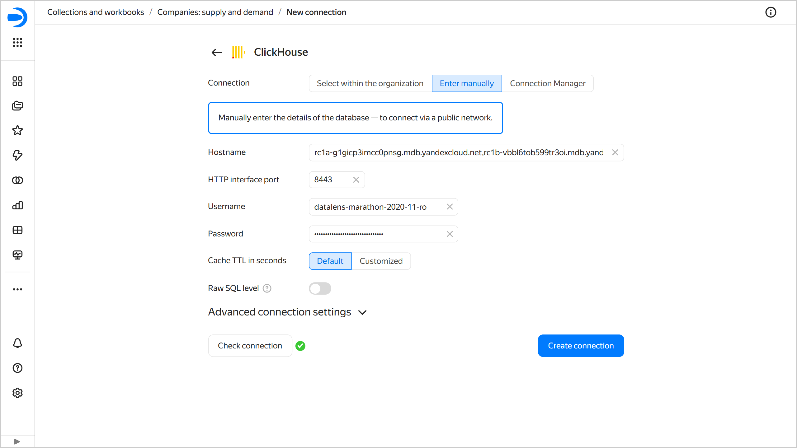

Wait for the connection to be saved.

## Create a dataset {#create-dataset}

Create a [dataset](../../datalens/dataset/index.md) based on the `DODO Con` connection:

1. In the top-right corner of the connection page, click **Create dataset**.
1. Drag the `marathon-2020-11.DODO_opendata` table to the workspace.

   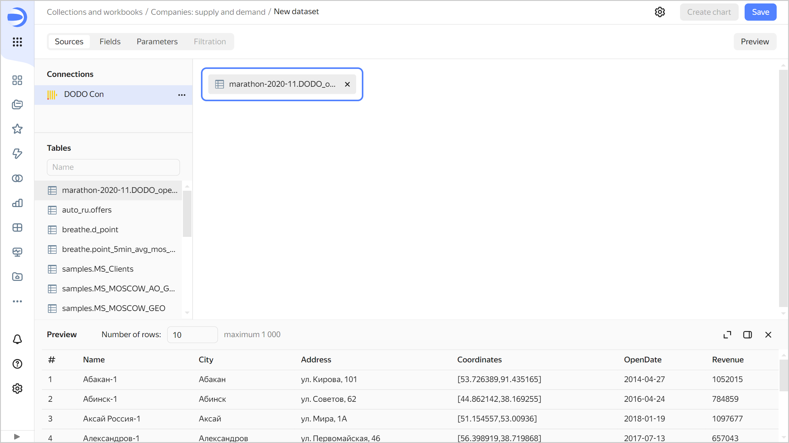

1. Navigate to the **Fields** tab.
1. Rename the `Name` field to `Pizzerias`. To rename a field, click its current name, delete it, and enter a new one.
1. For the `Coordinates` field, select **Geopoint** in the **Type** column.
1. For the `Revenue` field, set the aggregation type to **Sum**. The fields with defined aggregation functions become measures and change their color to blue.

   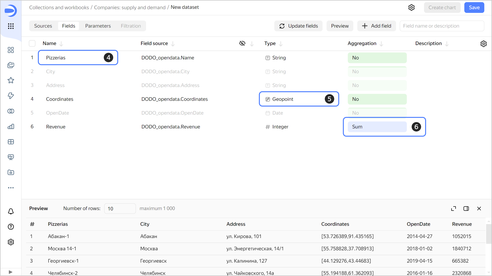

1. Create a measure for the number of pizzerias.

   1. Duplicate the `Pizzerias` field: on the right side of the row with the field, click  and select **Duplicate**.
   1. Rename the `Pizzerias (1)` duplicate field to `The number of pizzerias`.
   1. Change the aggregation type to **Number of unique**.

      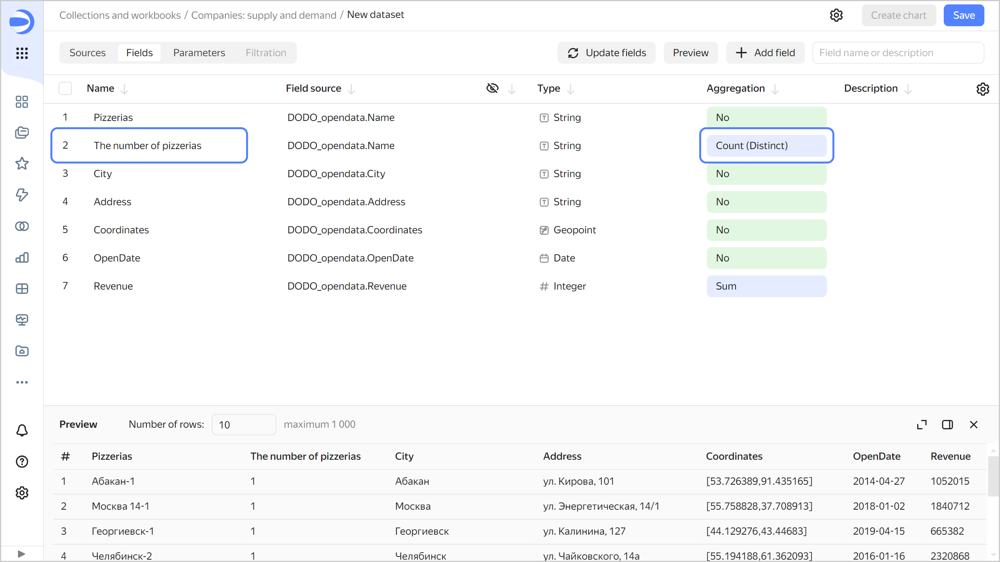

1. Create a calculated field to rank pizzerias by revenue:

   1. In the top-right corner, click **Add field**.
   1. At the top-left, specify the field name: `Rank by revenue`.
   1. In the formula field, enter `RANK([Revenue])`.
   1. Click **Create**.

      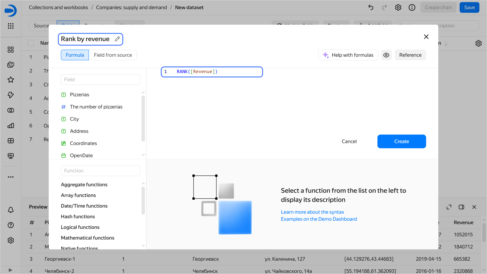

1. Save the dataset:

   1. In the top-right corner, click **Save**.
   1. Enter `DODO` for the dataset name and click **Create**.

## Analyze the rate of opening new pizzerias {#create-column-chart}

Create a [bar chart](../../datalens/visualization-ref/column-chart.md) to visualize the monthly rate of opening pizzerias:

1. Click **Create chart** in the top-right corner of the dataset page.
1. Add the opening date to your chart. To do this, drag the `OpenDate` field from **Dimensions** to the **X** section.
1. Add the number of pizzerias as a measure to your chart. To do this, drag the `The number of pizzerias` field from **Measures** to the **Y** section.

   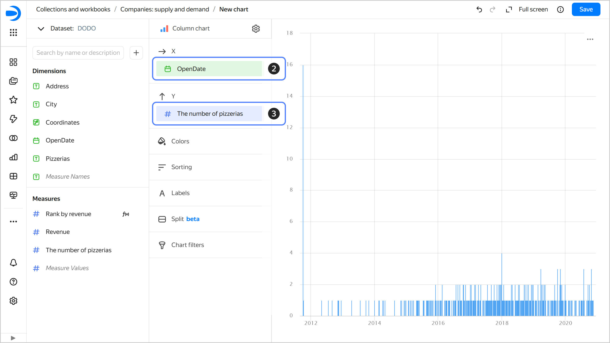

   The chart will show how many new pizzerias opened on a certain day.

1. Display the chart by month:

   1. Click the calendar icon next to the `OpenDate` field in the **X** section.
   1. In the **Grouping** field, select **Rounding** ⟶ **Month** and click **Apply**.

      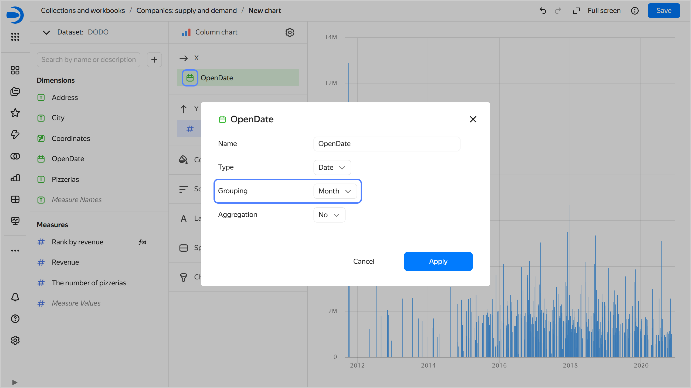

1. Save the chart:

   1. In the top-right corner, click **Save**.
   1. In the window that opens, enter `Opening rate` for the chart name and click **Save**.

      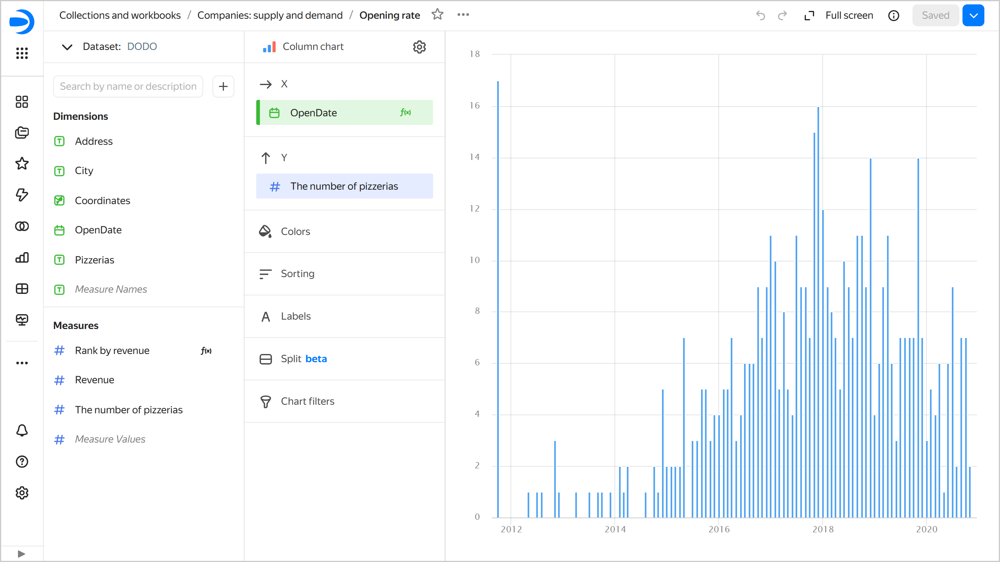

## Analyze the revenue of pizzerias {#create-bar-chart}

Create a [bar chart](../../datalens/visualization-ref/bar-chart.md) to display the top 10 pizzerias by revenue:

1. Copy the chart you created in the previous step:

   1. In the top-right corner, click  → **Save as copy**.

      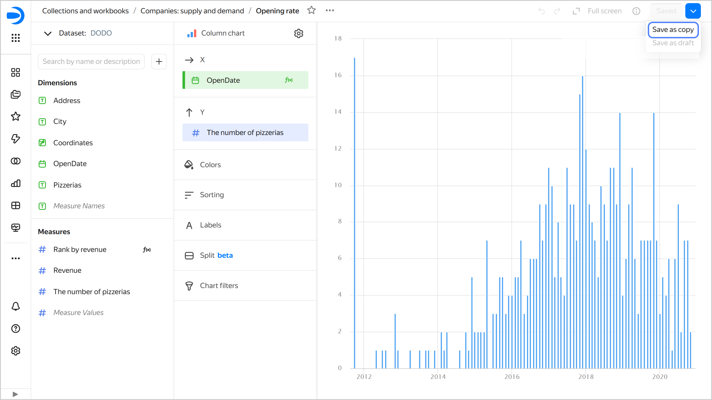

   1. In the window that opens, enter `Top 10 pizzerias` for the new chart name and click **Save**.

1. For the visualization type, select **Line chart**.

   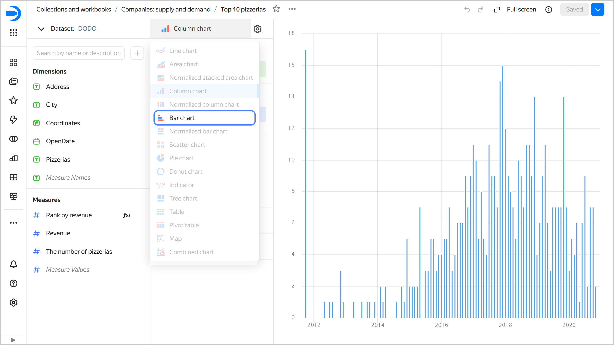

1. Replace the months with pizzeria names on the Y axis. To do this, drag the `Pizzerias` field from **Dimensions** to the **Y** section and hold it over the `OpenDate` field until the latter turns red.
1. Replace the number of pizzerias with the total revenue on the X axis. To do this, drag the `Revenue` field from **Measures** to the **X** section and hold it over the `The number of pizzerias` field until the latter turns red.
1. Sort the chart by revenue in descending order. To do this, drag the `Revenue` field from **Measures** to the **Sorting** section. The chart now displays the total revenue by pizzeria.
1. Add a filter to get the top 10 pizzerias by revenue:

   1. Drag the `Rank by revenue` field from **Measures** to the **Filters** section.
   1. Select `Less than or equal to` from the **Operation** list.
   1. Set **Value** to `10`.

      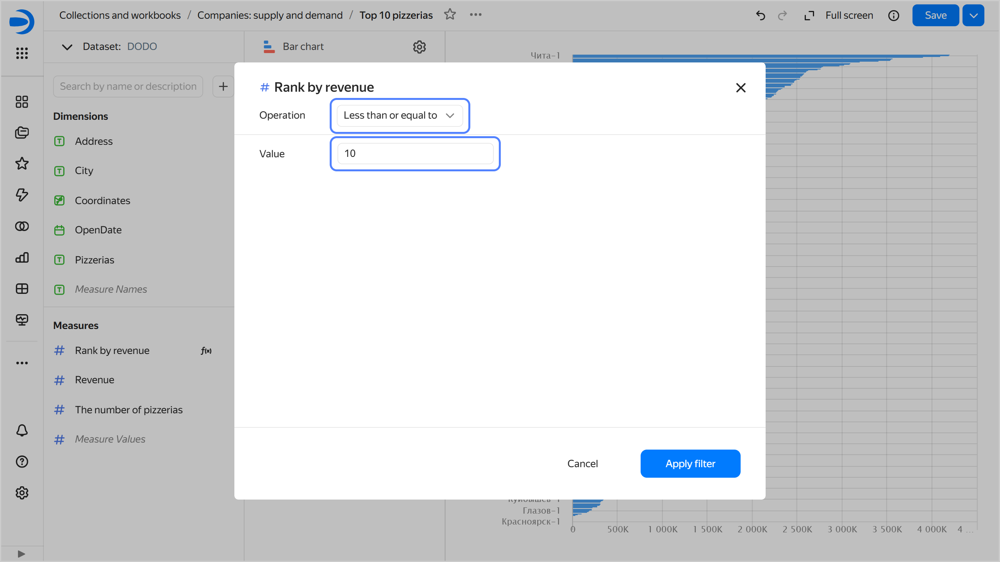

   1. Click **Apply filter**.

   The chart will show the top 10 pizzerias in Russia.

   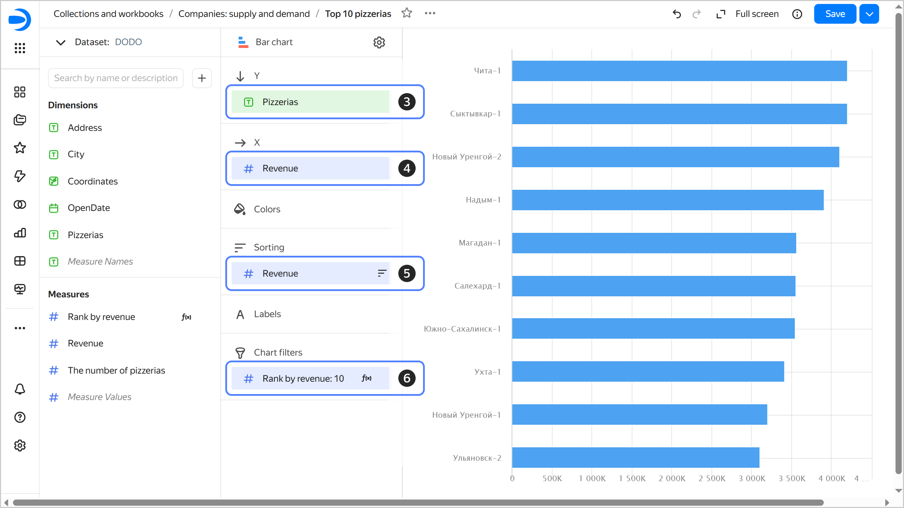

1. In the top-right corner, click **Save**.

## Calculate the total revenue and number of pizzerias {#create-indicator-chart}

Create an [indicator](../../datalens/visualization-ref/indicator-chart.md) to display the total revenue:

1. Copy the chart you created in the previous step:

   1. In the top-right corner, click  → **Save as copy**.
   1. In the window that opens, enter `Revenue` for the new chart name and click **Save**.

1. Select the **Indicator** visualization type.

   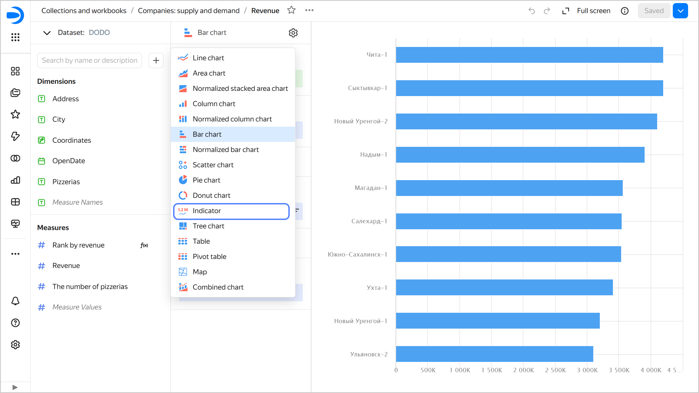

1. Clear the filter for the top 10 pizzerias by revenue. To do this, click  (the icon appears on when you hover over the field) next to the `Rank by revenue` field in the **Filters** section.
1. Drag the `Revenue` field from **Measures** to the **Measure** section.
1. Disable the header display in the chart settings:

   1. Click  to the right of the visualization type.
   1. Set the header to **Hide**.
   1. Click **Apply**.

      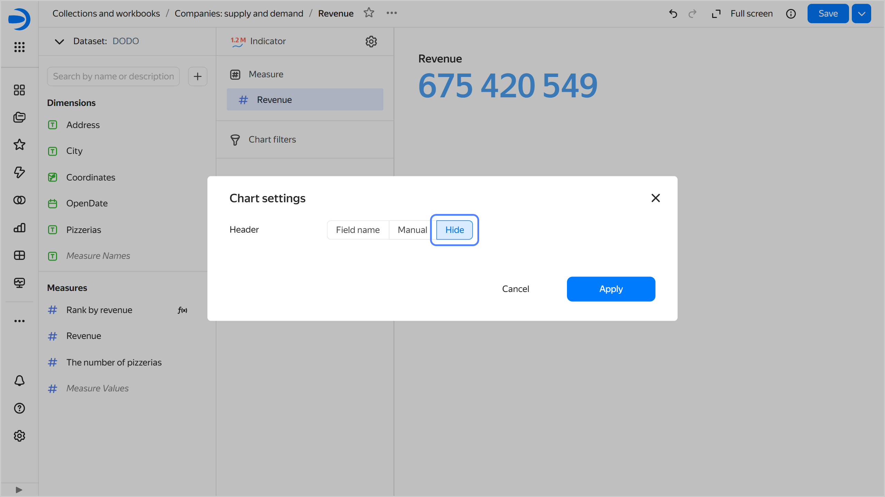

1. In the top-right corner, click **Save**.

   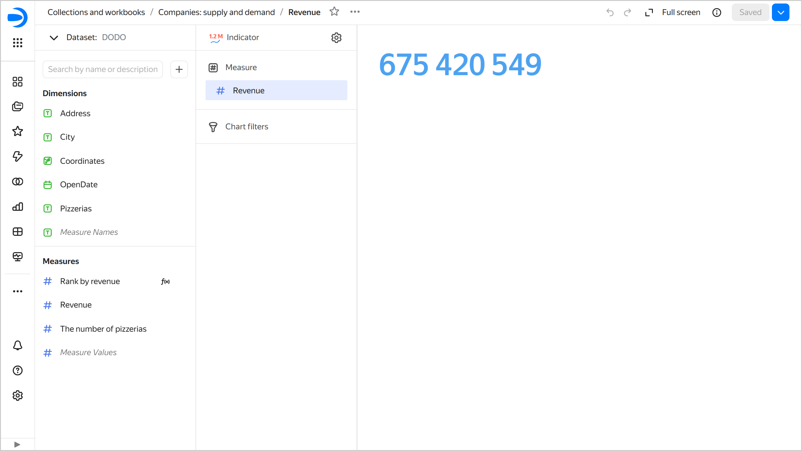

Create another indicator to display the number of pizzerias:

1. Copy the chart you created in the previous step:

   1. In the top-right corner, click  → **Save as copy**.
   1. In the window that opens, enter `Number of pizzerias` for the new chart name and click **Save**.

1. Replace the revenue with the number of pizzerias. To do this, drag the `The number of pizzerias` field from **Measures** to the **Measure** section and hold it over the `Revenue` field until the latter turns red.
1. In the top-right corner, click **Save**.

   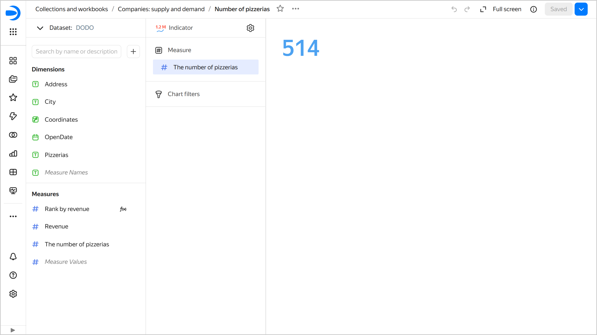

## Analyze order density on the map {#create-map-chart}

To visualize order density across Russia, create a [map](../../datalens/visualization-ref/point-map-chart.md).

1. Copy the chart you created in the previous step:

   1. In the top-right corner, click  → **Save as copy**.
   1. In the window that opens, enter `Map of pizzerias` for the new chart name and click **Save**.

1. Select the **Map** visualization type.

   

1. Add the coordinates of pizzerias to the map. To do this, drag the `Coordinates` field from **Dimensions** to the **Points (Geopoints)** section.
1. Change the point size based on the revenue measure. To do this, drag the `Revenue` field from **Measures** to the **Size** section.
1. Change the point color based on the revenue measure. To do this, drag the `Revenue` field from **Measures** to the **Colors** section.
1. Add the following fields to the **Tooltips** section:

   * `Pizzerias`
   * `Address`
   * `OpenDate`
   * `Revenue`

     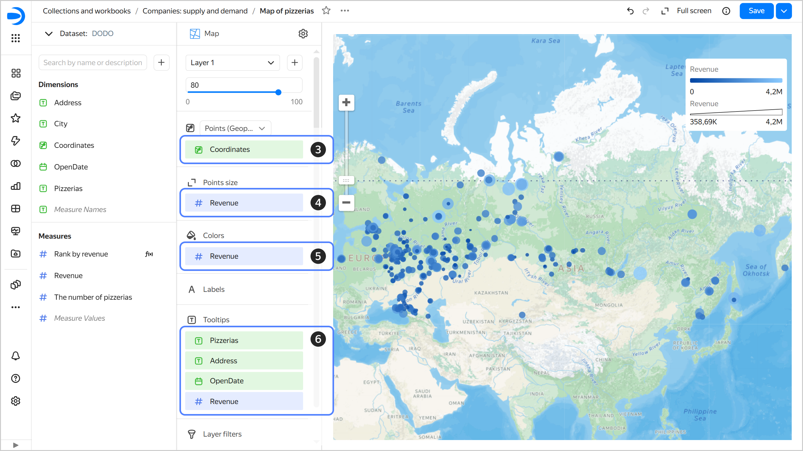

1. Update the **Colors** settings:

    1. Click  in the **Colors** section (the icon appears when you hover over the section).
    1. Select the **Two-color** gradient type and the **Yellow (shades)** color.
    1. Click **Apply**.

       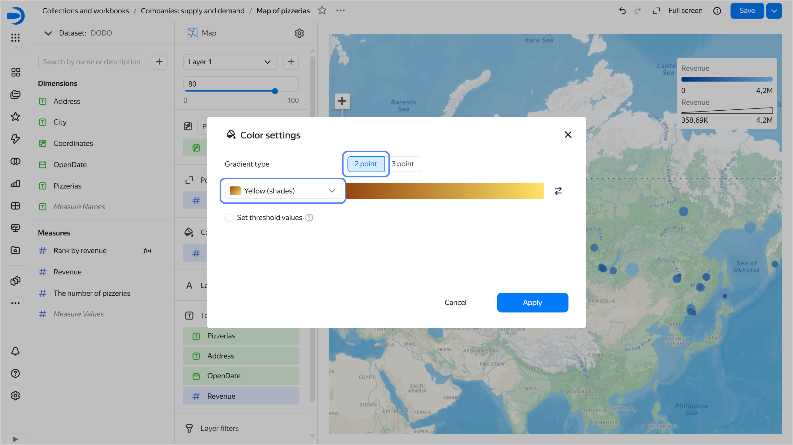

1. In the top-right corner, click **Save**.

    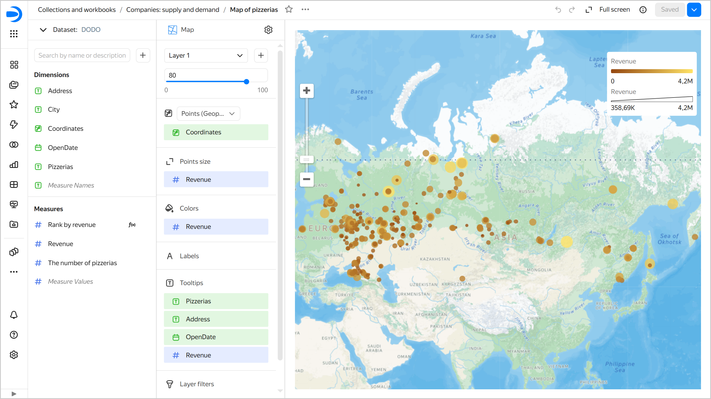

## Create a dashboard {#create-dashboard}

1. Go to the `Companies: supply and demand` workbook by clicking its name in the dashboard path.
1. In the top-right corner, click **Create** →  **Dashboard**.
1. In the panel at the bottom of the page, hold down  **Chart** and drag it to the required area.

   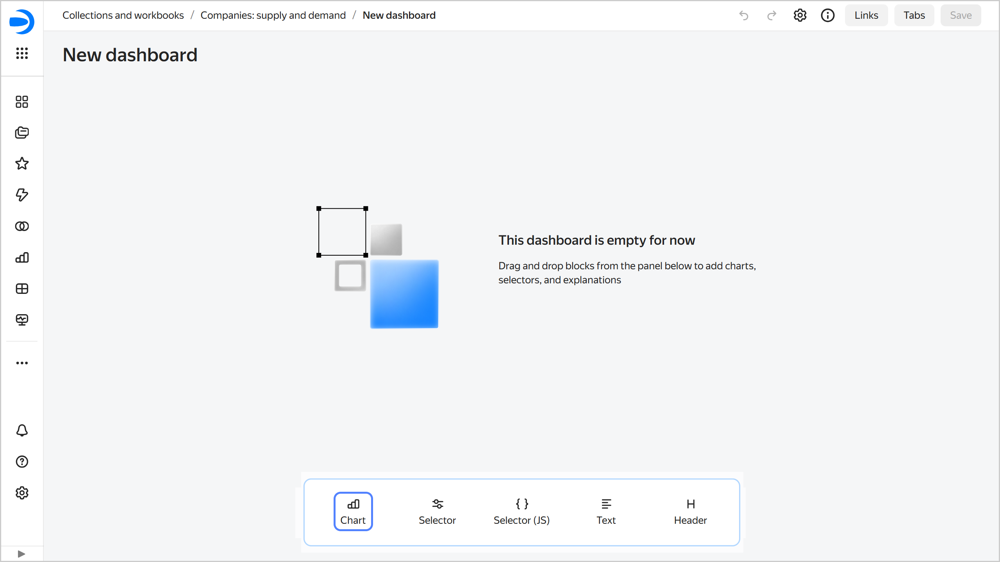

1. In the window that opens, click **Select**.
1. Select the `Opening rate` chart. This will automatically fill in the **Name** field.
1. Click **Add**.

   

1. Repeat steps 3-6 to add these charts:

   * `Top 10 pizzerias`.
   * `Revenue`.
   * `Number of pizzerias`.
   * `Map of pizzerias`.

1. Adjust the size of the charts with your mouse and place them on the dashboard as you prefer.

   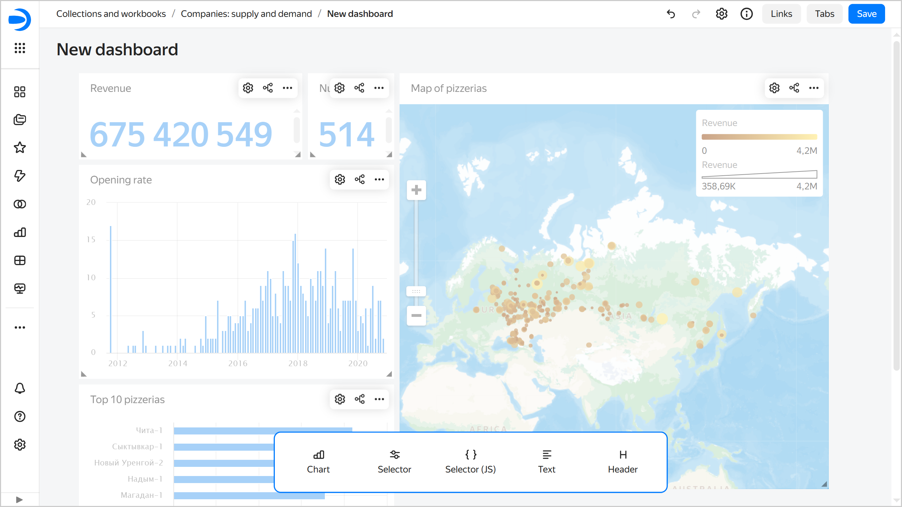

Add a [selector](../../datalens/dashboard/selector.md) to filter charts by city:

1. In the panel at the bottom of the page, hold down  **Selector** and drag it to the required area.

   

1. Add the calendar selector for the order date:

   1. Select `DODO`.
   1. Select the `City` field.
   1. Specify the header: `City`.
   1. Click **Save**.

      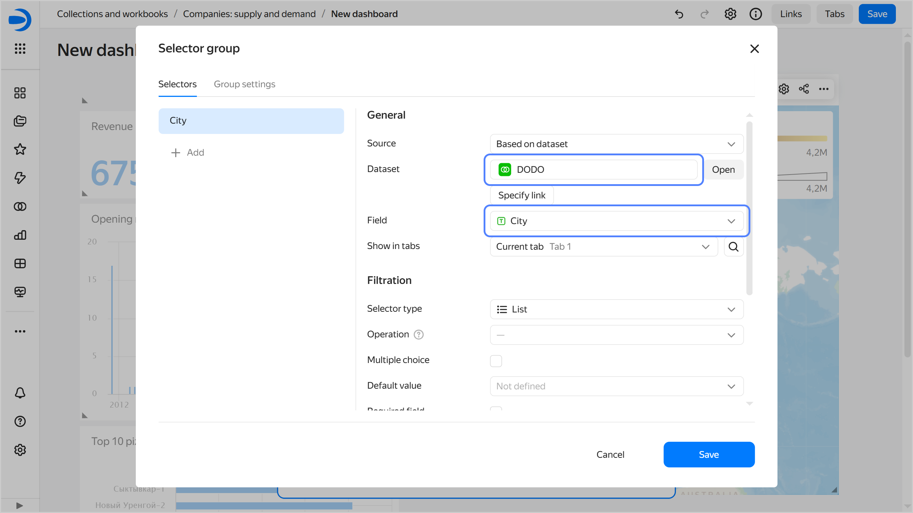

1. Drag the selector to the top of the dashboard.
1. Save the dashboard:

   1. In the top-right corner of the dashboard, click **Save**.
   1. Enter `DODO Dashboard` for the dashboard name and click **Create**.

Your dashboard is ready.

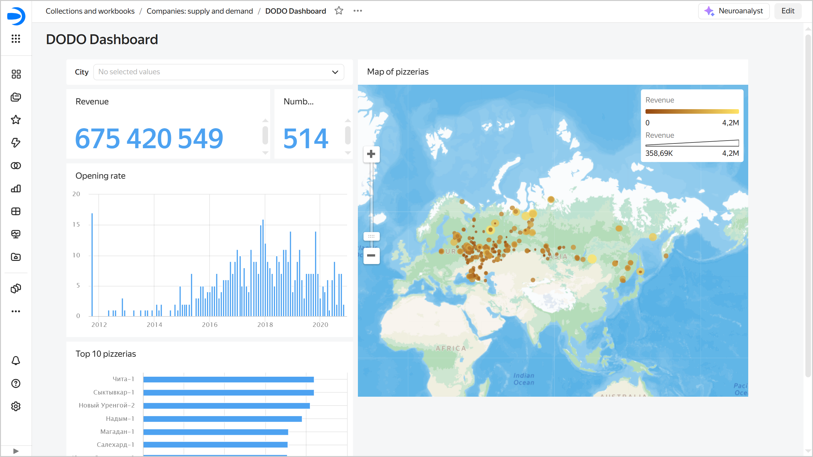

Choose `Moscow` in the selector. If the map focus remains at the same location, refresh the page in your browser. {{ datalens-name }} captures the map scale and location if you change them during the current session.

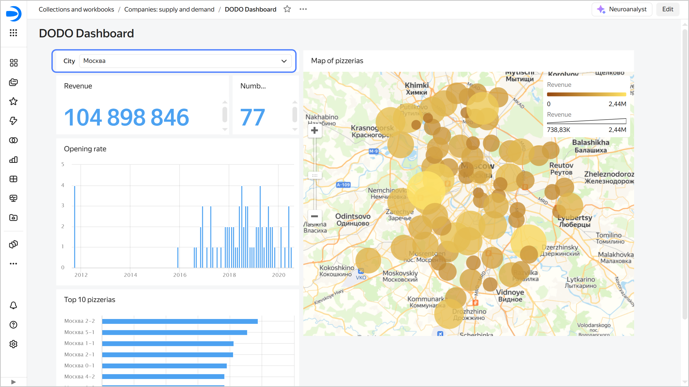

## Add geolayers to the dashboard {#add-geolayers}

1. Make sure you only selected Moscow in the city filter of your dashboard. Click  →  **Edit** in the top-right corner of the map.

   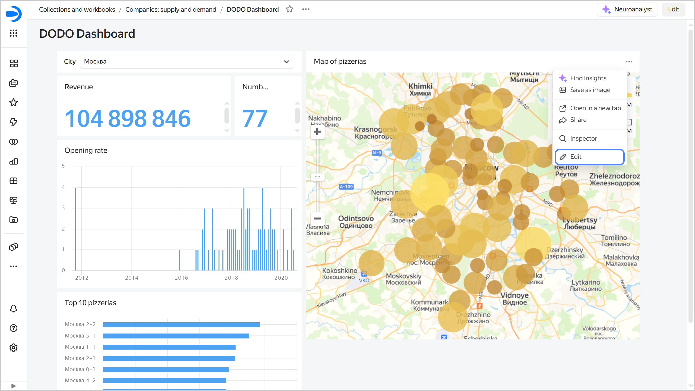

1. Click the **DODO** dataset name.
1. Click  **Add dataset**.
1. Select the `Companies` dataset [imported from {{ marketplace-short-name }}](#import-from-marketplace).

   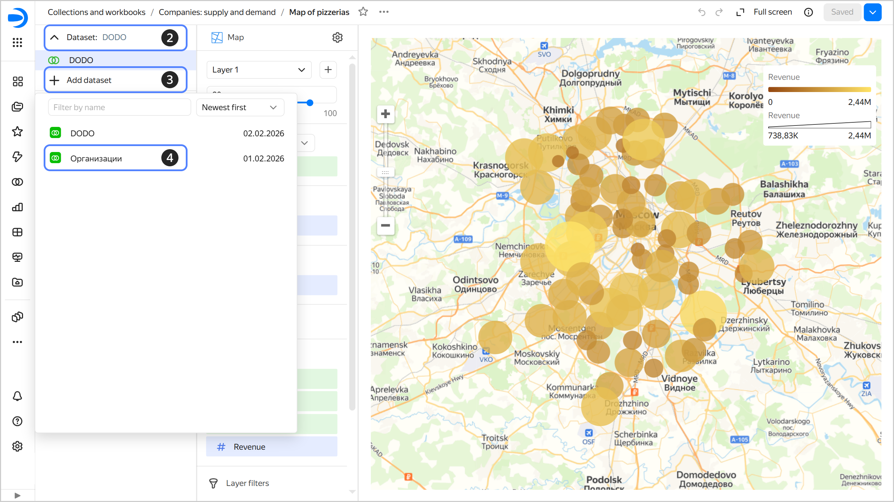

1. Once the dataset is selected, the link setup window appears. By default, a link is established between fields with the same names.

   1. Click **Add link**.
   1. Add a link between the `City` fields in the `DODO` and `Companies` datasets and click **Save**.
  
      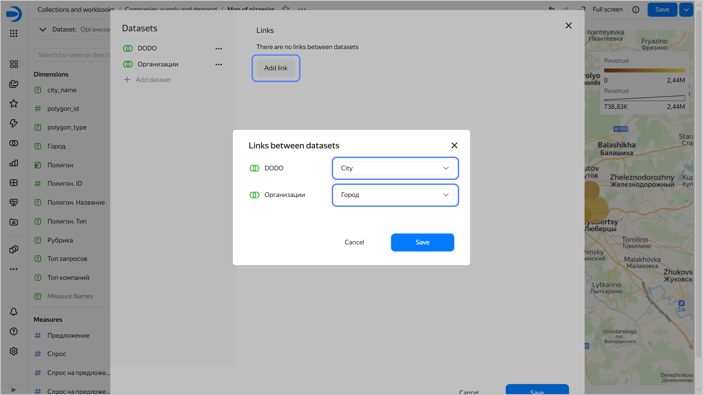

1. Click **Save** to close the **Links** window.

1. Rename **Layer 1**:

   1. Click the layer and then  (the icon appears when you hover over the layer) to the right of its name.

      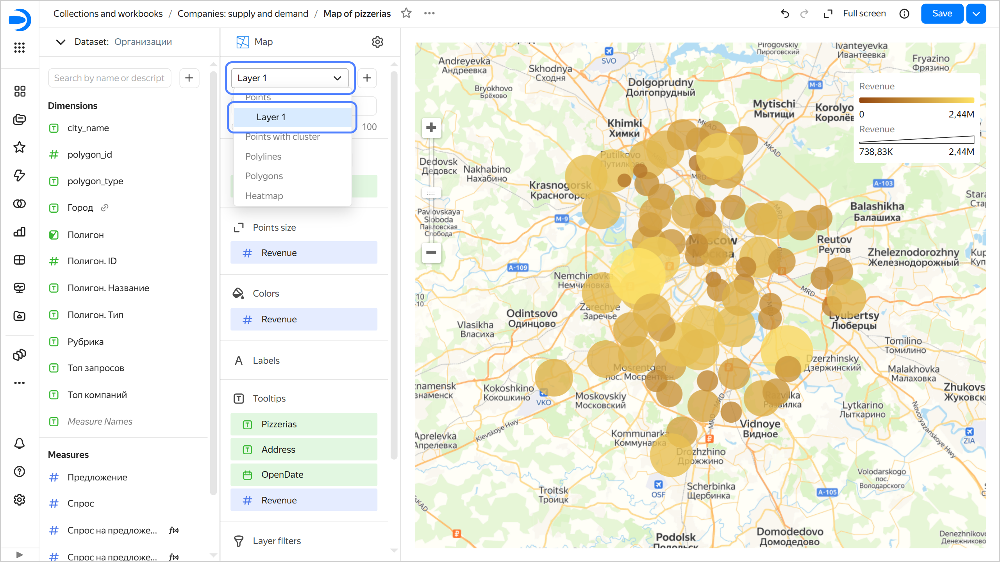

   1. In the **Layer settings** window that opens, enter `DODO` as the name and click **Apply**.

1. Add another layer:

   1. Click  to the right of the current layer.
   1. Rename the new layer to `Demand-to-supply ratio`.
   1. Change the geolayer type from **Points (Geopoints)** to **Polygons (Geopolygons)**.

   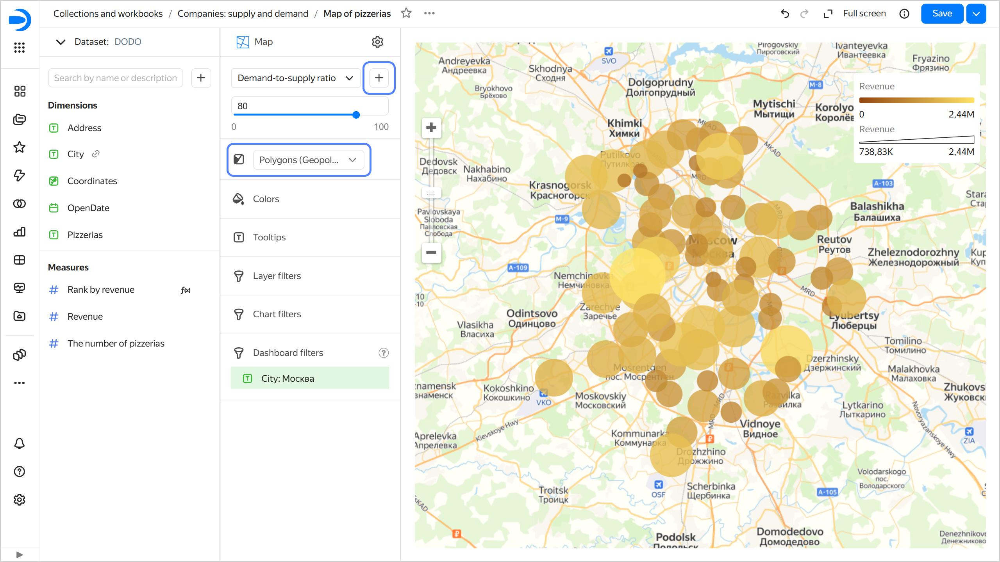

1. Make sure your current dataset is `Companies`, not `DODO`. If the current dataset is `DODO`, click its name in the top-left corner and select `Companies`.

   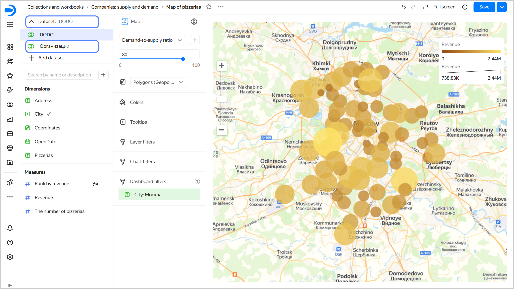

1. Drag the `Polygon` dimension to the **Polygons** section.
1. Add the `Polygon.Type` dimension to the **Filters** section and set it to `hash7`. Click **Apply filter**.
1. Add the `Category` dimension to the **Layer filters** section and choose `Pizzeria`. Click **Apply filter**.
1. Add the `Demand-to-supply ratio per city` measure to the **Colors** section.
1. In the color settings, select the `Blue-Grey-Red` three-color gradient and click **Apply**.

    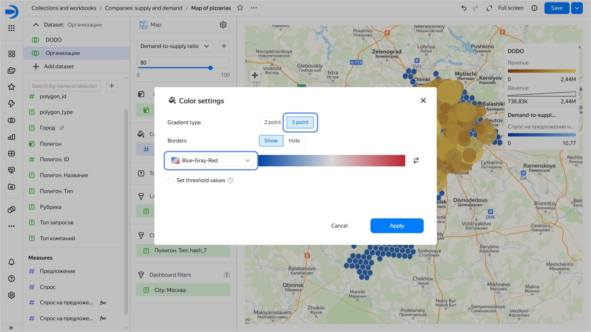

1. Change the transparency level to `60`.

   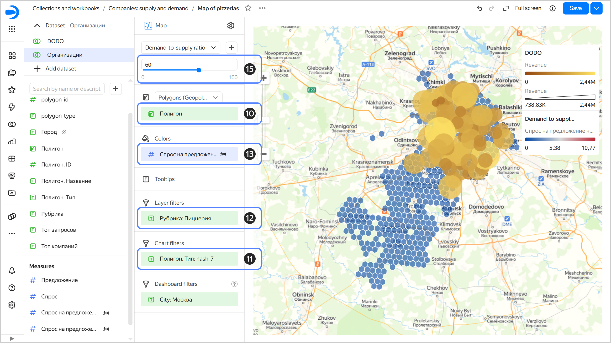

1. Add the following fields to the **Tooltips** section:

   * `Demand`.
   * `Supply`.
   * `Demand-to-supply ratio per city`.
   * `Top queries`.
   * `Top companies`.

     

1. Save your chart: click **Save** in the top-right corner.
1. Go back to the dashboard opened in the previous tab in your browser and refresh the page.
1. Choose `Saint Petersburg` in the selector. This will filter the entire dashboard, including the map and external geolayer, by this selector.

   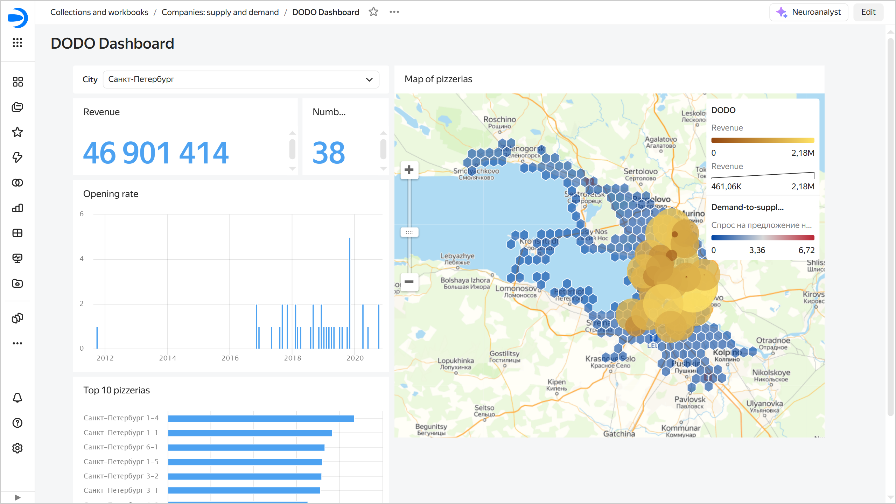

If the map focus remains at the same location when changing the city in the filter, refresh the page in your browser. {{ datalens-name }} captures the map scale and location if you change them during the current session.

## Optional {#additional}

Here are some ideas you might want to work on by yourself:

1. Adding a geolayer with businesses from the `Where to eat` category (restaurants and fast food chains in general, not only pizzerias).
1. Adding the [Audience: interests and social demographics]({{ link-datalens-main }}/marketplace/f2eemc2dui59rn72h0ck) product from {{ marketplace-short-name }} to display the city audience data on the map in a similar way.
1. You can use the city of Voronezh as an example to study the free [geolayers by Geointellect]({{ link-datalens-main }}/marketplace/f2eu3edujf1jdmaihu7u). The demo set offers calculated indexes representing the location's business potential for fast food.
